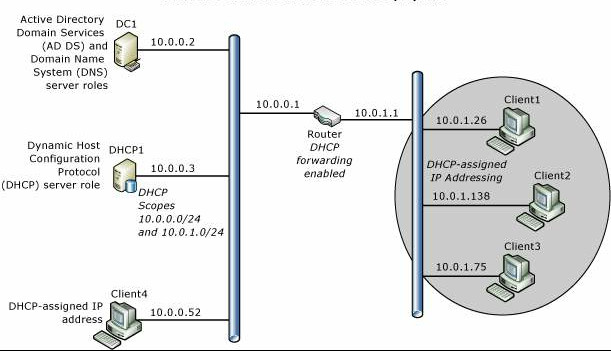

### Stub network

https://nordvpn.com/ko/cybersecurity/glossary/stub-network/#:~:text=A%20stub%20network%20is%20a,knows%20of%20one%20network%20exit.

A stub network is a local area network (LAN) that does not connect to the outside. A stub network can connect to outside networks but only through a single default path. It only relays packets of data internally. It can also be a dead-end LAN that only knows of one network exit. A stub network can have multiple connections, but it uses one path to single points of destination. It only has one default path to non-local hosts and has no knowledge about outside networks. So a stub network can either have one way to reach a single destination or it can have multiple ways to reach different points of a destination.

#### Stub network examples

- Internet service provider. An ISP provides internet services to users, who can use them either via one router or multiple routers connected to the same network. Each user represents a stub network for the ISP.
- LAN. A LAN that does not carry multiple router data packets and transmits data to or from local hosts.
- Open Shortest Path First. An OSPF area that has one default OSPF routing domain path is also an example of a stub network. The OSPF area can have multiple routers with the same exit route.
- Stub autonomous system. A stub autonomous system is connected to only one autonomous system, which is a collection of IP routing prefixes controlled by one or more network operators. The stub autonomous system accesses the internet through the autonomous system and represents another example of a stub network.

### CORE NETWORK

Historically, one of a set of gateways (routers) operated by the Internet Network Operations Center at BBN. Note: The core gateway system forms a central part of Internet routing in that all groups must advertise paths to their networks from a core gateway, using the exterior gateway protocol (EGP). [Bahorsky]

https://learn.microsoft.com/en-us/windows-server/networking/core-network-guide/core-network-guide

A core network is a collection of network hardware, devices, and software that provides the fundamental services for your organization's information technology (IT) needs.

The following illustration shows the Windows Server Core Network topology.

> Note
> 
> This guide also includes instructions for adding optional Network Policy Server (NPS) and Web Server (IIS) servers to your network topology to provide the foundation for secure network access solutions, such as 802.1X wired and wireless deployments that you can implement using Core Network Companion guides. For more information, see Deploying optional features for network access authentication and Web services.

Core Network Components
Following are the components of a core network.

- Router

This deployment guide provides instructions for deploying a core network with two subnets separated by a router that has DHCP forwarding enabled. You can, however, deploy a Layer 2 switch, a Layer 3 switch, or a hub, depending on your requirements and resources. If you deploy a switch, the switch must be capable of DHCP forwarding, or you must place a DHCP server on each subnet. If you deploy a hub, you are deploying a single subnet and do not need DHCP forwarding or a second scope on your DHCP server.

- Static TCP/IP configurations

The servers in this deployment are configured with static IPv4 addresses. Client computers are configured by default to receive IP address leases from the DHCP server.

- Active Directory Domain Services global catalog and DNS server DC1

Both Active Directory Domain Services (AD DS) and Domain Name System (DNS) are installed on this server, named DC1, which provides directory and name resolution services to all computers and devices on the network.

- DHCP server DHCP1

The DHCP server, named DHCP1, is configured with a scope that provides Internet Protocol (IP) address leases to computers on the local subnet. The DHCP server can also be configured with additional scopes to provide IP address leases to computers on other subnets if DHCP forwarding is configured on routers.

- Client computers

Computers running Windows client operating systems are configured by default as DHCP clients, which obtain IP addresses and DHCP options automatically from the DHCP server
.

### Introduction to core network

In telecommunications, a core network – also called a backbone network – is a central conduit designed to transfer network traffic at high speeds. Core networks focus on optimizing the performance and reliability of long-distance and large-scale data communications. They connect wide-area networks (WAN) and local area networks (LAN) altogether. While core networks provide a plethora of services, one of their key functions includes routing telephone calls across the public switched telephone network (PSTN). Usually, the term denotes the high-functioning communication facilities that interlink the primary nodes. Moreover, the core network provides routes to exchange information among different sub-networks. While the term ‘backbone’ is often used in enterprise network solutions rather than core network, network services providers mostly use the term core network. Furthermore, in 4G long-term evolution (LTE), core networks are known as evolved packet core (EPC).

### Autonomous System

An autonomous system is a collection of connected Internet Protocol routing prefixes under the control of one or more network operators on behalf of a single administrative entity or domain, that presents a common and clearly defined routing policy to the Internet.

Each AS is assigned an autonomous system number (ASN), for use in Border Gateway Protocol (BGP) routing. Autonomous System Numbers are assigned to Local Internet Registries (LIR) and end-user organizations by their respective Regional Internet Registries (RIR), which in turn receive block of ASN for reassignment from the Internet Assigned Numbers Authority (IANA). The IANA also  maintains a registry of ASN which are reserved for private use (and should therefore not be announced to the global Internet).

Originally, the definition required control by a single entity, typically an Internet service provider (ISP) or a very large organization with independent connections to multiple networks, that adhered to a single and clearly defined routing policy. In March 1996, the newer definition came into use because multiple organizations can run BGP using private AS numbers to an ISP that connects all those organizations to the internet. Even though there may be multiple autonomous system supported by the ISP, the Internet only sees the routing policy of the ISP. That ISP must have an officially registered ASN.

Until 2007, Autonomous System numbers defined as 16 bit intergers, which allowed for a maximum of 65,536 assignments. Since then, the IANA has begun to also 32 bit Autonomous System numbers to Regional Internet Registries (RIR). These numbers are written preferably as simple integers, in a notation referred to as "asplain", ranging from 0 to 4,294,967,295 (0xFFFFFFFF). Or, alternatively, in the form called "asdot+" which looks like x.y, where x and y are 16 bit numbers. Numbers of the form 0.y are exactly the old 16 bit Autonomous System numbers. The special 16 bit Autonomous System Number 23456 ("AS_TRANS") was assigned by IANA as a placeholder for 32 bit ASN values for the case when 32 bit ASN capable routers ("new BGP speakers") send BGP messages to routers with older BGP software ("old BGP speakers") which do not understand the new 32 bit Autonomous System Number.

The first and last Autonomous System Number of the original 16 bit integers (0 and 65,535) and the last Autonomous System Number of the 32 bit numbers (4,294,967,295) are reserved and should not be used by operators; AS0 is used by all five RIR to invalidate unallocated space. Autonomous System Number 64,496 to 64,511 of the original 16 bit range and 65,536 to 65,551 of the 32 bit range are reserved for use in documentation. Autonomous System Number 64,512 to 65,534 of the original 16 bit Autonomous System range, and 4,200,000,000 to 4,294,967,294 of the 32 bit range are reserved for Private Use.

https://en.wikipedia.org/wiki/Autonomous_system_(Internet)

https://www.cloudflare.com/ko-kr/learning/network-layer/what-is-an-autonomous-system/

모든 Autonomous System 은 특정 IP 주소 집합을 제어합니다. 지정된 Autonomous 에서 제어하는 IP 주소의 범위를 "IP 주소 공간"이라고 합니다.

대부분의 Autonomous System은 다른 여러 Autonomous System에 연결됩니다. Autonomous 가 하나의 다른 Autonomous 에만 연결되고 동일한 라우팅 정책을 공유하는 경우, 대신 첫 번째  Autonomous System 의 하위 네트워크로 간주될 수 있습니다.

일반적으로 각 AS는 인터넷 서비스 공급자(ISP), 대기업 기술 회사, 대학, 정부 기관 등 단일 대규모 조직에서 운영됩니다.

