Internet Protocol Version 6 IPv6 Specification
=========================================================

## Abstract

This document specifies version 6 of the Internet Protocol IPv6. It obsoletes [RFC2460](https://datatracker.ietf.org/doc/html/rfc2460).

## Status of This Memo

This is an Internet Standards Track document.

This document is a product of the Internet Engineering Task Force IETF. It represents the consensus of the Internet Engineering Task Force IETF community. It has received public review and has been approved for publication by the Internet Engineering Steering Group IESG. Further information on Internet Standards is available in [RFC Streams and Internet Standards / RFC7841](https://datatracker.ietf.org/doc/html/rfc7841#section-2).

Information about the current status of this document, any errata, and how to provide feedback on it may be obtained at [RFC EDITOR / RFC8200](http://www.rfc-editor.org/info/rfc8200).

## Copyright Notice

Copyright (c) 2017 IETF Trust and the persons identified as the document authors.  All rights reserved.

This document is subject to [BCP 78](https://datatracker.ietf.org/doc/html/bcp78) and the IETF Trust's Legal Provisions Relating to IETF Documents (http://trustee.ietf.org/license-info) in effect on the date of publication of this document.  Please review these documents carefully, as they describe your rights and restrictions with respect to this document.  Code Components extracted from this document must include Simplified BSD License text as described in Section 4.e of the Trust Legal Provisions and are provided without warranty as described in the Simplified BSD License.

This document may contain material from IETF Documents or IETF Contributions published or made publicly available before November 10, 2008.  The person(s) controlling the copyright in some of this material may not have granted the IETF Trust the right to allow modifications of such material outside the IETF Standards Process. Without obtaining an adequate license from the person(s) controlling the copyright in such materials, this document may not be modified outside the IETF Standards Process, and derivative works of it may not be created outside the IETF Standards Process, except to format it for publication as an RFC or to translate it into languages other than English.

## 1. Introduction

Internet Protocol version 6 IPv6 is a new version of the Internet Protocol IP, designed as the successor to Internet Protocol version 4 IPv4 [RFC791](https://datatracker.ietf.org/doc/html/rfc791). The changes from Internet Protocol version 4 IPv4 to Internet Protocol version 6 IPv6 fall primarily into the following categories:

- Expanded Addressing Capabilities

  Internet Protocol version 6 IPv6 increases the Internet Protocol IP address size from 32 bits to 128 bits, to support more levels of addressing hierarchy, a much greater number of addressable nodes, and simpler autoconfiguration of addresses. The scalability of multicast routing is improved by adding a "scope" field to multicast addresses. And a new type of address called an "anycast address" is defined; it is used to send a packet to any one of a group of nodes.

- Header Format Simplication

  Some Internet Protocol version 4 IPv4 header fields have been dropped or made optional, to reduce the common-case processing cost of packet handling and to limit the bandwidth cost of the Internet Protocol version 6 IPv6 header.

- Improved Support for Extensions and Options

  Changes in the way Internet Protocol IP header options are encoded allows for more officient forwarding, less stringent limits on the length of options, and greater flexibility for introduction new options in the future.

- Flow Labeling Capability

  A new capability is added to enable the labeling of sequences of packets that the sender requests to be treated in the network as a single flow.

- Authentication and Privacy Capabilities

  Extensions to support authentication, data integrity, and (optional) data confientiality are specified for Internet Protocol version 6 IPv6.

This document specifies the basic Internet Protocol version 6 IPv6 header and the initially defined Internet Protocol version 6 IPv6 extension headers and options. It also discusses packet size issues, the semantics of flow labels and traffic classes, and the effects of Internet Protocol version 6 IPv6 on the upper-layer protocols. The format and semantics of Internet Protocol version 6 IPv6 addresses are specified separately in [RFC4291](https://datatracker.ietf.org/doc/html/rfc4291). The Internet Protocol version 6 IPv6 version of Internet Control Message Protocol ICMP, which all Internet Protocol version 6 IPv6 implementations are required to include, is specified in [RFC4443](https://datatracker.ietf.org/doc/html/rfc4443).

The data transmission order for Internet Protocol version 6 IPv6 is the same as for Internet Protocol version 4 IPv4 as defined in [Appendix B / RFC791](https://datatracker.ietf.org/doc/html/rfc791#appendix-B).

Note: As this document obsoletes [RFC2460](https://datatracker.ietf.org/doc/html/rfc2460), any document referenced in this document that includes pointers to [RFC2460](https://datatracker.ietf.org/doc/html/rfc2460) should be interpreted as referencing this document.

## 2. Terminology

| Terminology | Description |
| ----------- | ----------- |
| node        | a device that implements Internet Protocol version 6 IPv6 |
| router | a node that forwards Internet Protocol version 6 IPv6 packets not explicitly addressed to itself. |
| host | any node that is not a router. |
| upper layer | a protocol layer immediately above Internet Protocol version 6 IPv6. Examples are transport protocols such as TCP and UDP, control protocols such as ICMP, routing protocols such as OSPF, and internet layer or lower layer protocols being "tunneled" over (i.e., encapsulated in) Internet Protocol version 6 IPv6 such as Internetwork Packet Exchange (IPX), AppleTalk, or Internet Protocol version 6 IPv6 itself. |
| link | a communcation facility or medium over which nodes can communicate at the link layer, i.e., the layer immediately below Internet Protocol version 6 IPv6. Examples are Ethernets (simple or bridged); PPP links; X.25, Frame Relay, or ATM networks; and internet-layer or higher-layer "tunnels", such as tunnels over Internet Protocol version 4 IPv4 or Internet Protocol version 6 IPv6 itself.
| neighbors | nodes attached to the same link. |
| interface | a node's attachment to a link. |
| address | an Internet Protocol version 6 IPv6 layer identifier for an interface or a set of interfaces. |
| packet | an Internet Protocol version 6 IPv6 header plus payload. |
| link MTU | the maximum transmission unit, i.e., maximum packet size in octets, that can be conveyed over a link. |
| path MTH | the minimum link Maximum Transmission Unit MTU of all the links in a path between a source node and a destination node. |

Note: it is possible for a device with multiple interfaces to be configured to forward non-self-destined packets arriving from some set (fewer than all) of its interfaces and to discard non-self-destined packets arriving from its other interfaces. Such a device must obey the protocol requirements for routers when receiving packets from, and interacting with neighbors over, the former (forwarding) interfaces. It must obey the protocol requiements for hosts when receiving packets from, and interacting with neighbors over, the latter (non-forwarding) interfaces.

## 3. Internet Protocol version 6 IPv6 Header Format

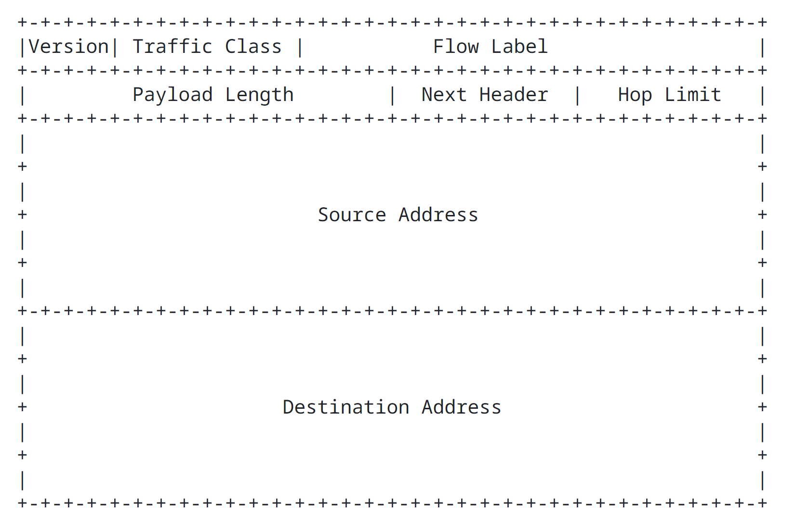

| Field | Size | Description |
| ----- | ---- | ----------- |
| Version | 4 bit | Internet Protocol version number = 6 |
| Traffic Class | 8 bit | Traffic Class filed. |
| Flow Label    | 20 bit | Flow label. |
| Payload Length | 16 bit unsigned integer | Length of the Internet Protocol version 6 IPv6 payload, i.e., the ret of the packet following this Internet Protocol version 6 IPv6 header, in octets. (Note that any extension headers present are considered part of the payload, i.e., included in the length count.) |
| Next Header | 8 bit selector | Identifies the type of header immediately following the Internet Protocol version 6 IPv6 header. Uses the same values as the Internet Protocol version 4 IPv4 protocol field. [Protocol Numbers](https://www.iana.org/assignments/protocol-numbers/protocol-numbers.xhtml) |
| Hop Limit | 8 bit unsigned integer | Decremented by 1 by each node that forwards the packet. When forwarding, the packet is discarded if Hop Limit was zero when received or is decremented to zero. A node that is the destination of a packet should not discard a packet with Hop Limit equal to zero; it should process the packet normally. |
| Source Address | 128 bit | address of the originator the packet. [RFC4291](https://datatracker.ietf.org/doc/html/rfc4291) |
| Destination Address | 128 bit | address of the intended recipient of the packet (possibly not the ultimate recipient, if a Routing header is present). [RFC4291](https://datatracker.ietf.org/doc/html/rfc4291) |

## 4. Internet Protocol version 6 IPv6 Extension Headers

In Internet Protocol version 6 IPv6, optional internet layer information is encoded in separate headers that may be placed between the Internet Protocol version 6 IPv6 header and upper layer header in a packet. There is a small number of such extension headers, each one identified by a distinct Next Header value.

Extension headers are numbered from [IANA IP Protocol Numbers](https://www.iana.org/assignments/protocol-numbers/protocol-numbers.xhtml), the same values used for Internet Protocol version 4 IPv4 and Internet Protocol version 6 IPv6. When processing a sequence of Next Header values in a packet, the first one that is not an [extension header](https://www.iana.org/assignments/ipv6-parameters/ipv6-parameters.xhtml) indicates that the next item in the packet is the corresponding upper layer header. A special "No Next Header" value is used if there is no upper layer header.

As illustrated in these examples, an Internet Protocol version 6 IPv6 packet may carry zero, one, or more extension headers, each identified by the Next Header field of the preceding header:

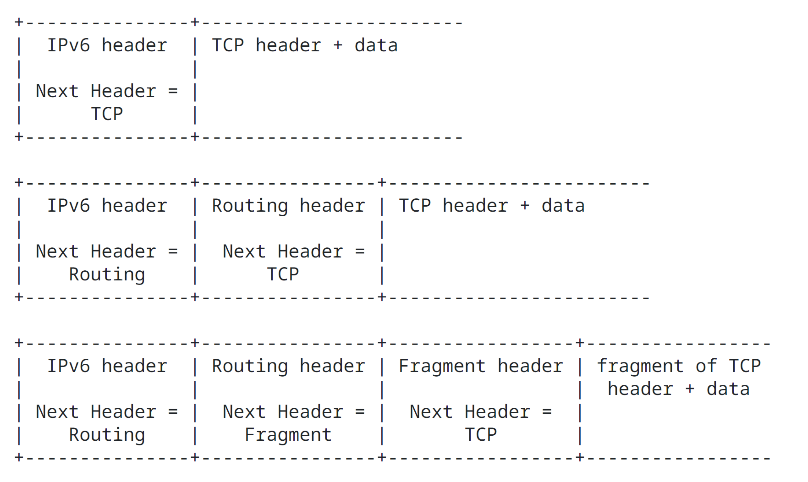

Extension headers (except for the Hop-by-hop Options header) are not processed, inserted, or deleted by any node along a packet's delivery path, until the packet reaches the node (or each of the set of nodes, in the case of multicast) identified in the Destination Address field or the Internet Protocol version 6 IPv6 header.

The Hop-by-hop Options header is not inserted or deleted, but may be examined or processed by any node along a packet's delivery path, until the packet reaches the node (or each of the set of nodes, in the case of multicast) identified in the Destination Address field of the Internet Protocol version 6 IPv6 header. The Hop-by-hop Option header, when present, must immediately follow the Internet Protocol version 6 IPv6 header. Its presence is indicated by the value zero in the Next Header field of the Internet Protocol version 6 IPv6 header.

Note: While [RFC2460](https://datatracker.ietf.org/doc/html/rfc2460) required that all nodes must examine and process the Hop-by-hop Options header, it is now expected that nodes along a packet's delivery path only examine and process the Hop-by-hop Options header if explicitly configured to do so.

At the destination node, normal, demultiplexing on the Next Header field of the Internet Protocol version 6 IPv6 header invokes the module to process the first extension header, or the upper layer header if no extension header is present. The contents and semantics of each extension header determine whether or not to processed strictly in the order they appear in the packet; a receiver must not, for example, scan through a packet looking for a particular kind of extension header and process that header prior to processing all preceding ones.

If, as a result of processing a header, the destination node is required to proceed to the next header but the Next Header value in the current header is unrecognized by the node, it should discard the packet and send an Internet Control Message Protocol ICMP Parameter Problem message to the source of the packet, with an Internet Control Message Protocol ICMP Code value of 1 ("unrecognized Next Header type encountered") and the Internet Control Message Protocol ICMP Pointer field containing the offset of the unrecognized value within the original packet. The same action should be taken if a node encoutners a Next Header value of zero if any header other than an Internet Protocol version 6 IPv6 header.

Each extension header is an integer multiple of 8 octets long, in order to retain 8 octet alignment for subsequent headers. Multi-octet fields within each extension header are aligned on their natural boundaries, i.e., fields of width n octets are placed at an integer multiple of n octets from the start of the header, for n = 1, 2, 4, or 8.

A full implementation of Internet Protocol version 6 IPv6 includes implementation of the following extension headers:

- Hop-by-Hop Options
- Fragment
- Destination Options
- Routing
- Authentication
- Encapsulating Security Payload

The first four are specified in this document; the last two are specified in [RFC4302](https://datatracker.ietf.org/doc/html/rfc4302) and [RFC4303](https://datatracker.ietf.org/doc/html/rfc4303), respectively. The current list of Internet Protocol version 6 IPv6 extension headers can be found at [Internet Protocol Version 6 (IPv6) Parameters](https://www.iana.org/assignments/ipv6-parameters/ipv6-parameters.xhtml).

### 4.1. Extension Header Order

When more than one extension header is used in the same packet, it is recommended that those headers appear in the following order:

- Internet Protocol version 6 IPv6 header
- Hop-by-Hop Options header
- Destination Options header

  For options to be processed by the first destination that appears in the Internet Protocol version 6 IPv6 Destination Address field plus subsequent destinations listed in the Routing header.

- Routing header
- Fragment header
- Authentication header
- Encapsulating Security Payload header

  Additional recommendations regarding the relative order of the Authentication and Encapsulating Security Payload headers are given in [RFC4303](https://datatracker.ietf.org/doc/html/rfc4303).

- Destination Options header

  For options to be processed only by the final destination of the packet.

- Upper Layer header

Each extension header should occur at most once, except for the Destination Options header, which should occur at most twice (once before a Routing header and once before the upper layer header).

If the upper layer header is another Internet Protocol version 6 IPv6 header (in the case of Internet Protocol version 6 IPv6 beging tunneled over or encapsulated in Internet Protocol version 6 IPv6), it may be followed by its own extension headers, which are separately subject to the same ordering recommendations.

If and when other extension headers are defined, their ordering constraints relative to the above listed headers must be specified.

Internet Protocol version 6 IPv6 nodes must accept and attempt to process extension headers in any order and occurring any number of times in the same packet, except for the Hop-by-Hop Option header, which is restricted to appear immediately after an Internet Protocol version 6 IPv6 packets adhere to the above recommended order until and unless subsequent specifications revise that recommendation.

### 4.2. Options

Two of the currently defined extension headers specified in this document -- the Hop-by-Hop Options header and the Destination Options header -- carry a variable number of "options" that are type-length-value TLV encoded in the following format:

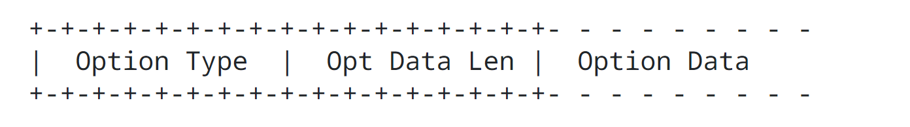

| Field | Size | Description |
| ----- | ---- | ----------- |
| Option Type | 8 bit | Identifier of the type of option. |
| Option Data Length | 8 bit unsigned integer. | Length of the Option Data field of this option, in octets. |
| Option Data | Variable-length field. | Option-Type-specific data. |

The sequence of options within a header must be processed strictly in the order they appear in the header; a receiver must not, for example, scan through the header looking for a particular kind of option and process that option prior to processing all preceding ones.

The Option Type identifiers are internally encoded such that their highest-order 2 bits specify the action that must be taken if the processing Internet Protocol verison 6 IPv6 node does not recognize the Option Type:

| Highest order 2 bits | Description |
| -------------------- | ----------- |
| 00                   | Skip over this option and continue processing the header. |
| 01                   | Discard the packet. |
| 10                   | Discard the packet and, regardless of whether or not the packet's Destination Address was a multicast address, send an Internet Control Message Protocol ICMP Parameter Problem, Code 2, message to the packet's Source Address, pointing to the unrecognied Option Type. |
| 11                   | Discard the packet and, only if the packet's Destination Address was not a multicast address, send an Internet Control Message Protocol ICMP Parameter Problem, Code 2, message to the packet's Source Address, pointing to the unrecognized Option Type. |

The third-highest-order bit of the Option Type specifies whether or not the Option Data of that option can change en route to the packet's final destination. When an Authentication header is present in the packet, for any option whose data may change en route, its entire Option Data field must be treated as zero-valued octets when computing or verifying the packet's authenticating value. 

| Third highest order bit | Description |
| ----------------------- | ----------- |
| 0 | Option Data does not change en route |
| 1 | Option Data may change en route |

The three high-order bits described above are to be treated as part of the Option Type, not independent of the Option Type. That is, a particular option is identified by a full 8 bit Option Type, not just the low order 5 bits of an Option Type.

The same Option Type numbering space is used for both the Hop-by-Hop Options header and the Destination Options header. However, the specification of a particular option may restrict its use to only one of those headers.

Individual options may have specific alginment requirements, to ensure that multi-octet values within Option Data fields fall on natural boundaries. The alignment requirement of an option is specified using the notation `xn+y`, meaning the Option Type must appear at an integer multiple of x octets from the start of the header, plus y octets. For example:

- 2n means any 2-octet offset from the start of the header.
- 8n+2 means any 8-octet offset from the start of the header, plus 2 octets.

There are two padding options that are used when necessary to align subsequent options and to pad out the containing header to a multiple of 8 octets in length. These padding options must be recognized by all Internet Protocol version 6 IPv6 implementations:

Pad1 option (alignment requirement: none)

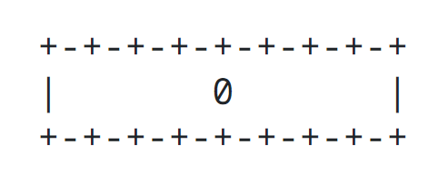

Note: the format of the Pad1 option is special case -- it does not have length and value fields.

The Pad1 option is used to insert 1 octet of padding into the Options area of a header. If more than one octet of padding is required, the PadN option, described next, should be used, rather than multiple Pad1 options.

PadN option (alignment requirement: none)

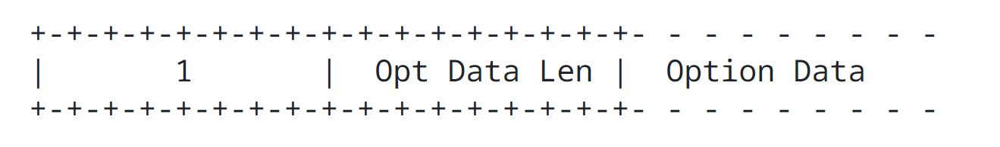

The PadN option is used to insert two or more octets of padding into the Option area of a header. For N octets of padding, the Option Data Length field contains the value N-2, and the Option Data consists of N-2 zero-valued octets.

Appendix A contains formatting guidelines for designing new options.

### 4.3. Hop-by-Hop Options Header

The Hop-by-Hop Options header is used to carry optional information that may be examined and processed by every node along a packet's delivery path. The Hop-by-Hop Options header is identified by a Next Header value of 0 in the Internet Protocol version 6 IPv6 header and has the following format:

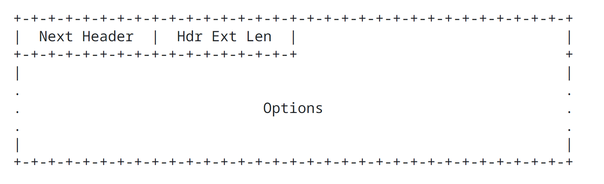

| Field | Size | Description |
| ----- | ---- | ----------- |
| Next Header | 8 bit selector | Identifies the type of header immediately following the Hop-by-Hop Options header. Uses the same values as the Internet Protocol version 4 IPv4 Protocol field [Protocol Numbers](https://www.iana.org/assignments/protocol-numbers/protocol-numbers.xhtml). |
| Header Extension Length | 8 bit unsigned integer. | Length of the Hop-by-Hop Option header in 8-octet units, not including the first 8 octets. |
| Options | - | Variable length field, of length such that the complete Hop-by-Hop Options header is an integer multiple of 8 octets long. Contains one or more Type Length Value TLV encoded options, as described in Section 4.2. |

The only hop-by-hop options defined in this document are the Pad1 and PadN options specified in Section 4.2.

## 4.4. Routing Header

The Routing header is used by an Internet Protocol version 6 IPv6 source to list one or more intermediate nodes to be "visited" on the way to a packet's destination. This function is very similar to Internet Protocol version 4 IPv4's Loose Source and Record Route option. The Routing header is identified by a Next Header value of 43 in the immediately preceding header and has the following format:

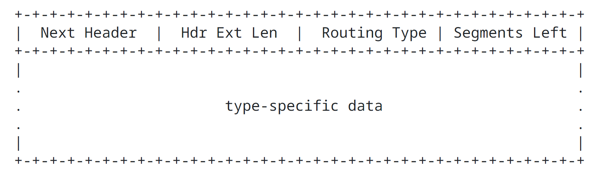

| Field | Size | Description |
| ----- | ---- | ----------- |
| Next Header | 8 bit selector | Identifies the type of header immediately following the Routing header. Uses the same values as the Internet Protocol version 4 IPv4 Protocol field. [Protocol Numbers](https://www.iana.org/assignments/protocol-numbers/protocol-numbers.xhtml). |
| Header Extension Length | 8 bit unsigned integer | Length of the Routing header in 8 octet units, not including the first 8 octets. |
| Routing Type | 8 bit | identifier of a particular Routing header variant. |
| Segments Left | 8 bit unsigned integer | Mumber os route segments remaining, i.e., number of explicitly listed intermediate nodes still to be visited before reaching the final destination. |
| type specific data | - | Variable length field, of format determined by the Routing Type, and of length such that the complete Routing header is an integer multiple of 8 octets long. |

If, while processing a received packet, a node encounters a Routing header with an unrecognized Routing Type value, the required behavior of the node depends on the value of the Segment Left field, as follows:

- If Segment Left is zero, the node must ignore the Routing header and proceed to process the next header in the packet, whose type is identified by the Next Header field in the Routing header.
- If Segment Left is non-zero, the node must discard the packet and send an Internet Control Message Protocol ICMP Parameter Problem, Code 0, message to the packet's Source Address, pointing to the unrecognized Routing Type.

If, after processing a Routing header of a received packet, an intermediate node determines that the packet is to be forwarded onto a link whose Link Maximum Transmission Unit Link MTU is less than the size of the packet, the node must discard the packet and send an Internet Control Message Protocol ICMP Packet Too Big message to the packet's Source Address.

The currently defined Internet Protocol version 6 IPv6 Routing Headers and their status can be found at [Internet Protocol Version 6 (IPv6) Parameters](https://www.iana.org/assignments/ipv6-parameters/ipv6-parameters.xhtml). Allocation guidelines for Internet Protocol version 6 IPv6 Routing Headers can be found in [RFC5871](https://datatracker.ietf.org/doc/html/rfc5871).

### 4.5. Fragment Header

The Fragment header is used by an Internet Protocol version 6 IPv6 source to send a packet larger than would fit in the Path Maximum Transmission Unit Path MTU to its destination. (Note: unlike Internet Protocol version 4 IPv4, fragmentation in Internet Protocol version 6 IPv6 is performed only by source nodes, not by routers along a packet's delivery path -- see Section 5.) The Fragment header is identified by the Next Header value of 44 in the immediately preceding header and has the following format:

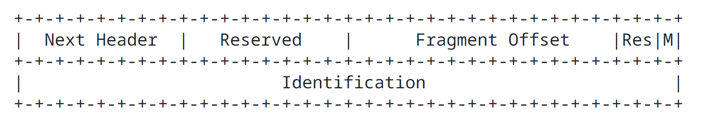

| Field | Size | Description |
| ----- | ---- | ----------- |
| Next Header | 8 bit selector | Identifies the initial header type of the Fragmentable Part of the original packet (defined below). Uses the same values as the Internet Protocol version 4 IPv4 field. [Protocol Numbers](https://www.iana.org/assignments/protocol-numbers/protocol-numbers.xhtml) |
| Reserved | 8 bit | Reserved field. Initialized to zero for transmission; ignored on reception. |
| Fragment Offset | 13 bit unsigned integer | The offset, in 8 octet units, of the data following this header, relative to the start of the Fragmentable Part of the original packet. |
| Res | 2 bit | Reserved field. Initialized to zero for transmission; ignored on reception. |
| M flag | 1 bit | 1 = more fragments; 0 = last fragment. |
| Identification | 32 bit | - |

In order to send a packet that it too large to fit in the Maximum Transmission Unit MTU of the path to its destination, a source node may node divide the packet into fragments and send each fragment as a separate packet, to be reassembled at the receiver.

For every packet that is to be fragmented, the source node generates an Identification value. The Identification must be different than that of any other fragmented packet sent recently with the same Source Address and Destination Address. If a Routing header is present, the Destination Address of concern is that of the final destination.

> "recently" means within the maximum likely lifetime of a packet, including transit time from source to destination and time spent awaiting reassembly with other fragments of the same packet. Howeverm it is not required that a source node knows the maximum packet lifetime. Rather, it is assumed that the requirement can be met by implementing an algorithm that results in a low identification reuse frequency. Examples of algorithms that can meet this requirement are described in [RFC7739](https://datatracker.ietf.org/doc/html/rfc7739).

The initial, large, unfragmented packet is referred to as the "original packet", and it is considered to consist of three parts, as illustrated:

original packet:

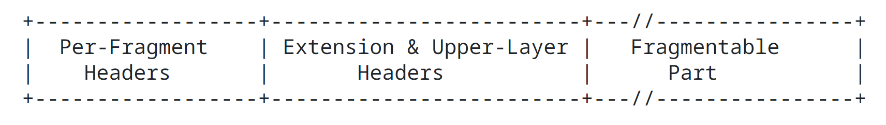

The Per-Fragment headers must consist of the Internet Protocol version 6 IPv6 header plus any extension headers that must be processed by nodes en route to the destination, that is, all headers up to and including the Routing header if present, else the Hop-by-Hop Options header if present, else no extension headers.

The Extension headers are all other extension headers that are not included in the Per-Fragment headers part of the packet. For this purpose, the Encapsulating Security Payload ESP is not considered an extension header. The Upper Layer header is the first upper layer header that is not an Internet Protocol version 6 IPv6 extension header. Examples of upper layer headers include Transmission Control Protocol TCP, User Datagram Protocol UDP, Internet Protocol version 4 IPv4, Internet Protocol version 6 IPv6, Internet Control Message Protocol version 6 ICMPv6, and as noted Encapsulating Security Payload ESP.

The Fragmentable Part consists of the rest of the packet after the upper layer header or after any header (i.e., initial Internet Protocol version 6 IPv6 header or extension header) that contains a Next Header value of No Next Header.

The Fragmentable Part of the original packet is divided into fragments. The lengths of the fragments must be chosen such that the resulting fragment packets fit within the Maximum Transmission Unit MTU of the path to the packet's destination(s). Each complete fragment, except possibly the last ("rightmost") one, is an integer multiple of 8 octets long.

The fragments are transmitted in separate "fragment packets" as illustrated:

Original Packet:

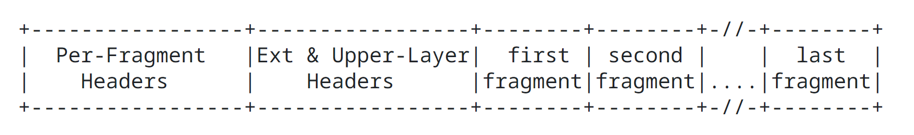

Fragment Packets:

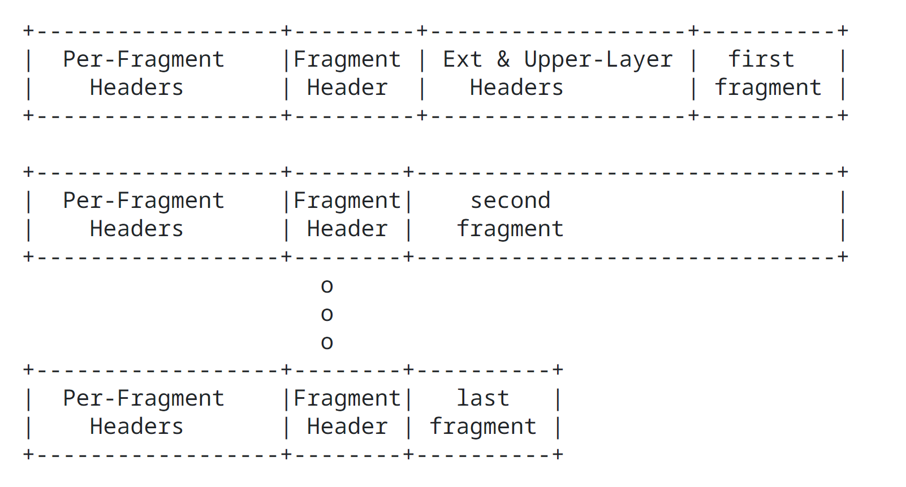

The first fragment packet is composed of:

1. The Per-Fragment headers of the original packet, with the Payload Length of the original Internet Protocol version 6 IPv6 header changed to contain the length of this fragment packet only (excluding the length of the Internet Protocol version 6 IPv6 header itself), and the Next Header field of the last number of the Per-Fragment headers changed to 44.

2. A Fragment header containing:

   - The Next Header value that identifies the first header after the Per-Fragment headers of the original packet.
   - A Fragment Offset containing the offset of the fragment, in 8 octet units, relative to the start of the Fragmentable Part of the original packet. The Fragment Offset of the first ("leftmost") fragment is 0.
   - An M flag value of 1 as this is the first fragment.
   - The Identfication value generated for the original packet.

3. Extension headers, if any, and the upper layer header. These headers must be in the first fragment. Note: This restricts the size of the headers through the upper layer header to the Maximum Transmission Unit MTU of the path to the packet's destination(s).

4. The first fragment.

The subsequent fragment packets are composed of:

1. The Per-Fragment headers of the original packet, with the Payload Length of the original Internet Protocol version 6 IPv6 header changed to contain the length of this fragment packet only (excluding the length of the Internet Protocol version 6 IPv6 header itself), and the Next Header field of the last header of the Per-Fragment headers changed to 44.

2. A Fragment header containing:

   - The Next Header value that identifies the first header after the Per-Fragment headers of the original packet.
   - A Fragment Offset containing the offset of the fragment, in 8-octet units, relative to the start of the Fragmentable Part of the original packet.
   - An M flag value of 0 if the fragment is the last ("rightmost") one, else an M flag value of 1.
   - The Identification value generated for the origina packet.
   - The fragment itself.

Fragments must not be created that overlap with any other fragments created from the original packet.

At the destination, fragment packets are reassembled into their original, unfragmented form, as illustrated:

reassmbled original packet:

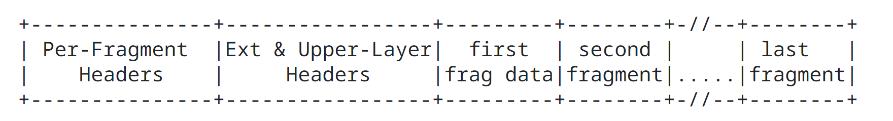

The following rules govern reassembly:

An original packet is reassembled only from fragment packets that have the same Source Address, Destination Address, and Fragment Identification.

The Per-Fragment headers of the reassembled packet consists of all headers up to, but not including, the Fragment header of the first fragment packet (that is, the packet whose Fragment Offset is zero), with the following two changes:

- The Next Header field of the last header of the Per-Fragment headers is obtained from the Next Header field of the first fragment's Fragment header.
- The Payload Length of the reassembled packet is computed from the length of the Per-Fragment headers and the length and offset of the last fragment. For example, a formula for computing the Payload Length of the reasembled original packet is:

Payload Length PL.origin = Payload Length PL.first - Fragment Length FL.first - 8 + (8 * Fragment Offset FO.last) + Fragment Length FL.last

where

- Payload Length PL.origin = Payload Length field of reassembled packet.
- Payload Length PL.first = Payload Length field of first fragment packet.
- Fragment Length FL.first = Length of fragment following Fragment header of first fragment packet.
- Fragment Offset FO.last = Fragment Offset field of Fragment header of last fragment packet.
- Fragment Length FL.last = Length of fragment following Fragment header of last fragment packet.

The Fragmentable Part of the reassembled packet is constructed from the fragments following the Fragment headers in each of the fragment packets. The length of each fragment is computed the fragment packets. The length of each fragment is computed by subtracting from the packet's Payload Length the length of the headers between the Internet Protocol version 6 IPv6 header and fragment itself; its relative position in Fragmentable Part is computed from its Fragment Offset value.

The Fragment header is not present in the final, reassembled packet.

If the fragment is a whole datagram (that is, both the Fragment Offset field and the M flag are zero), then it does not need any further reassembly and should be processed as a fully reassembled packet (i.e., updating Next Header, adjust Payload Length, removing the Fragment header, etc.). Any other fragments that match this packet (i.e., the same Internet Protocol version 6 IPv6 Source Address, Internet Protocol version 6 IPv6 Destination Address, and Fragment Identification) should be processed independently.

The following error conditions may arise when reassembling fragmented packets:

- If insufficient fragments are received to complete reassembly of a packet within 60 seconds of the reception of the first arriving fragment of that packet, reassembly of that packet must be abandoned and all the fragments that have been received for that packet must be discarded. If the first fragment (i.e., the one with a Fragment Offset of zero) has been received, an Internet Control Message Protocol ICMP Time Exceeded -- Fragment Reassembly Time Exceeded message should be sent to the source of that fragment.
- If the length of a fragment, as derived from the fragment packet's Payload Length field, is not a multiple of 8 octets and the M flag of that fragment is 1, then that fragment must be discarded and an Internet Control Message Protocol ICMP Parameter Problem, Code 0, message should be sent to the source of the fragment, pointing to the Payload Length field of the fragment packet.
- If the length and offset of a fragment are such that the Payload Length of the packet reassembled from that fragent would exceed 65,535 octets, then that fragment must be discarded and an Internet Control Message Protocol ICMP Parameter Problem, Code 0, message should be sent to the source of the fragment, pointing to the Fragment Offset field of the fragment packet.
- If the first fragment does not include all headers through an Upper Layer header, then that fragment should be discarded and an Internet Control Message Protocol ICMP Parameter Problem, Code 3, message should be sent to the source of the fragment, with the Pointer field set to zero.
- If any of the fragments being reassembled overlap with any other fragments being reassembled for the same packet, reassembly of that packet must be abandoned and all the fragments that have been received for that packet must be discarded, and no Internet Control Message Protocol ICMP error messages should be sent.

  It should be noted that fragments may be duplicated in the network. Instead of treating these exact duplicate fragments as overlapping fragments, an implementation may choose to detect this case and drop exact duplicate fragments while detect this case and drop exact duplicate fragments while keeping the other fragments belong to the same packet.

The following conditions are not expected to occur frequently but are not considered errors if they do:

- The number and content of the headers preceding the Fragment header of different fragments of the same original packet may differ. Whatever headers are present, preceding the Fragment header in each fragment packet, are processed when the packets arrive, prior to queueing the fragments for reassembly. Only those headers in the Offset zero fragment packet are retained in the reassembled packet.
- The Next Header values in the Fragment headers of different fragments of the same original packet may differ. Only the value from the Offset zero fragment packet is used for reassembly.
- Other fields in the Internet Protocol version 6 IPv6 header may also vary across the fragments being reassembled. Specifications that use these fields may provide additional instructions if the basic mechanism of using the values from the Offset zero fragment is not sufficient. For example, [Section 5.3 of RFC3168](https://datatracker.ietf.org/doc/html/rfc3168#section-5.3) describes how to combine the Explicit Congestion Notification ECN bits from different fragments to derive the Explicit Congestion Notification ECN bits of the reassembled packet.

### 4.6. Destination Options Header

The Destination Options header is used to carry optional information that need be examined only by a packet's destination node(s). The Destination Options header is identified by a Next Header value of 60 in the immediately preceding header and has the following format:

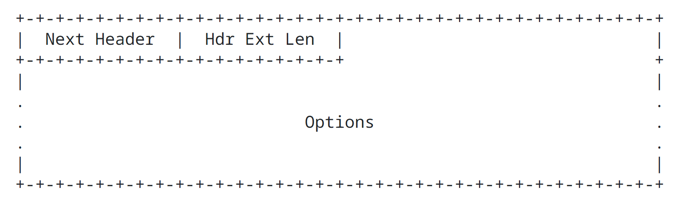

| Field | Size | Description |
| ----- | ---- | ----------- |
| Next Header | 8 bit selector | Identifies the type of header immediately following the Destination Options header. Uses the same values as the Internet Protocol version 4 IPv4 Protocol field. [Protocol Numbers](https://www.iana.org/assignments/protocol-numbers/protocol-numbers.xhtml) |
| Header Extension Length | 8 bit unsigned integer | Length of the Destination Options header in 8 octet units, not including the first 8 octets. |
| Options | - | Variable length field, of length such that the complete Destination Options header is an integer multiple of 8 octets long. Contains one or more Type Length Value TLV encoded options |

The only destination options defined in this document are the Pad1 and PadN options specified in Section 4.2.

Note that there are two possible ways to encode optional destination information in the Internet Protocol version 6 IPv6 packet: either as an option in the Destination Options header or as a separate extension header. The Fragment header and the Authentication header are examples of the latter approach. Which approach can be used depends on what action is desired of a destination node that does not understand the optional information:

- If the desired action is for the destination node to discard the packet and, only if the packet's Destination Address is not a multicast address, send an Internet Control Message Protocol ICMP Unrecognized Type message to the packet's Source Address, then the information may be encoded either as a separate header or as an option in the Destination Options header whose Option Type has the value 11 in tis highest order 2 bits. The choice may depend on such factors as which takes fewer octets, or which yields better alignment or more efficient parsing.
- If any other action is desired, the information must be encoded as an option in the Destination Options header whose Option Type has the value 00, 01, or 10 in tis highest order 2 bits, specifying the desired action.

### 4.7. No Next Header

The value 59 in the Next Header field of an Internet Protocol version 6 IPv6 header or any extension header indicates that there is nothing following that header. If the Payload Length field of the Internet Protocol version 6 IPv6 header indicates the presence of octets past the end of a header whose Next Header field contains 59, those octets must be ignored and passed on unchanged if the packet is forwarded.

### 4.8. Defining New Extension Headers and Options

Defining new Internet Protocol version 6 IPv6 extension headers is not recommended, unless there are no existing Internet Protocol version 6 IPv6 extension headers that can be used by specifying a new option for that Internet Protocol version 6 IPv6 extension header. A proposal to specify a new Internet Protocol version 6 IPv6 extension header must include a detailed technical explanation of why an existing Internet Protocol version 6 IPv6 extension header can not be used for the desired new function. See [RFC6564](https://datatracker.ietf.org/doc/html/rfc6564) for additional background information.

Note: New extension headers that require hop-by-hop behavior must not be defined because, as specified in Section 4 of this document, the only extension header that has hop-by-hop behavior is the Hop-by-Hop Options header.

New hop-by-hop options are not recommended because nodes may be configured to ignore the Hop-by-Hop Options header, drop packets containing a Hop-by-Hop Option header, or assign packets containing a Hop-by-Hop Options header to a slow processing path. Designers considering defining new hop-by-hop options need to be aware of this likely behavior. There has to be a very clear justification why any new hop-by-hop option is needed before it is standardized.

Instead of defining new extension headers, it is recommended that the Destination Options header is used to carry optional information that must be examined only by a packet's destination node(s), because they provide better handling and backward compatibility.

If new extension headers are defined, they need to use the following format:

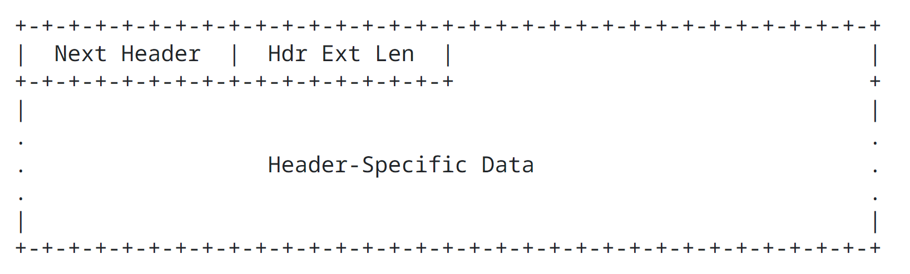

| Field | Size | Description |
| ----- | ---- | ----------- |
| Next Header | 8 bit selector | Identifies the type of header immediately following the extension header. Uses the same values as the Internet Protocol version 4 IPv4 Protocol field. [Protocol Numbers](https://www.iana.org/assignments/protocol-numbers/protocol-numbers.xhtml) |
| Header Extension Length | 8 bit unsigned integer | Length of the Destination Option header in 8 octet units, not including the first 8 octets. |
| Header Specific Data | - | Variable length field. Fields specific to the extension header. |

## 5. Packet Size Issues

Internet Protocol version 6 IPv6 requires that every link in the Internet have an Maximum Transmission Unit MTU of 1280 octets or greater. This is known as the Internet Protocol version 6 IPv6 minimum Link Maximum Transmission Unit Link MTU. On any link that cannot convey a 1280-octet packet in one piece, link specific fragmentation and reassembly must be provided at a layer below Internet Protocol version 6 IPv6.

Links that have a configurable Maximum Transmission Unit MTU (for example, PPP links [RFC1661](https://datatracker.ietf.org/doc/html/rfc1661)) must be configured to have an Maximum Transmission Unit MTU of at least 1280 octets; it is recommended that they be configured with an Maximum Transmission Unit MTU of 1500 octets or greater, to accommodate possible encapsulations (i.e., tunneling) without incurring Internet Protocol version 6 IPv6 layer fragmentation.

From each link to which a node is directly attached, the node must be able to accept packets as large as that link's Maximum Transmission Unit MTU.

It is strongly recommended that Internet Protocol version 6 IPv6 nodes implement Path Maximum Transmission Unit Path MTU Discovery [RFC8201](https://datatracker.ietf.org/doc/html/rfc8201), in order to discover and take advantage of path Maximum Transmission Unit MTU greater than 1280 octets. However, a minimal Internet Protocol version 6 IPv6 implementation (e.g., in a boot ROM) may simply restrict itself to sending packets no larger than 1280 octets, and omit implementation of Path Maximum Transimssion Unit Path MTU Discovery.

In order to send a packet larger than a Path Maximum Transmission Unit Path MTU, a node may use the Internet Protocol version 6 IPv6 Fragment header to fragment the packet at the source and have it reassembled at the destination(s). However, the use of such fragmentation is discouraged in any application that is able to adjust its packets to fit the measured Path Maximum Transmission Unit Path MTU (i.e., down to 1280 octets).

A node must be able to accept a fragmented packet that, after reassembly, is as large as 150 octets. A node is permitted to accept fragmented packets that reassemble to more than 1500 octets. An upper layer protocol or application that depends on Internet Protocol version 6 IPv6 fragmentation to send packets larger than the Maximum Transmission Unit MTU of a path should not send packets larger than 1500 octets unless it has assurance that the destination is capable of reassembling packets of that larger size.

## 6. Flow Labels

The 20 bit Flow Label field in the Internet Protocol version 6 IPv6 header is used by a source to label sequence of packets to be treated in the network as a single flow.

The current definition of the Internet Protocol version 6 IPv6 Flow Label can be found in [RFC6437](https://datatracker.ietf.org/doc/html/rfc6437).

## 7. Traffic Classes

The 8 bit Traffic Class field in the Internet Protocol version 6 IPv6 header is used by the network for traffic management. The value of the Traffic Class bits in a received packet or fragment might be different from the value sent by the packet's source.

The current use of the Traffic Class field for Differentiated Services and Explicit Congestion Notification is specified in [RFC2474](https://datatracker.ietf.org/doc/html/rfc2474) and [RFC3168](https://datatracker.ietf.org/doc/html/rfc3168).

## 8. Upper Layer Protocol Issues

### 8.1. Upper Layer Checksums

Any transport or other upper layer protocol that includes the addresses from the Internet Protocol IP header in its checksum computation must be modified for use over Internet Protocol version 6 IPv6, to include the 128 bit Internet Protocol version 6 IPv6 addresses instead of 32 bit Interner Protocol version 4 IPv4 addresses. In paricular, the following illustration shows the Transmission Control Protocol TCP and User Datagram Protocol UDP "pseudo-header" for Internet Protocol version 6 IPv6:

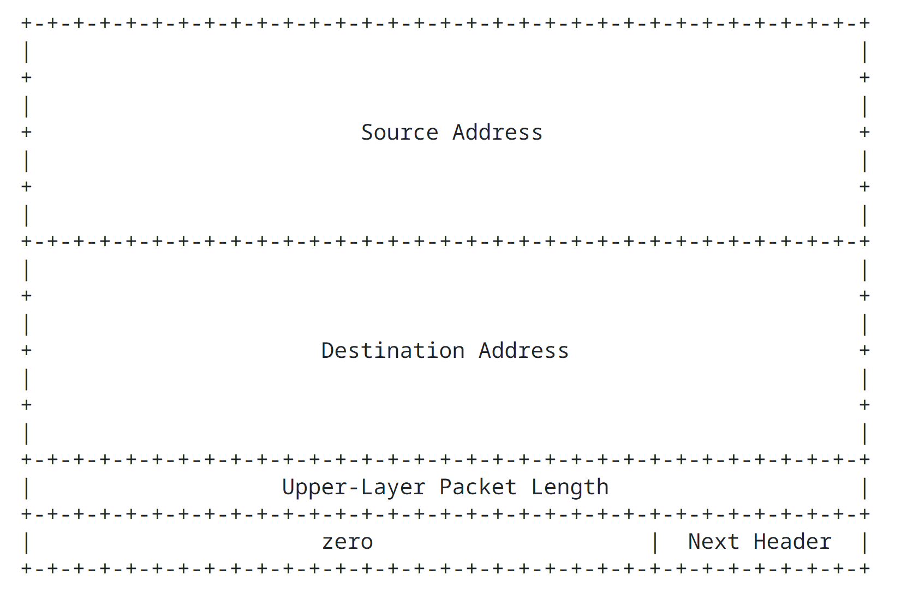

- If the Internet Protocol version 6 IPv6 packet contains a Routing header, the Destination Address used in the pseudo-header is that of the final destination. At the originating node, that address will be in the last element of the Routing header; at the recipient(s), that address will be in the Destination Address field of the Internet Protocol version 6 IPv6 header.
- The Next Header value in the pseudo-header identifies the upper-layer protocol (e.g., 6 for Transmission Control Protocol TCP or 17 for User Datagram Protocol UDP). It will differ from the Next Header value in the Internet Protocol version 6 IPv6 header if there are extension headers between the Internet Protocol version 6 IPv6 header and the upper layer header.
- The Upper Layer Packet Length in the pseudo-header is the length of the upper layer header and data (e.g., Transmission Control Protocol TCP header plus Transmission Control Protocol TCP data). Some upper layer protocols carry their own length information (e.g., the Length field in the User Datagram Prtoocol UDP header); for such protocols, that is the length used in the pseudo-header. Other protocols (such as Transmission Control Protocol TCP) do not carry their own length information, in which case the length used in the pseudo-header is the Payload Length from the Internet Protocol version 6 IPv6 header, minus the length of any extension headers present between the Internet Protocol version 6 IPv6 header and the upper layer header.
- Unlike Internet Protocol version 4 IPv4, the default behavior when User Datagram Protocol UDP packets are originated by an Internet Protocol version 6 IPv6 node is that the User Datagram Protocol UDP checksum is not optional. That is, whenever originating a User Datagram Protocol UDP packet, an Internet Protocol version 6 IPv6 node must compute a User Datagram Protocol UDP checksum over the packet and the pseudo-header, and, if that computation yields a result of zero, it must be changed to hex FFFF for placement in the User Datagram Protocol UDP header. Internet Protocol version 6 IPv6 receivers must discard User Datagram Protocol UDP packets containing a zero checksum and should log the error.
- As an exception to the default behavior, protocols that use User Datagram Protocol UDP as a tunnel encapsulation may enable zero-checksum mode for a specific port (or set of ports) for sending and/or receiving. Any node implementing zero-checksum mode must follow the requirements specified in "Applicability Statement for the Use of Internet Protocol version 6 IPv6 User Datagram Protocol UDP Datagrams with Zero Checksums" [RFC6936](https://datatracker.ietf.org/doc/html/rfc6936).

The Internet Protocol version 6 IPv6 version of Internet Control Message Protocol ICMP [RFC4443](https://datatracker.ietf.org/doc/html/rfc4443) includes the above pseudo-header in its checksum computation; this is a change from the Internet Protocol version 4 IPv4 version of Internet Control Message Protocol ICMP, which does not include a pseudo-header in its checksum. The reason for the change is to protect Internet Control Message Protocol ICMP from misdelivery or corruption of those fields of the Internet Protocol version 6 IPv6 header on which it depends, which, unlink Internet Protocol version 4 IPv4, are not covered by an internet-layer checksum. The Next Header field in the pseudo-header for Internet Control Message Protocol ICMP contains the value 58, which identifies the Internet Protocol version 6 IPv6 version of Internet Control Message Protocol ICMP.

### 8.2. Maximum Packet Lifetime

Unlike Internet Protocol version 4 IPv4, Internet Protocol version 6 IPv6 nodes required to enforce maximum packet lifetime. That is the reason the Internet Protocol version 4 IPv4 "Time-to-Live" field was renamed "Hop Limit" in Internet Protocol version 6 IPv6. In practice, very few, if any, Internet Protocol version 4 IPv4 implementations conform to the requirement that they limit packet lifetime, so this is not a change in practice. Any upper layer protocol that relies on the interent layer (whether Internet Protocol version 4 IPv4 or Internet Protocol version 6 IPv6) to limit packet lifetime ought to be upgraded to provide its own mechanisms for detecting and discarding obsolete packets.

### 8.3. Maximum Upper Layer Payload Size

When computing the maximum payload size available for upper layer data, an upper layer protocol must take into account the larger size of the Internet Protocol version 6 IPv6 header relative to the Internet Protocol version 4 IPv4 header. For example, in Internet Protocol version 4 IPv4, Transmission Control Protocol TCP's Maximum Segment Size (MSS) option is computed as the maximum packet size (a default value or a value learned through Path Maximum Transmission Unit Path MTU Discovery) minus 40 octets (20 octets for the minimum-length Internet Protocol version 4 IPv4 header and 20 octets for minimum-length Transmission Control Protocol TCP header). When using Transmission Control Protocol TCP over Internet Protocol version 6 IPv6, the Maximum Segment Size MSS must be computed as the maximum packet size minus 60 octets, because the minimum-length Internet Protocol version 6 IPv6 header (i.e., an Internet Protocol version 6 IPv6 header with no extension headers) is 20 octets longer than a minimum length Internet Protocol version 4 IPv4 header.

### 8.4. Responding to Packets Carrying Routing Headers

When an upper layer protocol sends one or more packets in response to a received packet that included a Routing header, the response packet(s) must not include a Routing header that was automatically derived by "reversing" the received Routing header unless the integrity and authenticity of the received Source Address and Routing header have been verified (e.g., via the use of an Authentiation header in the received packet). In other words, only the following kinds of packets are permitted in response to a received packet bearing a Routing header:

- Response packets that do not carry Routing headers.
- Response packets that carry Routing headers that were not derived by reversing the Routing header of the received packet (for example, a Routing header supplied by local configuration).
- Response packets that carry Routing headers that were derived by reversing the Routing header of the received packet if and only if the integrity and authenticity of the Source Address and Routing header from the received packet have been verified by the responder.

## 9. IANA Considerations

[RFC2460](https://datatracker.ietf.org/doc/html/rfc2460) is referenced in a number of IANA registries. These include:

- [Internet Protocol version 6 IPv6 Parameters](https://www.iana.org/assignments/ipv6-parameters/ipv6-parameters.xhtml)
- [Assigned Internet Protocol Numbers](https://www.iana.org/assignments/protocol-numbers/protocol-numbers.xhtml)
- [ONC RPC Network Identifiers (netids)](https://www.iana.org/assignments/rpc-netids/rpc-netids.xhtml)
- [Network Layer Protocol Identifiers (NLPIDs) of Interest](https://www.iana.org/assignments/nlpids/nlpids.xhtml)
- [Protocol Registries](https://www.iana.org/protocols)

The IANA has updated these references to point to this document.

## 10. Security Considerations

Internet Protocol version 6 IPv6, from the viewpoint of the basic format and transmission of packets, has security properties that are similar to Internet Protocol version 4 IPv4. These security issues include:

- Eavesdropping, where on-path elements can observe the whole packet (including both contents and metadta) of each Internet Protocol version 6 IPv6 datagram.
- Replay, where the attacker records a sequence of packets off of the wire and plays them back to the party that originally received them.
- Packet insertion, where the attcker forges a packet with some chosen set of properties and injects it into the network.