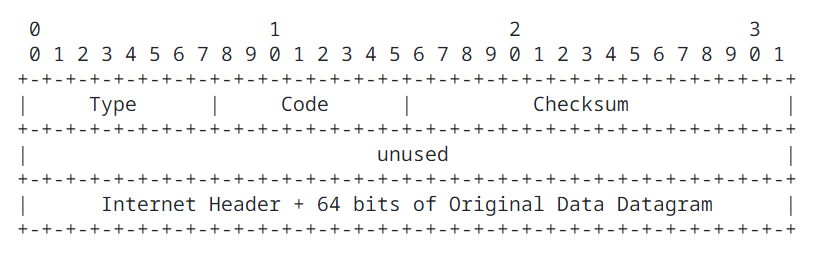
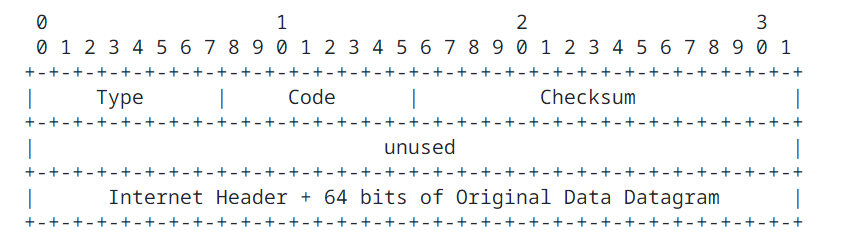
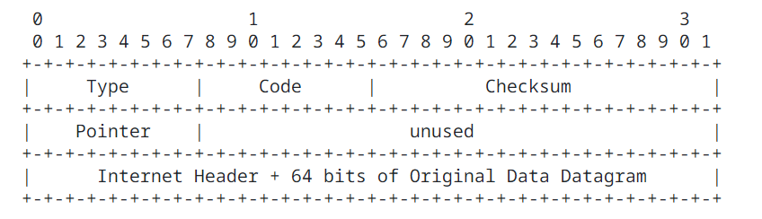
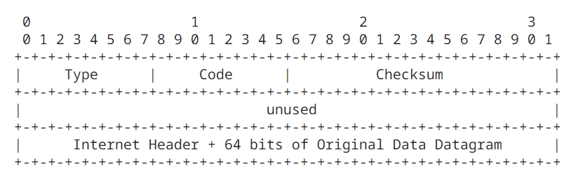
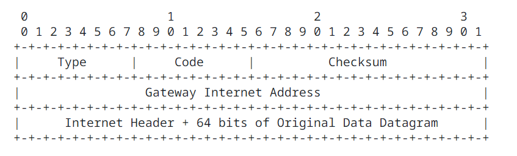
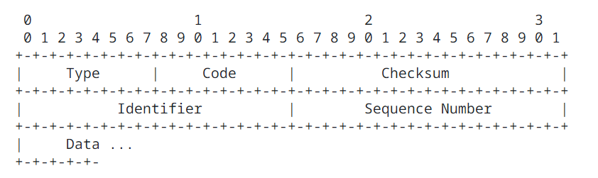
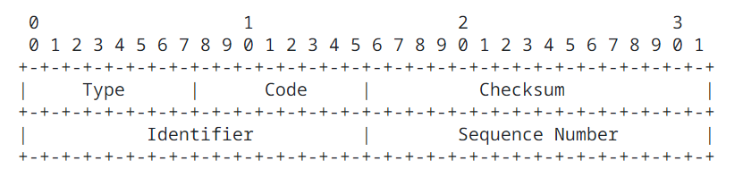

Internet Control Message Protocol
=================================

## Introduction

The [Internet Protocol IP](https://datatracker.ietf.org/doc/html/rfc791) is used for host-to-host datagram service in a system of interconnected networks called the Catenet. The network connecting devices are called Gateways. These gateways communicate between themselves for control purposes via a Gateway to Gateway Protocol GGP. Occasionally a gateway or destination host will communicate with a source host, for example, to report an error in datagram processing. For such purposes this protocol, the Internet Control Message Protocol ICMP, is used. Internet Control Message Protocol ICMP, uses the basic support of Internet Protocol IP as if it were a higher level protocol, however, Internet Control Message Protocol ICMP is actually an integral part of Internet Protocol IP, and must be implemented by every Internet Protocol IP module.

Internet Control Message Protocol ICMP messages are sent in several situations: for example, when a datagram cannot reach its destination, when the gateway does not have the buffering capacity to forward a datagram, and when the gateway can direct the host to send traffic on a shorter route.

The Internet Protocol is not designed to be absolutely reliable. The purpose of these control messages is to provide feedback about problems in the communication environment, not to make Internet Protocol IP reliable. There are still no guarantees that a datagram will be delivered or a control message will be returned. Some datagrams may still be undelivered without any report of their loss. The higher level protocols that use Internet Protocol IP must implement their own reliability procedures if reliable communication is required.

The Internet Control Message Protocol ICMP typically report errors in the processing of datagrams. To avoid the infinite regress of messages about messages etc., no Internet Control Message Protocol ICMP messages are sent about Internet Control Message Protocol ICMP messages are only sent about errors in handling fragment zero of fragmented datagrams. (Fragment zero has the fragment offset equal zero).

## Message Formats

Internet Control Message Protocol ICMP are sent using the basic Internet Protocol IP header. The first octet of the data portion of the datagram is a Internet Control Message Protocol ICMP type field; the value of labeled "unused" is reserved for later extensions and must be zero when sent, but receivers should not use these fields (except to include them i the checksum). Unless otherwise noted under the individual format descriptions, the values of the internet header fields are as follows:

| Field   | Value |
| ------- | ----- |
| Version | 4     |
| IHL     | Internet Header length in 32 bit words. |
| Type of Service | 0 |
| Total Length    | Length of internet header and data in octets. |
| Identification, Flags, Fragment Offset | Used in fragmentation. |
| Time to Live | Time to live in seconds; as this field is decremented at each machine in which the datagram is processed, the value in this field shold be at least as great ad the number of gateways which this datagram will traverse. |
| Protocol | ICMP = 1 |
| Header Checksum | The 16 bit one's complement of the one's complement sum of all 16 bit words in the header. For computing the checksum, the checksum field should be zero. This checksum may be replaced in the future. |
| Source Address | The address of the gateway or host that composes the Internet Control Message Protocol ICMP message. Unless otherwise noted, this can be any of a gateway's addresses. |
| Destination Address | The address of the gateway or host to which the mssage should be sent. |

### Destination Unreachable Message

Internet Protocol IP Fields:

| Field | Description |
| ----- | ----------- |
| Destination Address | The source network and address from the original datagram's data. |

Internet Control Message Protocol ICMP Fields:

| Field | Description |
| ----- | ----------- |
| Type  | 3 |
| Code  | 0 = Net unreachable; 1 = Host unreachable; 2 = Protocol unreachable; 3 = Port unreachable; 4 = Fragmentation needed and Don't Fragment DF set; 5 = Source route failed. |
| Checksum | The checksum is the 16 bit one's complement of the one's complement sum of the Internet Control Message Protocol ICMP message starting with the Internet Control Message Protocol ICMP Type. For computing the checksum, the checksum field should be zero. This checksum may be replaced in the future. |
| Internet Header + 64 bits of Data Datagram | The internet header plus the first 64 bits of the original datagram's data. This data is used by the host to match the message to the appropriate process If a higher level protocol uses port numbers, they are assumed to be in the first 64 data bits of the original datagram's data. |

Description

If, according to the information in the gateway's routing tables, the network specified in the internet destination feild of a datagram is unreachable, e.g., the distance to the network is infinity, the gateway may send a destination unreachable message to the internet source host of the datagram. In addition, in some networks, the gateway may be able to determine if the internet destination host is unreachable. Gateways in these networks may send destination unreachable messages to the source host when the destination host is unreachable.

If, in the destination host, the Internet Protocol IP module cannot deliver the datagram because the indicated protocol module or process port is unreachable message to the source host.

Another case is when a datagram must be fragmented to be forwarded by a gateway yet the Don't Fragment flag is on. In this case the gateway must discard the datagram and may return a destination unreachable message.

Code 0, 1, 4, and 5 may be received from a gateway. Code 2 and 3 may be received from a host.

### Time Exceeded Message

Internet Protocol IP Fields:

| Field | Description |
| ----- | ----------- |
| Destination Address | The source network and address from the original datagram data. |

Internet Control Message Protocol ICMP Fields:

| Field | Description |
| ----- | ----------- |
| Type  | 11 |
| Code | 0 = Time to live exceeded in transit; 1 = Fragment reassembly time exceeded. |
| Checksum | The checksum is the 16-bit ones's complement of the one's complement sum of the ICMP message starting with the ICMP Type. For computing the checksum , the checksum field should be zero. This checksum may be replaced in the future. |
| Internet Header + 64 bits of Data Datagram | The internet header plus the first 64 bits of the original datagram's data.  This data is used by the host to match the message to the appropriate process.  If a higher level protocol uses port numbers, they are assumed to be in the first 64 data bits of the original datagram's data. |

Description

If the gateway processing a datagram finds the time to live field is zero it must discard the datagram. The gateway may also notify the source host via the time exceeded message.

If a host reassembling a fragmented datagram cannot complete the reassembly due to missing fragments within its time limit it discards the datagram, and it may send a time exceeded message.

If fragment zero is not available then no time exceeded need be sent at all.

Code 0 may be received from a gateway. Code 1 may be received from a host.

### Parameter Problem Message

Internet Protocol IP Fields:

| Field | Description |
| ----- | ----------- |
| Destination Address | The source network and address from the original datagram data. |

Internet Control Message Protocol ICMP Fields:

| Field | Description |
| ----- | ----------- |
| Type  | 12 |
| Code  | 0 = Pointer indicates the error. |
| Checksum | The checksum is the 16-bit one's complement of the one's complement sum of the ICMP message starting with the ICMP Type. For computing the checksum , the checksum field should be zero. This checksum may be replaced in the future. |
| Pointer | If code = 0, identifies the octet where an error was detected. |
| Internet Header + 64 bits of Data Datagram | The internet header plus the first 64 bits of the original datagram's data.  This data is used by the host to match the message to the appropriate process.  If a higher level protocol uses port numbers, they are assumed to be in the first 64 data bits of the original datagram's data |

Description

If the gateway or host processing a datagram finds a problem with the header parameters such that it cannot complete processing the datagram it must discard the datagram. One potential source of such a problem is with incorrect arguments in an option. The gateway or host may also notify the source host via the parameter problem message. This message is only sent if the error caused the datagram to be discarded.

The pointer identifies the octet of the original datagram's header where the error was detected (it may be in the middle of an option). For example, 1 indicates something is wrong with the Type of Service, and (if there are options present) 20 indicates something is wrong with the type code of the first option.

Code 0 may be retrieved from a gateway or a host.

### Source Quench Message

Internet Protocol IP Fields:

| Field | Description |
| ----- | ----------- |
| Destination Address | The source network and address of the original datagram data. |

Internet Control Message Protocol ICMP Fields:

| Field | Description |
| ----- | ----------- |
| Type  | 4 |
| Code  | 0 |
| Checksum | The checksum is the 16-bit one's complement of the one's complement sum of the ICMP message starting with the ICMP Type. For computing the checksum , the checksum field should be zero. This checksum may be replaced in the future. |
| Internet Header + 64 bits of Data Datagram | The internet header plus the first 64 bits of the original datagram's data.  This data is used by the host to match the message to the appropriate process.  If a higher level protocol uses port numbers, they are assumed to be in the first 64 data bits of the original datagram's data. |

Description

A gateway may discarded internet datagrams if it does not have the buffer space needed to queue the datagrams for output ot the next network on the route to the destination network. If a gateway discards a datagram, it may send a source quench message to the internet source host or the datagram. A destination host may also send a source quench message is a request to the host to cut back the rate at which it is  sending traffic to the internet destination. The gateway may send a source quench message for every message that it discards. On receopt of a source quench message, the source host should cut back the rate at which it is sending traffic to the specified destination until it no longer receives source quench messages from the gateway. The source host can then gradually increase the rate at which it sends traffic to the destination until it again receives source quench messages.

The gateway or host may send the source quench message when it approaches its capacity limit rather than waiting until the capacity is exceeded. This means that the data datagram which triggered the source quench message may be delivered.

Code 0 may be received from a gateway or a host.

### Redirect Message

Internet Protocol IP Fields:

| Field | Description |
| ----- | ----------- |
| Destination Address | The source network and address of the original datagram data |

Internet Control Message Protocol ICMP Fields:

| Field | Description |
| ----- | ----------- |
| Type  | 5 |
| Code  | 0 = Redirect datagrams for the Network; 1 = Redirect datagrams for the Host; 2 = Redirect datagrams for the Type of Service and Network; 3 = Redirect datagrams for the Type of Service and Host |
| Checksum | The checksum is the 16-bit ones's complement of the one's complement sum of the ICMP message starting with the ICMP Type. For computing the checksum , the checksum field should be zero. This checksum may be replaced in the future. |
| Gateway Internet Address | Address of the gateway to which traffic for the network specified in the internet destination network field of the original datagram data should be sent. |
| Internet Header + 64 bits of Data Datagram | The internet header plus the first 64 bits of the original datagram's data.  This data is used by the host to match the message to the appropriate process.  If a higher level protocol uses port numbers, they are assumed to be in the first 64 data bits of the original datagram's data. |

Description

The gateway sends a redirect message to a host in the following situation. A gateway G1 receives an internet datagram from a host on a network to which the gateway is attached. The gateway G1 checks its routing table and obtains the address of the next gateway G2 on the route to the datagram's internet destination network X. If gateway G2 and the host identified by the internet source address of the datagram are on the same network, a redirect message is sent to the host. The redirect message advises the host to send its traffic for network X directly to gateway G2 as this is a shorter path to the destination. The gateway forwards the original datagram's data to its internet destination.

For datagrams with the Internet Protocol IP source route options and the gateway address in the destinatino address field, a redirect message is not sent even if there is a better route to the ultimate destination than the next address in the source route.

Code 0, 1, 2, and 3 may be received from a gateway.

### Echo or Echo Reply Message

Internet Protocol IP Fields:

| Field     | Description |
| --------- | ----------- |
| Addresses | The address of the source in an echo message will be the destination of the echo reply message. To form an echo reply message. the source and destination addresses are simply reversed, the type code changed to 0, and checksum recomputed. |

Internet Control Message Protocol ICMP Fields:

| Field | Description |
| ----- | ----------- |
| Type  | 8 = Echo message, 0 = Echo reply message |
| Code  | 0 |
| Checksum | The checksum is the 16-bit ones's complement of the one's complement sum of the ICMP message starting with the ICMP Type. For computing the checksum , the checksum field should be zero. If the total length is odd, the received data is padded with one octet of zeros for computing the checksum.  This checksum may be replaced in the future. |
| Identifier | If code = 0, an identifier to aid in matching echos and replies may be zero. |
| Sequence Number | If code = 0, a sequence number to aid in matching echos and replies, may be zero. |

Description

The data received in the echo message must be returned in the echo reply message.

The identifier and sequence number may be used by the echo sender to aid in matching the replies with the echo requests. For example, the identifier might be used like a port in Transmission Control Protocol TCP and User Datagram Protocol UDP to identify a session, and the sequence number might be incremented on each echo request sent. The echoer returns these same values in the echo reply.

Code 0 may be received from a gateway or a host.

### Timestamp or Timestamp Reply Message

Internet Protocol IP Fields:

| Field | Description |
| ----- | ----------- |
| Addresses | The address of the source in a timestamp message will be the destination of the timestamp reply message. To form a timestamp reply message, the source and destination addresses are simply reversed, the type code changed to 14, and the checksum recomputed. |

Internet Control Message Protocol ICMP Fields:

| Field | Description |
| ----- | ----------- |
| Type  | 13 = Timestamp message; 14 = Timestamp message |
| Code  | 0 |
| Checksum | The checksum is the 16-bit ones's complement of the one's complement sum of the ICMP message starting with the ICMP Type. For computing the checksum , the checksum field should be zero. This checksum may be replaced in the future. |
| Identifier | If code = 0, an identifier to aid in matching timestamp and replies, may be zero. |
| Sequence Number | If code = 0, a sequence number to aid in matching timestamp and replies, may be zero. |

Description

The data received (a timestamp) in the message is returned in the reply together with an additional timestamp. The timestamp is 32 bits of milliseconds since midnight UT. One use of these timestamps is described by [DCNET Internet Clock Service](https://datatracker.ietf.org/doc/html/rfc778).

The Originate Timestamp is the same time the sender last touched the message before sending it, the Receive Timestamp is the time the echoer first touched it on receipt, and the Transmit Timestamp is the time the echoer last touched the mssage on sending it.

It the time is not available in milliseconds or cannot be provided with respect to midnight UT then any time can be inserted in a timestamp provided the high order bit of the timestamp is also set to indicate this non-standard value.

The identifier and sequence number may be used by the echo sender to aid in matching the replies with the requests. For example, the identifier might be used like a port in Transmission Control Protocol TCP or User Datagram Protocol UDP to identify a session, and the sequence number might be incremented on echo request sent. The destination returns these same values in the reply.

Code 0 may be received from a gateway or a host.

### Information Request or Information Reply Message

Internet Protocol IP Fields:

| Field | Description |
| ----- | ----------- |
| Addresses | The address of the source in a information request message will be the destination of the information reply message.  To form a information reply message, the source and destination addresses are simply reversed, the type code changed to 16, and the checksum recomputed. |

Internet Control Message Protocol ICMP Fields:

| Field | Description |
| ----- | ----------- |
| Type  | 15 = Information Request message; 16 Information Reply message. |
| Code  | 0 |
| Checksum | The checksum is the 16-bit ones's complement of the one's complement sum of the ICMP message starting with the Internet Control Message Protocol ICMP Type. For computing the checksum , the checksum field should be zero. This checksum may be replaced in the future. |
| Identifier | If code = 0, an identifier to aid in matching request and replies, may be zero. |
| Sequence Number | If code = 0, a sequence number to aid in matching request and replies, may be zero. |

Description

This message may be sent with the source network in the Internet Protocol IP header soruce and destination address fields zero (which means "this" network). The replying Internet Protocol IP module should send the reply with the addresses fully specified. This message is a way for a host to find out the number of the network it is on.

The identifier and sequence number may be used by the echo sender to aid in matching the replies with the requests. For example, the identifier might be used like a port in Transmission Control Protocol TCP or User Datagram Protocol UDP to identify a session, and the sequence number might be incremented on each request sent. The destination returns these same values in the reply.

Code 0 may be received from a gateway or a host.

### Summary of Message Types

| Type | Description |
| ---- | ----------- |
| 0    | Echo Reply |
| 3    | Destination Unreachable |
| 4    | Source Quench |
| 5    | Redirect |
| 8    | Echo |
| 11   | Time Exceeded |
| 12   | Parameter Problem |
| 13   | Timestamp |
| 14   | Timestamp Reply |
| 15   | Information Request |
| 16   | Information Reply |
