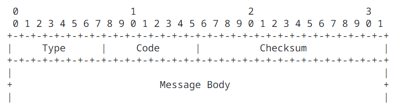
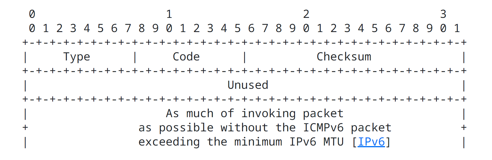
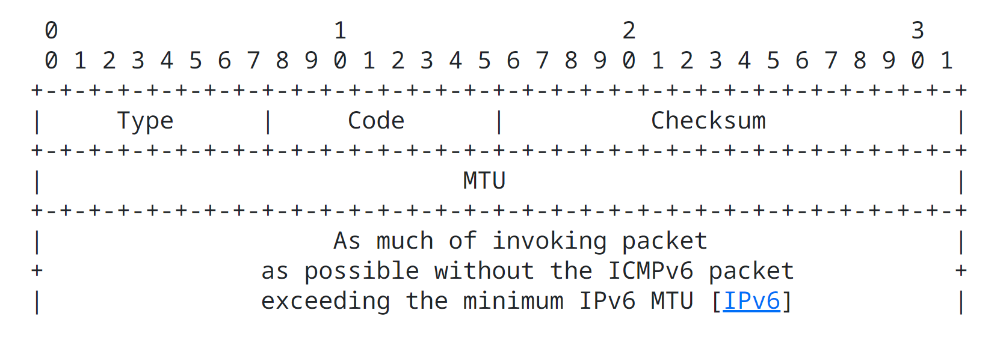
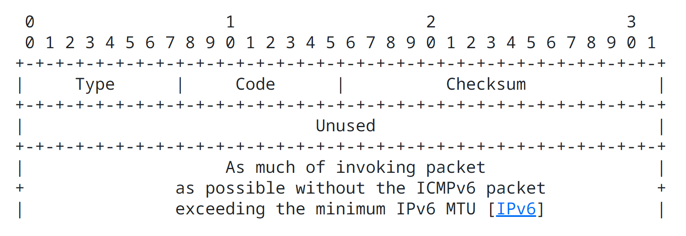
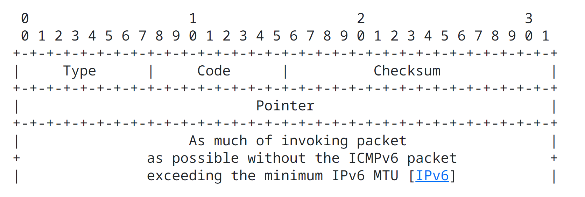
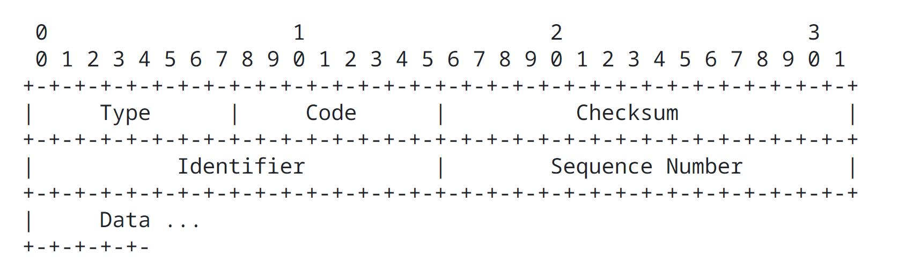
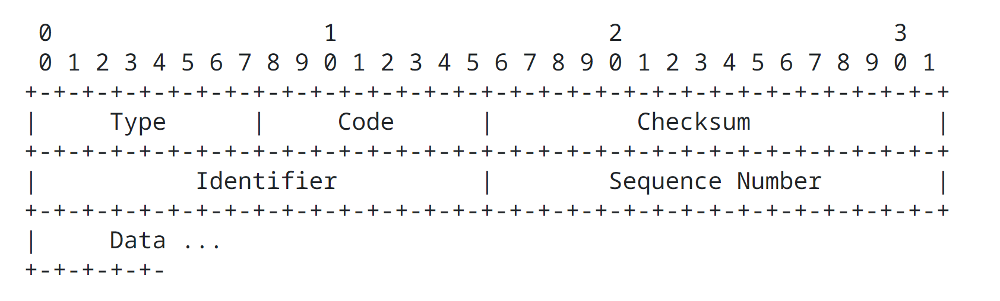

Internet Control Message Protocol ICMPv6 for the Internet Protocol version 6 IPv6 Specification
====================================================================

### Status of This Memo

This document specifies an Internet standards track protocol for the Internet community, and requests discussion and suggestions for improvements.  Please refer to the current edition of the "Internet Official Protocol Standards" (STD 1) for the standardization state and status of this protocol.  Distribution of this memo is unlimited.

### Copyright Notice

Copyright (C) The Internet Society (2006).

### Abstract

This document describes the format of a set of control messages used in ICMPv6 (Internet Control Message Protocol).  ICMPv6 is the Internet Control Message Protocol for Internet Protocol version 6 (IPv6).

## 1. Introduction

The Internet Protocol version 6 IPv6 uses Internet Control Message Protocol ICMP as defined for Internet Protocol version 4 IPv4 [RFC792](https://datatracker.ietf.org/doc/html/rfc792), with a number of changes. The resulting protocol is called Internet Control Message Protocol version 6 ICMPv6 and has an Internet Protocol version 6 IPv6 Next Header value of 58.

This document describes the format of a set of control messages used in Internet Control Message Protocol version 6 ICMPv6. It does not describe the procedures for using these messages to achieve functions like Path Maximum Transmission Unit Path MTU discovery; these procedures are described in other documents [Path MTU Discovery for IP version 6](https://datatracker.ietf.org/doc/html/rfc8201). Other documents may also introduce additional Internet Control Message Protocol version 6 ICMPv6 message types, such as Neighbor Discovery messages [Neighbor Discovery for IP version 6 (IPv6)](https://datatracker.ietf.org/doc/html/rfc4861), subject to the general rules for Internet Control Message Protocol version 6 ICMPv6 messages given in Section 2 of this document.

Terminology defined in the Internet Protocol version 6 IPv6 and Internet Protocol version 6 IPv6 Routing and Addressing specification [IP Version 6 Addressing Architecture](https://datatracker.ietf.org/doc/html/rfc4291) applies to this document as well.

This document obsoletes [RFC2463](https://datatracker.ietf.org/doc/html/rfc2463) and updates [RFC2780](https://datatracker.ietf.org/doc/html/rfc2780).

The key words "MUST", "MUST NOT", "REQUIRED", "SHALL", "SHALL NOT", "SHOULD", "SHOULD NOT", "RECOMMENDED", "MAY", and "OPTIONAL" in this document are to be interpreted as described in [RFC-2119](https://datatracker.ietf.org/doc/html/rfc2119).

## 2. Internet Control Message Protocol version 6 ICMPv6

Internet Control Message Protocol version 6 ICMPv6 is used by Internet Protocol version 6 IPv6 nodes to report errors encountered in processing packets, and to perform other internet layer functions, such as diagnostics (Internet Protocol version 6 IPv6 "ping"). Internet Protocol version 6 IPv6 is an integral part of Internet Protocol version 6 IPv6, and the base protocol (all the messages and behavior required by this specification) must be fully implemented by every Internet Protocol version 6 IPv6 node.

### 2.1. Message General Format

Every Internet Control Message Protocol version 6 ICMPv6 message is preceded by an Internet Protocol version 6 IPv6 header and zero or more Internet Protocol version 6 IPv6 extension headers. The Internet Control Message Protocol version 6 ICMPv6 header is identified by a Next Header value of 58 in the immediately preceding header. (This is different from the value used to identify Internet Control Message Protocol ICMP for Internet Protocol version 4 IPv4.)

The Internet Control Message Protocol version 6 ICMPv6 messages have the following general format:

The type field indicates the type of the message. Its value determines the format of the remaining data.

The code field depends on the message type. It is used to create additional level of message granularity.

The checksum field is used to detect data corruption in the Internet Control Message Protocol version 6 ICMPv6 message and parts of the Internet Protocol version 6 IPv6 header.

Internet Control Message Protocol version 6 ICMPv6 messages are grouped into two classes: error messages and informational messages. Error messages are identified as such by a zero in the high-order bit of their message Type field values. Thus, error messages have message types from 0 to 127; informational messages have message types from 128 to 255.

This document defines the message formats for the following Internet Control Message Protocol version 6 ICMPv6 messages:

Internet Control Message Protocol version 6 ICMPv6 error messages:

- 1 = Destination Unreachable
- 2 = Packet Too Big
- 3 = Time Exceeded
- 4 = Parameter Problem
- 100 = Private experimentation
- 101 = Private experimentation
- 127 = Reserved for expansion of Internet Control Message Protocol version 6 ICMPv6 error messages

Internet Control Message Protocol version 6 ICMPv6 informational messages:

- 128 = Echo Request
- 129 = Echo Reply
- 200 = Private experimentation
- 201 = Private experimentation
- 255 = Reserved for expansion of Internet Control Message Protocol version 6 ICMPv6 informational messages

Type values 100, 101, 200, and 201 are reserved for private experimentation. They are not intended for general use. It is expected that multiple concurrent experiments will be done with the same type values. Any wide-scale and/or uncontrolled usage should obtain real allocations as defined in Section 6.

Type values 127 and 255 are reserved for fugure expansion of the type value range if there is a shortage in the future. The details of this are left for future work. One possible way of doing that would not cause any problems with current implementations is that if the type equals 127 to 255, the code field should be used for the new assignment. Existing implementations would ignore the new assignments as specified in Section 2.4. The new messages using these expanded type values could assign fields in the message body for its code values.

Section 3 and 4 describe the message formats for the Internet Control Message Protocol version 6 ICMPv6 error message types 1 through 4 and informational message types 128 and 129.

Inclusion of, at least, the start of the invoking packet is intended to allow the originator of a packet that has resulted in an Internet Control Message Protocol version 6 ICMPv6 error message to identify the upper layer protocol and process that sent the packet.

### 2.2. Message Source Address Determination

A node that originates an Internet Control Message Protocol version 6 ICMPv6 message has to determine both the Source and Destination Internet Protocol version 6 IPv6 Addresses in the Internet Protocol version 6 IPv6 header before calculating the checksum. If the node has more than one unicast address, it must choose the Source Address of the message as follows:

1. If the message is a response to a message sent to one of the node's unicast addresses, the Source Address of the reply must be that same address.
2. If the message is a response to a message sent to any other address, such as
   - A multicast group address
   - An anycast address implemented by the node
   - A unicast address that does not belong to the node

   the Source Address of the Internet Control Message Protocol version 6 ICMPv6 packet must be a unicast address belonging to the node. The address should be chosen according to the rules that would be used to select the source address for any other packet originated by the node, given the destination address of the packet. However, it may be selected in an alternative way if this would lead to a more informative choice of address reachable from the destination of the Internet Control Message Protocol version 6 ICMPv6 packet.

### 2.3. Message Checksum Calculation

The checksum is the 16-bit one's complement of the one's complement sum of the entire ICMPv6 message, starting with the ICMPv6 message type field, and prepended with a "pseudo-header" of IPv6 header fields, as specified in [IPv6, Section 8.1].  The Next Header value used in the pseudo-header is 58.  (The inclusion of a pseudo-header in the ICMPv6 checksum is a change from IPv4; see [IPv6] for the rationale for this change.)

For computing the checksum, the checksum field is first set to zero.

### 2.4. Message Processing Rules

Implementations must observe the following rules when processing Internet Control Message Protocol version 6 ICMPv6 messages [Requirements for Internet Hosts -- Communication Layers](https://datatracker.ietf.org/doc/html/rfc1122).

1. If an Internet Control Message Protocol version 6 ICMPv6 error message of unknown type is received at its destination, it must be passed to the upper layer process that originated the packet that caused the error, where this can be identified.
2. If an Internet Control Message Protocol version 6 ICMPv6 informational message of unknown type is received, it must be silently discarded.
3. Every Internet Control Message Protocol version 6 ICMPv6 error message (type < 128) must include as much of the Internet Protocol version 6 IPv6 offending (invoking) packet (the packet that caused the error) as possible without making the error message packet exceed the minimum Interner Protocol version 6 IPv6 Maximum Transmission Unit MTU.
4. In cases where the internet layer protocol is required to pass an Internet Control Message Protocol version 6 ICMPv6 error message to the upper layer process, the upper layer protocol type is extracted from the original packet (contained in the body of the Internet Control Message Protocol version 6 ICMPv6 error message) and used to select the appropriate upper layer process to handle the error.

   In cases where it is not possible to retrieve the upper layer protocol type from the Internet Control Message Protocol version 6 ICMPv6 message, the Internet Control Message Protocol version 6 ICMPv6 message is silently dropped after any Internet Protocol version 6 IPv6 layer processing. One example of such a case is an Internet Control Message Protocol version 6 ICMPv6 message with an unusally large amount of extension headers that does not have the upper layer protocol type due to truncation of the original packet to meet the minimum Internet Protocol version 6 IPv6 Maximum Transmission Unit MTU limit. Another example is an Internet Control Message Protocol version 6 ICMPv6 message with an Encapsulating Security Payload ESP extension header for which it is not possible to decrypt the original packet due to either truncation or the unavailability of the state necessary to decrypt the packet.
5. An Internet Control Message Protocol version 6 ICMPv6 error message must not be originated as a result of receiving the following:
   - An Internet Control Message Protocol version 6 ICMPv6 error message
   - Internet Control Message Protocol version 6 ICMPv6 redirect message [Neighbor Discovery for IP Version 6 (IPv6)](https://datatracker.ietf.org/doc/html/rfc2461)
   - A packet destined to an Internet Protocol version 6 IPv6 multicast address. There are two exceptions to this rule:
     - The Packet Too Big Message to allow Path Maximum Transmission Unit Path MTU discovery to work for Internet Protocol version 6 IPv6 multicast
     - The Parameter Problem Message, Code 2 reporting an unrecognized Internet Protocol version 6 IPv6 option that has the Option Type highest-order two bits set to 10.
   - A packet sent as a link-layer multicast.
   - A packet sent as a link-layer broadcast
   - A packet whose source address does not uniquely identify a single node -- e.g., the Internet Protocol version 6 IPv6 Unspecified Address, an Internet Protocol version 6 IPv6 multicast address, or an address known by the Internet Control Message Protocol ICMP message originator to be an Internet Protocol version 6 IPv6 anycast address.
6. Finally, in order to limit the bandwidth and forwarding costs incurred by originating Internet Control Message Protocol version 6 ICMPv6 error messages, an Internet Protocol version 6 IPv6 node must limit the rate of Internet Control Message Protocol version 6 ICMPv6 error messages it originates. This situation may occur when a source sending a stream of erroneous packets fails to heed the resulting Internet Control Message Protocol version 6 ICMPv6 error messages.
   
   Rating limiting of forwarded Internet Control Message Protocol ICMP messages is out of scope of this specification.

   A recommended method for implementing the rate-limiting function is a token bucket, limiting the average rate of transmission to N, where N can be either packet/second or a fraction of the attached link's bandwidth, but allowing up to B error messagee to be transmitted in a burst, as long as the long-term average is not exceeded.

   Rate-limiting mechanisms that cannot cope with bursty traffic (e.g., traceroute) are not recommended; for example, a simple timer-based implementation, allowing an error message every milliseconds (even with low values for T), is not reasonable.

   The rating-limiting parameters should be configurable. In the case of a token bucket implementation, the best defaults depend on where the implementation is expected to be deployed (e.g., a high-end router vs. an embedded host). For example, in a small/mid-size device, the possible defaults could be B=10, N=10/s.

Note: The restrictions under 5 and 6 above take precedence over any requirement elsewhere in this document for originating Internet Control Message Protocol ICMP error messages.

The following sections describe the message formats for the above Internet Control Message Protocol version 6 ICMPv6 messages.

## 3. Internet Control Message Protocol version 6 ICMPv6 Error Messages

### 3.1. Destination Unreachable Message

Internet Protocol version 6 IPv6 Fields:

| Field | Description |
| ----- | ----------- |
| Destination Address | Copied from the Source Address field of the invoking packet. |

Internet Control Message Protocol version 6 ICMPv6 Fields:

| Field | Description |
| ----- | ----------- |
| Type  | 1 |
| Code  | 0 = No route to destination; 1 = Communication with destination administratively prohibited; 2 = Beyond scope of source address; 3 = Address unreachable; 4 = Port unreachable; 5 = Source address failed ingress/egress policy; 6 = Reject route to destination |
| Unused | This field is unused for all code values. It must be initialized to zero by the originator and ignored by the receiver. |

Description

A Destination Unreachable message should be generated by a router, or by the Internet Protocol version 6 IPv6 layer in the originating node, in response to a packet than cannot be delivered to its destination address for reasons other than congestion. (An Internet Control Message Protocol version 6 ICMPv6 message must not be generated if a packet is dropped due to congestion.)

If the reason for the failure to deliver is lack of a matching entry in the forwarding node's routing table, the code field is set to 0. (This error can occur only in nodes that do not hold a "default route" in their ruoting tables.)

If the reason for the failure to deliver is adminstrative prohibition (e.g., a "firewall filter"), the Code field is set to 1.

If the reason for the failure to deliver is that the destination is beyond the scope of the source address, the Code field is set to 2. This condition can occur only when the scope of the source address is smaller than the scope of the destination address (e.g., when a packet has a link-local source address and a global-scope destination address) and the packet cannot be delivered to the destination without leaving the scope of the source address.

If the reason for the failure to deliver cannot be mapped to any of other codes, the Code field is set to 3. Example of such cases are an inability to resolve the Internet Protocol version 6 IPv6 destination address into a corresponding link address, or a link-specific problem of some sort.

One specific case in which a Destination Unreachable message is sent with a code 3 is in response to a packet received by a router from a point-to-point link, destined to an address within a subnet assigned to that same link (other than one of the receiving router's own addresses). In such a case, the packet must not be forwarded back onto the arrival link.

A destination node should originate a Destination Unreachable message with Code 4 in response to a packet for which the transport protocol (e.g., User Datagram Protocol UDP) has no listener, if that transport protocol has no alternative means to inform the sender.

If the reason for the failure to deliver is that the packet with this source address is not allowed due to ingress or egress filtering policies, the Code field is set to 5.

If the reason for the failure to deliver is that the route to the destination is a reject route, the Code field is set to 6. This may occur if the router has been configured to reject all the traffic for a specific prefix.

Codes 5 and 6 are more informative subsets of code 1.

For security reasons, it is recommended that implementations should allow sending of Internet Control Message Protocol ICMP destination unreachable messages to be disabled, preferably on a per-interface basis.

Upper Layer Notification

A node receiving the Internet Control Message Protocol version 6 ICMPv6 Destination Unreachable message not notify the upper layer process if the relevant process can be identified.

### 3.2. Packet Too Big Message

Internet Protocol version 6 IPv6 Fields:

| Field | Description |
| ----- | ----------- |
| Destination Address | Copied from the Source Address field of the invoking packet. |

Internet Control Message Protocol version 6 ICMPv6 Fields:

| Field | Description |
| ----- | ----------- |
| Type  | 2 |
| Code  | Set to 0 (zero) by the originator and ignored by the receiver. |
| MTU   | The Maximum Transmission Unit of the next-hop link. |

Description

A Packet Too Big must be sent by a router in response to a packet that it cannot forward because the packet is larger than the Maximum Transmission Unit MTU of the outgoing link. The information is this message is used as part of the Path Maximum Transmission Unit Path MTU Discovery process. [Path MTU Discovery for IP version 6](https://datatracker.ietf.org/doc/html/rfc1981)

Originating a Packet Too Big Message makes an exception to one of the rules as to when to originate an Internet Control Message Protocol version 6 ICMPv6 error message. Unlike other messages, it is sent in response to a packet received with an Internet Protocol version 6 IPv6 multicast destination address, or with a link layer multicast or link layer broadcast address.

Upper Layer Notification

An incoming Packet Too Big message must be passed to the upper layer process if the relevant process can be identified.

### 3.3. Time Exceeded Message

Internet Protocol version 6 IPv6 Fields:

| Field | Description |
| ----- | ----------- |
| Destination Address | Copied from the Source Address field of the invoking packet. |

Internet Control Message Protocol version 6 ICMPv6 Fields:

| Field | Description |
| ----- | ----------- |
| Type  | 3 |
| Code  | 0 = Hop limit exceeded in transit; 1 = Fragment reassembly time exceeded |

Description

If a router receives a packet with a Hop Limit to zero, or if a router decrements a packet's Hop Limit to zero, it must discard the packet and originate an Internet Control Message Protocol version 6 ICMPv6 Time Exceeded message with Code 0 to the source of the packet. This indicates either a routing loop or too small an initial Hop Limit value.

An Internet Control Message Protocol version 6 ICMPv6 Time Exceeded message with Code 1 is used to report fragment reassembly timeout.

Upper Layer Notification

An incoming Time Exceeded message must be passed to the upper layer process if the releant process can be identified.

### 3.4. Parameter Problem Message

Internet Protocol version 6 IPv6 Fields:

| Field | Description |
| ----- | ----------- |
| Destination Address | Copied from the Source Address field of the invoking packet. |

Internet Control Message Protocol version 6 ICMPv6 Fields:

| Field | Description |
| ----- | ----------- |
| Type  | 3 |
| Code  | 0 = Erroreous header field encountered; 1 = Unrecognized Next Header type encountered; 2 = Unrecognized Internet Protocol version 6 IPv6 option encountered |
| Pointer | Identifies the octet offset within the invoking packet where the error was detected. The pointer will point beyond the end of the Internet Control Message Protocol version 6 ICMPv6 packet if the field in error is beyond what can fit i the maximum size of an Internet Control Message Protocol version 6 ICMPv6 error message. |

Description

If an Internet Protocol version 6 IPv6 node processing a packet finds a problem with a field in the Internet Protocol version 6 IPv6 header or extension headers such that it cannot complete processing the packet, it must discard the packet and should originate an Internet Control Message Protocol version 6 ICMPv6 Parameter Problem message to the packet's source, indicating the type and location of the problem.

Codes 1 and 2 are more informative subsets of Code 0.

The pointer identifies the octet of the original packet's header where the error was detected. For example, an Internet Control Message Protocol version 6 ICMPv6 message with a Type field of 4, Code field of 1, and Pointer field of 40 would indicate that the Internet PRotocol version 6 extension header following the Internet Protocol version 6 IPv6 header of the original packet holds an unrecognized Next Header field value.

Upper Layer Notification

A node receiving this Internet Control Message Protocol version 6 ICMPv6 message must notify the upper layer process if the relevant process can be identified.

## 4. Internet Control Message Protocol version 6 ICMPv6 Informational Messages

### 4.1. Echo Request Message

Internet Protocol version 6 IPv6 Fields:

| Field | Description |
| ----- | ----------- |
| Destination Address | Any legal Internet Protocol version 6 IPv6 address. |

Internet Control Message Protocol version 6 ICMPv6 Fields:

| Field | Description |
| ----- | ----------- |
| Type  | 128 |
| Code  | 0 |
| Identifier | An identifier to aid in matching Echo Replies to this echo Request. May be zero. |
| Sequence Number | A sequence number to aid in matching Echo Replies to this Echo Request. May be zero. |
| Data | Zero or more octets of arbitrary data. |

Description

Every node must implement an Internet Control Message Protocol version 6 ICMPv6 Echo responder function that receives Echo Requests and originates corresponding Echo Replies. A node should also implement an application layer interface for originating Echo Requests and receiving Echo Replies, for diagnostic purposes.

Upper Layer Notification

Echo Request messages may be passed to processes receiving Internet Control Message Protocol ICMP messages.

### 4.2. Echo Reply Message

Internet Protocol version 6 IPv6 Fields:

| Field | Description |
| ----- | ----------- |
| Destination Address | Copied from the Source Address field of the invoking Echo Request packet. |

Internet Control Message Protocol version 6 ICMPv6 Fields:

| Field | Description |
| ----- | ----------- |
| Type  | 129 |
| Code  | 0 |
| Identifier | The identifier from the invoking Echo Request message. |
| Sequence Number | The sequence number from the invoking Echo Request message. |
| Data | The data from the invoking Echo Request message. |

Description

Every node must implement an Internet Control Message Protocol version 6 ICMPv6 Echo responder function that receives Echo Requests and originates corresponding Echo Replies. A node should also implement an application layer interface for originating Echo Requests and receiving Echo Replies, for diagnostic purpose.

The source address of an Echo Reply sent in response to a unicast Echo Request message must be the same as the destination address of that Echo Request message.

An Echo reply should be sent in response to an Echo Request message sent to an Internet Protocol version 6 IPv6 multicast or anycast address. In this case, the source address of the reply must be a unicast address belonging to the interface on which the Echo Request message was received.

The data received in the Internet Control Message Protocol version 6 ICMPv6 Echo Request message must be returned entirely and unmodified in the Internet Control Message Protocol version 6 ICMPv6 Echo Reply message.

Upper Layer Notification

Echo Reply messages must be passed to the process that originated an Echo Request message. An Echo Reply message may be passed to processes that did not originate the Echo Request message.

Note that there is no limitation on the amount of data that can be put in Echo Request and Echo Reply messages.

## 5. Security Considerations

### 5.1. Authentication and Confidentiality of Internet Control Message Protocol ICMP Messages

Internet Control Message Protocol ICMP packet exchanges can be authenticated using the [Internet Protocol IP Authentication Header](https://datatracker.ietf.org/doc/html/rfc4302) or [Internet Protocol IP Encapsulating Security Payload Header](https://datatracker.ietf.org/doc/html/rfc4203). Confidentiality for the Internet Control Message Protocol ICMP protocol packet exchanges can be achieved using the Internet Protocol IP Encapsulating Security Payload Header.

[Security Architecture for the Internet Protocol](https://datatracker.ietf.org/doc/html/rfc4301) describes the IPsec handling of Internet Control Message Protocol ICMP traffic in detail.

### 5.2. Internet Control Message Protocol ICMP Attacks

Internet Control Message Protocol ICMP may be subject to various attacks. A complete discussion can be found in the [Internet Protocol IP Security Architecture](https://datatracker.ietf.org/doc/html/rfc4301). A brief discussion of these attacks and their prevention follows:

1. Internet Control Message Protocol ICMP messages may be subject to actions intended to cause the receiver to believe the message came from a different source from that of the message originator. The protection against this attack can be achieved by applying the [Internet Protocol version 6 IPv6 Authentication mechanism](https://datatracker.ietf.org/doc/html/rfc4301) to the Internet Control Message Protocol ICMP message.
2. Internet Control Message Protocol ICMP messages may be subject to actions intended to cause the message or the reply to it to go to a destination different from that of the message originator's intention. The protection against this attack can be achieved by using the Authentication Header or Encapsulating Security Payload Header. The Authentication Header provides the protection against change for the source and the destination address of the Internet Protocol IP packet. The Encapsulating Security Payload Header does not provide this protection, but the Internet Control Message Protocol ICMP checksum calculation includes the source and the destination addresses, and the Encapsulating Security Payload Header protectes the checksum. Therefore, the combination of Internet Control Message Protocol ICMP checksum and the Encapsulating Security Payload Header provides protection against this attack. The protection provides by the Encapsulating Security Payload Header will not be as strong as the protection provided by the Authentication Header.
3. Internet Control Message Protocol ICMP messages may be subject to changes in the message fields, or paylod. The authentication or encryption of the internet Control Message Protocol ICMP message protects against such actions.
4. Internet Control Message Protocol ICMP messages may be used to attempt denial-of-service attacks by sending back to back erroneous Internet Protocol IP packets. An implementation that correctly followed Section 2.4, of this specificationm would be protected by the Internet Control Message Protocol ICMP error rate limiting mechanism.
5. The exception number 2 of rule e.3 in Section 2.4 gives a malicious node the opportunity to cause a denial-of-service attack to a multicast source. A malicious node can send a multicast packet with an unknow destination option marked as mandatory, with the Internet Protocol version 6 IPv6 source address of a valid multicast source. A large number of destination nodes will send an Internet Control Message Protocol ICMP Parameter Problem Message to the multicast source, causing a denial-of-service attack. The way multicast traffic is forwarded by the multicast routers requires that the malicious node be part of the correct multicast path, i.e., near to the multicast source. This attack can only be avoided by securing the multicast traffic. The multicast source should be careful while sending multicast traffic with the destination options marked as mandatory, because they can cause a denial-of-service attack to themselves if the destination option is unknown to a large number of destinations.
6. As the Internet Control Message Protocol ICMP messages are passed to the upper layer processes, it is possible to perform attacks on the upper layer protocols (e.g., Transmission Control Protocol TCP) with Internet Control Message Protocol ICMP. It is recommended that the upper layers perform some form of validation of Internet Control Message Protocol ICMP messages (using the information contained in the payload of the Internet Control Message Protocol ICMP message) before acting upon them. The actual validation checks are specific to the upper layers and are out of the scope of this specification. Protecting the upper layer wiht IPsec mitigates these attacks.

   Internet Control Message Protocol ICMP error messages signal network error conditions that were encountered while processing an internet datagram. Depending on the particular scenario, the error conditions being reported might or might not get solved in the near term. Therefore, reaction to Internet Control Message Protocol ICMP error messages may depend not only on the error type and code but also on other factors, such as the time at which the error messages are received, previous knowledge of the network error conditions being reported, and knowledge of the network scenario in which the receiving host is operating.
