Internet Protocol
=================

## 1. Introduction

### 1.1. Motivation

The Internet Protocol is designed for use in interconnected systems of packet-switched computer communication networks. Such a system has been called a "catenet". The Internet Protocol provides for transmitting blocks of data called datagrams from sources to destinations, where sources and destinations are hosts identified by fixed length addresses. The Internet Protocol also provides for fragmentation and reassembly of long datagrams, if necessary, for transmission through "small packet" networks.

### 1.2. Scope

The Internet Protocol is specifically limited in scope to provide the functions necessary to deliver a package of bits (as internet datagram) from a source to a destination over an interconnected system of networks. There are no mechanisms to argument end-to-end data reliability, flow control, sequencing, or other services commonly found in host-to-host protocols. The Internet Protocol can capitalize on the services of its supporting networks to provide various types and qualities of service.

### 1.3. Interfaces

This protocol is called on by host-to-host protocols in an internet environment. This protocol calls on local network protocols to carry the internet datagram to the next gateway or destination host.

For example, a Transmission Control Protocol TCP module to take a Transmission Control Protocol TCP segment (including the Transmission Control Protocol TCP header and user data) as the data portion of an internet datagram. The Transmission Control Protocol TCP module would provide the addresses and other parameters in the internet header to the internet module as arguments of the call. The internet module would then create an internet datagram and call on the local network interface to transmit the internet datagram.

In the ARPANET case, for example, the internet module would call on a local net module which would add the 1822 leader to the internet datagram creating an ARPANET message to transmit to the IMP. The ARPANET address would be derived from the internet address by the local network interface and would be the address of some host in the ARPANET, that host might be a gateway to other networks.

### 1.4. Operation

The Internet Protocol implements two basic functions: addressing and fragmentation.

The internet modules use the addresses carried in the internet header to transmit internet datagrams toward their destinations. The selection of a path for transmission is called routing.

The internet modules use fields in the internet header to fragment and reassemble internet datagrams when necessary for transmission through "small packet" networks.

The model of operation is that an internet module resides in each host engaged in internet communication and in each gateway that interconnects networks. These modules share common rules for interpreting address fields and for fragmenting and assembling internet datagrams. In addition, these modules (especially in gateways) have procedures for making routing decisions and other functions.

The internet protocol uses four key mechanisms in providing its service: Type of Service, Time to Live, Options, and Header Checksum.

The type of Service is used to indicate the quality of the service desired. The type of service is an abstract or generalized set of parameters which characterize the service choices provided in the networks that make up the internet. This type of service indication is to be used by gateways to select the actual transmission parameters for a particular network, the network to be used for the next hop, or the next gateway when routing an internet datagram.

The Time to Live is an indication of an upper bound on the lifetime of an internet datagram. It is set by the sender of the datagram and reduced at the points along the route where it is processed. If the time to live reaches zero before the internet datagram reaches its destination, the internet datagram is destroyed. The time to live can be thought of as a self destruct time limit.

The Options provide for control functions needed or useful in some situations but unnecessary for the most common communications. The options include provisions for timestamps, security, and special routing.

The Header Checksum provides a verification that the information used in processing internet datagram has been transmitted correctly. The data may contain errors. If the header checksum fails, the internet datagram is discarded at once by the entity which detects the error.

The Internet Protocol does not provide a reliable communication facility. There are no acknowledgments either end-to-end or hop-by-hop. There is no error control for data, only a header checksum. There are no retransmissions. There is no flow control.

Errors detected may be reported via the Internet Control Message Protocol ICMP which is implemented in the Internet Protocol module.

## 2. Overview

### 2.1. Relation to Other Protocols

The following diagram illustrates the place of the Internet Protocol in the protocol hierarchy:

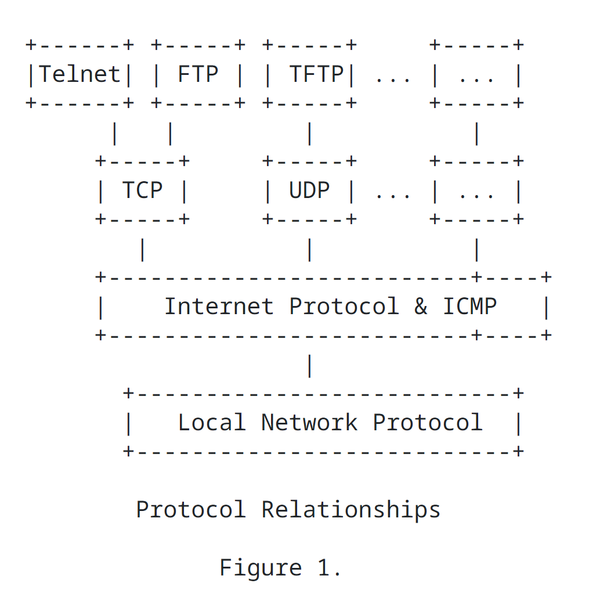

Internet Protocol interfaces on one side to the higher level host-to-host protocols and on the other side to the local network protocol. In this context a "local network" may be a small network in a building or a large network such as the ARPANET.

### 2.2. Model of Operation

The model of operation for transmitting a datagram from one application program to another is illustrated by the following scenario:

We suppose that this transmission will involve one intermediate gateway.

The sending application program prepares its data and calls on its local internet module to send that data as a datagram and passes the destination address and other parameters as arguments of the call.

The internet module prepares a datagram header and attaches the data to it.  The internet module determines a local network address for this internet address, in this case it is the address of a gateway.

It sends this datagram and the local network address to the local network interface.

The local network interface creates a local network header, and attaches the datagram to it, then sends the result via the local network.

The datagram arrives at a gateway host wrapped in the local network header, the local network interface strips off this header, and turns the datagram over to the internet module.  The internet module determines from the internet address that the datagram is to be forwarded to another host in a second network.  The internet module determines a local net address for the destination host.  It calls on the local network interface for that network to send the datagram.

This local network interface creates a local network header and attaches the datagram sending the result to the destination host.

At this destination host the datagram is stripped of the local net header by the local network interface and handed to the internet module.

The internet module determines that the datagram is for an application program in this host.  It passes the data to the application program in response to a system call, passing the source address and other parameters as results of the call.

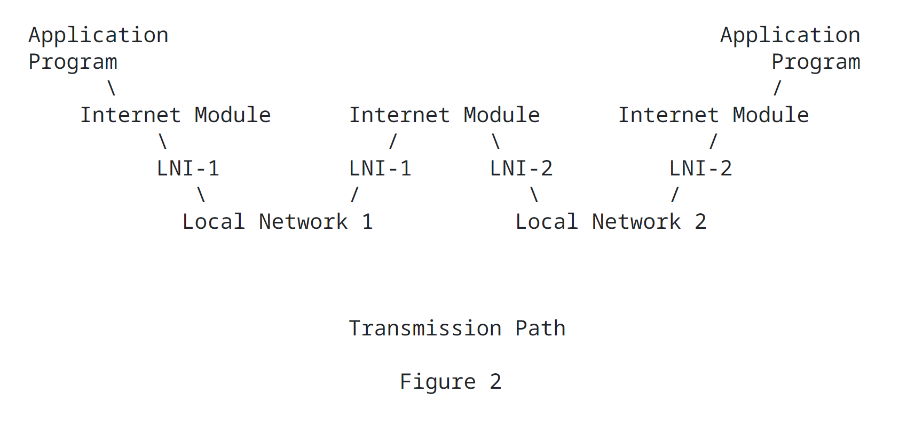

### 2.3. Function Description

The function or purpose of Internet Protocol is to move datagrams through an interconnected set of networks. This is done by passing the datagrams from one internet module to another until the destination is reached. The internet modules reside in hosts and gateways in the internet system. The datagrams are routed from one internet module to another through individual networks based on the interpretation of an internet address. Thus, one important mechanism of the internet protocol is the internet address.

In the routing of messages from one internet module to another, datagrams may need to traverse a network whose maximum packet size is smaller than the size of the datagram. To overcome this difficulty, a fragmentation mechanism is provided in the internet protocol.

Addressing

A distinction is made between names, addresses, and routes. A name indicates what we seek. An address indicates where it is. A route indicates how to get there. The internet protocol deals primarily with addresses. It is the task of higher level (i.e., host-to-host or application) protocols to make the mapping from names to addresses. The internet module maps internet addresses to local net addresses. It is the task of lower level (i.e., local net or gateways) procedures to make the mapping from local net addresses to routes.

Addresses are fixed length of four octets (32 bits). An address begins with a network number, followed by local address (called the "rest" field). There are three formats or classes of internet addresses: in class a, the high order bit is zero, the next 7 bits are the network, and the last 24 bits are the local address; in class b, the high order two bits are the local address; in class c, the high order three bits are one-one-zero, the next 21 bits are the network and the last 8 bits are the local address.

Care must be taken in mapping internet addresses to local net addresses; a single physical host must be able to act as if it were several distinct hosts to the extent of using several distinct internet addresses. Some hosts will also have several physical interfaces (multi-homing).

That is, provision must be made for a host to have several physical interfaces to the network with each having several logical internet addresses.

Examples of address mappings may be found in "Address Mappings".

Fragmentation

Fragmentation of an internet datagram is necessary when it originates in a local net that allows a large packet size and must traverse a local net that limits packets to a smaller size to reach its destination.

An internet datagram can be marked "don't fragment." Any internet datagram so marked is not to be internet fragmented under any circumstances. If internet datagram marked don't fragment cannot be delivered to its destination without fragmenting it, it is to be discarded instead.

Fragmentation, transmission and reassembly across a local network which is invisible to the internet protocol module is called intranet fragmentation and may be used.

The internet fragmentation and reassembly procedure needs to be able to break a datagram into an almost arbitrary number of pieces that can be later reassembled. The receiver of the fragments uses the identification field to ensure that fragments of different datagrams are not mixed. The fragment offset field tells the receiver the position of a fragment in the original datagram. The fragment offset and length determine the portion of the original datagram covered by this fragment. The more-fragments flag indicates (by being reset) the last fragment. These fields provide sufficient information to reassemble datagrams.

The identification field is used to distinguish the fragments of one datagram from those of another. The originating protocol module of an internet datagram sets the identfication field to a value that must be unique for that source-destination pair and protocol for the time the datagram will be active in the internet system. The originating protocol module of a complete datagram sets the more-fragments flag to zero and the fragment offset to zero.

To fragment a long internet datagram, an internet protocol module (for example, in a gateway), creates two new internet datagrams and copies the contents of the internet header fields from the long datagram into both new internet headers. The data of the long datagram is divided into two portions on a 8 octet (64 bit) boundary (the second portion might not be an integral multiple of 8 octets, but the first must be). Call the number of 8 octet blocks in the first portion NFB (for Number of Fragment Blocks). The first portion of the data is placed in the first new internet datagram, and the total length field is set to the length of the first datagram. The more-fragments flag is set to one. The second portion of the data is placed in the second new internet datagram, and the total length field is set to the length of the second datagram. The more-fragment flag carries the same value as the long datagram. The fragment offset field of the second new internet datagram is set to the value of that field in the long datagram plus NFB.

This procedure can be generalized for an n-way split, rather than the two-way split described.

To assemble the fragments of an internet datagram, an internet protocol module (for example at a destination host) combines internet datagrams that all have the same value for the four fields: identification, source, destination, and protocol. The combination is done by placing the data portion of each fragment in the relative position indicated by the fragment offset in that fragment's internet header. The first fragment will have the fragment offset zero, and the last fragment will have the more-fragments flag reset to zero.

### 2.4. Gateways

Gateways implement internet protocol to forward datagrams between networks. Gateways also implement the Gateway to Gateway Protocol GGP to coordinate routing and other internet control information.

In an gateway the higher level protocols need not be implemented and the GGP functions are added to the IP module.

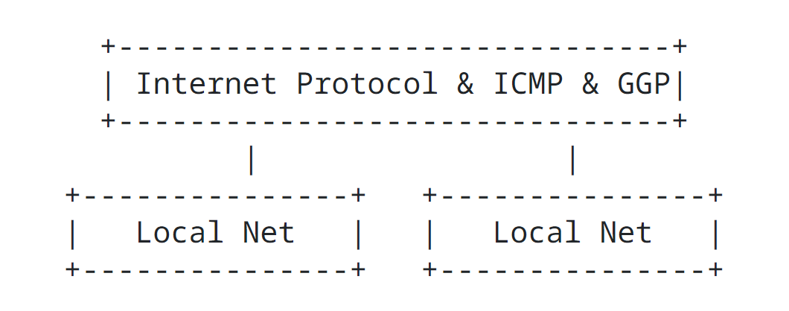

## 3. Specification

### 3.1. Internet Header Format

A summary of the contents of the internet header follows:

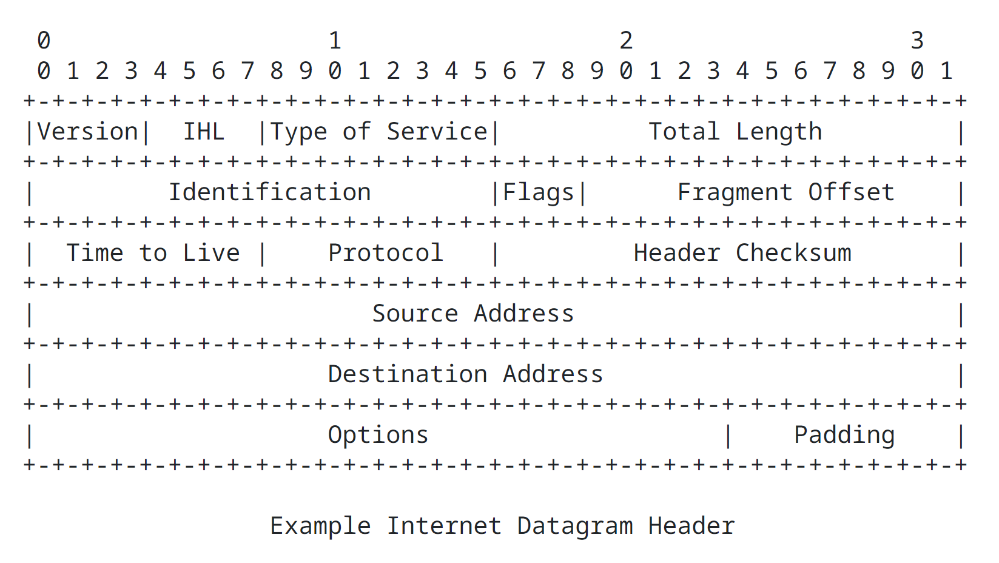

Note that each tick mark represents one bit position.

Version: 4 bits

  The version field indicates the format of the internet header. This document describes version 4.

IHL: 4 bits

  Internet Header Length is the length of the internet header in 32 bit words, and thus points to the beginning of the data. Note that the minimum value for a correct header is 5.

Type of Service: 8 bits

  The Type of Service provides an indication of the abstract parameters of the quality of service desired. These parameters are to be used to guide the selection of the actual service parameters when transmitting a datagram through a particular network. Several networks offer service precedence, which somehow treats high prcedence traffic as more important than other traffic (generally by accepting only traffic above a certain prcedence at time of high load). The major choice is a three way tradeoff between low-delay, high-relability, and high-throughput.

  - Bits 0-2: Precedence.
  - Bit    3: 0 = Normal Delay, 1 = Low Delay.
  - Bit    4: 0 = Normal Throughput, 1 = High Throughput.
  - Bit    5: 0 = Normal Reliability, 1 = High Reliability.
  - Bits 6-7: Reserved for Future Use.

  

  Precedence

  - 111 - Network Control
  - 110 - Internetwork Control
  - 101 - CRITIC/ECP
  - 100 - Flash Override
  - 011 - Flash
  - 010 - Immediate
  - 001 - Priority
  - 000 - Routine

  The use of the Delay, Throughput, and Reliability indications may increase the cost (in some sense) of the service. In many networks better performance for one of these parameters is coupled with worse performance on another. Except for very unusal cases at most two of these three indications should be set.

  The type of service is used to specify the treatment of the datagram during its transmission through the internet system. Example mappings of the internet type of service to the actual service provided on networks such as AUTODIN II, ARPANET, SATNET, and PRNET is given in "Service Mappings".

  The Network Control precedence designation is intended to be used within a network only. The actual use and control of that designation is up to each network. The internetwork control designation is intended for use by gateway control originators only. If the actual use of these precedence designations is of concern to a particular network, it is the responsibility of that network to control the access to, and use of, those prcedence designations.

Total Length: 16 bits

  Total Length is the length of the datagram, measured in octets, including internet header and data. This field allows the length of a datagram to be up to 65,535 octets. Such long datagrams are impractical for most hosts and networks. All hosts must be prepared to accept datagrams of up to 575 octets (whether they arrive whole or in fragments). It is recommended that hosts only send datagrams larger than 576 octets if they have assurance that the destination is prepared to accep the larger datagrams.

  The number 575 is selected to allow a reasonable sized data block to be transmitted in addition to the required header information. For example, this size allows a data block of 512 octets plus 64 header octets to fit in a datagram. The maximal internet header is 60 octets, and a typical internet header is 20 octets, allowing a margin for headers of higher level protocols.

Identification: 16 bits

  An identifying value assigned by the sender to aid in assembling the fragments of a datagram.

Flags: 3 bits

  Various Control Flags.

  - Bit 0: reserved, must be zero
  - Bit 1: (DF) = May Fragment, 1 = Don't Fragment.
  - Bit 2: (MF) = Last Fragment, 1 = More Fragments.

  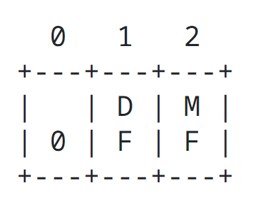

Fragment Offset: 13 bits

  This field indicates where in the datagram this fragment belongs. The fragment offset is measured in units of 8 octets (64 bits). The first fragment has offset zero.

Time to Live: 8 bits

  This field indicates the maximum time the datagram is allowed to remain in the internet system. If this field contains the value zero, then the datagram must be destroyed. This field is modified in internet header processing. The time is measured in units of seconds, but since every module that processes a datagram must decrease the TTL by at least one even if it process the datagram in less than a second, the TTL must be thought of only as an upper bound on the time a datagram may exist. The intention is to cause undeliverable datagrams to be discarded, and to bound the maximum datagram lifetime.

Protocol: 8 bits

  This field indicates the next level protocol used in the data portion of the internet datagram. The values for various protocols are specified in Assigned Numbers.

Header Checksum: 16 bits

  A checksum on the header only. Since some header fields change (e.g., time to live), this is recomputed and verified at each point that the internet header is processed.

  The checksum algorithm is:

  The checksum field is the 16 bit one's complement of the one's complement sum of all 16 bit words in the header. For purposes of computing the checksum, the value of the checksum field is zero.

  This is a simple to compute checksum and experimental evidence indicates it is adequate, but it is provisional and may be replaced by a CRC procedure, depending on further experience.

Source Address: 32 bits

  The source address.

Destination Address: 32 bits

  The destination address.

Options: variable

  The options may appear or not in datagrams. They must be implemented by all Internet Protocol IP modules (host and gateways). What is optional is their transmission in any particular datagram, not their implementation.

  In some environments the security option may be required in all datagrams.

  The option field is variable in length. There may be zero or more options. There are two cases for the format of an option:

  - Case 1: A single octet of option-type.
  - Case 2: An option-type octet, an option-length octet, and the actual option-data octets.

  The option-length octet counts the option-type octet and the option-length octet as well as the option-data octets.

  The option-type octet is viewed as having 3 fields:

  - 1 bit copied flag.
  - 2 bits option class.
  - 5 bits option number.

  The copied flag indicates that this option is copied into all fragments on fragmentation.

  - 0 = not copied
  - 1 = copied

  The option classes are:

  - 0 = control
  - 1 = reserved for future use
  - 2 = debugging and measurement
  - 3 = reserved for future use

  The following internet options are defeind:

| CLASS | NUMBER | LENGTH | DESCRIPTION |
| ----- | ------ | ------ | ----------- |
| 0     | 0      | -      | End of Option list. This option occupies only 1 octet; it has no length octet. |
| 0     | 1      | -      | No Operation. This option occupies only 1 octet; it has no length octet. |
| 0     | 2      | 11     | Security. Used to carry Security, Compartmentation, User Group (TCC), and Handling Restriction Codes compatible with DOD requirements. |
| 0     | 3      | var.   | Loose Source Routing. Used to route the internet datagram based on information supplied by the source. |
| 0     | 9      | var.   | Strict Source Routing. Used to route the internet datagram based on information supplied by the source. |
| 0     | 7      | var.   | Record Route. Used to trace the route an internet datagram takes. |
| 0     | 8      | 4      | Stream ID. Used to carry the stream identifier. |
| 2     | 4      | var.   | Internet Timestamp. |

Specific Option Definitions

End of Option List

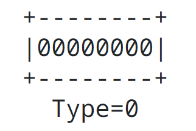

This option indicates the end of the option list. This might not coincide with the end of the internet header according to the internet header length. This is used at the end of all options, not the end of each option, and need only be used if the end of the options would not otherwise coincide with the end of the internet header.

May be copied, introduced, or deleted on fragmentation, or for any other reason.

No Operation

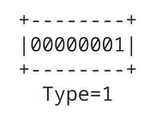

This option may be used between options, for example, to align the beginning of a subsequent option on a 32 bit boundary.

May be copied, introduced, or deleted on fragmentation, or for any other reason.

Security

This option provides a way for hosts to send security, compartmentation, handling restrictions, and TCC (closed user group) parameter. The format for this option is as follows:

Security (S field): 16 bits

Specifies one of 16 levels of security (eight of which are reserved for future use).

  - 00000000 00000000 - Unclassified
  - 11110001 00110101 - Confidential
  - 01111000 10011010 - EFTO
  - 10111100 01001101 - MMMM
  - 01011110 00100110 - PROG
  - 10101111 00010011 - Restricted
  - 11010111 10001000 - Secret
  - 01101011 11000101 - Top Secret
  - 00110101 11100010 - (Reserved for future use)
  - 10011010 11110001 - (Reserved for future use)
  - 01001101 01111000 - (Reserved for future use)
  - 00100100 10111101 - (Reserved for future use)
  - 00010011 01011110 - (Reserved for future use)
  - 10001001 10101111 - (Reserved for future use)
  - 11000100 11010110 - (Reserved for future use)
  - 11100010 01101011 - (Reserved for future use)

Compartments (C field): 16 bits

  An all zero value is used when the information transmitted is not comparmented. Other values for the compartments field may be obtained from the Defense Intelligence Agency.

Handling Restrictions (H field): 16 bits

  The values for the control and release markings are alphanumeric digraphs and are defined in the Defense Intelligence Agency Manual DIAM 65-19, "Standard Security Markings".

Transmission Control Code (TCC field): 24 bits

  Provides a means to segregate traffic and define controlled communities of interest among subscribers. The TCC values are trigraphs, and are available from HQ DCA Code 530.

Must be copied on fragmentation. This option appears at most once in a datagram.

Loose Source and Record Route

The loose source and record route (LSRR) option provides a means for the source of an internet datagram to supply routing information to be used by the gateways in forwarding the datagram to the destination, and to record the route information.

The option begins with the option type code.  The second octet is the option length which includes the option type code and the length octet, the pointer octet, and length-3 octets of route data. The third octet is the pointer into the route data indicating the octet which begins the next source address to be processed.  The pointer is relative to this option, and the smallest legal value for the pointer is 4.

A route data is composed of a series of internet addresses. Each internet address is 32 bits or 4 octets.  If the pointer is greater than the length, the source route is empty (and the recorded route full) and the routing is to be based on the destination address field.

If the address in destination address field has been reached and the pointer is not greater than the length, the next address in the source route replaces the address in the destination address field, and the recorded route address replaces the source address just used, and pointer is increased by four.

The recorded route address is the internet module's own internet address as known in the environment into which this datagram is being forwarded.

This procedure of replacing the source route with the recorded route (though it is in the reverse of the order it must be in to be used as a source route) means the option (and the IP header as a whole) remains a constant length as the datagram progresses through the internet.

This option is a loose source route because the gateway or host IP is allowed to use any route of any number of other intermediate gateways to reach the next address in the route.

Must be copied on fragmentation.  Appears at most once in a datagram.

Strict Source and Record Route

The strict source and record route (SSRR) option provides a means for the source of an internet datagram to supply routing information to be used by the gateways in forwarding the datagram to the destination, and to record the route information.

The option begins with the option type code.  The second octet is the option length which includes the option type code and the length octet, the pointer octet, and length-3 octets of route data. The third octet is the pointer into the route data indicating the octet which begins the next source address to be processed. The pointer is relative to this option, and the smallest legal value for the pointer is 4.

A route data is composed of a series of internet addresses. Each internet address is 32 bits or 4 octets.  If the pointer is greater than the length, the source route is empty (and the recorded route full) and the routing is to be based on the destination address field.

If the address in destination address field has been reached and the pointer is not greater than the length, the next address in the source route replaces the address in the destination address field, and the recorded route address replaces the source address just used, and pointer is increased by four.

The recorded route address is the internet module's own internet address as known in the environment into which this datagram is being forwarded.

This procedure of replacing the source route with the recorded route (though it is in the reverse of the order it must be in to be used as a source route) means the option (and the IP header as a whole) remains a constant length as the datagram progresses through the internet.

This option is a strict source route because the gateway or host IP must send the datagram directly to the next address in the source route through only the directly connected network indicated in the next address to reach the next gateway or host specified in the route.

Must be copied on fragmentation.  Appears at most once in a datagram.

Record Route

The record route option provides a means to record the route of an internet datagram.

The option begins with the option type code.  The second octet is the option length which includes the option type code and the length octet, the pointer octet, and length-3 octets of route data.  The third octet is the pointer into the route data indicating the octet which begins the next area to store a route address.  The pointer is relative to this option, and the smallest legal value for the pointer is 4.

A recorded route is composed of a series of internet addresses. Each internet address is 32 bits or 4 octets.  If the pointer is greater than the length, the recorded route data area is full. The originating host must compose this option with a large enough route data area to hold all the address expected.  The size of the option does not change due to adding addresses.  The intitial contents of the route data area must be zero.

When an internet module routes a datagram it checks to see if the record route option is present.  If it is, it inserts its own internet address as known in the environment into which this datagram is being forwarded into the recorded route beginning at the octet indicated by the pointer, and increments the pointer by four.

If the route data area is already full (the pointer exceeds the length) the datagram is forwarded without inserting the address into the recorded route.  If there is some room but not enough room for a full address to be inserted, the original datagram is considered to be in error and is discarded.  In either case an ICMP parameter problem message may be sent to the source host.

Not copied on fragmentation, goes in first fragment only. Appears at most once in a datagram.

Stream Identifier

This option provides a way for the 16 bit SATNET stream identifier to be carried through networks that do not support the stream concept.

Must be copied on fragmentation. Appears at most once in a datagram.

Internet Timestamp

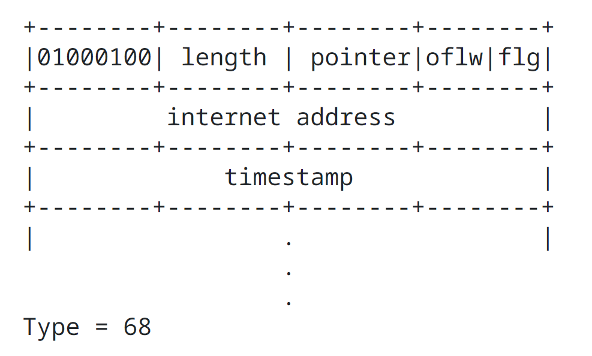

The Option Length is the number of octets in the option counting the type, length, pointer, and overflow/flag octets (maximum length 40).

The Pointer is the number of octets from the beginning of this option to the end of timestamps plus one (i.e., it points to the octet beginning the space for next timestamp).  The smallest legal value is 5.  The timestamp area is full when the pointer is greater than the length.

The Overflow (oflw) [4 bits] is the number of IP modules that cannot register timestamps due to lack of space.

The Flag (flg) [4 bits] values are

  - 0 -- time stamps only, stored in consecutive 32-bit words,

  - 1 -- each timestamp is preceded with internet address of the
               registering entity,

  - 3 -- the internet address fields are prespecified.  An IP module only registers its timestamp if it matches its own address with the next specified internet address.

  The Timestamp is a right-justified, 32-bit timestamp in milliseconds since midnight UT.  If the time is not available in milliseconds or cannot be provided with respect to midnight UT then any time may be inserted as a timestamp provided the high order bit of the timestamp field is set to one to indicate the use of a non-standard value.

The originating host must compose this option with a large enough timestamp data area to hold all the timestamp information expected.  The size of the option does not change due to adding timestamps.  The intitial contents of the timestamp data area must be zero or internet address/zero pairs.

If the timestamp data area is already full (the pointer exceeds the length) the datagram is forwarded without inserting the timestamp, but the overflow count is incremented by one.

If there is some room but not enough room for a full timestamp to be inserted, or the overflow count itself overflows, the original datagram is considered to be in error and is discarded. In either case an ICMP parameter problem message may be sent to the source host.

The timestamp option is not copied upon fragmentation.  It is carried in the first fragment.  Appears at most once in a datagram.

Padding:  variable

The internet header padding is used to ensure that the internet header ends on a 32 bit boundary. The padding is zero.

### 3.2. Discussion

The implementation of a protocol must be robust. Each implementatin must expect to interoperate with others created by different individuals. While the goal of this specification is to be explicit about the protocol there is the possibility of differing interpretations. In general, an implementation must be conservative in tis sending behavior, and liberal in its receiving behavior. That is, it must be careful to send well-formed datagrams, but must accept any datagram that it can interpret (e.g., not object to technical errors where the meaning is still clear).

The basic internet service is datagram oriented and provides for the fragmentation of datagrams at gateways, with reassembly taking place at the destination internet protocol module in the destination host. Of course, fragmentation and reassembly of datagrams within a network or by private agreement between the gateways of a networks of a network is also allowed since this transparent to the internet protocols and the higher-level protocols. This transparent type of fragmentation and reassembly is termed "network-depedent" (or intranet) fragmentation and is not discussed further here.

Internet addresses distingush sourcs and destinations to the host level and provide a protocol field as well. It is assumed that each protocol will provide for whatever multiplexing is necessary within a host.

#### Addressing

To provide for flexibility in assigning address to networks and allow for the large number of small to intermediate sized networks the interpretation of the address field is coded to specify a small number of networks with a large number of host, a moderate number of networks with a moderate number of hosts, and a large number of networks with a small number of hosts. In addition there is an escape code for extended addressing mode.

Address Formats:

| High Order Bits | Format | Class |
| --------------- | ------ | ----- |
| 0               | 7 bits of net, 24 bits of host | a |
| 10              | 14 bits of net, 16 bits of host | b |
| 110             | 21 bits of net, 8 bits of host  | c |
| 111             | excape to extended addressing mode | - |

A value of zero in the network field means this network. This is only used in certain Internet Control Message Protocl ICMP messages. The extended addressing mode is undefined. Both of these features are reserved for future use.

The actual values assigned for network addresses is given in Assigned Numbers.

The local address, assigned by the local network, must allow for a single physical host to act as several distinct internet hosts. That is, there must be a mapping between internet host addresses and network/host interfaces that allows several internet addresses to correspond to one interface. It must also be allowed for a host to have several physical interfaces and to treat the datagrams from several of them as if they were all addressed to a single host.

Address mappings between internet addresses and addresses for ARPANET, SATNET, PRNET, and other networks are described in [Address Mappings](https://datatracker.ietf.org/doc/html/rfc796).

#### Fragmentation and Reassembly

The internet identification field ID is used with the source and destination address, and the protocol fields, to identify datagram fragments for reassembly.

The More Fragments MF flag bit is set if the datagram is not the last fragment. The Fragment Offset field identifies the fragment location, relative to the beginning of the original unfragmented datagram. Fragments are counted in units of 8 octets. The fragmentation strategy is desinged so than an unfragmented datagram has all zero fragmentation information (More Fragment MF = 0, fragment offset = 0). If an internet datagram is fragmented, its data portion must be broken on 8 octet boundaries. This format allows 2^13 = 8192 fragments of 8 octets each for a total of 65,536 octets. Note that this is consistent with the datagram total length field (of course, the header is counted in the total length and not in the fragments).

When fragmentation occurs, some options are copied, but others remain with the first fragment only.

Every internet module must be able to forward a datagram of 68 octets without further fragmentation. This is because an internet header may be up to 60 octets, and the minimum fragment is 8 octets.

Every internet destination must be able to receive a datagram of 576 octets either in one piece or in fragments to be reassembled.

The fields which may be affected by fragmentation include:

- options field
- more fragments flag
- fragment offset
- internet header length field
- total length field
- header checksum

If the Don't Fragment DF flag bit is set, then internet fragmentation of this datagram is not permitted, although it may be discarded. This can be used to prohibit fragmentation is cases where the receiving host does not have sufficient resources to reassemble internet fragments.

One example of use of the Don't Fragment feature is to down line load a small host. A small host could have a boot strap program that accepts a datagram stores it in memory and then executes it.

The fragmentation and reassembly procedures are most easily described by examples. The following procedures are example implementations.

General notation in the following pseudo programs: 

- "=<" means "less than or equal"
- "#" means "not equal"
- "=" means "equal"
- "<-" means "is set to".
- "x to y" includes x and excludes y; for example, "4 to 7" would include 4, 5, and 6 (but not 7).

#### An Example Fragmentation Procedure

The maximum sized datagram that can be transmitted through the next network is called the Maximum Transmission Unit MTU.

If the total length is less than or equal the maximum transmission unit than submit this datagram to the next step in datagram processing; otherwise cut the datagram into two fragments, the first fragment being the maximum size, and the second fragment being the rest of the datagram. The first fragment is submitted to the next step in datagram processing, while the second fragment is submitted to this procedure in case it is still too large.

##### Notation:

- Fragment Offset FO
- Internet Header Length IHL
- Don't Fragment Flag DF
- More Fragment Flag MF
- Total Length TL
- Old Fragment Offset OFO
- Old Internet Header Length OIHL
- Old More Fragment Flag OMF
- Old Total Length OTL
- Number of Fragment Blocks NFB
- Maximum Transmission Unit MTU

##### Procedure:

IF Total Length TL =< Maximum Transmission Unit MTU THEN Submit this datagram to the next step in datagram processing ELSE IF Don't Fragment Flag DF = 1 THEN discard the datagram ELSE

To produce the first fragment:

1. Copy the original internet header;
2. Old Internet Header Length OIHL <- Internet Header Length IHL; Old Total Length OTL <- Total Length TL; Old Fragment Offset OFO <- Fragment Offset FO; Old More Fragment Flag OMF <- More Fragment MF;
3. Number of Fragment Block NFB <- (Maximum Transmission Unit MTU - Internet Header Length IHL * 4) / 8;
4. Attach the first Number of Fragment Block NFB * 8 data octets;
5. Correct the header:
   More Fragment Flag MF <- 1; Total Length TL <- (Internet Header Length IHL * 4) + (Number of Fragment Block NFB * 8); Recompute Checksum;
6. Submit this fragment to the next step in datagram processing;

To produce the second fragment:

7. Selectively copy the internet header (some options are not copied);
8. Append the remaining data;
9. Correct the header:
   Internet Header Length IHL <- (((Old Internet Header Length OIHL * 4) -(length of options not copied)) + 3) / 4; Total Length TL <- Old Total Length OTL - Number of Fragment Block NFB * 8 - (Old Internet Header Length OIHL * 4);
   Fragment Offset FO <- Old Fragment Offset OFO + Number of Fragment Block NFB;
   More Fragment Flag MF <- Old More Fragment Flag OMF; Recompute Checksum;
10. Submit this fragment to the fragmentation test;
11. DONE.

In the above procedure each fragment (except the last) was made the maximum allowable size. An alternative might produce less than the maxmimum size datagrams. For example, one could implement a fragmentation procedure that repeatly divided large datagrams in half until the resulting fragments were less than the maximum transmission unit size.

##### An Example Reassembly Procedure

For each datagram the buffer identifier is computed as the concatenation of the source, destination, protocol, and identification fields. If this is a whole datagram (that is both the fragment offset and the more fragments fields are zero), then any reassembly resources associated with this buffer identifier are released and the datagram is forwarded to the next step in datagram processing.

If no other fragment with this buffer identifier is on hand then reassembly resources are allocated. The reassembly resources consist of a data buffer, a header buffer, a fragment block bit table, a total data length field, and a timer. The data from the fragment is placed in the data buffer according to its fragment offset and length, and bits are set in the fragment block bit table corresponding to the fragment blocks received.

If this is the first fragment (that is the fragment offset is zero) this header is placed in the header buffer. If this is the last fragment (that is the more fragments field is zero) the total data length is computed. If this fragment completes the datagram (tested by checking the bits set in the fragment block table), then the datagram is sent to the next step in datagram processing; otherwise the timer is set to the maximum of the current timer value and the value of the time to live field from this fragment; and the reassembly routine gives up control.

If the timer runs out, the all reassembly resources for this buffer identifier are released. The initial setting of the timer is a lower bound on the reassembly waiting time. This is because the waiting time will be increased if the Time to Live in the arriving fragment is greater than the current timer value but will not be decreased if it is less. The maximum this timer value could reach is the maximum time to live (approimately 4.25 minutes). The current recommendation for the initial timer setting is 15 seconds. This may be changed as experience with this protocol accumulates. Note that the choice of this parameter value is related to the buffer capacity available and the data rate of the transmission medium; that is, data rate times timer values equals buffer size (e.g., 10Kb/s x 15 s = 150Kb).

Notation:

- Fragment Offset FO
- Internet Header Length IHL
- More Fragments Flag MF
- Time to Live TTL
- Number of Fragment Blocks NFB
- Total Length TL
- Total Data Length TDL
- Buffer Identifier BUFID
- Fragment Received Bit Table RCVBT
- Timer Lower Bound TLB

Procedure:

1. Buffer Identifier BUFID <- source|destination|protocol|identification;
2. IF Fragment Offset FO AND More Fragment MF = 0
3. THEN IF buffer with Buffer Identifier BUFID is allocated
4. THEN flush all reassembly for this Buffer Identifier BUFID;
5. Submit datagram to next step; DONE.
6. ELSE IF no buffer with Buffer Identifier BUFID is allocated
7. THEN allocate reassembly resources with Buffer Identifier BUFID;
   TIMER <- Timer Lower Bound TLB; Total Data Length TDL <- 0;
8. put data from fragment into data buffer with Buffer Identifier BUFID from octet Fragment Offset FO * 8 to octet (Total Length TL - (Internet Header Length IHL * 4)) + Fragment Offset FO * 8;
9. set Fragment Received Bit Table RCVBT bits from Fragment Offset FO to Fragment Offset FO + ((Total Length TL - (Internet Header Length IHL * 4) + 7) / 8);
10. IF More Fragment MF = 0 THEN Total Data Length TDL <- Total Length TL - (Internet Header Length IHL * 4) + (Fragment Offset FO * 8)
11. IF Fragment Offset FO = 0 THEN put header in header buffer
12. IF Total Data Length TDL # 0
13. AND all Fragment Received Bit Table RCVBT bits from 0 to (Total Data Length TDL + 7) / 8 are set
14. THEN Total Length TL <- Total Data Length TDL + (Internet Header Length IHL * 4)
15. Submit datagram to next step;
16. free all reassembly resources for this Buffer Identifier BUFID; DONE.
17. TIMER <- MAX(TIMER, Time to Live TTL)
18. give up until next fragment or timer expires
19. timer expires: flush all reassembly with this Buffer Identifier BUFID; DONE.

In the case that two or more fragments contain the same data either identically or through a partial overlap, this procedure will use the more recently arrived copy in the data buffer and datagram delivered.

#### Identification

The choice of the Identifier for a datagram is based on the need to provide a way to uniquely identify the fragments of a particular datagram. The protocol module assembling fragments judges fragments to belong to the same datagram if they have the same source, destination, protocol, and identifier. Thus, the sender must choose the Identifier to be unique for this source, destination pair and protocol for the time the datagram (or any fragment of it) could be alive in the internet.

It seems then that a sending protocol module needs to keep a table of Identifiers, one entry for each destination it has communicated with in the last maximum packet lifetime for the internet.

However, since the Identifier field allows 65,536 different values, some host may be able to simply use unique identifiers indpendent of destination.

It is appropriate for some higher protocols to choose the identifier. For example, TCP protocol modules may retransmit an identical TCP segment, and the probability for correct reception would be enhanced if the retransmission carried the same identifier as the original transmission since fragments of either datagram could be used to construct a correct TCP segment.

#### Type of Service

The Type of Service TOS is for internet service quality selection. The Type of Service is specified along the abstract parameters precedence, delay, throughput, and reliability. These abstract parameters are to be mapped into the actual service parameters of the particular networks the datagram traverses.

##### Precedence

An independent measure of the importance of this datagram.

##### Delay

Prompt delivery is important for datagrams with this indication.

##### Throughput

High data rate is important for datagrams with this indication.

##### Reliability

A higher level of effort to ensure delivery is important for datagrams with this indication.

For example, the ARPANET has a priority bit, and a choice between "standard" messages (type 0) and "uncontrolled" message (type 3), (the choice between single packet and multipacket messages can also be considered a service parameter). The uncontrolled messages tend to be less reliably delivered and suffer less delay. Suppose an internet datagram is to be sent through the ARPANET. Let the internet type of service be given as:

      Precedence:    5
      Delay:         0
      Throughput:    1
      Reliability:   1

In this example, the mapping of these parameters to those available for the ARPANET would be to set the ARPANET priority bit on since the Internet precedence is in the upper half of its range, to select standard messages since the throughput and reliability requirements are indicated and delay is not. More details are given on servcie mapping in [Service Mappings](https://datatracker.ietf.org/doc/html/rfc795).

#### Time to Live

The time to live is set by the sender to the maximum time the datagram is allowed to be internet system. If the datagram is in the internet system longer than the time to live, then the datagram must be destroyed.

This field must be decreased at each point that the internet header is processed to reflect the time spent processing the datagram. Even if no local information is available on the time actually spent, the field must be decremented by 1. The time is measured in units of seconds (i.e. the value 1 means one second). Thus, the maximum time to live is 255 seconds or 4.25 minutes. Since every module that processes a datagram must decrease the Time to Live TTL by at least one even if it process the datagram in less than a second, the Time to Live TTL must be thought of only as an upper bound on the time a datagram may exist. The intention is to cause undeliverable datagrams to be discarded, and to bound the maximum datagram lifetime.

Some higher level reliable connection protocols are based on assumptions that old duplicate datagrams will not arrive after a certain time elapses. The Time to Live TTL is a way for such protocols to have an assurance that their assumption is met.

#### Options

The options are optional in each datagram, but required in implementations. That is, the presence or absence of an option is the choice of the sender, but each internet module must be able to parse every option. There can be several options present in the option field.

The options might not end on a 32 bit boundary. The internet header must be filled out with octets of zeros. The first of these would be interpreted as the end-of-options option, and the remainder as internet header padding.

Every internet module must be able to act on every option. The Security Option is required if classified, restricted, or compartmented traffic is to be passed.

#### Checksum

The internet header checksum is recomputed if the internet header is changed. For example, a reduction of the time to lieve, additions or changes to internet options, or due to fragmentation. This checksum at the internet level is indended to protect the internet header fields from transmission errors.

There are some applications where a few data bit errors are acceptable while retransmission delays are not. If the internet protocol enforced data correctness such applications could not be supported.

#### Errors

Internet protocol errors may be reported via the Internet Control Message Protocol ICMP messages.

### 3.3. Interfaces

The functional description of user interfaces to the Internet Protocol IP is, at best, fictional, since every operating system will have different facilities. Consequently, we must warn readers that different Internet Protocol IP implementations may have different user interfaces. However, all Internet Protocol IP must provide a certain minimum set of services to guarantee that all Internet Protocol IP implementations can support the same protocol hierarchy. This section specifies the functional interfaces required of all Internet Protocol IP implementations.

Internet protocol interfaces on one side to the local network and on the other side to either a higher level protocol or an application program. In the following, the higher level protocol or application program (or even a gateway program) will be called the "user" since it is using the internet module. Since internet protocol is a datagram protocol, there is minimal memory or state maintained between datagram transmissions, and each call on the internet protocol module by the user supplies all information necessary for the Internet Protocol IP to perform the service requested.

An Example Upper Level Interface

The following two example calls satisfy the requirements for the user to internet protocol module communication:

("=>" means returns)

SEND (src, dst, prot, TOS, TTL, BufPTR, len, ID, DF, opt => result)

Where:

  - src: source address
  - dst: destination address
  - prot: protocol
  - TOS: type of service
  - TTL: time to live
  - BufPTR: buffer pointer
  - len: length of buffer
  - Id: Identifier
  - DF: Don't fragment
  - Opt: option data
  - result = response
    - Ok = datagram sent ok
    - Error = error in arguments or local network error

  Note that the precedence is included in the Type of Service TOS and the security/compartment is passed as an option.

RECV(BufPtr, prot, => result, src, dst, TOS, len, opt)

Where:

  - BufPTR = buffer pointer
  - prot = protocol
  - result = response
    - OK = datagram received ok
    - Error = error in arguments
  - len = length of buffer
  - src = source address
  - dst = destination address
  - TOS = type of service
  - opt = option data

When the user sends a datagram, it executes the SEND call supplying all the arguments. The internet protocol module, on receiving this call, checks the arguments and prepares and sends the message. If the arguments are good and the datagram is accepted by the local network, the call returns successfully. If either the arguments are bad, or the datagram is not accepted by the local network, the call returns unsuccessully. On unsuccessful returns, a reasonable report must be made as to the cause of the problem, but the details of such reports are up to individual implementations.

When a datagram arrives at the internet protocol module from the local network, either there is a pending RECV call from the user addressed or there is not. In the first case, the pending call is satisfied by passing the information from the datagram to the user. In the second case, the user addressed is notified of tha pending datagram. If the user addressed does not exist, an Internet Control Message Protocol ICMP error message is returned to the sender, and the data is discarded.

The notification of a user may be vai a pseudo interrupt or similar mechanism, as appropriate in the particular operating system environment of the implementation.

A user's RECV call may then either be immediately satisfied by a pending datagram, or the call may be pending until a datagram arrives.

The source address is included in the send call in case the sending host has several addresses (multiple physical connections or logical addresses). The internet module must check to see that the source address is one of the legal address for this host.

An implementation may also allow or require a call to the internet module to indicate interest in or reserve exclusive use of a class of datagrams (e.g., all those with a certain value in the protocol field).

This section functionally characterizes a USER/IP interface. The notation used is similar to most procedure of function calls in high level languages, but this usage is not meant to rule out trap type service calls (e.g., SVCs, UUOs, EMTs), or any other form of interprocess communication.

## Appendix A: Example & Scenarios

### Example 1:

This is an example of the minimal data carrying internet datagram:

Note that each tick mark represents one bit position.

This is a internet datagram in version 4 of internet protocol; the internet header consists of five 32 bit words, and the total length of the datagram is 21 octets. This datagram is a complete datagram (not a fragment).

### Example 2:

In this example, we show first a moderate size internet datagram (452 data octets), then two internet fragments that might result from the fragmentation of this datagram if the maximum sized transmission allowed were 280 octets.

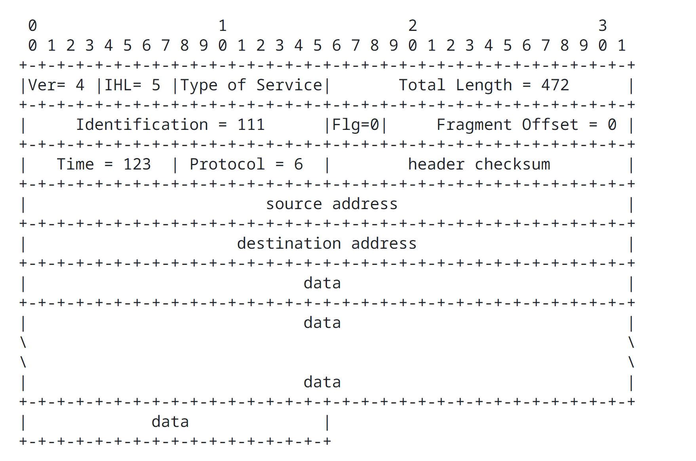

Now the first fragment that results from splitting the datagram after 256 data octets.

And the second fragment.

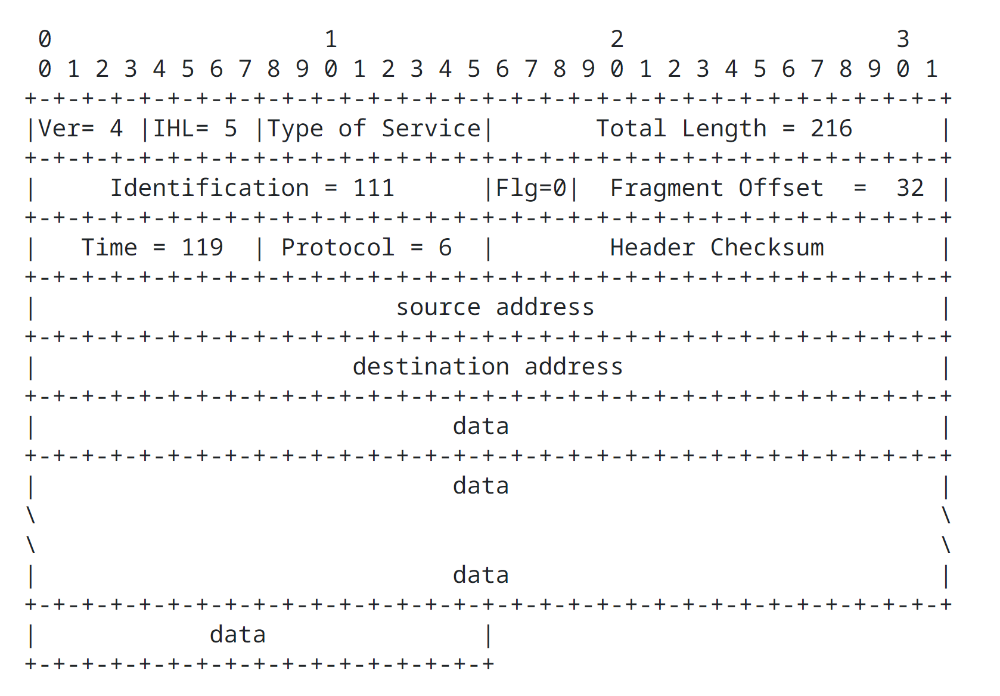

### Example 3:

Here, we show an example of a datagram containing options:

## Appendix B: Data Transmission Order

The order of transmission of the header and data described in this document is resolved to the octet level. Whenever a diagram shows a group of octets, the order of transmission of those octets is the normal order in which they are read in English. For example, in the following diagram the octets are transmitted in the order they are numbered.

Whenever an octet represents a numeric quantity the left most bit in the diagram is the high order or most significant bit. That is, the bit labeled 0 is the most significant bit. For example, the following diagram represents the value 170 (decimal).

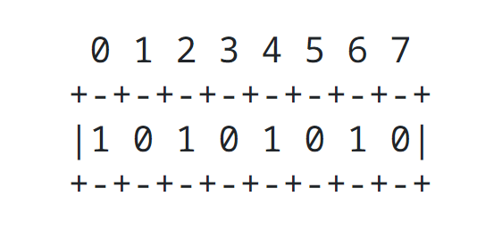

Similaryly, whenever a multi-octet field represents a numeric quantity the left most bit of the whole field is the most significant bit. When a multi-octet quantity is transmitted the most significant octet is transmitted first.

