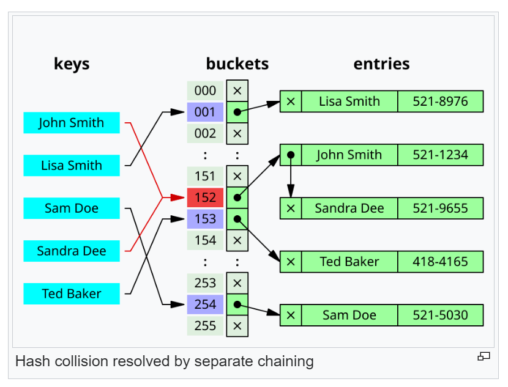

HASH TABLE
==========

[hash table](https://en.wikipedia.org/wiki/Hash_table)

In computing, a hash table is a data structure often used to implement the map abstract data type. A hash table uses a hash function to compute an index also called a hash code, into an array of buckets or slots, from which the desired value can be found. During lookup, the key is hashed and the resulting hash indicates where the corresponding value is stored.

Most hash table designs employ an imperfect hash function. Hash collisions, where the hash function generates the same index for more than one key, therefore typically must be accomomodated in some way.

In a well-dimensioned hash table, the average time complexity for each lookup is independent of the number of elements stored in the table. Many hash table designs also allow arbitrary insertions and deletions of key-value pairs, at amortized constant average cost per operation.

Hashing is an example of a space time tradeoff. If memory is infinite, the entire key can be used directly as an index to locate its value with a single memory access. On the other hand, if infinite time is available, values can be stored without regard for their keys, and a binary search or linear search can be used to retrieve the element.

In many situations, hash tables turn out to be on average more efficient than search trees or any other table lookup strcuture. For this reason, they are widely used in many kinds of computer software, particular for associative arrays, database indexing, caches, and sets.


## Overview

An associative array stores a set of (key, value) pairs and allows insertion, deletion, and lookup (search), with the constraint of unique keys. In the hash table implementation of associative arrays, an array `A` of length `m` is partially filled with `n` elements, where `m` >= `n`. A value `x` gets stored at an index location `A[h(x)]`, where `h` is a hash function, and `h(x) < m`. Under reasonable assumptions, hash tables have better time complexity bounds on search, delete, and insert operations in comparison to self-balancing binary search trees.

Hash tables are also commonly used to implement sets, by omitting the stored value for each key and merely tracking whether the key is present.

### Load factor

A load factor `a` is a critical statistic of a hash table, and is defined as follows:

```c
load factor(a) = n / m
```

- `n` is the number of entries occupied in the hash table
- `m` is the number of buckets

The performacne of the hash table deteriorates in relation to the load factor `a`.

The software typically ensures that the load factor `a` remains below a certain constant, a<sub>max</sub>. This helps maintain good performance. Therefore, a common approach is to resize or rehash the hash table whenever the load factor `a` reaches a<sub>max</sub>. Similarly the table may also be resized if the load factor drops below a<sub>max</sub>/4.

#### Load factor for separate chaining

With separate chaining hash tables, each slot of the bucket array stores a pointer to a list of array of data.

Separate chaining hash tables suffer gradually declining performance as the load factor grows, and no fixed point beyond which resizing is absolutely needed.

With separate chaining, the value of a<sub>max</sub> that gives best performance is typically between 1 and 3.

#### Load factor for open addressing

With open chaining, each slot of the bucket array holds exactly one item. Therefore an open-addressed hash table cannot have a load factor greater than 1.

The performance of open addressing becomes very bad when the load factor approaches 1.

Therefore a hash table that uses open addressing must be resized or rehashed if the load factor a approaches 1.

With open addressing, acceptable figures of max load factor a<sub>max</sub> should range around 0.6 to 0.75.

## Hash function

A hash function `h: U -> { 0, ..., m - 1 }` maps the universe U of keys to indices or slots within the table, that is, `h(x) < 0,..., m - 1` for `x < U`. The conventional implementations of hash functions are based on the integer universe assumption that all elements of the table stem from the universe `U = { 0, ..., u - 1 }`, where the bit length of u is confined within the word size of a computer architecture.

A hash function h is said to be perfect for a given set S if it is injective on S, that is, if each element `x < S` maps to a different value in 0, ..., m - 1. A perfect hash function can be created if all the keys are known ahead of time.

### Integer universe assumption

The schemes of hashing used in integer universe assumption include hashing by division, hashing by multiplication, universal hashing, dynamic perfect hashing, and static perfect hashing. However, hashing by division is the commonly used scheme.

#### Hashing by division

The scheme in hashing by division is as follows:

h(x) = x mod m

Where M is the hash digest of x < S and m is the size of the table.

#### Hashing by multiplication

The scheme in hashing by multiplication is as follows:

`h(x) = [m((MA)) mod 1]`

Where A is a real-value constant and m is the size of the table. An advantage of the hashing by multiplication is that the m is not critical. Altough any value A produces a hash function, Donald Knuth suggests using the golden ratio.

### Choosing a hash function

Uniform distribution of the hash values is a fundamental requirement of a hash function. A non-uniform distribution increases the number of collisions and the cost of resolving them. Uniformity is sometimes difficult to ensure by design, but may be evaludated empirically using statistical tests, e.g., a Pearson's chi-sequared test for discrete uniform distributions.

The distribution needs to be uniform only for table sizes that occur in the application. In particular, if one uses dynamic resizing with exact doubling and halving of the table size, then the hash function needs to be uniform only when the size is a power of two. Here the index can be computed as some range of bits of the hash function. On the other hand, some hashing algorithms prefer to have the size be a prime number.

For open addressing schemes, the hash function should also avoid clustering, the mapping of two or more keys to consecutive slots. Such clustering may cause the lookup cost to skyrocket, even if the load factor is low and collisions are infrequent. The popular multiplicative hash is claimed to have particularly poor clustering behavior.

K-independent hashing offers a way to prove a certain hash function does not have bad keysets for a given type of hashtable. A number of K-independence results are known for collision resolution schemes such as linear probing and cuckoo hashing. Since K-independence can prove a hash function works, one can then focus on finding the fastest possible such hash function.

## Collision resolution

A search algorithm that uses hashing consists of two parts. The first part is computing a hash function which transforms the search key into an array index. The ideal case is such that no two search keys hashes to the same array index. However, this is not always the case and is impossible to guarantee for unseen given data. Hence the second part of the algorithm is collision resolution. The two common methods for collision resolution are separate chaining and open addressing.

### Separate chaining

In separate chaining the process involves building a linked list with key value pair for each search array index. The collided items are chained together through a single linked list, which can be traversed to access the item with a unique search key. Collision resolution through chaining with linked list is a common method of implementation of hash tables. Let T as x be the hash table and the node respectively, the operation involves as follows:

```
Chained-Hash-Insert(T, k)
  insert x at the head of linked list T[h(k)]

Chained-Hash-Search(T, k)
  search for an element with key k in linked list T[h(k)]

Chained-Hash-Delete(T, k)
  delete x from the linked list T[h(k)]
```

If the element is comparable either numerically or lexically, and inserted into the list by maintaining the total order, it results in faster termination of the unsuccessful searches.

#### Other data structures for separate chaining

If the keys are ordered, it could be efficient to use "self-organizing" concepts such as using a self balancing binary search tree, through which the theoretical worst case could be brought down to O(log n), although it introduces additional complexities.

In dynamic perfect hashing, two level hash tables are used to reduce the lookup complexity to be guarnateed O(1) in the worst case. In this technique, the buckets of k entries are organized as perfect hash tables with K<sup>2</sup> slots providing constant worst case lookup time, and low amortied time for insertion. A study shows array based separate chaining to be 97% more performant when compared to the standard linked list methdo under heavy load.

Techniques such as using fusion tree for each buckets also result in constant time for all operations with high probability.

Caching and locality of reference

The linked list of separate chaining implementation may not be cache conscious due to spatial localitiy when the nodes of the linked list are scattered across memory, thus the list traversal during insert and search may entail CPU cache inefficiencies.

In cache conscious variants of collision resolution through separate chaining, a dynamic array found to be more cache friendly is used in the place where a linked list or self balancing binary search trees is usually deployed, since the contiguous allocation pattern of the array could be exploited by hardware cache prefetchers resulting in reduced access time and memory consumption.




### Open Addressing

Open addressing is another collision resolution technique in which every entry record is stored in the bucket array itself, and the hash resolution is performed through probing. When a new entry has to be inserted, the buckets are examined, starting with the hashed-to slot and proceeding in some probe sequence, until an unoccupied slot is found. When searching for an entry, the buckets are scanned in the same sequence, until either the target record is found, or an unused array slot is found, which indicates an unsuccessful search.

Well-known probe sequences include:

- Linear probing: in which the interval between probes is fixed (usually 1).
- Quadratic probing: in which the interval between probes is increased by adding the successive outputs of a quadratic polynomial to the value given by the original hash computation.
- Double hashing, in which the interval between probes is computed by a secondary hash function.

The performance of open addressing may be slower compared to separate chaining since the probe sequence increases when the load factor a approaches 1. The probing results in an infinite loop if the load factor reaches 1, in the case of a completely filled table. The average cost of linear probing depends on the hash function's ability to distribute the elements uniformly throughout the table to avoid clustering, since formation of clusters would result in increased search time.

Caching and locality of reference

Since the slots are located in successive locations, linear probing could lead to better utiliation of CPU cache due to localitiy of references resulting in reduced memory latency.

Other collision resolution techniques based on open addressing

Coalesced hashing

Coalesced hashing is a hybrid of both separate chaining and open addressing in which the buckets or nodes link within the table. The algorithm is ideally suited for fixed memory allocation. The collision in coalesced hashing is resolved by identifying the largest indexed empty slot on the hash table, then the colliding value is inserted into that slot. The bucket is also linked to the inserted node's slot which contains its colliding hash address.

Cuckoo hashing

Cuckoo hashing is a form of open addressing collision resolution technique which guarantees O(1) worst case lookup complexity and constant amortized time for insertions. The collision is resolved through maintaining two hash tables, each having its own hash function, and collided slot gets replaced with the given item, and the preoccupied element of the slot gets displaced into the other hash table. The process continues until every key has its own spot in the empty buckets of the tables; if the procedure enters into infinite loop - which is identified through maintaining a thresold loop counter - both hash tables get rehashed with newer hash functions and the procedure continues.

Hopsotch hasing

Hopscotch hashing is an open addressing based algorithm which combines the elements of cuckoo hashing, linear probing and chaining through the notion of a neighbourhood of buckets - the subsequent buckets around any given occupied bucket, also called a "virtual" bucket. The algorithm is designed to deliver better performance when the load factor of the hash table grows beyond 90%; it also provides high throughput in concurrent settings, thus well suited for implemnting resizable concurrent hash table. The neighbourhood characteristic of hopscotch hashing guarantees a property that, the cost of finding the desired item from any given buckets within the neighbourhood is very close of finding it in the bucket itself; the algorithm attempts to be an item into its neighbourhood - with a possible const involved in displacing other items.

Each bucket within the hash table includes an additional "hop-information" - an H-bit bit array for indicating the relative distance of the item which was originally hashed into the current virtual bucket within H-1 entries. Let k and Bk be the key to be inserted and bucket to which the key is hashed into respectively; several cases are involved in the insertion procedure such that the neighbourhood property of the algorithm is vowed: if bk is empty, the element is inserted, and the leftmost bit of bitmap is set to 1; if not empty, linear probing is used for finding an empty slot in the table, the bitmap of the bucket gets updated followed by the insertion; if the empty slot is not within the range of the neighbourhood, i.e. H-1 subsequent swap and hop-info bit array manipulation of each bucket is performed in accordance with its neighbourhood invariant properties.

#### Robin Hood hashing

Robin Hood hashing is an open addressing based collision resolution algorithm; the collisions are resolved through favouring the displacement of the element that is farthest - or longest probe sequence length - from its "home location" i.e. the bucket ot which the item was hashed into. Although Robin Hood hasing does not change theoretical search cost, it significantly affects the variane of the distribution of the items on the buckets, i.e dealing with cluster formation in the hash table. Each node within the hash table that uses Robin Hood hashing should be augmented to store an extra PSL value. Let x be the key to be inserted, x.psl be the (incremental) PSL length of x, T be the hash table and j be the inde, the insertion procedure is as follows:


## Dynamic Resizing

Repeated insertions cause the number of entries in a hash table to grow, which consequently increases the load factor; to maintain the amortized O(1) performance of the lookup and insertion operations, a hash table is dynamically resized and the items of the tables are rehashed into the bukets of the new hash table, since the items cannot be copied over as varying table sizes results in different hash value due to modulo operation. If a hash table becomes "too empty" after deleting elements, resizing may be performed to avoid excessive memory usage.

### Resizing by moving all entries

Generally, a new hash table with a size double that of the original hash table gets allocated privately and every item in the original hash table gets moved to the newly allocated one by computing the hash values of the items followed by the insertion opration. Rehashing is simple, but computationally expensive.

### Alternatives to all at once rehashing

Some hash table implementations, notably in real time systems, cannot pay the price of enlarging the hash table all at once, because it may interrupt time-critical operations. If one cannot avoid dynamic resizing, a solution is to perform the resizing gradually to avoid storage blip - typically at 50% of new table's size - during rehashing and to avoid memory fragmentatin that triggers heap compaction due to deallocation of large memory blocks caused by the old hash table. In such case, the rehashing operation is done incrementally through extending prior memory block allocated for the old hash table such that the buckets of the hash table remain unaltered. A common approach for amortized rehashing involves maintaining two hash functions h<sub>old</sub> and h<sub>new</sub>. The process of rehashing a bucket's items in accordance with the new hash function is termed as cleaning, which is implemented through command pattern by encapsulating the operations such as add(key), get(key) and delete(key) through a lookup(key, command) wrapper such that each element in the bucket gets rehashed and its procedure involve as follows:

...

Linear hasing

Linear hashing is an implementation of the hash table which enables dynamic growths or shrinks of the table one bucket at a time.

