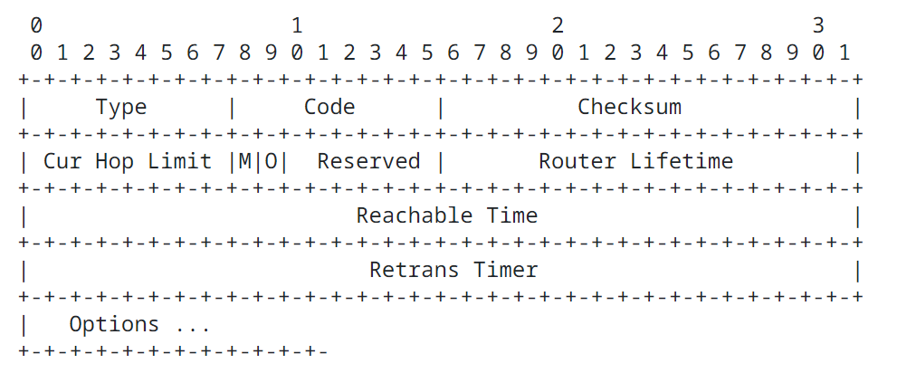
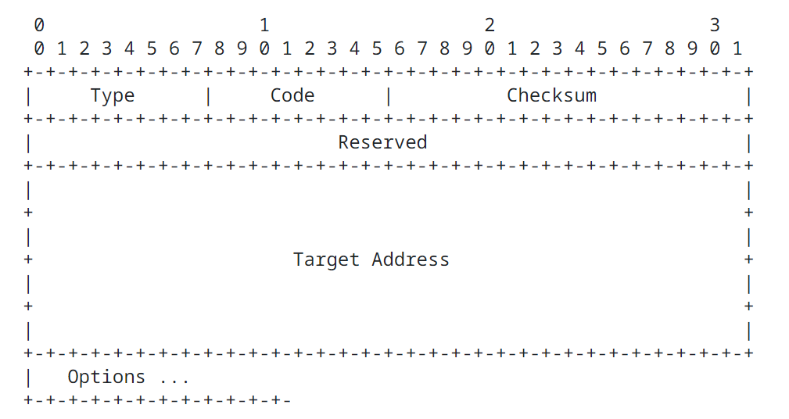
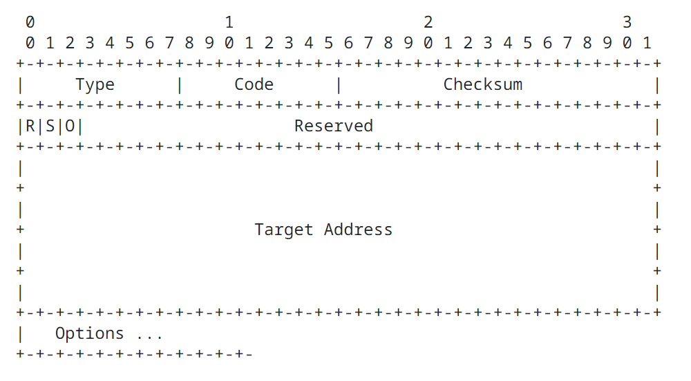
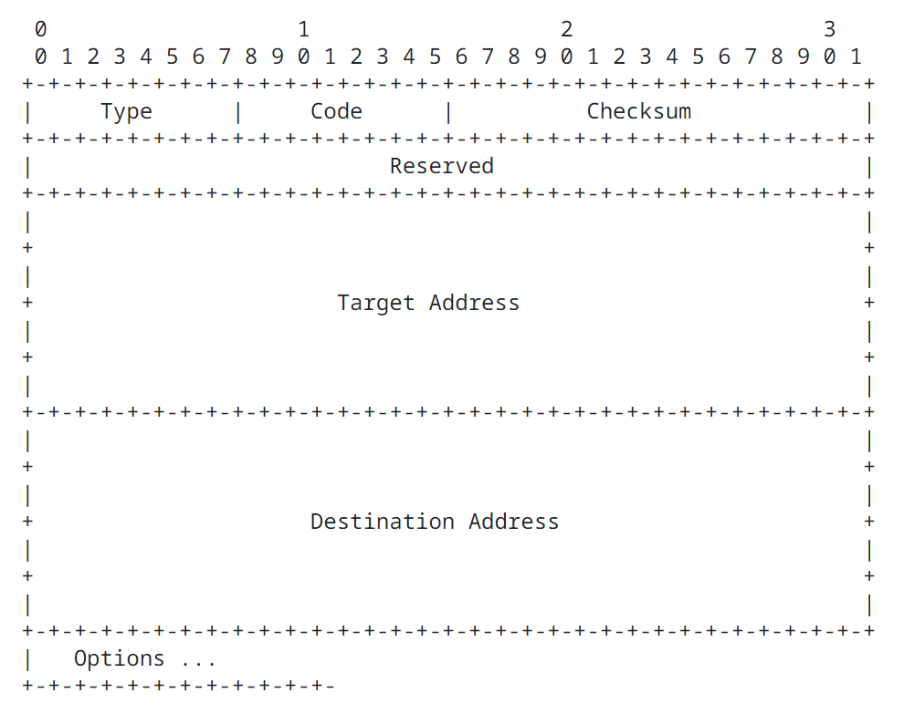
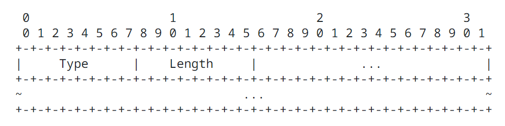
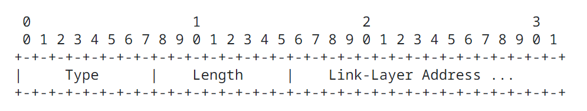
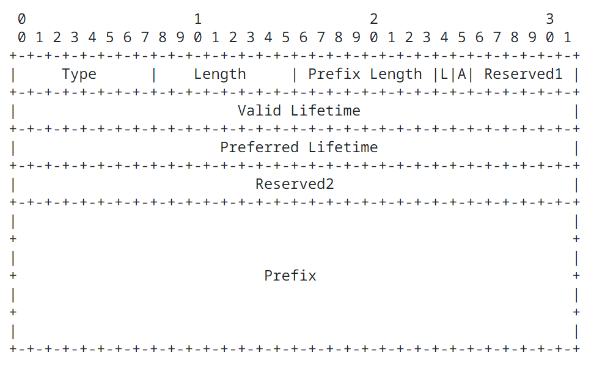
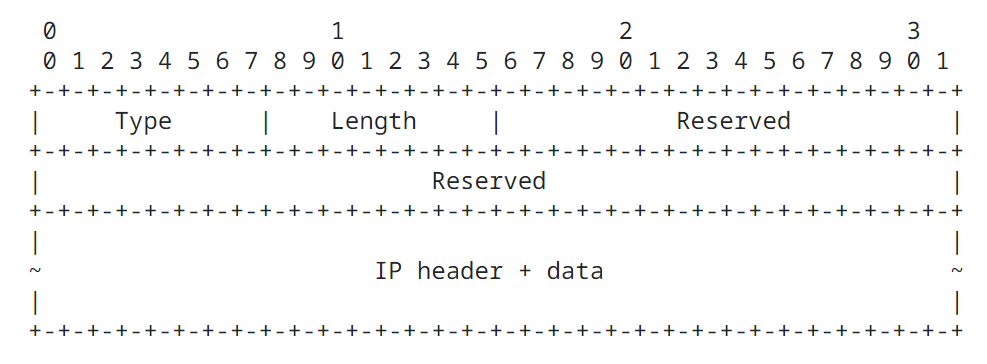
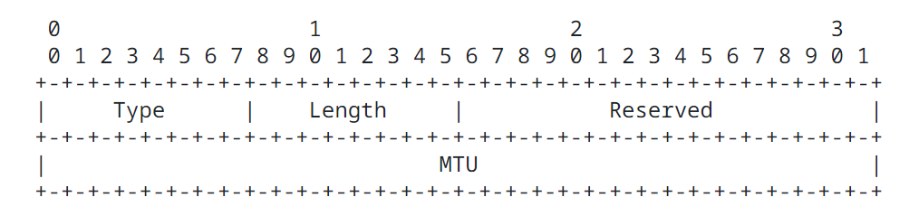

Neighbor Discovery for Internet Protocol version 6IPv6
=================================================================

### Abstract

This document specifies the Neighbor Discovery protocol for Internet Protocol version 6IPv6. Internet Protocol version 6IPv6 nodes on the same link use Neighbor Discovery to discover each other's presence, to determine each other's link layer addresses, to find routers, and to maintain reachability information about the paths to active neighbors.

## 1. Introduction

This specification defines the Neighbor DiscoveryND protocol for Internet Protocol version 6 IPv6. Nodes (hosts and routers) use Neighbor Discovery to determine the link layer addresses for neighbors known to reside on attached links and to quickly purge cached values that become invalid. Hosts also use Neighbor Discovery to find neighboring routers that are willing to forward packets on their behalf. Finally, nodes use the protocol to actively keep track of which neighbors are reachable and which are not, and to detect changed link layer addresses. When a router or the path to a router fails, a host actively searches for functioning alternates.

Unless specified otherwise (in a document that covers operating Internet ProtocolIP over a particular link type) this document applies to all link types. However, because Neighbor Discovery ND uses link layer multicast for some of its services, it is possible that on some link types (e.g., Non-Broadcast Multi Access NBMA links), alternative protocols or mechanisms to implement those services will be specified (in the appropriate document covering the operation of Internet Protocol IP over a particular link type). The services described in this document that are not directly dependent on multicast, such as Redirects, Next-hop determination, Neighbor Unreachability Detection, etc., are expected to be provided as specified in this document. The details of how one uses Neighbor Discovery ND on Non-Broadcast Multi Access NBMA links are addressed in [IPv6 over Non-Broadcast Multiple Access (NBMA) networks](https://datatracker.ietf.org/doc/html/rfc2491). In addition, [Recommendations for IPv6 in Third Generation Partnership Project (3GPP) Standards](https://datatracker.ietf.org/doc/html/rfc3314) and [Internet Protocol Version 6 (IPv6) for Some Second and Third Generation Cellular Hosts](https://datatracker.ietf.org/doc/html/rfc3316) discuss the use of this protocol over some cellular links, which are examples of Non-Broadcast Multi Access NBMA links.

## 2. Terminology

### 2.1. General

| Field | Description |
| ----- | ----------- |
| IP    | Internet Protocol version 6. The terms Internet Protocol version 4 IPv4 and Internet Protocol version 6 IPv6 are used only in contexts where necessary to avoid ambiguity. |
| ICMP  | Internet Control Message Protocol for the Internet Protocol version 6. The terms Internet Control Message Protocol verison 4 ICMPv4 and Internet Control Message Protocol verison 6 ICMPv6 are used only in contexts where necessary to avoid ambiguity. |
| Node  | A device that implements Internet Protocol. |
| Router | A node that forwards Internet Protocol IP packets not explicitly addressed to itself. |
| Host  | Any node that is not a router. |
| Upper layer | A protocol layer immediately above Internet Protocol IP. Examples are transport protocols such as Transmission Control Protocol TCP and User Datagram Protocol UDP, control protocols such as Internet Control Message Protocol ICMP, routing protocols such as Open Shortest Path First OSPF, and Internet layer (or lower layer) protocols being "tunneled" over (i.e., encapsulated in) Internet Protocol IP such ad Internetwork Packet Exchange IPX, AppleTalk, or Internet Protocol IP itself. |
| link | a communcation facility or medium over which nodes can communicate at the link layer, i.e., the layer immediately below Internet Protocol IP. Examples are Ethernets (simple or bridged), PPP links, X.25, Frame Relay, or ATM networks as well as Internet layer (or higher layer) "tunnels", such as tunnels over Internet Protocol version 4 IPv4 or Internet Protocol version 6 IPv6 itself. |
| interface | A node's attachment to a link. |
| neighbors | nodes attached to the same link. |
| address | an Internet Protocol IP layer identifier for an interface or a set of interfaces. |
| anycast address | An identifier for a set of interfaces (typically belonging to different nodes). A packet sent to an anycast address if delivered to one of the interfaces identified by that address (the "nearest" one, according to the routing protocol's measure of distance). See [IP Version 6 Addressing Architecture](https://datatracker.ietf.org/doc/html/rfc4291).  Note that an anycast address is syntactically indistinguishable from a unicast address. Thus, nodes sending packets to anycast addresses don't generally know that an anycast address is being used. Throughout the rest of this document, references to unicast addresses also apply to anycast addresses in those cases where the node is unaware that a unicast address is actually an anycast address. |
| prefix | a bit string that consists of some number of initial bits of an address. |
| link layer address | a link layer identifier for an interface. Examples include IEEE 802 addresses for Ethernet links. |
| on link | an address that is assigned to an interface on a specified link. A node considers an address to be on link if:  - it is covered by one of the link's prefixes (e.g., as indicated by the on link flag in the Prefix Information option)  - a neighboring router specifies the address as the target of a Redirect message  - a Neighbor Advertisement message is received for the target address  - any Neighbor Discovery message is received from the address. |
| off link | the opposite of "on link"; an address that is not assigned to any interfaces on the specified link. |
| longest prefix match | the process of determining which prefix (if any) i a set of prefixes covers a target address. A target address is covered by a prefix if all of the bits in the prefix match the left-most bits of the target address. When multiple prefixes cover an address, the longest prefix is the one that matches. |
| reachability | whether or not the one-way "forward" path to a neighbor is functioning properly. In particular, whether packets sent to a neighbor are reaching the Internet Protocol IP layer on the neighboring machine and are being processed properly by the receiving Internet Protocol IP layer. For neighboring routers, reachability means that packets sent by a node's Internet Protocol IP layer are delivered to the router's Internet Protocol IP layer, and the router is indeed forwarding packets (i.e., it is configured as a router, not a host). For hosts, reachability means that packets sent by a node's Internet Protocol IP layer are delivered to the neighbor host's Internet Protocol IP layer. |
| packet | an Internet Protocol IP header plus payload. |
| link MTU | the maximum transmission unit, i.e., maximum packet size in octets, that can be conveyed in one transmission unit over a link. |
| target | an address about which address resolution information is sought, or an address that is the new first hop when being redirected. |
| proxy | a node that responds to Neighbor Discovery query messages on behalf on another node. A router acting on behalf of a mobile node that has moved off link could potentailly act as a proxy for the mobile node. |
| ICMP destination unreachable indication | an error indication returned to the original sender of a packet that cannot be delivered for the reasons outlined in [Internet Control Message Protocol (ICMPv6) for the Internet Protocol Version 6 (IPv6) Specification](https://datatracker.ietf.org/doc/html/rfc4443). If the error occurs on a node other than the node originating the packet, an ICMP error message is generated. If the error occurs on the originating node, an implementation is not required to actually create and send an ICMP error packet to the source, as long as the upper layer sender is notified through an appropriate mechanism (e.g., return value from a procedure call). Note, however, that an implementation may find it convenient in some cases to return errors to the sender by taking the offending packet, generating an ICMP error message, and then delivering it (locally) through the generic error handling routines. |
| random delay | when sending out messages, it is sometimes necessary to delay a transmission for a random amount of time in order to prevent multiple nodes from transmitting at exactly the same time, or to prevent long-range periodic transmissions from synchronizing with each other sync. When a random component is required, a node calculates the actual delay in such a way that the computed delay forms a uniformly distributed random value that falls between the specified minimum and maximum delay times. The implementor must take care to ensure that thne granularity of the calculated random component and the resolution of the timer userd are both high enough to ensure that the probability of multiple nodes delaying the same amount of time is small. |
| random delay seed | if a pseudo random number generator is used in calculating a random delay component, the generator should be initialized with a unique seed prior to being used. Note that it is not sufficient to use the interface identifier alone as the seed, since interface identifiers will not always be unique. To reduce the probability that duplicate interface identifiers cause the same seed to be used, the seed should be calculated from a vaierty of input sources (e.g., machine components) that are likely to be different even on identical "boxes". For example, the seed could be formed by combining the CPU's serial number with an interface identifier. Additional information on randomness and random number generation can be found in [Randomness Requirements for Security](https://datatracker.ietf.org/doc/html/rfc4086). |

### 2.2. Link Types

Different link layers have different properties. The ones of concern to Neightbor Discovery are:

| Field | Description |
| ----- | ----------- |
| multicast capable | a link that supports a native mechanism at the link layer for sending packets to all (i.e., broadcast) or a subset of all neighbors. |
| point-to-point | a link that connects exactly two interfaces. A point-to-point link is assumed to have multicast capability and a link local address. |
| Non-Broadcast Multi Access NBMA | a link to which more than two interfaces can attach, but that does not support a native form of multicast or broadcast (e.g., X.25, ATM, frame relay, etc.). Note that all link types (including NBMA) are expected to provide multicast service for applications that need it (e.g., using multicast servers). However, it is an issue for further study whether Neighbor Discovery ND should use such facilities or an alternate mechanism that provides the equivalent multicast capability for Neighbor Discovery ND. |
| shared media | a link that allows direct communication among a number of nodes, but attached nodes are configured in such a way that they do not have complete prefix information for all on link destinations. That is, at the Internet Protocol IP level, nodes on the same link may not know that they are neighbors; by default, they communicate through a router. Examples are large (switched) public data networks such as Switched Multimegabit Data Service SMDS and Broadband Integrated Service Digital Network B-ISND. Also known as "large clouds". See [Internet Architecture Extensions for Shared Media](https://datatracker.ietf.org/doc/html/rfc1620). |
| variable MTU | a link that does not have a well-defined MTU (e.g., IEEE 802.5 token rings). Many links (e.g., Ethernet) have a standard MTU defined by the link layer protocol or by the specific document describing how to run IP over the link layer. |
| asymmetric reachability | a link where non-reflexive and/or non-transitive reachability is part of normal operation. (Non-reflexive reachability means packets from A reach B, but packets from B don't reach A. Non-transitive reachability means packets from A reach B, and packets from B reach C, but packets from A don't reach C.) Many radio links exhibit these properties. |

### 2.3. Addresses

Neighbor Discovery makes use of a number of different addresses defined in [IP Version 6 Addressing Architecture](https://datatracker.ietf.org/doc/html/rfc4291), including:

| Field | Description |
| ----- | ----------- |
| all-nodes multicast address | the link local scope address to reach all nodes, FF02::1. |
| all-routers multicast address | the link local scope address to reach all routers, FF02::2. |
| solicited-node multicast address | a link local scope multicast address that is computed as a function of the solicited target's address. The function is described in [IP Version 6 Addressing Architecture](https://datatracker.ietf.org/doc/html/rfc4291). The function is chosen so that Internet Protocol IP addresses that differ only in the most significant bits, e.g., due to multiple prefixes associated with different providers, will map to the same solicited-node address thereby reducing the number of multicast addresses a node must join at the link layer. |
| link-local address | a unicast address having link only scope that can be used to reach neighbors. All interfaces on routers must have a link local address. Also, [IPv6 Stateless Address Autoconfiguration](https://datatracker.ietf.org/doc/html/rfc4862) requires that interfaces on hosts have a link local address. |
| unspecified address | a reserved address value that indicates the lack of an address (e.g., the address is unknown). It is never used as a destination address, but may be used as a source address if the sender does not (yet) know its own address (e.g., while verifying an address is used during stateless address autoconfiguration). The unspecified address has a value of 0:0:0:0:0:0:0:0. |

Note that this specification does not strictly comply with the consistency requirements in [Default Address Selection for Internet Protocol version 6 (IPv6)](https://datatracker.ietf.org/doc/html/rfc3484) for the scopes of source and destination addresses. It is possible in some cases for hosts to use a source address of a large scope than the destination address in the IPv6 header.

## 3. Protocol Overview

This protocol solves a set of problems related to the interaction between nodes attached to the same link. It defines mechanisms for solving each of the following problems:

- Router Discovery

  How hosts locate routers that reside on an attached link.

- Prefix Discovery

  How hosts discover the set of address prefixes that define which destinations are on link for an attached link. (Notes use prefixes to distinguish destinations that reside on link from those only reachable through a router.)

- Parameter Discovery

  How a node learns link parameters (such as the Link Maximum Transmission Unit Link MTU) or Internet Parameters (such as the hop limit value) to place in outgoing packets.

- Address Autoconfiguration

  Introduces the mechanisms needed in order to allow nodes to configure an address for an interface in a stateless manner. Stateless address autoconfiguration is specified in [IPv6 Stateless Address Autoconfiguration](https://datatracker.ietf.org/doc/html/rfc4862).

- Address resolution

  How nodes determine the link layer address of an on link destination (e.g., a neighbor) given only the destination's Internet Protocol IP address.

- Next-hop determination

  The algorithm for mapping an Internet Protocol IP destination address into the Internet Protocol address of the neighbor to which traffic for the destination should be sent. The next-hop can be a router or the destination itself.

- Neighbor Unreachability Detection

  How nodes determine that a neighbor is no longer reachable. For neighbors used as routers, alternate default routers can be tried. For both routers and hosts, address resolution can be performed again.

- Duplicate Address Detection

  How a node determines whether or not an address it wishes use is already in use by another node.

- Redirect

  How a router informs a host of a better first-hop node to reach a particular destination.

Neighbor Discovery defines five different Internet Control Message Protocol ICMP packet types: A pair of Router Solicitation and Router Advertisement messages, a pair of Neighbor Solicitation and Neighbor Advertisements messages, and a Redirect message. The messages serve the following purpose:

- Router Solicitation

  When an interface becomes enabled, hosts may send out Router Solicitations that request reouters to generate Router Advertisements immediately rather than at their next scheduled time.

- Router Advertisement

  Routers advertise their presence together with various link and Internet parameters either periodically, or in response to a Router Solicitation message. Router Advertisements contain prefixes that are used for determining whether another address shares the same link (on link determination) and/or address configuration, a suggested hop limit value, etc.

- Neighbor Solicitation

  Sent by a node to determine the link layer address of a neighbor, or to verify that a neighbor is still reachable via a cached link layer address. Neighbor Solicitations are also used for Duplicate Address Detection.

- Neighbor Advertisement

  A response to a Neighbor Solicitation message. A node may also send unsolicited Neighbor Advertisements to announce a link layer address change.

- Redirect

  Used by routers to inform hosts of a better first hop for a destination.

On multicast capable links, each router periodically multicasts a Router Advertisement packet announcing its availability. A host receives Router Advertisements from all routers, building a list of default routers. Routers generate Router Advertisements frequently enough that hosts will learn of their presence within a few minutes, but not frequently enough to rely on an absence of advertisements to detect router failure; a separate Neighbor Unreachability Detection algorithm provides failure detection.

Router Advertisement contain a list of prefix used for on link determination and/or autonomous address configuration; flags associated with the prefixes specify the intended uses of a particular prefix. Hosts use the advertised on link prefixes to build and maintain a list that is used in deciding when a packet's destination is on link or beyond a router. Note that a destination can be on link even though it is not covered by any advertised on link prefix. In such cases, a router can send a Redirect informing the sender that the destination is a neighbor.

Router Advertisements (and per-prefix flags) allow routers to inform hosts how to perform Address Autoconfiguration. For example, routers can specify whether hosts should use DHCPv6 and/or autonomous (stateless) address configuration.

Router Advertisement messages also contain Internet parameters such as the hop limit that hosts should use in outgoing packets and, optionally, link parameters such as the Link Maximum Transmission Unit Link MTU. This facilitates centralized administration of critical parameters that can be set on routers and automatically propagated to all attached hosts.

Notes accomplish address resolution by multicasting a Neighbor Solicitation that asks the target node to return its link layer address. Neighbor Solicitation messages are multicast to the solicited-node multicast address of the target address. The target returns its link layer address in a unicast Neighbor Advertisement message. A single request response response pair of packets is sufficient for both the initiator and the target to resolve each other's link layer addresses; the initiator includes its link layer address in the Neighbor Solicitation.

Neighbor Solicitation messages can also be used to determine if more than one node has been assigned the same unicast address. The use of Neighbor Solicitation messages for Duplicate Address Detection is specified in [IPv6 Stateless Address Autoconfiguration](https://datatracker.ietf.org/doc/html/rfc4862).

Neighbor Unreachability Detection detects the failure of a neighbor or the failure of the forward path to the neighbor. Doing so requires positive confirmation that packets sent to a neighbor are actually reaching that neighbor and being processed properly by its Internet Protocol IP layer. Neighbor Unreachability Detection uses confirmation from two sources. When possible, upper layer protocols provide a positive confirmation that a connection is making "forward progress", that is, previously sent data is known to have been delivered correctly (e.g., new acknowledgments were received recently). When positive confirmation is not forthcoming through such "hints", a node sends unicast Neighbor Solicitation messages that solicit Neighbor Advertisements as reachability confirmation from the next hop. To reduce unnecessary network traffic, probe messages are only sent to neighbors to which the node is actively sending packets.

In addition to addressing the above general problems, Neighbor Discovery also handles the following situations:

- Link layer address change

  A node that knows its link layer address has changed can multicast a few (unsolicited) Neighbor Advertisement packets to all nodes quickly update cached link layer addresses that have become invalid. Note that the sending of unsolicited advertisements is a performance enhancement only (e.g., unreliable). The Neighbor Unreachability Detection algorithm ensures that all nodes will reliably discover the new address, though the delay may be somewhat longer.

- Inbound load balancing

  Nodes with replicated interfaces may want to load balance the reception of incoming packets across multiple network interfaces on the same link. Such nodes have multiple link layer addresses assigned to the same interface. For example, a single network driver could represent multiple network interface cards as a single logical interface having multiple link layer addresses. Neighbor Discovery allows a router to perform load balancing for traffic addressed to itself by allowing routers to omit the source link layer address from Router Advertisement packets, thereby forcing neighbors to use Neighbor Solicitation messages to learn link layer addresses that differ depending on, e.g., define a mechanism that allows hosts to Load-balance incoming packets. See [IPv6 Host-to-Router Load Sharing](https://datatracker.ietf.org/doc/html/rfc4311).

- Anycast addresses

  Anycast addresses identify one of a set of nodes providing an equivalent service, and multiple nodes on the same link may be configured to recognize the same anycast address. Neighbor Discovery handles anycasts by having nodes expect to receive multiple Neighbor Advertisements for the same target. All advertisements for anycast addresses are tagged as being non-Override advertisements. A non-Override advertisement is one that does not update or replace the information sent by another advertisement. These advertisements are discussed later in the context of Neighbor advertisement messages. This invokes specific rules to determine which of potentially multiple advertisements should be used.

- Proxy advertisements

  A node willing to accept packets on behalf of a target address that is unable to respond to Neighbor Solicitations can issue non-Override Neighbor Advertisements. Proxy advertisements are used by Mobile IPv6 Home Agents to defend mobile nodes' addresses when they move off link. However, it is not intended as a general mechanism to handle nodes that, e.g., do not implement this protocol.

### 3.1. Comparison with Internet Protocol version 4 IPv4

The Internet Protocol version 6 IPv6 Neighbor Discovery protocol corresponds to a combination of the Internet Protocol version 4 IPv4 protocols Address Resolution Protocol [An Ethernet Address Resolution Protocol or Converting Network Protocol Addresses](https://datatracker.ietf.org/doc/html/rfc826), Internet Control Message Protocol ICMP Router Discovery [ICMP Router Discovery Messages](https://datatracker.ietf.org/doc/html/rfc1256), and Internet Control Message Protocol ICMP Redirect. In Internet Protocol version 4 IPv4 there is no generally agreed upon protocol or mechanism for Neighbor Unreachability Detection, although the Hosts Requirements document [Requirements for Internet Hosts -- Communication Layers](https://datatracker.ietf.org/doc/html/rfc1122) does specify some possible algorithms for Dead Gateway Detection (a subset of the problems Neighbor Unreachability Detection tackles).

The Neighbor Discovery protocol provides a multitude of improvements over the Internet Protocol version 4 IPv4 set of protocols:

- Router Discovery is part of the base protocol set; there is no need for hosts to "snoop" the routing protocols.
- Router Advertisements carry link layer addresses; no additional packet exchange is needed to resolve the router's link layer address.
- Router Advertisements carry prefixes for a link; there is no need to have a separate mechanism to configure the "netmask".
- Router Advertisements enable Address Autoconfiguration.
- Routers can advertise an Maximum Transmission Unit MTU for hosts to use on the link, ensuring that all nodes use the same Maximum Transmission Unit MTU value on links lacking a well-defined Maximum Transmission Unit MTU.
- Address resolution multicasts are "spread" over 16 million (2^24) multicast addresses, greatly reducing address resolution related interrupts on nodes other than the target. Moreover, non-IPv6 machines should not be interrupted at all.
- Redirects contain the link layer address of the new first hop; separate address resolution is not needed upon receiving a redirect.
- Multiple prefixes can be associated with the same link. By default, hosts learn all on link prefixes from Router Advertisements. However, routers may be configured to omit some or all prefixes from Router Advertisements. In such cases hosts assume that destinations are off link and send traffic to routers. A router can then issue redirects as appropriate.
- Unlike Internet Protocol version 4 IPv4, the recipient of an Internet Protocol version 6 IPv6 redirect assumes that the new next-hop is on link. In Internet Protocol version 4 IPv4, a host ignores redirects specifying a next-hop that is not on link according to the link's network mask. The Internet Protocol version 6 IPv6 redirect mechanism is analogous to the XRedirect facility specified in [Internet Architecture Extensions for Shared Media](https://datatracker.ietf.org/doc/html/rfc1620). It is expected to be useful on non-broadcast and shared media links in which it is undesirable or not possible for nodes to know all prefixes for on-link destinations.
- Neighbor Unreachability Detection is part of the base, which significantly improves the robustness of packet delivery in the presence of failing routers, partially failing or partitioned links, or nodes that change their link layer addresses. For instance, mobile nodes can move off link without losing any connectivity due to stale ARP caches.

Unlike ARP, Neighbor Discovery detects half-link failures (using Neighbor Unreachability Detection) and avoids sending traffic to neighbors with which two-way connectivity is absent.

Unlike in Internet Protocol version 4 IPv4 Router Discovery, the Router Advertisement messages do not contain a preference field. The preference field isnot needed to handle routers of different "stability"; the Neighbor Unreachability Detection will detect dead routers and switch to a working one.

The use of link local addresses to uniquely identify routers (for Router Advertisement and Redirect messages) makes it possible for hosts to maintain the router associations in the event of the site renumering to use new global prefixes.

By setting the Hop Limit to 255, Neighbor Discovery is immune to off lnik senders that accidentally or intentionally send Neighbor Discovery ND messages. In Internet Protocol version 4 IPv4, off link senders can send both Internet Control Message Protocol ICMP Redirects and Router Advertisement messages.

Placing address resolution at the Internet Control Message Protocol ICMP layer makes the protocol more media-independent than ARP and makes it possible to use generic IP-layer authentication and security mechanisms as appropriate.

### 3.2. Supported Link Types

Neighbor Discovery supports links with different properties. In the presence of certain properties, only a subset of the Neighbor Discovery ND protocol mechanisms are fully specified in this document:

- point-to-point

  Neighbor Discovery handles such links just like multicast links. (Multicast can be trivially provided on point-to-point links, and interfaces can be assigned link-local addresses.)

- multicast

  Neighbor Discovery operates over multicast capable links.

- Non-Broadcast multiple Access MBMA

  Redirect, Neighbor Unreachability Detection and next-hop determination should be implemented as described in this document. Address resolution, and the mechanism for delivering Router Solicitations and Advertisements on Non-Broadcast multiple Access MBMA links are not specified in this document. Note that if hosts support manual configuration of a list of default routers, hosts can dynamically acquire the link layer addresses for their neighbors from Redirect messages.

- shared media

  The Redirect message is modeled after the XRedirect message in [Internet Architecture Extensions for Shared Media](https://datatracker.ietf.org/doc/html/rfc1620) in order to simplify use of the protocol on shared medai links.

  This specification does not address shared media issues that only relate to routers, such as:

  - How routers exchange reachability information on a shared media link
  - How a router determines the link-layer address of a host, which it needs to send redirect messages to the host.
  - How a router determines that it is the first hop router for a received packet.

  The protocol is extensible (through the definition of new options) so that other solutions might be possible in the future.

- Variable MTU

  Neighbor Discovery allows routers to specify an MTU for the link, which all nodes then use. All nodes on a link must use the same MTU (or Maximum Received Unit) in order for multicast to work properly. Otherwise, when multicasting, a sender, which can not know which nodes will receive the packet, could not determine a minimum packet size that all receivers can process (or Maximum Receive Unit).

- Asymmetric Reachability

  Neighbor Discovery detects the absence of symmetric reachability; a node avoids paths to a neighbor with which it does not have symmetric connectivity.

  The Neighbor Unreachability Detection will typically identify half-links and the node will refrain from using them.

  The protocol can presumably be extended in the future to find viable paths in environments that lack reflexive and transitive connectivity.

### 3.3. Securing Neighbor Discovery Messages

Neighbor Discovery messages are needed for various functions. Several functions are designed to allow hosts to ascertain the ownership of an address or the mapping between link layer and Internet Protocol IP layer addresses. Vulnerabilities related to Neighbor Discovery are discussed in Section 11.1. A general solution for securing Neighbor Discovery is outside the scope of this specification and is discussed in [SEcure Neighbor Discovery (SEND)](https://datatracker.ietf.org/doc/html/rfc3971). However, Section 11.2 explains how and under which constraints IPsec Authentication Header AH or Encapsulating Security Payload ESP can be used to secure Neighbor Discovery.

## 4. Message Formats

This function introduces message formats for all messages used in this specification.

### 4.1. Router Solicitation Message Format

Hosts send Router Solicitations in order to prompt routers to generate Router Advertisements quickly.

Internet Protocol IP Fields:

| Field | Description |
| ----- | ----------- |
| Source Address | An Internet Protocol IP address assigned to the sending interface, or the unspecified address if no address is assigned to the sending interface. |
| Destination Address | Typically the all routers multicast address. |
| Hop Limit | 255 |

Internet Control Message Protocol ICMP Field:

| Field | Description |
| ----- | ----------- |
| Type  | 133 |
| Code  | 0 |
| Checksum | The Internet Control Message Protocol ICMP checksum |
| Reserved | This field is unused. It must be initialized to zero by the sender and must be ignored by the receiver. |

Valid Options:

- Source link layer address

  The link layer address of the sender, if known. Must not be included if the Source Address is the unspecified address. Otherwise, it should be included on link layers that have addresses.

Future versions of this protocol may define new option types. Receivers must silently ignore any options they do not recognize and continue processing the message.

### 4.2. Router Advertisement Message Format

Routers send out Router Advertisement messages periodically, or in response to Router Solicitations.

Internet Protocol IP Fields:

| Field | Description |
| ----- | ----------- |
| Source Address | Must be the link local address assigned to the interface from which this message is sent. |
| Destination Address | Typically the Source Address of invoking Router Solicitation or the all nodes multicast address. |
| Hop Limit | 255 |

Internet Control Message Protocol ICMP Field:

| Field | Description |
| ----- | ----------- |
| Type  | 134 |
| Code | 0 |
| Checksum | The Internet Control Message Protocol ICMP checksum. |
| Cur Hop Limit | 8 bit unsigned integer. The default value that should be placed i the Hop Count field of the Internet Protocol IP header for outgoing Internet Protocol IP packets. A value of zero means unspecified (by this router). |
| M | 1 bit "Managed address configuration" flag. When, set it indicates that addresses are available via [Dynamic Host Configuration Protocol DHCPv6](https://datatracker.ietf.org/doc/html/rfc3315).  If the M flag is set, the O flag is redundant and can be ignored because Dynamic Host Configuration Protocol version 6 DHCPv6 will return all available configuration information. |
| O | 1 bit "Other configuration" flag. When set, it indicates that other configuration information is available via Dynamic Host Configuration Protocol version 6 DHCPv6. Examples of such information are DNS-related information or information on other servers within the network. |
| Router Lifetime | 16 bit unsigned integer. The lifetime associated with the default router in units of seconds. The field can contain values up to 65535 and receivers should handle any value, while the sending rules in Section 6 limit the lifetime to 9000 seconds. A Lifetime of 0 indicates that the router is not a default router and should not appear on the default router list. The Router Lifetime applies only to the router's usefulness as a default router; it does not apply to information contained in other message fields or options. Options that need time limits for their information include their own lifetime fields. |
| Reachable Time | 32 bit unsigned integer. The time, in milliseconds, that a node assumes a neighbor is reachable after having received a reachability confirmation. Used by the Neighbor Unreachability Detection algorithm (see Section 7.3). A value of zero means unspecified (by this router). |
| Retrans Timer | 32 bit unsigned integer. The time, in milliseconds, between retransmitted Neighbor Solicitation messages. Used by address resolution and the Neighbor Unreachability Detection algorithm (see Sections 7.2 and 7.3). A value of zero means unspecified (by this router). |

Note: If neither M nor O flags are set, this indicates that no information is available via Dynamic Host Configuration Protocol version 6 DHCPv6.

Possible options:

- Source link layer address

  The link layer address of the interface from which the Router Advertisement is sent. Only used on link layers that have addresses. A router may omit this option in order to enable inbound load sharing across multiple link layer addresses.

- MTU

  Should be sent on links that have a variable MTU (as specified in the document that describes how to run IP over the particular link type). May be sent on other links.

- Prefix Information

  These Options specify the prefixes that are on link and/or are used for stateless address autoconfiguration. A router should include all its on link prefixes (except the link local prefix) so that multihomed hosts have complete prefix information about on link destinations for the links to which they attach. If complete information is lacking, a host with multiple interfaces may not be able to choose the correct outgoing interface when sending traffic to its neighbors.

Future versions of this protocol may define new option types. Receivers MUST silently ignore any options they do not recognize and continue processing the message.

### 4.3. Neighbor Solicitation Message Format

Nodes send Neighbor Solicitations to request the link layer address of a target node while also providing their own link layer address to the target. Neighbor Solicitations are multicast when the node needs to resolve an address and unicast when the node seeks to verify the reachability of a neighbor.

Internet Protocol IP Field:

| Field | Description |
| ----- | ----------- |
| Source Address | Either an address assigned to the interface fro which this message is sent or (if Duplicate Address Detection is in progress) the unspecified address. |
| Destination Address | Either the solicited node multicast address corresponding to the target address, or the target address. |
| Hop Limit | 255 |

Internet Control Message Protocol ICMP Field:

| Field | Description |
| ----- | ----------- |
| Type | 135 |
| Code | 0 |
| Checksum | The Internet Control Message Protocol ICMP checksum. |
| Target Address | The Internet Protocol IP address of the target of the solicitation. It must not be a multicast address. |

Possible options:

- Source link layer address

  The link layer address for the sender. Must not be included when the source Internet Protocol IP address is the unspecified address. Otherwise, on link layers that have addresses this option must be included in multicast solicitations and should be included in unicast solicitations.

Future versions of this protocol may define new option types. Receivers MUST silently ignore any options they do not recognize and continue processing the message.

### 4.4. Neighbor Advertisement Message Format

A node sends Neighbor Advertisements in response to Neighbor Solicitations and sends unsolicited Neighbor Advertisements in order to (unreliably) propagate new information quickly.

Internet Protocol IP Fields:

- Source Address

  An address assigned to the interface from which the advertisement is sent

- Destination Address

  For solicited advertisements, the Source Address of an invoking Neighbor Solicitation or, if the solicitation's Source Address is the unspecified address, the all nodes multicast address.

  For unsolicited advertisement typically tha all nodes multicast address.

- Hop Limit

  255

Internet Control Message Protocol ICMP Field:

- Type

  136

- Code

  0

- Checksum

  The Internet Control Message Protocol ICMP checksum.

- R

  Routing flag. When set, the R-bit indicates that the sender is a router. The R-bit is used by Neighbor Unreachability Detection to detect a router that changes to a host.

- S

  Solicited flag. When set, the S-bit indicates that the advertisement was sent in response to a Neighbor Solicitation from the Destination address. The S-bit is used as a reachability confirmation for Neighbor Unreachability Detection. It must not be set in multicast advertisements or in unsolicited unicast advertisements.

- O

  Override flag. When set, the O-bit indicates that the advertisement should override an existing cache entry and update the cached link layer address. When it is not set the advertisement will not update a cached link layer address though it will update an existing Neighbor Cache entry for which no link layer address is known. It should not be set in solicited advertisements for anycast addresses and in solicited proxy advertisements. It should be set in other solicited advertisements and in unsolicited advertisements.

- Target Address

  For solicited advertisements, the Target Address field in the Neighbor Solicitation message that prompted this advertisement. For an unsolicited advertisement, the address whose link layer address has changed. The Target Address must not be a multicast address.

Possible options:

- Target link layer address

  The link layer address for the target, i.e., the sender of the advertisement. This option must be included on link layers that have addresses when responding to multicast solicitations. When responding to a unicast Neighbor Solicitation this option should be included.

  The option must be included for multicast solicitations in order to avoid infinite Neighbor Solicitation "recursion" when the peer node does not have a cache entry to return a Neighbor Advertisement message. When responding to unicast solicitations, the option can be omitted since the sender of the solicitation has the correct link layer address; otherwise, it would not be able to send the unicast solicitation in the first place. However, including solicitation in the first place. However, including the link layer address in this case adds little overhead and eliminates a potential race condition where the sender deletes the cached link layer address prior to receiving a response to a previous solicitation.

### 4.5. Redirect Message Format

Routers send Redirect packets to inform a host of a better first-hop node on the path to a destination. Hosts can be redirected to a better first-hop router but can also be informed by a redirect that the destination is in fact a neighbor. The latter is accomplished by setting the Internet Control Message Protocol ICMP Target Address equal to the Internet Control Message Protocol ICMP Destination Address.

Internet Protocol IP Fields:

- Source Address

  Must be the link local address assigned to the interface from which this message is sent.

- Destination Address

  The Source Address of the packet that triggered the redirect.

- Hop Limit

  255

Internet Control Message Protocol ICMP Fields:

- Type

  137

- Code

  0

- Checksum

  The Internet Control Message Protocol ICMP checksum.

- Target Address

  An Internet Protocol IP address that is a better first hop to use for the Internet Control Message Protocol ICMP Destination Address. When the target is the actual endpoint of communication, i.e., the destination is a neighbor, the Target Address field must contain the same value as the Internet Control Message Protocol ICMP Destination Address field. Otherwise, the target is a better first hop router and the Target Address must be the router's link local address so that hosts can uniquely identify routers.

- Destination Address

  The Internet Protocol IP address of the destination that is redirected to the target.

Possible options:

- Target link layer address

  The link layer address for the target. It should be included (if known). Note that on Non-Broadcast Multi Access MBMA links, hosts may rely on the presence of the Target Link Layer Address option in Redirect messages as the means for determining the link layer addresses of neighbors. In such cases, the option must be included in Redirect messages.

- Redirected Header

  As much as possible of the Internet Protocol IP packet that triggered the sending of the Redirect without making the redirect packet exceed the minimum MTU specified in Internet Protocol version 6.

### 4.6. Option Formats

Neighbor Discovery messages include zero or more options, some of which may appear multiple times in the same message. Options should be padded when necessary to ensure that they end on their natural 64 bit boundaries. All options are of the form:

Fields:

- Type

  8 bit identifier of the type of option. The options defined in this document are:

| Option Name | Type |
| ----------- | ---- |
| Source Link Layer Address | 1 |
| Target Link Layer Address | 2 |
| Prefix Information        | 3 |
| Redirected Header         | 4 |
| MTU                       | 5 |

- Length

  8 bit unsigned integer. The length of the option (including the type and length fields) in units of 8 octets. The value 0 is invalid. Nodes must silently discard an Neighbor Discovery ND packet that contains an option with length zero.

#### 4.6.1. Source/Target Link Layer Address

Fields:

- Type

  - 1 for Source Link Layer Address
  - 2 for Target Link Layer Address

- Length

  The length of the option (including the type and length fields) in units of 8 octets. For example, the length for IEEE 802 addresses is 1. [Transmission of IPv6 Packets over Ethernet Networks](https://datatracker.ietf.org/doc/html/rfc2464)

- Link Layer Address

  The variable length link layer address.

  The content and format of this field (including byte and bit ordering) is expected to be specified in specific documents that describe how Internet Protocol version 6 IPv6 operates over different link layers. For instance, [Transmission of IPv6 Packets over Ethernet Networks](https://datatracker.ietf.org/doc/html/rfc2464)

- Description

  The Source Link Layer Address option contains the link layer address of sender of the packet. It is used in the Neighbor Solicitation, Router Solicitation, and Router Advertisement packets.

  The Target Link Layer Address option contains the link layer address of the target. It is used in Neighbor Advertisement and Redirect packets.

  These options must be silently ignored for other Neighbor Discovery messages.

#### 4.6.2. Prefix Information

Fields:

- Type

  3

- Length

  4

- Prefix Length

  8 bit unsigned integer. The number of leading bits in the prefix that are valid. The value ranges from 0 to 128. The prefix length field provides necessary information for on link determination (when combined with the L flag in the prefix information option). It also assists with address autoconfiguration as specified in [IPv6 Stateless Address Autoconfiguration](https://datatracker.ietf.org/doc/html/rfc4862), for which there may be more restrictions on the prefix length.

- L

  1 bit on link flag. When set, indicates that this prefix can be used for on link determination. When not set the advertisement makes no statement about on link or off link properties of the prefix. In other words, if the L flag is not set a host must not conclude that an address derived from the prefix is off link. That is, it must not update a previous indication that the address is on link.

- A

  1 bit autonomous address configuration flag. When set indicates that this prefix can be used for stateless address configuration as specified in [IPv6 Stateless Address Autoconfiguration](https://datatracker.ietf.org/doc/html/rfc4862).

- Valid Lifetime

  32 bit unsigned integer. The length of time in seconds (relative to the time the packet is sent) that the prefix is valid for the purpose of on link determination. A value of all one bits (0xFFFFFFFF) represents infinity. The Valid Lifetime is also used by [IPv6 Stateless Address Autoconfiguration](https://datatracker.ietf.org/doc/html/rfc4862).

- Preferred Lifetime

  32 bit unsigned integer. The length of time in seconds (relative to the time the packet is sent) that addresses generated from the prefix via stateless address autoconfiguration remain preferred [IPv6 Stateless Address Autoconfiguration](https://datatracker.ietf.org/doc/html/rfc4862). A value of all one bits (0xFFFFFFFF) represents infinity.

  Note that the value of this field must not exceed the Valid Lifetime field to avoid preferring addresses that are no longer valid.

- Prefix

  An Internet Protocol IP or a prefix of an Internet Protocol IP address. The Prefix Length field contains the number of valid leading bits in the prefix. The bits in the prefix after the prefix length are reserved and must be initialized to zero by the sender and ignored by the receiver. A router should not send a prefix option for the link local prefix and a host should ignore such a prefix option.

Description

The Prefix Information option provide hosts with on link prefixes and prefixes for Address Autoconfiguration. The Prefix Information option appears in Router Advertisement packets and must be silently ignored for other messages.

#### 4.6.3. Redirect Header

Fields:

- Type

  4

- Length

  The length of the option in units of 8 octets

- Internet Protocol IP header + data

  The original packet truncated to ensure that the size of the redirect message does not exceed the minimum Maximum Transmission Unit MTU required to support Internet Protocol version 6 IPv6 as specified in [Internet Protocol, Version 6 (IPv6) Specification](https://datatracker.ietf.org/doc/html/rfc8200).

Description

The Redirected Header option is used in Redirect messages and conditions all or part of the packet that is being redirected.

This option must be silently ignored for other Neighbor Discovery messages.

#### 4.6.4. Maximum Transmission Unit MTU

Fields:

- Type

  5

- Length

  1

- Maximum Transmission Unit MTU

  32 bit unsigned integer. The recommended Maximum Transmission Unit MTU for the link.

Description

The Maximum Transmission Unit MTU option is used in Router Advertisement messages to ensure that all nodes on a link use the same Maximum Transmission Unit MTU value in those cases where the link Maximum Transmission Unit MTU is not well known.

This option must be silently ignored for other Neighbor Discovery messages.

In configurations in which heterogeneous technologies are bridged together, the maximum supported Maximum Transmission Unit MTU may differ from one segment to another. If the bridges do not generate Internet Control Message Protocol ICMP Packet Too Big messages, communicating nodes will be unable to use Path Maximum Transmission Unit MTU to dynamically determine the appropriate Maximum Transmission Unit MTU on a per-neighbor basis. In such cases, routers can be configured to use the Maximum Transmission Unit MTU option to specify the maximum Maximum Transmission Unit MTU value that is supported by all segments.

## 5. Conceptual Model of a Host

This section describes a conceptual model of one possible data structure organization that hosts (and, to some extent, routers) will maintain in interacting with neighboring nodes. The described organizatio is provided to facilitate the explanation of how the Neighbor Discovery protocol should behave. This document does not mandate that implementations adhere to this module as long as their external behavior is consistent with that described in this document.

This model is only concerned with the aspects of host behavior directly related to Neighbor Discovery. In particular, it does not concern itself with such issues as source address selection or the selecting of an outgoing interface on a multihomed host.

### 5.1. Conceptual Data Structures

Hosts will need to maintain the following pieces of information for each interface:

- Neighbor Cache

  A set of entries about individual neighbors to which traffic has been sent recently. Entries are keyed on the neighbor's on link unicast Internet Protocol IP address and contain such information as its link layer address, a flag indicating whether the neighbor is a router or a host (called IsRouter in this document), a pointer to any queued packets waiting for address resolution to complete, etc. A Neighbor Cache Entry also contains information used by the Neighbor Unreachability Detection algorithm, including the reachability state, the number of unanswered probes, and the time the next Neighbor Unreachability Detection event is scheduled to take place.

- Destination Cache

  A set of entries about destination to which traffic has been sent recently. The Destination Cache includes both on link and off link destinations and provides a level of indirection into the Neighbor Cache; the Destination Cache maps a destination Internet Protocol IP address to the Internet Protocol IP address of the next hop neighbor. This cache is updated with information learned from Redirect messages. Implementations may find it convenient to store additional information not directly related to Neighbor Discovery in Destination Cache entries, such as the Path Maximum Transmission Unit MTU and round-trip timers maintained by transport protocols.

- Prefix List

  A list of the prefixes that define a set of addresses that are on link. Prefix List entries are created from information received in Router Advertisements. Each entry has an associated invalidation timer value (extracted from the advertisement) used to expire prefixes when they become invalid. A special "infinity" timer value specifies that a prefix remains valid forever, unless a new (finite) value is received in a subsequent advertisement.

  The link local prefix is considered to be on the prefix list with an infinite invalidation timer regardless of whether routers are advertising a prefix for it. Received Router Advertisements should not modify the invalidation timer for the link local prefix.

- Default Router List

  A list of routers to which packets may be sent. Router list entries point to entries in the Neighbor Cache; the algorithm for selecting a default router favors routers known to be reachable over those whose reachability is suspect. Each entry also has an associated invalidation timer value (extracted from Router Advertisements) used to delete entries that are no longer advertised.

Note that the above conceptual data structures can be implemented using a variety of techniques. One possible implementation is to use a single longest-match routing table for all of the above data structures. Regardless of the specific implementation, it is critical that the Neighbor Cache entry for a router is shared by all Destination Cache entries using that router in order to prevent redundant Neighbor Unreachability Detection probes.

Note also that other protocols (e.g., Mobile Internet Protocol version 6 IPv6) might add additional conceptual data structures. An implementation is at liberty to implement such data structures in any way it pleases. For example, an implementation could merge all conceptual data structures into a single routing table.

The Neighbor Cache contains information maintained by the Neighbor Unreachability Detection algorithm. A key piece of information is a neighbor's reachability state, which is one of five possible values. The following definitions are informal; precise definitions can be found in Section 7.3.2.

- INCOMPLETE

  Address resolution is in progress and the link layer address of the neighbor has not yet been determined

- REACHABLE

  Roughly speaking, the neighbor is known to have been reachable recently (within tens of seconds ago).

- STALE

  The neighbor is no longer known to be reachable but until traffic is sent to the neighbor, no attempt should be made to verify its reachability.

- DELAY

  The neighbor is no longer known to be reachable, and traffic has recently been sent to the neighbor. Rather than probe the neighbor immediately, however, delay sending probes for a short while in order to give upper layer protocols a chance to provide reachability confirmation.

- PROBE

  The neighbor is no longer known to be reachable, and unicast Neighbor Solicitation probes are being sent to verify reachability.

### 5.2. Conceptual Sending Algorithm

When sending a packet to a destination, a node uses a combintation of the Destination Cache, the Prefix List, and the Default Router List to determine the Internet Protocol IP address of the appropriate next hop, an operation known as "next-hop determination". Once the Internet Protocol IP address of the next hop is known, the Neighbor Cache is consulted for link layer information about that neighbor.

Next-hop determination for a given unicast destination operates as follows. The sender performs a longest prefix match against the Prefix List to determine whether the packet's destination is on link or off link. If the destination is on link, the next hop address is the same as the packet's destination address. Otherwise, the sender selects a router from the Default Router List (following the rules described in Section 6.3.6).

For efficiency reasons, next-hop determination is not performed on every packet that is sent. Instead, the results of next hop determination computations are saved in the Destination Cache (which also contains updates learned from Redirect messages). When the sending node has a packet to send, it first examines the Destination Cache. If no entry exists for the destination, next-hop determination is invoked to create a Destinatino Cache entry.

Once the Internet Protocol IP address of the next hop node is known, the sender examines the Neighbor Cache for link layer information about that neighbor. If no entry exists, the sender creates one, sets its state to INCOMPLETE, initiates Address Resolution, and then queues the data packet pending completion of address resolution, and then queues the data packet pending completion of address resolution. For multicast capable interfaces Address Resolution consists of sending a Neighbor Solicitation message and waiting for a Neighbor Advertisement. When a Neighbor Advertisement response is received, the link layer addresses is entered in the Neighbor Cache entry and the queued packet is transmitted. The address resolution mechanism is described in detail in Section 7.2.

For multicast packets, the next hop is always (multicast) destination address and is considered to be on link. The procedure for determining the link layer address corresponding to a given Internet Protocol IP multicast address can be found in a separate document that covers operating Internet Protocol IP over a particular link type.

Each time a Neighbor Cache entry is accessed while transmitting a unicast packet, the sender checks Neighbor Unreachability Detection related information according to the Neighbor Unreachability Detection algorithm. This unreachability check might result in the sender transmitting a unicast Neighbor Solicitation to verify that the neighbor is still reachable.

Next-hop determination is done the first time traffic is sent to a destination. As long as subsequent communication to that destination proceeds successfully, the Destination Cache entry continues to be used. If at some point communication ceases to proceed, as determined by the Neighbor Unreachability Detection algorithm, next hop determination may need to be performed again. For example, traffic through a failed router should be switched to a working router. Likewise, it may be possible to reroute traffic destined for a mobile node to a "mobility agent".

Note that when a node redoes next-hop determination there is no need to discard the complete Destination Cache entry. In fact, it is generally beneficial to retain such cached information as the Path Maximum Transmission Unit MTU and round-trip timer values that may also be kept in the Destination Cache entry.

Routers and multihomed hosts have multiple interfaces. The remainder of this document assumes that all sent and received Neighbor Discovery messages refer to the interface of appropriate context. For example, when responding to a Router Solicitation, the corresponding Router Advertisement is sent out the interface on which the solicitation was received.

### 5.3. Garbage Collection and Timeout Requirements

The conceptual data structures described above use different mechanisms for discarding potentially stale or unused information.

From the perspective of correctness, there is no need to periodically purge Destination and Neighbor Cache entries. Although stale information can potentailly remain in the cache indefinitely, the Neighbor Unreachability Detections algorithm ensures that stale information is purged quickly if it is actually being used.

To limit the storage needed for the Destination and Neighbor Caches, a node may need to garbage collect old entries. However, care must be taken to ensure that sufficient space is always present to hold the working set of active entries. A small cache may result in an excessive number of Neighbor Discovery messages if entries are discarded and rebuilt in quick succession. Any Least Recently Used LRU based policy that only reclaims entries that have not been used in some time (e.g., ten minutes or more) should be adequate for garbage collecting unused entries.

A node should retain entries in the Default Router List and the Prefix List until their lifetimes expire. However, a node may garbage collect entries prematurely if it is low on memory. If not all routers are kept on the Default Router list, a node should retain at least two entries in the Default Router List (and preferably more) in order to maintain robust connectivity for off link destinations.

When removing an entry from the Prefix List, there is no need to purge any entries from the Destination or Neighbor Caches. Neighbor Unreachability Detection will efficiently purge any entries in these caches that have become invalid. When removing an entry from the Default Router List, however, any entries in the Destination Cache that go through that router must perform next hop determination again to select a new default router.

## 6. Router and Prefix Discovery

This section describes router and host behavior related to the Router Discovery portion of Neighbor Discovery. Router Discovery is used to locate neighboring routers as well as learn prefixes and configuration parameters related to stateless address autoconfiguration.

Prefix Discovery is the process through which hosts learn the ranges of Internet Protocol IP addresses that reside on link and can be reached directly without going through a router. Routers send Router Advertisements that indicate whether the sender is willing to be a default router. Router Advertisements also contain Prefix Information options that list the set of prefixes that identify on likn Internet Protocol IP addresses.

Stateless Address Autoconfiguration must also obtain subnet prefixes as part of configuring addresses. Although the prefixes used for address autoconfiguration are logically distinct from those used for on link determination, autoconfiguration information is piggybacked same prefixes can be advertised for on link determination and address autoconfiguration by specifying the appropriate flags in the Prefix Information options. See [IPv6 Stateless Address Autoconfiguration](https://datatracker.ietf.org/doc/html/rfc4862) for details on how autoconfiguration information is processed.

### 6.1. Message Validation

#### 6.1.1. Validation of Router Solicitation Messages

Hosts must silently discard any received Router Solicitation Messages.

A router must silently discard any received Router Solicitation messages that do not satisfy all of the following validity checks:

- The Internet Protocol IP Hop Limit field has a value of 255, i.e., the packet could not possibly have been forwarded by a router.
- Internet Control Message Protocol ICMP Checksum is valid.
- Internet Control Message Protocol ICMP Code is 0.
- Internet Control Message Protocol ICMP length (derived from the Internet Protocol IP length) is 8 or more octets.
- All included options have a length that is greater than zero.
- If the Internet Protocol IP source address is the unspecified address, there is no source link layer address option in the message.

The contents of the Reserved field, and of any unrecognized options, must be ignored. Future, backward-compatible changes to the protocol may specify the contents of the Reserved field or add new options; backward-incompatible changes may use different Code values.

The contents of any defined options that are not specified to be used with Router Solicitation messages must be ignored and the packet processed as normal. The only defined option that may appear is the Source Link Layer Address option.

A solicitation that passes the validity checks is called a "valid solicitation".

#### 6.1.2. Validation of Router Advertisement Messages

A node must silently discard any received Router Advertisement messages that do not satisfy all of the following validity checks:

- Internet Protocol IP Source Address is a link local address. Routers must use their link local address as the source for Router Advertisement and Redirect messages so that hosts can uniquely identify routers.
- The Internet Protocol IP Hop Limit field has a value of 255, i.e., the packet could not possibly have been forwarded by a router.
- Internet Control Message Protocol ICMP Checksum is valid.
- Internet Control Message Protocol ICMP Code is 0.
- Internet Control Message Protocol ICMP length (derived from the Internet Protocol IP length) is 16 or more octets.
- All included options have a length that is greater than zero.

The contents of the Reserved field, and of any unrecognized options, must be ignored. Future, backward compatible changes to the protocol may specify the contents of the Reserved field or add new options; backward incompatible changes may use different Code values.

The contents of any defined options that are not specified to be used with Router Advertisement messages must be ignored and the packet processed as normal. The only defined options that may appear are the Source Link Layer Address, Prefix Information and Maximum Transmission Unit MTU options.

An advertisement that passes the validity checks is called a "valid advertisement".

### 6.2. Router Specification

#### 6.2.1. Router Configuration Variables

A router must allow for the following conceptual variables to be configured by system management. The specific variable names are used for demonstration purposes only, and an implementation is not required to have them, so long as its external behavior is consistent with that described in this document. Default values are specified to simplify configuration in common cases.

The default values for some of the variables listed below may be overridden by specific documents that describe how Internet Protocol version 6 IPv6 operates over different link layers. This rule simplifies the configuration of Neighbor Discovery over link types with widely differing performance characteristics.

For each interface:

- IsRouter

  A flag indicating whether routing is enabled on this interface. Enabling routing on the interface would imply that a router can forward packets to or from the interface.

  Default: FALSE

- AdvSendAdvertisements

  A flag indicating whether or not the router sends periodic Router Advertisement and responds to Router Solicitations.

  Default: FALSE

  Note that AdvSendAdvertisements must be false by default so that a node will not accidentally start acting as a router unless it is explicitly configured by system management to send Router Advertisements.

- MaxRtrAdvInterval

  The maximum time allowed between sending unsolicited multicast Router Advertisements from the interface, in seconds. Must be no less than 4 seconds and no greater than 1800 seconds.

  Default: 600 seconds

- MinRtrAdvInterval

  The minimum time allowed between sending unsolicited multicast Router Advertisements from the interface, in seconds. Must be no less than 3 seconds and no greater than .75 * MaxRtrAdvInterval.

  Default: 0.33 * MaxRtrAdvInterval If MaxRtrAdvInterval >= 9 seconds; otherwise, the Default is MaxRtrAdvInterval.

- AdvManagedFlag

  The TRUE/FALSE value to be placed in the "Managed address configuration" flag field in the Router Advertisement.

  Default: FALSE

- AdvOtherConfigFlag

  The TRUE/FALSE value to be placed in the "Other configuration" flag field in the Router Advertisement.

  Default: FALSE

- AdvLinkMTU

  The value to be placed in MTU options sent by the router. A value of zero indicates that no MTU options are sent.

  Default: 0

- AdvReachableTime

  The value to be placed in the Reachable Time field in the Router Advertisement messages sent by the router. The value zero means unspecified (by this router). Must be no greater than 3,600,000 millisecons (1 hour).

  Default: 0

- AdvRetransTimer

  The value to be placed in the Retrans Timer field in the Router Advertisement messages sent by the router. The value zero means unspecified (by this router).

  Default: 0

- AdvCurHopLimit

  The default value to be placed in the Cur Hop Limit field in the Router Advertisement messages sent by the router. The value should be set to the current diameter of the Internet. The value zero means unspecified (by this router).

  Default: The value specified in the "Assigned Numbers" that was in effect at the time of implementation.

- AdvDefaultLifetime

  The value to be placed in the Router Lifetime field of Router Advertisements sent from the interface, in seconds. Must be either zero or between MaxRtrAdvInterval and 9000 seconds. A value of zero indicates that the router is not to be used as a default router. These limits may be overridden by specific documents that describe how Internet Protocol version 6 IPv6 operates over different link layers. For instance, in a point-to-point link the peers may have enough information about the number and status of devices at the other end so that advertisements are needed less frequently.

  Default: 3 * MaxRtrAdvInterval

- AdvPrefixList

  A list of prefixes to be placed in Prefix Information options in Router Advertisement messages sent from the interface.

  Default: all prefixes that the router advertises via routing protocols as being on link for the interface from which the advertisement is sent. The link local prefix should not be included i the list of advertised prefixes.

  Each prefix has an associated:

  - AdvVliadLifetime

    The value to be placed in the valid Lifetime in the Prefix Information option, in seconds. The designated value of all 1's (0xFFFFFFFF) represents infinity. Implementation may allow AdvValidLifetime to be specified in two ways:

    - A time that decrements in real time, that is, one that will result i a Lifetime of zero at the specified time in the future, or
    - A fixed time that stays the same in consecutive advertisements.

    Default: 2592000 seconds (30 days), fixed (i.e., stays the same in consecutive advertisements).

  - AdvOnLinkFlag

    The value to be placed in the on link flag ("L-bit") field in the Prefix Information option.

    Default: TRUE

  Stateless address configuration defines addtional information associated with each of the prefixes:

  - AdvPreferredLifetime

    The value to be placed in the Preferred Lifetime in the Prefix Information option, in seconds. The designated value of all 1's (0xFFFFFFFF) represents infinity. See [IPv6 Stateless Address Autoconfiguration](https://datatracker.ietf.org/doc/html/rfc4862) for details on how this value is used. Implementations may allow AdvPreferredLifetime to be specified in two ways:

    - A time that decrements in real time, that is, one that will result in a Lifetime of zero at a specified time in the future, or
    - A fixed time that stays the same in consecutive advertisements.

    Default: 604800 seconds (7 days), fixed (i.e., stays the same in consecutive advertisements). This value must not be larger than AdvValidLifetime.

  - AdvAutonomousFlag

    The value to be placed in the Autonomous Flag field in the Prefix Information option.

    Default: TRUE

The above variables contain information that is placed in outgoing Router Advertisement messages. Hosts use the received information to initialize a set of analogous variables that control their external behavior. Some of these host variables (e.g., CurHopLimit, RetransTimer, and ReachableTime) apply to all nodes including routers. In practice, these variables may not actually be present on routers, since their contents can be derived from the variables described above. However, external router behavior must be the same as host behavior with respect to these variables. In particular, this includes the occasional randomization of the ReachableTime value as described in Section 6.3.2.

Protocol constants are defined in Section 10.

#### 6.2.2. Becoming an Advertising Interface

The term "advertising interface" refers to any functioning and enabled interface that has at least one unicast IP address assigned to it and whose corresponding AdvSendAdvertisements flag is TRUE.  A router MUST NOT send Router Advertisements out any interface that is not an advertising interface.

An interface may become an advertising interface at times other than system startup. For example:

- Changing the AdvSendAdvertisements flag on an enabled interface from FALSE to TRUE, or
- Administratively enabling the interface, if it had been administratively disabled, and its AdvSendAdvertisements flag is TRUE, or
- Enabling Internet Protocol IP forwarding capability (i.e., changing the system from being a host to being a router), when the interface's AdvSendAdvertisements flag is TRUE.

A router must join the all routers multicast address on an advertising interface. Routers respond to Router Solicitation sent to the all router address and verify the consistency of Router Advertisements sent by neighboring routers.

#### 6.2.3. Router Advertisement Message Content

A router sends periodic as well as solicited Router Advertisements out its advertising interfaces. Outgoing Router Advertisements are filled with the following values consistent with the message format given in Section 4.2:

- In the Router Lifetime field: the interface's configured AdvDefaultLifetime
- In the M and O flags: the interface's configured AdvManagedFlag and AdvOtherConfigFlag, respectively.
- In the Cur Hop Limit field: the interface's configured CurHopLimit.
- In the Reachable Time field: the interface's configured AdvReachableTime
- In the Retrans Timer field: the interface's configured AdvRetransTimer
- In the options:
  - Source Link Layer Address option: link layer address of the sending interface. This option may be omitted to facilitate in bound load balancing over replicated interfaces.
  - Max Transmission Unit MTU option: the interface's configured AdvLinkMTU value if the value is non-zero. If AdvLinkMTU is zero, the Maximum Transmission Unit MTU option is not sent.
  - Prefix Information options: one Prefix Information option for each prefix listed in AdvPrefixList with the option fields set from the information in the AdvPrefixList entry as follows:
    - In the "on link" flag: the entry's AdvOnLinkFlag.
    - In the Valid Lifetime field: the entry's AdvValidLifetime.
    - In the "Autonomous address configuration" flag: the entry's AdvAutonomousFlag.
    - In the Preferred Lifetime field: the entry's AdvPreferredLifetime.

A router might want to send Router Advertisements without advertising itself as a default router. For instance, a router might advertise prefixes for stateless address autoconfiguration while not wishing to forward packets. Such a router sets the Router Lifetime field in outgoing advertisement to zero.

A router may choose not to include some or all options when sending unsolicited Router Advertisements. For example, if prefix lifetimes are much longer than AdvDefaultLifetime, including them every few advertisements may be sufficient. However, when responding to a Router Solicitation or while sending the first few initial unsolicited advertisements, a router should include all options so that all information (e.g., prefixes) is propagated quickly during system initialization.

If including all options causes the size of an advertisement to exceed the link Maxmimum Transmission Unit MTU, multiple advertisements can be sent, each containing a subset of the options.

#### 6.2.4. Sending Unsolicited Router Advertisements

A host must not send Router Advertisement messages at any time.

Unsolicited Router Advertisements are not strictly periodic: the interval between subsequent transmissions is randomized to reduce the probability of synchronization with the advertisements from other routers on the same link [The Synchronization of Periodic Routing Messages](ftp://ftp.ee.lbl.gov/papers/sync_94.ps.Z). Each advertising interface has its own timer. Whenever a multicast advertisement is sent from an interface, the timer is reset to a uniformly distributed random value between the interface's configured MinRtrAdvInterval and MaxRtrAdvInterval; expiration of the timer causes the next advertisement to be sent and a new random value to be chosen.

For the first few advertisements (up to MAX_INITIAL_RTR_ADVERTISEMENTS) sent from an interface when it becomes an advertising interface, if the randomly chosen interval is greater than MAX_INITIAL_RTR_ADVERT_INTERVAL, the timer should be set to MAX_INITIAL_RTR_INTERVAL instead. Using a smaller interval for the initial advertisements increases the likeihood of a router being discovered quickly when it first becomes available, in the presence of possible packet loss.

The informatin contained in Router Advertisements may change through actions of system management. For instance, the lifetime of advertised prefixes may change, new prefixes could be added, a router could cease to be a router (i.e., switch from being a router to being a host), etc. In such cases, the router may transmit up to MAX_INITIAL_RTR_ADVERTISEMENTS unsolicited advertisements, using the same rules as when an interface becomes an advertising interface.

#### 6.2.5. Ceasing To Be an Advertising Interface

An interface may cease to be an advertising interface, through actions of system management such as:

- Changing the AdvSendAdvertisements flag of an enabled interface from true or false, or
- Administratively disabling the interface, or
- Shutting down the system

In such cases, the router should transmit one or more (but not more than MAX_FINAL_RTR_ADVERTISEMENTS) final multicast Router Advertisements on the interface with a Router Lifetime field or zero. In the case of a router becoming a host, the system should also depart from the all routers Internet Protocol IP multicast (whether or not they had been advertising interfaces). In addition, the host must ensure that subsequent Neighbor Advertisement messages sent from the interface have the Router flag set to zero.

Note that system management may disable a router's Internet Protocol IP forwarding capability (i.e., changing the system from being a router to being a host), a step that does not necessarily imply that the router's interfaces stop being advertising interfaces. In such cases, subsequent Router Advertisements must set the Router Lifetime field to zero.

#### 6.2.6. Processing Router Solicitations

A host must silently discard any received Router Solicitation messages.

In addition to sending periodic, unsolicited advertisements, a router sends advertisements in response to valid solicitations received on an advertising interface. A router may choose to unicast the response directly to the soliciting host's address (if the solicitation's source address is not the unspecified address), but the usual case is to multicast the response to the all nodes group. In the latter case, the interface's interval timer is reset to a new random value, as if an unsolicited advertisement had just been sent (see Section 6.2.4).

In all cases, Router Advertisements sent in response to a Router Solicitation must be delayed by a random time between 0 and MAX_RA_DELAY_TIME seconds. (If a single advertisement is sent in response to multiple solicitations, the delay is relative to the first solicitation.) In addition, consecutive Router Advertisements sent to the all nodes multicast address must be rate limited to no more than one advertisement every MIN_DELAY_BETWEEN_RAS seconds.

A router might process Router Solicitations as follows:

- Upoen receipt of a Router Solicitation, compute a random delay within the range 0 through MAX_RA_DELAY_TIME. If the computed value corresponds to a time later than the time the next multicast Router Advertisement is scheduled to be sent, ignore the random delay and send the advertisement at the already scheduled time.
- If the router sent a multicast Router Advertisement (solicited or unsolicited) within the last MIN_DELAY_BETWEEN_RAS seconds, scheudle the advertisement to be sent at a time corresponding to MIN_DLEAY_BETWEEN_RAS plus the random value after the previous advertisement was sent. This ensures that the multicast Router Advertisements are rate limited.
- Otherwise, schedule the sending of a Router Advertisement at the time given by the random value.

Note that a router is permitted to send multicast Router Advertisements more frequently than indicated by the MinRtrAdvInterval configuration variable so long as the more frequent advertisements are responses to Router Solicitations. In all cases, however, unsolicited multicast advertisement must not be sent more frequently than indicated by MinRtrAdvInterval.

Router Solicitations in which the Source Address is the unspecified address must not update the router's Neighbor Cache; solicitations with a proper source address update the Neighbor Cache as follows. If the router already has a Neighbor Cache entry for the solicitation's sender, the solicitation contains a Source Link Layer Address option, and the received link layer address differs from that already in the cache, then the link layer address should be updated in the appropriate Neighbor Cache entry, and its reachability state must also be set to STALE. If there is no existing Neighbor Cache entry for the solicitation's sender, the router creates one, installs the link layer address and sets its reachability state to STALE as specified in Section 7.3.3. If there is no existing Neighbor Cache entry and no Source Link Layer Address option was present in the solicitation, the router may respond with either a multicast or a unicast router advertisement. Whether or not a Source Link Layer Address option is provided, if a Neighbor Cache entry for the solicitation's sender exists (or is created) the entry's IsRouter flag must be set to false.

#### 6.2.7. Router Advertisement Consistency

Routers should inspect valid Router Advertisements sent by other routers and verify that the routers are advertising consistent information on a link. Detected inconsistencies indicate that one or more routers might be misconfigured and should be logged to system or network management. The minimum set of information to check includes:

- Cur Hop Limit values (except for the unspecified value of zero other inconsistencies should be logged to system network management).
- Values of the M or O flags.
- Reachable Time values (except for the unspecified value of zero).
- Retrans Timer values (except for the unspecified value of zero).
- Values in the Maximum Transimission Unit MTU options.
- Preferred and Valid Lifetimes for the same prefix. If AdvPreferredLifetime and/or AdvValidLifetime decrement in real time as specified in Section 6.2.1 then the comparison of the lifetimes cannot compare the content of the fields in the Router Advertisement, but must instead compare the time at which the prefix will become deprecated and invalidated, respectively. Due to link propagation delays and potentially poorly synchronized clocks between the routers such comparison should allow some time skew.

Note that it is not an error for different routers to advertise different sets of prefixes. Also, some routers might leave soe fields as unspecified, i.e., with the value zero, while other routers specify values. The logging of errors should be restricted to conflicting information that causes hosts to switch from one value to another with each received advertisement.

Any other action on reception of Router Advertisement messages by a router is beyond the scope of this document.

#### 6.2.8. Link Local Address Change

The Link Layer Address on a router should rarely change, if ever. Nodes receiving Neighbor Discovery messages use the source address to identify the sender. If multiple packets from the same router contain different source addresses, nodes will assume they come from different routers, leading to undesirable behavior. For example, a node will ignore Redirect messages that are believed to have been sent by a router other than the current first hop router. Thus, the source address used in Router Advertisements sent by a particular router must be identical to the target address in a Redirect message when redirecting to that router.

Using the link local address to uniquely identify routers on the link has the benefit that the address a router is known by should not change when a site renumbers.

If a router changes the link local address for one of its interfaces, it should inform hosts of this change. The router should multicast a few Router Advertisements from the old link local address with the Router Lifetime field set to zero and also multicast a few Router Advertisements from the new link local address. The overall effect should be them as if one interface ceases being an advertising interface, and a different one starts being an advertising interface.

### 6.3. Host Specification

#### 6.3.1. Host Configuration Variables

None

#### 6.3.2. Host Variables

A host maintains certain Neighbor Discovery related variables in addtion to the data structures defined in Section 5.1. The specific variable names are used for demonstration purposes only, and an implmentation is not required to have them, so long as its external behavior is consistent with that described in this document.

These variables have default values that are overridden by information received in Router Advertisement messages. The default values are used when there is no router on the link or when all received Router Advertisements have left a particular value unspecified.

The default values in this specification may be overridden by specific documents that describe how Internet Protocol IP operates over different link layers. This rule allows Neighbor Discovery to operate over links with widely varying performance characteristics.

For each interface:

- Link Maximum Transmission Unit LinkMTU

  The Maximum Transmission Unit MTU of the link.

  Default: The valued defined in the specific document that describes how Internet Protocol version 6 IPv6 operates over the particular link layer.

- CurHopLimit

  The default hop limit to be used when sending Internet Protocol IP packets.

  Default: The value specified in the "Assigned Numbers" that was in effect at the time of implementation.

- BaseReachableTime

  A base value used for computing the random ReachableTime value.

  Default: REACHABLE_TIME milliseconds.

- ReachableTime

  The time a neighbor is considered reachable after receiving a reachability confirmation.

  This value should be a uniformly distributed random value between MIN_RANDOM_FACTOR and MAX_RANDOM_FACTOR times BaseReachableTime milliseconds. A new random value should be calculated when BaseReachableTime changes (due to Router Advertisements) or at least every few hours even if no Router Advertisements are received.

- RetransTimer

  The time between retransmissions of Neighbor Solicitation messages to a neighbor when resolving the address or when probing the reachability of a neighbor.

  Default: RETRANS_TIMER milliseconds.

#### 6.3.3. Interface Initialization

The host joins the all nodes multicast address on all multicast capable interfaces.

#### 6.3.4. Processing Received Router Advertisement

When multiple routers are present, the information advertised collectively by all routers may be a superset of the information contained in a single Router Advertisement. Moreover, information may also be obtained through other dynamic means like Dynamic Host Configure Protocol version 6 DHCPv6. Hosts accept the union of all received information; the receipt of a Router Advertisement must not invalidate all information received in a previous advertisement or from another source. However, when received information for a a specific parameter (e.g., Link Maximum Transmission Unit Link MTU) or option (e.g., Lifetime on a specific Prefix) differs from information received earlier, and the parameter/option can only have one value, the most recently received information is considered authoritative.

A Router Advertisement field (e.g., Cur Hop Limit, Reachable Time, and Retrans Timer) may contain a value denoting that it is unspecified. In such cases, the parameter should be ignored and the host should continue using whatever value it is already using. In particular, a host must not interpret the unspecified value as meaning change back to the default value that was in use before the first Router Advertisement was received. This rule prevents hosts from continually changign an internal variable when one router advertises a specific value, but other routers advertise the unspecified value.

On receipt of a valid Router Advertisement, a host extracts the source address of the packet and does the following

- If the address is not already present in the host's Default Router List, and the advertisement's Router Lifetime is non-zero, create a new entry in the list, and initialize its invalidation timer value from the advertisement's Router Lifetime field.
- If the address is already present in the host's Default Router List as a result of a previously received advertisement, reset its invalidation timer to the Router Lifetime value in the newly received advertisement.
- If the address is already present in the host's Default Router List and the received Router Lifetime value is zero, immediately time-out the entry as specified in Section 6.3.5.

To limit the storage needed for the Default Router List, a host may choose not to store all of the router addresses discovered via advertisements. However, a host must retain at least two router addresses and should retain more. Default router selections are made whenever communication to a destination appears to be failing. Thus, the more routers on the list, the more likely an alternative working router can be found quickly (e.g., without having to wait for the next advertisement to arrive).

If the received Cur Hop Limit value is non-zero, the host should set its CurHopLimit variable to the received value.

If the received Reachable Time value is non-zero, the host should set its BaseReacahbleTime variable to the received value. If the new value differs from the previous value, the host should recompute a new random ReachableTime value. ReachableTime is computed as a uniformly distributed random value between MIN_RANDOM_FACTOR and MAX_RANDOM_FACTOR times the BaseReachableTime. Using a random component elemitated the possiblility that Neighbor Unreachability Detection messages will synchronize with each other.

In most cases, the advertised Reachable Time value will be the same in consecutive Router Advertisements, and a host's BaseReachableTime rarely changes. in such cases, an implementation should ensure that a new random value gets recomputed at least once every few hours.

The RetransTimer variable should be copied from the Retrans Timer field, if the received value is non-zero.

After extracting information from the fixed part of the Router Advertisement message, the advertisement is scanned for valid options. If the advertisement contains a Source Link Layer Address option, the link layer address should be recorded in the Neighbor Cache entry for the router (creating an entry if necessary) and the IsRouter flag in the Neighbor Cache entry must be set to true. If no Source Link Layer Address is included, but a corresponding Neighbor Cache entry exists, its IsRouter flag must be set to true. The IsRouter flag is used by Neighbor Unreachability Detection to determine when a router changes to being a host (i.e., no longer capable of forwarding packets). If a Neighbor Cache entry is created for the router, its reachability state must be set to STALE as specified in Section 7.3.3. If a cache entry already exists and is updated with a different link layer address, the reachability state must also be set to STALE.

If the MTU option is present, hosts should copy the option's value into LinkMTU so long as the value is greater than or equal to the minimum link MTU and does not exceed the maximum LinkMTU value specified in the link type specific document.

Prefix Information options that have the "on link" (L) flag set indicate a prefix identifying a range of addresses that should be considered on link. Note, however, that a Prefix Information option with the on link flag set to zero conveys no information concerning on link determination and must not be interpreted to mean that addresses covered by the prefix are off link. The only way to cancel a previous on link indication is to advertise that prefix with the L bit set and the Lifetime set to zero. The default behavior (see Section 5.2) when sending a packet to an address for which no information is known about the on link status of the address is to forward the packet to a default router; the reception of a Prefix Information option with the "on link" L flag set to zero does not change this behavior. The reasons for an address being treated as on lnik is specified in the definition of "on link" in Section 2.1. Prefixes with the on link flag set to zero would normally have the autonomous flag set and be used by [IPv6 Stateless Address Autoconfiguration](https://datatracker.ietf.org/doc/html/rfc4862).

For each Prefix Information option with the on link flag set, a host does the following:

- If the prefix is the link local prefix, silently ignore the Prefix Information option.
- If the prefix is not already present in the Prefix List, and Prefix Information option's Valid Lifetime field is non-zero, create a new entry for the prefix and initialize its invalidation timer to the Valid Lifetime value in the Prefix Information option.
- If the prefix is already present in the host's Prefix List as the result of a previously received advertisement, reset its invalidation timer to the Valid Lifetime value in the Prefix Information option. If the new Lifetime value is zero, time-out the prefix immediately.
- If the Prefix Information option's Valid Lifetime field is zero, and the Prefix is not present in the host's Prefix List, silently ignore the option.

Stateless address autoconfiguration may in some circumstances use a larger Valid Lifetime of a prefix or ignore it completely in order to prevent a particular denial of service attack. However, since the effect of the same denial of service targeted at the on link prefix list is not catastrophic (hosts would send packets to a default router and receive a redirect rather than sending packets directly to a neighbor), the Neighbor Discovery protocol does not impose such a check on the prefix lifetime values. Similarly [IPv6 Stateless Address Autoconfiguration](https://datatracker.ietf.org/doc/html/rfc4862) may impose certain restrictions on the prefix length for address configuration purposes. Therefore, the prefix might be rejected by [IPv6 Stateless Address Autoconfiguration](https://datatracker.ietf.org/doc/html/rfc4862) implementation in the host. However, the prefix length is still valid for on link determination when combined with otehr flags in the prefix option.

Note: Implementations can choose to process the on-link aspects of the prefixes separately from the stateless address autoconfiguration aspects of the prefixes by, e.g., passing a copy of each valid Router Advertisement message to both an "on-link" and an "addrconf" function.  Each function can then operate independently on the prefixes that have the appropriate flag set.

#### 6.3.5. Timing out Prefixes and Default Routers

Whenever the invalidation timer expires for a Prefix List entry, that entry is discarded. No existing Destination Cache entries need be updated, however. Should a reachability problem arise with an existing Neighbor Cache entry, Neighbor Unreachability Detection will perform any needed recovery.

Whenever the Lifetime of an entry in the Default Router List expires, that entry is discarded. When removing a router from the Default Router list, the node must update the Destination Cache in such a way that all entries using the router perform next-hop determination again rather than continue sending traffic to the (deleted) router.

#### 6.3.6. Default Router Selection

The algorithm for selecting a router depends in part on whether or not a router is known to be reachable. The exact details of how a node keeps track of a neighbor's reachability state are covered in Section 7.3. The algorithm for selecting a default router is invoked during next-hop determination when no Destination Cache entry exists for an off link destination or when communication through an existing router appears to be failing. Under normal conditions, a router would be selected the first time traffic is sent to a destination, with subsequent traffic for that destination using the same router as indicated in the Destination Cache modulo any changes to the Destination Cache caused by Redirect messages.

The policy for selecting routers from the Default Router List is as follows:

1. Routers that are reachable or probably reachable (i.e., in any state other than INCOMPLETE) should be preferred over routers whose reachability is unknown or suspect (i.e., in the INCOMPLEMENT state, or for which no Neighbor Cache entry exists). Further implementation hints on default router selection when multiple equivalent routers are available are discussed in [IPv6 Host-to-Router Load Sharing](https://datatracker.ietf.org/doc/html/rfc4311).
2. When no routers on the list are known to be reachable or probably reachable, routers should be selected in a round-robin fashion, so that subsequent requests for a default router do not return the same router until all other routers have been selected.

Cycling through the router list in this case ensures that all available routers are actively probed by the Neighbor Unreachability Detection algorithm. A request for a default router is made in conjuction with the sending of a packet to a router, and the selected router will be probed for reachability as a side effect.

#### 6.3.7. Sending Router Solicitations

When an interface becomes enables, a host may be unwilling to wait for the next unsolicited Router Advertisement to locate default routers or lean prefixes. To obtain Router Advertisements quickly, a host should transmit up to MAX_RTR_SOLICITATIONS Router Solicitation messages, each separated by at least RTR_SOLICITATION_INTERVAL seconds. Router Solicitations may be sent after any of the following events:

- The interace is initialized at system startup time.
- The interface is reinitialized after a temporary interface failure or after being temporarily disabled by system management.
- The system changes from being a router to being a host, by having its Internet Protocol IP forwarding capability turned off by system management.
- The host attaches to a link for the first time.
- The host reattaches to a link after being detached for some time.

A host sends Router Solicitations to the all routers multicast address. The Internet Protocol IP source address is set to either one of the interface's unicast addresses or the unspecified address. The Source Link Layer Address option should be set to the host's link layer address, if the Internet Protocol IP source address is not the unspecified address.

Before a host sends an initial solicitation, it should delay the transmission for a random amount of time between 0 and MAX_RTR_SOLICITATION_DELAY. This serves to alleviate congestion when many hosts start up on a link at the same time, such as might happen after recovery from a power failure. If a host has already performed a random delay since the interface became (re)enabled (e.g., as part of Duplicate Address Detection), there is no need to delay again before sending the first Router Solicitation message.

In some cases, the random delay may be omitted if necessary. For instance, a mobile node, using [Mobility Support in IPv6](https://datatracker.ietf.org/doc/html/rfc3775), moving to a new link would need to discover such movement as soon as possible to minimize the amount of packet losses resulting from the change in its topological movement. Router Solicitations provide a useful tool for movement detection in Mobile IPv6 as they allow mobile node received link layer information indicating that movement might have taken place, it may send a Router Solicitation immediately, without random delays. The strength of such indications should be assessed by the mobile node's implementation depending on the level of cetainty of the link layer hints, and it is outside the scope of this specification. Note that using this mechanism inappropriately (e.g., based on weak or transient indications) may result in Router Solicitation storms. Furthermore, simultaneous mobility of a large number of mobile nodes that use this mechanism can reslut in a large number of solicitations sent simultaneously.

Once the host sends a Router Solicitation, and receives a valid Router Advertisement with a non-zero Router Lifetime, the host must desist from sending additional solicitations on that interface, until the next time one of the above events occurs. Moreover, a host should send at least one solicitation in the case where an advertisement is received prior to having sent a solicitation. Responses to solicited advertisements may contain more information than unsolicited advertisements.

If a host sends MAX_RTR_SOLICITATIONS solicitations, and receives no Router Advertisements after having waited MAX_RTR_SOLICITATION_DELAY seconds after sending the last solicitation, the host concludes that there are no routers on the link for the purpose of [IPv6 Stateless Address Autoconfiguration](https://datatracker.ietf.org/doc/html/rfc4862). However, the host continues to receive and process Router Advertisements messages in the event that routers appear on the link.