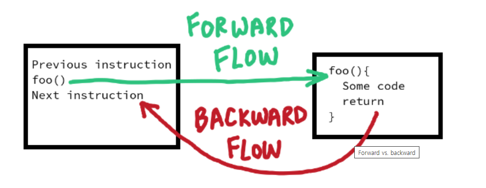
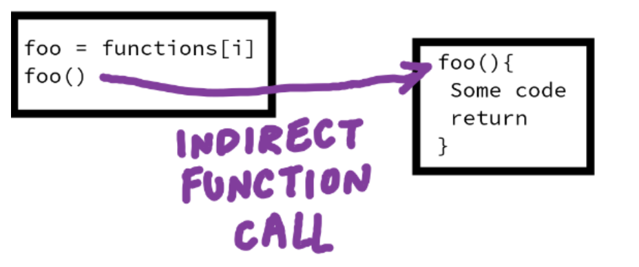
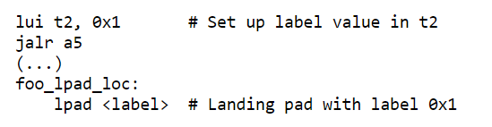

Improving Control Flow Integrity for Linux on RISC-V
====================================================

https://lwn.net/Articles/977720/

Redirecting execution flow is a common malware technique that can be used to compromise operating systems. To protect from such attacks, the chip makers of leading architectures like x86 and arm64 have implemented [Control Flow Integrity CFI extensions](https://lwn.net/Articles/900099/), though they need system software support to function. At the [Linux Security Summit North America](https://events.linuxfoundation.org/linux-security-summit-north-america/), [RISC-V](https://riscv.org/) kernel developer Deepak Gupta described the Control Flow Integrity CFI protections for that architecture and invited community input on the kernel support for them.

RISC-V is an Instruction Set Architecture ISA that follows the [philosophy of open source hardware](https://lwn.net/Articles/749185/). Its attractiveness lies in its lack of Instruction Set Architecture ISA licensing fees and that it is extensible, allowing designers to integrate custom instructions and features tailored to their specific needs. Notably, startups have chosen to adopt RISC-V and the [European Union has made substantial investment](https://www.eetimes.com/european-union-seeks-chip-sovereignty-using-risc-v/) toward developing its own chips based on the architecture.

Gupta's talk was entitled "Control Flow Integrity on RISC-V Linux"; it is available as [YouTube video](https://www.youtube.com/watch?v=H0Er5gDl9AU) for those interested. He began by explaining that Control Flow Integrity CFI techniques address vulnerabilities orginating from memory-safety issues in C and C++ code bases; these vulnerabilities can be exploited using the usual suspects (memory attacks, such as stack buffer overflow) to divert the proper execution flow and redirect it somewhere else within the address space.

An important thing to remember regarding control flow is the destination between forward and backward directions of the function call process. Forward control flow integrity protects the flow into functions (green arrow in the diagram). Indirect function calls, such as by calling a function via a pointer, present opportunities for attackers to alter the pointer value to jump to an address of their choosing, thus they need Control Flow Integrity CFI protection. Backward Control Flow Integrity CFI is concerned with returns from function (the red arrow in the diagram); the return addresses stored on the stack or in a register can also be altered by attackers. Gupta discussed the problem options for both directions for RISC-V architecture.

## Forward Control Flow

Previous efforts to protect forward control flow mainly involved keeping track of indirect calls and jumps using the CPU and/or system software extensions. A few years ago, a [popular approach](https://lwn.net/Articles/810077/) involved validating indirect function pointers in some way to ensure that the flow remained as expected. This was done by checking the function prototype, including the type of the return value and all of the argument types. If the forward flow was hijacked, the only place an attacker could jump to was the start of a function in the kernel that matched the required prototype.

However, this approach had limited success and coarse granularity, since it left many kernel functions that met the requirements as valid options. A more direct approach is modifying the functions directly. In the case of x86 architecture, this is done through [Indirect Branch Tracking IBT](https://lwn.net/Articles/889475/), which introduced new instructions, which introduced new instructions, `endbr64` and `endbr32`, where indirect branches must land. With Indirect Branch Tracking IBT, the CPU implements a state machine to track indirect jump and call instructions, marking valid target addresses. If a violation is detected, it triggers a Control Protection CP exception.

Gupta introduced the [Zicfilp](https://github.com/riscv/riscv-cfi/blob/main/src/cfi_forward.adoc) CPU extensions, designed to protect RISC-V systems against forward-control-flow threats. He had sent patches to support this feature earlier in the year. Zicfilp makes sure that all indirect branches (Shown in the diagram above) must land on the new instruction lpad, which essentially acts as a landing pad. lpad includes a label that must match a corresponding value stored into register t2 by the caller. Enforcing this matching label ensures control flow integrity; if the CPU fails to find a match, it raises a new software-check exception, indicating a detected error. For example, consider the following snippet from Gupta's talk:

In this code, the lui instruction loads a specific value (in this case, 0x1) into register t2, setting up the label value required to validate the integrity of the flow. The subsequent jalr instruction jumps to the target location indirectly, meaning that it obtains the target address at run time from a register (a5). The execution flow then reaches the designated landing pad at function foo_lpad_loc, where the lpad instruction with the embedded label (0x1) resides and serves as a reference point to ensure proper flow. In this example, the combination of the jalr instruction's indirect jump and the lpad instruction's label validation mechanism ensures the integirty of the forward flow.

## Backward Control Flow

In the case of backward control flow, the most popular attacks to Control Flow Integrity CFI typically involve [Return Oriented Programming ROP](https://en.wikipedia.org/wiki/Return-oriented_programming). With Return Oriented Programming ROP attacks, vulnerabilities in backward indirect control transfers are exploited. These transfers are vulnerable because the function return addresses are determined dynamically at run time, allowing execution to be redirected to sequences of existing code fragments.

In RISC-V, as in arm64, the function return address is stored in a register (in x1 based on the RISC-V [calling convetion](https://riscv.org/wp-content/uploads/2015/01/riscv-calling.pdf)), which provides protection to that address from stack-based attacks. However, subsequent calls require pushing the return addresses onto the stack. Such addresses need to be protected with something better than regular store operations, either via software with the compiler adding additional checks (for example, LLVM's [Control Flow Integrity CFI Protection](https://clang.llvm.org/docs/ControlFlowIntegrity.html) and [SafeStack](https://clang.llvm.org/docs/SafeStack.html) insert extra security checks into programs) or hardware-based solutions. For this, x86 [Control Flow Enforcement Technology CET](https://docs.kernel.org/next/x86/shstk.html) relies on a shadow stack and arm64, similarly, uses its [Guarded Control Stack GCS](https://lwn.net/Articles/940403/).

As with the case of forward control flow, a Control Protection CP exception may be issued in scenarios where shadow stacks are enabled. The return addresses get pushed onto both the regular and the shadow stack on a function call. Then, when returning from the funciton call, both stacks are popped. If the addresses retrieved from the two stacks don't match, indicating potential corruption, a Control Protection CP exception is raised.

This is the same approach followed by [Zicfiss](https://github.com/riscv/riscv-cfi/blob/main/src/cfi_backward.adoc), which is used on RISC-V to protect backward control flow, Gupta said. With Zicfiss, the Instruction Set Architecture ISA is extended to include a shadow stack and instructions to safely manipulate the stack (sspush for pushing and sspopchk for popping and checking). The sspush instructino executes a store operation similar to existing store instructions, with the distinction that the base is implicityly the new shadow-stack pointer ssp. There is also a new instruction, ssrdp, to read the ssp; its width is determined by the word length of the architecture. The virtual address stored in ssp needs a shadow-stack attribute (for more information on this, refer to RISC-V's Shadow Stack Memory Protection documentation). The shadow stack can be located anywhere in the address space and can even be discontigous (this reduces the memory footprint when multiple threads share an address space). To ensure security, the CPU is informted that a region is a shadow stack through a new page table bit added by the Instruction Set Architecture ISA extension, which ensures that the memory is writable only with the new specialized instructions.

## Additional Extensions

RISC-V flow control extensions also provide the new instruction ssamoswap for atomically swapping a value on the stack, designed for asynchronous operations within the kernel - similar to the RICS-V amoswap atomic swap instruction but tailored to the shadow stack. Gupta mentioned that it is needed for signal handling in Linux, where the execution flwo can be hijacked, and the stack needs to be switched.

Concurrent operation of multiple threads on the same shadow stack can be problematic and a source of security concerns; for example, an adversarial thread can reuse return addresses placed by the primary thread or inject return addresses into the shadow stack. To switch securely when the shadow stack is enabled, certain tokens are used to verify stack switching at run time: ssamoswap makes this possible by atomically storing these tokens, thereby mitigating any concurrency issues during validation (and raising software check exceptions if needed). The ssamoswap instruction is the RISC-V counterpart to x86's rstorssp and saveprevssp, as well as Arm v9's gcsss1 and gcsss2, providing analogous functionality for asynchronous shadow stack operations.

Gupta recently submitted patches to test Zicfiss with straightforward kselftests. In these test, a child process attempts to write to the memory location of a shadow stack (which should result in the process being killed with a SIGSEGV). The parent process then checks if the memory contents have been changed.

The patches for improving RISC-V kernel defense against control flow attacks are still in the works. It's exciting to see the communitiy getting behind the effort to make open source hardware more secure. Moreover, it's worth noting that the kernel work led by Gupta and others shares similarities and builds upon previous methods for control flow integrity - a characteristic generally desirable in open source development.

