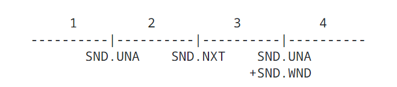
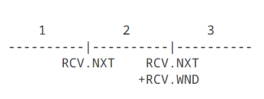

#### 3.3.1. Key Connection State Variables

<!-- Summary or Slid -->

Before we can discuss the operation of the Transmission Control Protocol TCP implementation in detail, we need to introduce some detailed terminology. The maintenance of a Transmission Control Protocol TCP connection requires maintaining state for several variables. We conceive of these variables being stored in a connection record called a Transmission Control BlockTCB. Among the variables stored in the Transmission Control Block TCB are the local and remote Internet Protocol IP addresses and port numbers, the Internet Protocol IP security level, and compartment of the connection [Appendex A.1](A.1.IPSecurityCompartmentandPrecedence.md), pointers to the user's send and receive buffers, pointers to the retransmit queue and to tue current segment. In addition, several variables relating to the send and receive sequence numbers are stored in the Transmission Control Block TCB.

| Variable | Description                                              |
| -------- | -------------------------------------------------------- |
| SND.UNA  | Send Unacknowledged                                      |
| SND.NXT  | Send Next                                                |
| SND.WND  | SEnd Window                                              |
| SND.UP   | Send Urgent Pointer                                      |
| SND.WL1  | Segment sequence number used for last window update      |
| SND.WL2  | Segment acknowledment number used for last window update |
| ISS      | Initial Send Sequence number                             |

Table 2: Send Sequence Variables

| Variable | Description                     |
| -------- | ------------------------------- |
| RCV.NXT  | Receive Next                    |
| RCV.WND  | Receive Window                  |
| RCV.UP   | Receive Urgent Pointer          |
| IRS      | Initial Receive Sequence number |

Table 3: Receive Sequence Variables

The following diagrams may help to relate some of these variables to the sequence space.

- 1 - old sequence numbers that have been acknowledged
- 2 - sequence numbers of unacknowledged data
- 3 - sequence numbers allowed for new data transmission
- 4 - future sequence numbers that are not yet allowed

The send window is the portion of the sequence space labeled 3 in Figure 3.

- 1 - old sequence numbers that have been acknowledged
- 2 - sequence numbers allowed for new reception
- 3 - future sequence numbers that are not yet allowed

The receive window is the portion of the sequence space labeled 2 in Fgirue 4.

There are also some variables used frequently in the discusstion that take their values from the fields of the current segment.

| Variable | Description |
| -------- | ----------- |
| SEG.SEQ  | Segment sequence number |
| SEG.ACK  | Segment Acknowledgment number |
| SEG.LEN  | Segment Length |
| SEG.WND  | Segment Window |
| SEG.UP   | Segment Urgent Pointer |

Table 4: Current Segment Variables
