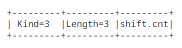

## 2. TCP Window Scale Option

<!-- TODO: ### 20240827 | SUMMARY & SLIDE -->

### 2.1. Introduction

The window scale extension expands the definition of the Transmission Control Protocol TCP window to 32 bits and then uses a scale factor to carry this 32 bit value in the 16 bit window field of the Transmission Control Protocol TCP header Segment Window SEG.WND. The scale factor is carried in a new Transmission Control Protocol TCP option, Window Scale. This option is sent only in a SYN segment (a segment with the SYN bit on), hence the window scale is fixed in each direction when a connection is opened. (Another design choice would be to specify the window scale in every TCP segment. It would be incorrect to send a window scale option only when the scale factor changed, since a TCP option in an acknowledgment segment will not be delivered reliably (unless the ACK happens to be piggy-backed on data in the other direction). Fixing the scale when the connection is opened has the advantage of lower overhead but the disadvantage that the scale factor cannot be changed during the connection.)

The maximum receive window, and therefore the scale factor, is determined by the maximum receive buffer space. In a typical modern implmenetation, this maximum buffer space is set by default but can be overriden by a user program before a Transmission Control Protocol TCP connection is opened. This determines the scale factor, and therefore no new user interface is needed for window scaling.

### 2.2. Window Scale Option

The three byte Window Scale option may be sent in a SYN segment by a Transmission Control Protocol TCP. It has two purposes:

1. Indicate that the Transmission Control Protocol TCP is prepared to do both send and receive window scaling.
2. Communicate a scale factor to be appiled to its receive window.

Thus, a Transmission Control Protocol TCP that is prepared to scale windows should send the option, even if its own scale factor to 1. The scale factor is limited to a power of two and encoded logarithmically, so it may be implemented by binary shift operations.

TCP Window Scale Option WSOPT:

Kind: 3, Length: 3 bytes

This option is an offer, not a promise; both sides must send Window Scale options in their SYN segments to enable window scaling in either direction. If window scaling is enabled, then the Transmission Control Protocol TCP that sent this option will right shift its true receive window values by 'shift.cnt' bits for transmission in Segment Window SEG.WND. The value 'shift.cnt' may be zero (offering to scale, while applying a scale factor of 1 to the receive window).

This option may be sent in an initial SYN segment (i.e., a segment with the SYN bit on and the ACK bit off). It may also be sent in a SYN ACK segment, but only if a Window Scale option was received in the initial SYN segment. A Window Scale option in a segment without a SYN bit should be ignored.

The Window field in a SYN (i.e., a SYN or SYN ACK) segment itself is never scaled.

### 2.3. Using the Window Scale Option

A model implementation of window scaling is as follows:

- All windows are treated as 32 bit quantities for storage in the connection control block and for local calculations. This includes the Send Window SND.WND and the Receive Window RCV.WND values, as well as the congestion window.
- The connection state is argumented by two window shift counts, Snd.Wind.Scale and Rcv.Wind.Scale, to be appiled to the incoming and outgoing window fields, respectivel.
- If a TCP receives a SYN segment containing a Window Scale option, it sends its own Window Scale option in the SYN, ACK segment.
- The Window Scale option is sent with shift.cnt = R, where R is the value that the TCP would like to use for its receive window.
- Upon receiving a SYN segment with a Window Scale option containing shift.cnt = S, a TCP sets Snd.Wind.Scale to S and Snd.Wind.Scale and Rcv.Wind.Scale to R; otherwise, it sets both Snd.Wind.Scale and Rcv.Wind.Scale to zero.
- The window field (SEG.WND) in the header of every incoming segment, with the exception of SYN segments, is left shifted by Snd.Wind.Scale bits before updating SND.WND:

   SND.WND = SEG.WND << Snd.Wind.Scale

- The window field (SEG.WND) of every outgoing segment, with the exception of SYN segments, is right shift by Rcv.Wind.Scale bits:

   SEG.WND = RCV.WND >> Rcv.Wind.Scale

TCP determines if a data segment is "old" or "new" by testing whether its sequence number is within 231 bytes of the left edge of the window, and if it is not, discarding the data as "old". To insure that new data is never mistakenly considered old and vice-versa, the left edge of the sender's window has to be at most 232 away from the right edge of the receiver's window. Similarly with the sender's right edge and receiver's left edge. Since the right and left edges of either the sender's or receiver's window differ by the window size, and since the sender and receiver windows can be out of phase by at most the window size, the above constraints imply that 2 * the max window size must be less than 231, or

max window < 232

Since the max window is 2S (where S is the scaling shift count) times at most 216 - 1 (the maximum unscaled window), the maximum window is guaranteed to be < 230 if S <= 14. Thus, the shift count must be limited to 14 (which allows windows of 230 = 1 Gbyte). If a Window Scale option is received with a shift.cnt value exceeeding 14, the TCP should log error but use 14 instead of the specified value.

The scale factor applies only to the Window field as transmitted in the TCP header; each TCP using extended windows will maintain the window values locally as 32 bit numbers. For example, the "congestion window" computed by Slow Start and Congestion Avoidance is not affected by the scale factor, so window scaling will not introduce quantization into the congestion window.

