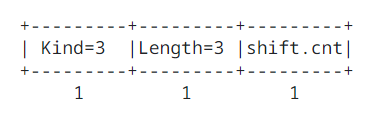

## 2. TCP Window Scale Option

### 2.1. Introduction

The window scale extension expands the definition of the TCP window to 30 bits and then uses an implicit scale factor to carry this 30 bit value in the 16 bit window field of the TCP header (SEG.WND). The exponent of the scale factor is carried in a TCP option, Window Scale. This option is sent only in SYN segment (a segment with the SYN bit on), hence the window scale is fixed in each direction when a connection is opened.

The maximum receive window, and therefore the scale factor, is determined by the maximum receive buffer space. In a typical modern implementation, this maximum bufer space is set by default but can be overriden by a user program before a TCP connection is opened. This determines the scale factor, and therefore no new user interface is needed for window scaling.

### 2.2. Window Scale Option

The three byte Window Scale option may be sent in a SYN segment by a TCP. It has two purposes:

1. Indicate that the TCP is prepared to both send and receive window scaling.
2. Communicate the exponent of a scale factor to be applied to its receive window.

Thus, a TCP that is prepared to scale windows should send the option, even if its own scale factor is 1 and the exponent 0. The scale factor is limited to a power of two and encoded logarithmically, so it may be implemented by binary shift operations. The maximum scale exponent is limited to 14 for a maximum permissible receive window size of 1 GiB (214 + 16).

TCP Window Scale option WS:

Kind: 3

Length: 3 bytes

This option is an offer, not a promise; both sides must send Window Scale options in their SYN segments to enable window scaling in either direction. If window scaling is enabled, then the TCP that sent this option will right shift its true receive window values by 'shift.cnt' bits for transmission in SEG.WND. The value 'shift.cnt' may be zero (offering to scale, while applying a scale factor of 1 to the receive window).

This option may be sent in an initial SYN segment (i.e., a segment with the SYN bit on and the ACK bit off). If a Window Scale optin was received in the initial SYN segment, then this option may be sent in the SYN ACK segment. A Window Scale optino in a segment without a SYN bit must be ignored.

The window field in a segment where a the SYN bit is set (i.e., a SYN or SYN ACK) must not be scaled.

### 2.3. Using the Window Scale Option

A model implementation of window scaling is as follows:

- The connection state is augmented by two window shift counters, Snd.Wind.Shift and Rcv.Wind.Shift, to be applied to the incoming and outgoing window fields, respectively.
- If a TCP receives a SYN segment containing a Window Scale option, it should send its own Window Scale option in the SYN ACK segment.
- The Window Scale option must be sent with shift.cnt = R, where R is the value that the TCP would like to use for its receive window.
- Upon receiving a SYN segment with a Window Scale option containing shift.cnt = S, a TCP must set Snd.Wind.Shift to S and must set Rcv.Wind.Shift to R; otherwise, it must set both Snd.Wind.Shift and Rcv.Wind.Shift to zero.
- The window field (SEG.WND) in the header of every incoming segment, with the exception of SYN segments, must be left shifted by Snd.Wind.Shift bits before updating SND.WND:

    SND.WND = SEG.WND << Snd.Wind.Shift

- The window field (SEG.WND) of every outgoing segment, with the exception of SYN segments, must be right shifted by Rcv.Wind.Shift bits:

    SEG.WND = RCV.WND >> Rcv.Wind.Shift

TCP determines if a data segment is "old" or "new" by testing whether its sequence number is within 231 bytes of the left edge of the window, and if it is not, discarding the data as "old". To insure that new data is never mistakenly considered old and vice versa, the left edge of the sender's window has to be at most 231 away from the right edge of the receiver's window. The same is true of the sender's right edge and receiver's left edge. Since the right and left edges of either the sender's or receiver's window differ by the window size, and since the sender and receiver windows can be out of phase by at most the window size, the above constraints imply that two times the maximum window size must be less than 231, or

max window < 230

Since the max window is 2S (where S is the scaling shift count) times at most 216 - 1 (the maximum unscaled window), the maximum window is guaranteed to be < 230 if S <= 14. Thus, the shift count must be limited to 14 (which allows windows of 230 = 1 GiB). If a Window Scale option is received with a shfit.cnt value larger than 14, the TCP should log the error but must use 14 instead of the specified value. This is safe as a sender can always choose to only partially use any signaled receive window. If the receiver is scaling by a factor larger than 14 and the sender is only scaling by 14, then the receive window used by the sender will appear smaller than it is in reality.

The scale factor applies only to the window field as transmitted in the TCP header; each TCP using extended windows will maintain the window values locally as 32 bit numbers. For example, the "congestion window" computed by slow start and congestion avoidance (See [TCP Congestion Control](https://datatracker.ietf.org/doc/html/rfc5681)) is not affected by the scale factor, so window scaling will not introduce quantization into the congestion window.

### 2.4. Addressing Window Retraction

When a non-zero scale factor is in use, there are instances when a retracted window can be offered -- see [Appendix. F](./Appendix.md#-Appendix-F-Window-Retraction-Example) for a detailed example. The end of the window will be on a boundary based on the granularity of the scale factor being used. If the sequence number is then updated by a number of bytes smaller tahn that granualarity, the TCP will have to either advertise a new window that is beyond what it previously advertised (and perhaps beyond the buffer) or will have to advertise a smaller window, which will cause the TCP window to shrink. Implementation must ensure that they handle a shrinking window, as specified in [4.2.2.16. Managing the Window / Requirements for Internet Hosts -- Communication Layers](https://datatracker.ietf.org/doc/html/rfc1122#section-4.2.2.16).

For the receiver, this implies that:

1. The receiver must honor, as in a window, any segment that would have been in window for any ACK sent by the receiver.
2. When window scaling is in effect, the receiver should track the actual maximum window sequence number (which is likely to be greater than the window sequence announced by the most recent ACK, if more than one segment has arrived since the aoolication consumed any data in the receive buffer).

On the sender side:

3. The initial transmission must be within the window announced by the most recent ACK.
4. On first retransmission, or if the sequence number is out of window by less than 2Rcv.Wind.Shift, then do normal retransmission without regard to the receiver window as long as the original segment was in window when it was sent.
5. Subsequent retransmissions may only be sent if they are within the window announced by the most recent ACK.

