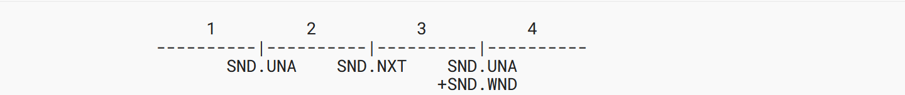
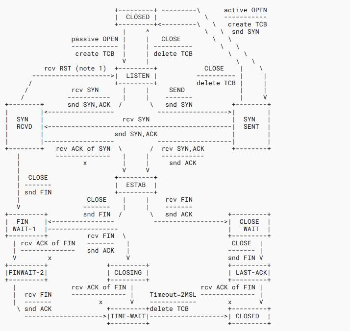
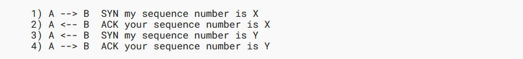
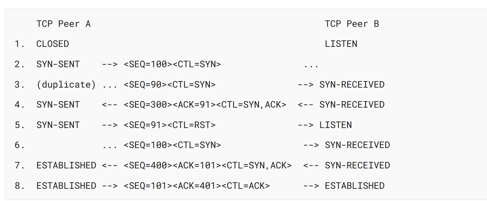
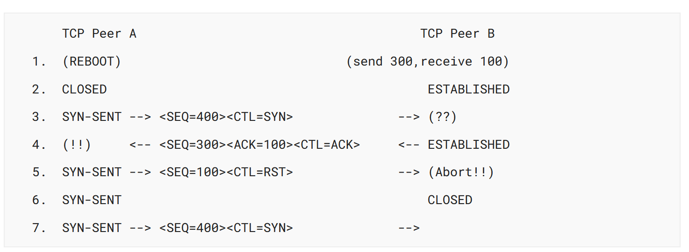
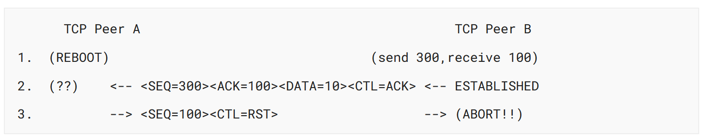
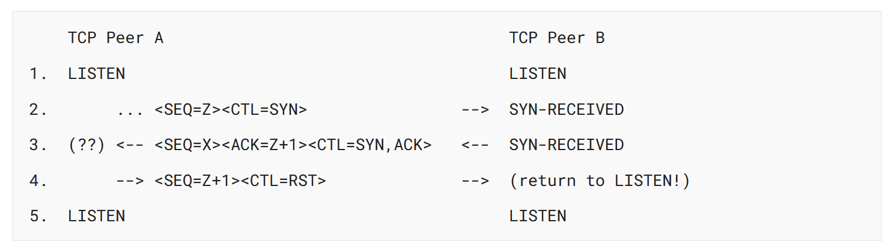

## 3. Functional Specification

<!-- TODO ### 20240829 | 3.1. Header Format -->
<!-- TODO ### 20240829 | 3.2. Specific Option Definitions -->

### 3.3. TCP Terminology Overview

This section includes an overview of key terms needed to understand the detailed protocol operation in the rest of the document. There is glossary of terms in [Section 4. Glossary](./Glossary.md).

#### 3.3.1. Key Connection State Variables

Before we can discuss the operation of the Transmission Control Protocol TCP implementation in detail, we need to introduce some detailed terminology. The maintenance of a Transmission Control Protocol TCP connection requires maintaining state for several variables. We conceive of these variables being stored in a connection record called a Transmission Control Block TCB. Among the variables stored in Transmission Control Block TCB are the local and remote Internet Protocol IP addresses and port numbers, the Internet Protocol IP security level, and compartment of the connection (see [Appendix A.1](https://www.ietf.org/rfc/rfc9293.html#name-ip-security-compartment-and)), pointers to the user's send and receive buffers, pointers to the retransmit queue and to the current segment. In addition, several variables relating to the send and receive sequence numbers ate stored in the Transmission Control Block TCB.

| Variable | Description                                               |
| -------- | --------------------------------------------------------- |
| SND.UNA  | Send Unacknowledged                                       |
| SND.NXT  | Send Next                                                 |
| SND.WND  | Send Window                                               |
| SND.UP   | Send Urgent Pointer                                       |
| SND.WL1  | Segment sequence number used for last window update       |
| SND.WL2  | Segment acknowledgment number used for last window update |
| ISS      | Initial Send Sequece number                               |

Table 2: Send Sequence Variables

| Variables | Description                     |
| --------- | ------------------------------- |
| RCV.NXT   | Receive Next                    |
| RCV.WND   | Receive Window                  |
| RCV.UP    | Receive Urgent Pointer          |
| IRS       | Initial Receive Sequence number |

Table 3: Receive Sequence Variables

The following diagrams may help to relate some of these variables to the sequence space.

- 1 - Old sequence numbers that have been acknowledged
- 2 - Sequence numbers of unacknowledged data
- 3 - Sequence numbers allowed for new data transmission
- 4 - Future sequence numbers that are not yet allowed

Figure 3: Send Sequence Space

The send window is the portion of the sequence space labeled 3 in Figure 3.

- 1 - Old sequence numbers that have been acknowledged
- 2 - Sequence numbers allowed for new reception
- 3 - Future sequence numbers that are not yet allowed

Figure 4: Receive Sequence Space

The receive window is the portion of the sequence space labeled 2 in Figure 4.

There are also some variables used frequently in the discussion that take their values fro the fields of the current segment.

| Variable | Description                   |
| -------- | ----------------------------- |
| SEG.SEQ  | Segment Sequence number       |
| SEG.ACK  | Segment Acknowledgment number |
| SEG.LEN  | Segment length                |
| SEG.WND  | Segment Window                |
| SEG.UP   | Segment urgent pointer        |

Table 4: Current Segment Variables 

#### 3.3.2. State Machine Overview

A connection progress through a series of states durinng its lifetime. The states are: LISTEN, SYN-SENT, SYN-RECEIVED, ESTABLISHED, FIN-WAIT-1, FIN-WAIT-2, CLOSE-WAIT, CLOSING, LAST-ACK, TIME-WAIT, and the fictional state CLOSED. CLOSED is fictional because it represents the state when there is no Transmission Control Block TCB, and therefore, no connection. Briefly the meaning of the states are:

- LISTEN

  Represent waiting for a connectino request from any remote Transmission Control Protocol TCP peer and port.

- SYN-SENT

  Represents waiting for a matching connection request after having sent a connection request.

- SYN-RECEIVED

  Represents waiting for a confirming connection request acknowledgment after having both received and sent a connection request.

- ESTABLISHED

  Represents an open connection, data received can be delivered to the user. The normal state for the data transfer phase of the connection.

- FIN-WAIT-1

  Represents waiting for a connection termination request from the remote Transmission Control Protocol TCP peer, or an acknowledgment of the connection termination request previously sent.

- FIN-WAIT-2

  Represents waiting for a connection termination request from the remote Transmission Control Protocol TCP peer.

- CLOSE-WAIT

  Represents waiting for a connection termination request from the local user.

- CLOSING

  Represents waiting for a connection termination request acknowledgment from the remote Transmission Control Protocol TCP peer.

- LAST-ACK

  Represents waiting for an acknowledgment of the connection termination request previously sent to the remote Transmission Control Protocol TCP peer (this termination request sent to the remote Transmission Control Protocol TCP peer already included an acknowledgment of the termination request sent from the remote Transmission Control Protocol TCP peer).

- TIME-WAIT

  Represents waiting for enough time to pass to be sure the remote Transmission Control Protocol TCP peer received the acknowledgment of its connection termination request and to avoid new connections being impacted by delayed segments from previous connections.

- CLOSED

  Represents no connection state at all.

A Transmission Control Protocol TCP connection progresses from one state to another in response to events. The events are the user calls, open, send, receive, close, abort, and status; the incoming segments, particularly those containing the SYN, ACK, RST, and FIN flags; and timeouts.

The open call specifies whether connection establishment is to be actively pursued, or to be passibely waited for.

A passive open request means that the process wants to accept incoming connection requests, in contrast to an active open attempting to initiate a connection.

The state diagram in Figure 5 illustrates only state changes, together with the causing events and resulting actions, but addresses neither error conditions nor actions that are not connected with state changes. In a later section, more detail is offered with respect to the reaction of Transmission Control Protocol TCP implementation to events. Some state names are abbreviated or hyphenated differently in the diagram from how they appear elsewhere in the document.

NOTA BENE: This diagram is only a summary and must not be taken as the total specification. Many details are not included.

The following notes apply to Figure 5.

Note 1: The transition from SYN-RECEIVED to LISTEN on receiving a RST is conditional on having reached SYN-RECEIVED after a passive OPEN.

Note 2: The figure omits a transition from FIN-WAIT-1 to TIME-WAIT if a FIN is received and the local FIN is also acknowledged.

Note 3: A RST can be sent from any state with a corresponding transition to TIME-WAIT (see [The TIME-WAIT state in TCP and its effect on busy servers](https://ieeexplore.ieee.org/document/752180) for rationale). These transitions are not explicitly shown; otherwise, the diagram would become very difficult to read. Similarly, receipt of a RST from any state results in a transition to LISTEN or CLOSED, though this also omitted from the diagram for legibility.

<!-- TODO ### 20240829 | 3.4. Sequence Numbers  -->

### 3.4. Sequence Numbers

A fundamental notion in the design is that every octet of data sent over a Transmission Control Protocol TCP connection has a sequence number. Since every octet is sequenced, each of them can be acknowledged. The acknowledgment mechanism employed is cumulative so that an acknowledgment of sequence number x indicates that all octets up to but not including x have been received. This mechanism allows for strightforward duplicate detection in the presence of retransmission. The numbering scheme of octets within a segment is as follows: the first data octet immediately following the header is the lowest numbered, and the following octets are numbered consecutively.

It is essential to remember that the actual sequence number space is finite, though large. This space ranges from 0 to 232 - 1. Since the space is finite, all arithmetic dealing with sequence numbers must be performed modulo 232. This unsigned arithmetic preserves the relationship of sequence numbers as they cycle from 232 - 1 to 0 again. Thre are some subtleties to computer modulo arithmetic, so great care should be taken in programming the comparison of such values. The symbol `=<` means "less than or equal" (modulo 232).

The typical kinds jof sequence number comparisons that the Transmission Control Protocol TCP implementation must perform include:

1. Determining that an acknowledgment refers to some sequence number sent but not yet acknowledged.
2. Determining that all sequence numbers occupied by a segment have been acknowledged (e.g., to remove the segment from a retransmission queue).
3. Determining that an incoming segment contains sequence numbers that are expected (i.e., that the segment "overlaps" the receive window).

In response to sending data, the Transmission Control Protocol TCP endpoint will receive acknowledgments. The following comparisons are needed to process the acknowledgments:

- SND.UNA = Oldest unacknowledged sequence number
- SND.NXT = Next sequence number to be sent
- SEG.ACK = Acknowledgment from the receiving TCP peer (next sequence number expected by the receiving TCP peer)
- SEG.SEQ = First sequence number of a segment
- SEG.LEN = The number of octets occupied by the data in the segment (counting SYN and FIN)
- SEG.SEQ + SEG.LEN - 1 = Last seqeunce number of a segment

A new acknowledgment (called an "acceptable ack") is one for which the inequality below holds:

SND.UNA < SEG.ACK = SND.NXT

A segment on the retransmission queue is fully acknowledged if the sum of its sequence number and length is less than or equal to the acknowledgment value in the incoming segmet.

When data is received, the following comparisons are needed:

- RCV.NXT = Next sequence number expected on an incoming segment, and is the left or lower edge of the receive window.
- RCV.NXT + RCV.WND - 1 = Last sequence number expected on an incoming segment, and is the right or upper edge of the receive window.
- SEG.SEQ = First sequence number occupied by the incoming segment.
- SEG.SEQ + SEG.LEN - 1 = Last sequence number occupied by the incoming segment

A segment is judged to occupy a portion of valid receive sequence space if

RCV.NXT =< SEG.SEQ < RCV.NXT + RCV.WND

or

RCV.NXT =< SEG.SEQ + SEG.LEN - 1 < RCV.NXT + RCV.WND

The first part of this test checks to see if the beginning of the segment falls in the window, the second part of the test checks to see if the end of the segment falls in the window; if the segment passes either part of the test, it contains data in the window.

Actually, it is a little more complicated than this. Due to zero windows and zero length segments, we have four cases for the acceptability of an incoming segment:

| Segment Length     | Receive Window     | Test                                   |
| ------------------ | ------------------ | -------------------------------------- |
| 0                  | 0                  | SEG.SEQ = RCV.NXT                      |
| 0                  | Receive Window > 0 | RCV.NXT =< SEG.SEQ < RCV.NXT + RCV.WND |
| Segment Length > 0 | 0                  | Not acceptable                         |
| Segment Length > 0 | Receive Window > 0 | RCV.NXT <= SEG.SEQ < RCV.NXT + RCV.WND RCV.NXT =< SEG.SEQ + SEG.LEN - 1 < RCV.NXT + RCV.WND |

Table 5: Segment Acceptability Tests

Note that when the receive window is zero no segments should be acceptable except Acknowledgment ACK segments. Thus, it is possible for a Transmission Controll Protocol TCP implementation to maintain a zero receive window while transmitting data and receiving Acknowledgment ACK. A Transmission Control Protocol TCP receiver must process the Reset RST and Urgent URG fields of all incoming segments, even when the receive window is zero.MUST 66

We have taken advantage of the numbering scheme to protect certain control information as well. This is achieved by implicitly including some control flags in the sequence space so they can be retransmitted and acknowledged without confusion (i.e., one and only one copy of the control will be acted upon). Control information is not physically carried in the segment data space. Consequently, we must adopt rules for implicitly assigning sequence numbers to control. The SYN and FIN are the only controls requiring this protection, and these controls are used only at connection opening and closing. For sequence number purposes, the SYN is considered to occur before the first actual data octet of the segment in which it occurs, while the FIN is considered to occur after the last actual data octet in a segment in which it occurs. The Segment Length SEG.LEN includes both data and sequence space occupying controls. When a SYN is present, then SEG.SEQ is the sequence number of the SYN.

#### 3.4.1. Initial Sequence Number Selection

A connection is defined by a pair of sockets. Connections can be reused. New instances of a connection will be referred to as incarnations of the connection. The problem that arises from this is -- "How does the Transmission Control Protocol TCP implementation identify duplicate segments from previous incarnations of the connection?" This problem becomes apparent if the connection is being opened and closed in quick succession, or if the connection breaks with loss of memory and is then reestablished. To support this, the TIME-WAIT state limits the rate of connection reuse, while the initial sequence number selection described below further protects against ambiguity about which incarnation of a connection an incoming packet corresponds to.

To avoid confusion, we must prevent segments from one incarnation of a connection from being used while the same sequence numbers may still be present in the network from an earlier incarnation. We want to assure this even if a TCP endpoint loses all knowledge of the sequence numbers it has been using. When new connections are created, an Initial Sequence Number ISN generator is employed that selects a new 32 bit Initial Sequence Number ISN. There are security issues that result if an off path attacker is able to predict or guess Initial Sequence Number ISN values. See [Defending against Sequence Number Attacks](https://www.ietf.org/rfc/rfc6528.html)

TCP initial sequence numbers are generated from a number sequence that monotonically increases until it wraps, known loosely as a "clock". This clock is a 32 bit counter that typically increments at least once every roughly 4 microseconds, although it is neither assumed to be realtime nor precise, and need not persist across reboots. The clock component is intended to ensure that with a Maximum Segment Lifetime MSL, generated Initial Sequence Number ISN will be unique since it cycles approximately every 4.55 hours, which is much longer than the Maximum Segment Lifetime MSL. Please note that for modern networks that support high data rates where the connectionmight start and quickly advance numbers to overlap within the Maximum Segment Lifetime MSL, it is recommended to implement the Timestamp Option as mentioned later in Section 3.4.3.

A TCP implementation must use the above type of "clock" for clock-driven selection of initial sequence numberMUST 8, and should generate its initial sequence numbers with the expression:

ISN = M + F(Local IP, Local Port, Remote IP, Remote Port, Secret Key)

where `M` is the 4 microsecond timer, and `F()` is a Pseudorandom Function PRF of the connection's identifying parameters ("Local IP, Local Port, Remote IP, Remote Port") and a Secret Key ("Secret Key") SHOULD 1. `F()` must not be computable from the outside MUST 9, or an attacker could still guess at sequence numbers from the Initial Sequence Number ISN used for some other connection. The Pseudorandom Function PRF could be implemented as a cryptographic hash of the connection of the TCP connection parameters and some secret data. For discussion of the selection of a specific hash algorithm and management of the secret key data, please see Section 3 of [Defending against Sequence Number Attacks](https://www.rfc-editor.org/rfc/rfc6528).

For each connection there is a send sequence number and a receive sequence number. The Initial Send Sequence number ISS is chosen by the data sending TCP peer, and the Initial Receive Sequence number IRS is learned during the connection establishing procedure.

For a connection to be established or initialized, the two TCP peers must synchronize on each other's initial sequence numbers. This is done in an exchange of connection establishing segments carrying a control bit called "SYN" (for synchronize) and the initial sequence numbers. As a shorthand, segments carrying the SYN bit are also called "SYN". Hence, the solution requires a suitable mechanism for picking an initial sequence number and a slightly involved handshake to exchange the Initial Sequence Number ISN.

The synchronization requires each side to send its own initial sequence number and to receive a confirmation of it in acknowledgment from the remote TCP peer. Each side must also receive the remote peer's initial sequence number and send a confirming acknowledgment.

Because steps 2 and 3 can be combined in a single message this is called the three-way (or three message) handshake 3WHS.

A Three-way Handshake 3WHS is necessary because sequence numbers are not tied to a global clock in the network, and TCP implementations may have different mechanisms for picking the Initial Sequence Number ISN. The receiver of the first SYN has no way of knowing whether the segment was an old one or not, unless it remembers the last sequence number used on the connection (which is not always possible), and so it must ask the sender to verify this SYN. The three way handshake and the advantages of a clock driven scheme for ISN selection are discussed in [Connection management in transport protocols](https://www.sciencedirect.com/science/article/abs/pii/0376507578900533?via%3Dihub).

#### 3.4.2. Knowing When to Keep Quiet

A theoretical problem exists where data could be corrupted due to confusion between old segments in the network and new ones after a host reboots if the same port numbers and sequence space are reused. The "quite time" concept discussed below addresses this, and the discussion of it is included for situations where it might be relevant, although it is not felt to be necessary in most current implementations. The problem was more relevant earlier in the history of Transmission Control Protocol TCP. In practial use on the Internet today, the error-prone conditions are sufficiently unlikely that it is safe to igonre. Reasons why it is now negligible include:

- Initial Send Sequence ISS and ephemeral port randomization have reduced likelihood of reuse of port numbers and sequence numbers after reboots
- The effective Maximum Segment Lifetime MSL of the Internet has declined as links have become faster
- Reboots often taking longer than an Maximum Segment Lifetime MSL anyways.

To be sure that a Transmission Control Protocol TCP implementation does not create a segment carrying a sequence number that may be duplicated by an old segment remaining in the network, the TCP endpoint must keep quiet for an MSL before assigning any sequence numbers upon starting up or recovering from a situation where memory of sequence numbers in use was lost. For thi specification the MSL is taken to be 2 minutes. This is an engineering choice, and may be changed if experience indicates it is desirable to do son. Note that if a TCP endpoint is reinitialized in some sence, yet retains its memory of sequence numbers in use, the  it need not wait at all; it must only be sure to use sequence numbers larger than those recently used.

#### 3.4.3. The TCP Quiet Time Concept

Hosts that for any reason lose knowledge of the last sequence numbers transmitted on each active (i.e., not closed) connection shall delay emitting any TCP segments for at least the agreed MSL in the internet system that the host is a port of. In the paragraphs below, an explanation for this specification is given. TCP implementaters may violdate the "quiet time" restriction, but only at the risk of causing some old data to be accepted as new or new data rejected as old duplicated data by some receivers in the internet system.

TCP endpoints consume sequence number space each time a segment is formed and entered into the the network output queue at a source host. The duplicate detection and sequencing algorithm in TCP relies on the unique binding of segment data to sequence space to the extent that sequence numbers will not cycle through all 232 values before the segment data bound to those sequence numbers has been delivered and acknowledged by the receiver and all duplicate copies of the segments have "drained" from the internet. Without such an assumption, two distinct TCP segments could conceivably be assigned the same or overlapping sequence numbers, causing confusion at the receiver as to which data is new and which is old. Remember that each segment is bound to as many consecutive sequence numbers as there are octets data and SYN or FIN flags in the segment.

Under normal conditions, TCP implementations keep track of the next sequence number to emit and the oldest awaiting acknowledgment so as to avoid mistakenly reusing a sequence number before its first use has been acknowledged. This alone does not guarantee that old duplicate data is drained from the net, so the sequence space has been made large to reduce the probability that a wandering duplicate will cause trouble upon arrival. At 2 megabits/sec., it takes 4.5 hours to use up 232 octets of sequence space. Since the maximum segment lifetime in the net is not likely to exceed a few tens of seconds, this is deemed ample protection for foreseeable nets, even if data rates escalate to 10s of megabits/sec. At 100 megabits/sec., the cycle time is 5.4 minutes, which may be a litte short but still within reason. Much higher data rates are possible today, with implications described in the final paragraph of this subsection.

The basic duplicate detection and sequencing algorithm in TCP can be defeated, however, if a source TCP endpoint does not have any memory of the sequence numbers it last used on a given connection. For example, if the TCP implementation were to start all connections with sequence number 0, then upon the host rebooting, a TCP peer might re-form an earlier connection (possibly after half-open connetion resolution) and emit packets with sequence numbers identical to or overlapping with packets still in the network, which were emitted on an earlier incarnation of the same connection. In the absence of knowledge about the sequence numbers used on a particular connection, the TCP specification recommends that the source delay for MSL seconds before emitting segments on the connection, to allo time for segments from the earlier connection incarnation to drain from the system.

Even hosts that can remember the time of day and use it to select initial sequence number values are not immune from this problem (i.e., even if time of day is used to select an initial sequence number for each new connection incarnation).

Suppose, for example, that a connection is opened starting with sequence number S. Suppose that this connection is not used much and that eventually the initial sequence number ISN(T) takes on a value equal to the sequence number, say S1, of the last segment sent by this TCP endpoint on a particular connection. Now suppose, at this instant, the host reboots and establishes a new incarnation of the connection. The initial sequence number chosen is S1 = ISN(T) -- last used sequence number on old incarnation of connection! If the recovery occurs quickly enough, any old duplicates in the net bearing sequence numbers in the neighborhood of S1 may arrive and be treated as new packets by the receiver of the new incarnation of the connection.

The problem is that the recovering host may not know for how long it was down between rebooting nor does it know whether there are still old duplicates in the system from earlier connection incarnations.

One way to deal with this problem is to deliberately delay emitting segments for one MSL after recovery from a reboot -- this is the "quite time" specification. Hosts that prefer to avoid waiting and are willing to risk possible confusion of old and new packets at a given destination may choose not to wait for the "quite time". Implementers may provide TCP users with the ability to select on a connection-by-connection basis whether to wait after a reboot, or may informally implement te "quite time" for all connections. Obviously, even where a user selects to "wait", this not necessary after the host has been "up" for at least MSL seconds.

To summarize: every segment emitted occupied one or more sequence numbers in the sequence space, and the numbers occupied a segment are "busy" or "in use" until MSL seconds have passed. Upon rebooting, a block of space-time is occupied by the octets and SYN and FIN flags of any potentially still in-flight segments. If a new connection is started too soon and uses any of the sequence numbers in the space-time footprint of those potentially still in-flight segments of the previous connection incarnation, there is a potential sequence number overlap area that could cause confusion at the receiver.

High performance cases will have shorter cycle times than those in the megabits per second that the base TCP design described above considers. At 1 Gbps, the cycle time is 32 secons, only 3 seconds at 10 Gbps, and around a third of a second at 100 Gbps. In these higher-performance cases, TCP Timestamp Options and Protection Against Wrapped Sequence PAWS provide the needed capability to detect and discard old duplicates. [TCP Extensions for High Performance](https://www.rfc-editor.org/rfc/rfc7323.html)

### 3.5. Establishing a Connection

The __Three-way Handshake__ is the procedure used to establish a connection. This procedure normally is initiated by one TCP peer and responded by another TCP peer. The procedure also works if tow TCP peers simultaneously initiate the procedure. When simultaneous open occurs, each TCP peer receives a SYN segment that carries no acknowledgment after it has sent a SYN. Of course, the arrival of an old duplicate SYN segment can potentially make it appear, to the recipient, that a simultaneous connection initiation is in progress. Proper use of "reset" segments can disambiguate these cases.

<!--

Three-way Handshake는 연결을 설정하는 데 사용되는 절차입니다. 이 절차는 일반적으로 하나의 TCP 피어에 의해 시작되고 다른 TCP 피어에 의해 응답됩니다. 이 절차는 견인 TCP 피어가 동시에 절차를 시작하는 경우에도 작동합니다. 동시 오픈이 발생하면 각 TCP 피어는 SYN을 보낸 후에 아무런 확인 응답을 전송하지 않는 SYN 세그먼트를 받습니다. 물론 오래된 중복 SYN 세그먼트가 도착하면 잠재적으로 수신자에게 동시 연결 시작이 진행 중인 것처럼 보일 수 있습니다. "reset" 세그먼트를 적절하게 사용하면 이러한 경우를 명확하게 할 수 있습니다.

  -->

Several examples of connection initiation follow. Although these examples do not show connection synchronization using data-carrying segments, this perfectly legitimate, so long as the receiving TCP endpoint doesn't deliver the data to the user until it is clear the data is valid (e.g., the data is buffered at the receiver until the connection reaches the established state, given that the Three-way Handshake reduces the possibility of false connections). It is a trade-off between memory and messages to provide information for this checking.

<!--

연결 시작의 몇 가지 예는 다음과 같습니다. 이러한 예들은 데이터 전송 세그먼트를 사용한 연결 동기화를 보여주지는 않지만, 수신 TCP 엔드포인트가 데이터가 유효하다는 것이 명확할 때까지 데이터를 사용자에게 전달하지 않는 한, 이것은 완벽하게 합법적입니다(예: 삼자 핸드셰이크가 잘못된 연결의 가능성을 줄여준다는 점을 감안할 때, 연결이 설정된 상태에 도달할 때까지 수신기에서 데이터를 버퍼링합니다). 이 확인을 위한 정보를 제공하는 것은 메모리와 메시지 사이의 트레이드오프입니다.

  -->

This simplest Three-way Handshake 3WHS is shown in Figure 6. The figures should be interpreted in the following way. Each line is numbered for reference purposes. Right arrow `-->` indicate departure of a TCP segment from TCP Peer A to TCP Peer B or arrival of a segment at B from A. Left arrows `<--` indicate the reverse. Ellipses `...` indicate a segment that is still in the network (delayed). Comments appear in parentheses. TCP connection states represent the state after the departure or arrival of the segment (whose contents are shown in the center of each line). Segment contents are shown in abbreviated form, with sequence number, control flags, and ACK field. Other fields such as window, addresses, lengths, and text have been left out in the interest of clarity.

<!--

이 가장 간단한 3방향 핸드셰이크 3WHS는 그림 6에 나와 있습니다. 그림은 다음과 같은 방식으로 해석되어야 합니다. 각 행에는 참조용으로 번호가 매겨집니다. 오른쪽 화살표 --\> 는 TCP 피어 A에서 TCP 피어 B로 TCP 세그먼트의 출발 또는 A에서 B로 세그먼트의 도착을 나타냅니다. 왼쪽 화살표 \<-- 는 그 반대를 나타냅니다. 타원...은 아직 네트워크에 있는 세그먼트(지연됨)를 나타냅니다. 주석은 괄호 안에 표시됩니다. TCP 연결 상태는 세그먼트의 출발 또는 도착 이후의 상태(각 행의 중앙에 내용이 표시됨)를 나타냅니다. 세그먼트 내용은 시퀀스 번호, 제어 플래그 및 ACK 필드와 함께 축약된 형태로 표시됩니다. 창, 주소, 길이 및 텍스트와 같은 다른 필드는 명확성을 위해 생략되었습니다.

  -->

Figure 6: Basic Three-way Handshake for Connection Synchronization

In line 2 of Figure 6, TCP Peer A begins by sending a SYN segment indicating that it will use sequence number 100. In line 3, TCP Peer B sends a SYN and acknowledges the SYN it received from TCP Peer A. Note that the acknowledgment field indicates TCP Peer B is now expecting to hear sequence 101, acknowledging the SYN that occupied sequence 100.

At line 4, TCP Peer A responds with an empty segment containing an ACK for TCP Peer B's SYN; and in line 5, TCP Peer A sends some data. Note that the sequence number of the segment in line 5 is the same as in line 4 because the ACK does not occupy sequence number space (if it did, we would wind up ACK).

Simultaneous initiation is only slightly more complex, as is shown in Figure 7. Each TCP peer's connection state cycles from CLOSED to SYN-SENT to SYN-RECEIVED to ESTABLISHED.

A TCP implementation must support simultaneous open attempts. MUST10

Note that a TCP implementation must keep track of whether a connection has reached SYN-RECEIVED state as the result of a passive open or an active open. MUST11

The principal reason for the Three-way Handshake is to prevent old duplicate connection initiations from causing confusion. To deal with this, a special control message, reset, is specified. If the receiving TCP peer is in a non-synchronized state (i.e., SYN-SENT, SYN-RECEIVED), it returns to LISTEN on receiving TCP peer is in a non-synchronized state (i.e., SYN-SENT, SYN-RECEIVED), it returns to LISTEN on receiving an acceptable reset. If the TCP peer is one of the synchronized state (ESTABLISHED, FIN-WAIT-1, FIN-WAIT-2, CLOSE-WAIT, CLOSING, LAST-ACK, TIME-WAIT), it aborts the connection and informs its user. We discuss this latter case under "half-open" connections below.

As a simple example of recovery from old duplicates, consider Figure 8. At line 3, an old duplicate SYN arrives at TCP Peer B. TCP Peer B cannot tell that this is an old duplicate, so it responds normally (line 4). TCP Peer A detects that the ACK field is incorrect and returns a RST (reset) with its SEQ field selected to make the segment believable. TCP Peer B, on receiving the RST, returns to the LISTEN state. When the original SYN finally arrives at line 6, the synchronization proceeds normally. If the SYN at line 6 had arrived before the RST, a more complex exchange might have occurred with RST sent in both directions.

#### 3.5.1. Half-Open Connections and Other Anomalies

An established connection is said to be "half-open" if one of the TCP peers has closed or aborted the connection at its end without the knowledge of the other, or if the two ends of the connection have become desynchronized owing to a failure or reboot that resulted in loss of memory. Such connections will automatically become reset if an attempt is made to send data in either direction. However, half-open connections are expected to be unusual.

If at site A the connection no longer exists, then an attempt by the user at site B to send any data on it will result in the site B TCP endpoint receiving a reset control message. Such a message indicates to the site B TCP endpoint that something is wrong, and it is expected to abort the connection.

Assume that two user processes A and B are communicating with one another when a failure or reboot occurs causing loss of memory to A TCP implementation. Depending on the operating system supporting A TCP implementation, it is likely that some error recovery mechanism exists. When the TCP endpoint is up again, A is likely to start again from the beginning or from a recovery point. As a result, A will probably try to open the connection again or try to send on the connection it believes open. In the latter case, it receives the error message "connection not open" from the local TCP implementation. In an attempt establish the connection, A TCP implementation will send a segment containing SYN. This senario leads to the example shown in Figure 9. After TCP Peer A reboots, the user attempts to reopen the connection. TCP Peer B, in the meantime, thinks the connection is open.

Figure 9: Half-Open Connection Discovery

When the SYN arrives at line 3, TCP Peer B, being in a synchronized state, and the incoming segment outside the window, responds with an acknowledgment indicating what sequence it next expects to hear. TCP Peer A sees that this segment does not acknowledge anything it sent and, being unsynchronized, sends a resetRST because it has detected a half-open connection. TCP Peer B aborts at line 5. TCP Peer A will continue to try to establish the connection; the problem is now reduced to the basic Three-way Handshake of Figure 6.

An interesting alternative case occurs when TCP Peer A reboots and TCP Peer B tries to send data on what it thinks is a synchronized connection. This is illustrated in Figure 10. In this case, the data arriving at TCP Peer A from TCP Peer B (line 2) is unacceptable because no such connection exists, so TCP Peer A sends a RST. The RST is acceptable so TCP Peer B processes it and aborts the connection.

In Figure 11, two TCP Peer A and B with passive connections waiting for SYN are depcited. An old duplicate arriving at TCP Peer B (line 2) stirs B into action. A SYN-ACK is returned (line 3) and causes TCP A to generate a RST (the ACK in line 3 is not acceptable). TCP Peer B accepts the reset and returns to its passive LISTEN state.

A variety of other cases possible, all of which are accounted for by the following rules for RST generation and processing.

#### 3.5.2. Reset Generation

A TCP user or application can issue a reset on a connection at any time, though reset events are also generated by the protocol itself when various error conditions occurs, as described below. The side of connection issuing a reset should enter the TIME-WAIT state, as this generally helps to reduce the load on busy servers for reasons described in [The TIME-WAIT state in TCP and its effect on busy servers](https://ieeexplore.ieee.org/document/752180).

As a general rule, reset RST is sent whenever a segment arrives that apparently is not intended for the current connection. A reset must not be sent if it is not clear that this is the case.

There are three groups of states:

1. If the connection does not exist (CLOSED), then a reset is sent in response to any incoming segment except another reset. A SYN segment that does not match an existing connection is rejected by this means.

   If the incoming segment has the ACK bit set, the reset takes its sequence number from the ACK field of the segment; otherwise, the reset has sequence number zero and the ACK field is set to the sum of sequence number and segment length of the incoming segment. The connection remains in the CLOSED state.

2. If the connection is in any non-synchronized state (LISTEN, SYN-SENT, SYN-RECEIVED), and the incoming segment acknowledges something not yet sent (the segment carries an unacceptable ACK), or if an incoming segment has a security level or compartment [Appendix A.1](https://www.ietf.org/rfc/rfc9293.html#seccomp) that does not exactly matach the level and compartment requested for the connection, a reset is sent.

   If the incoming segment has an ACK field, the reset takes its sequence number from the ACK field of the segment; otherwise, the reset has sequence number zero and the ACK field is set to the sum of the sequence number and segment length of the incoming segment. The connection remains in the same state.

3. If the connection is in a synchronized state (ESTABLISHED, FIN-WAIT-1, FIN-WAIT-2 CLOSE-WAIT, CLOSING, LAST-ACK, TIME-WAIT), any unacceptable segment (out-of-window sequence number of unacceptable acknowledgment number) must be responded to with an empty acknowledgment segment (without any user data) containing the current send sequence number and an acknowledgment indicating the next sequence number expected to be received, and the connection remains in the same state.

   If an incoming segment has a security level or compartment that does not exactly match the level and compartment requested for the connection, a reset is sent and the connection goes to the CLOSED state. The reset takes its sequence number from the ACK field of the incoming segment.

#### 3.5.3. Reset Processing

In all states except SYN-SENT, all reset RST segments are validated by checking their SEQ fields. A reset is valid if its sequence number is in the window. In the SYN-SENT state (a RST received in response to an inital SYN), the RST is acceptable if the ACK field acknowledges the SYN.

The receiver of a RST first validates it, then change state. If the receiver was in the LISTEN state, it ignores it. If the receiver was in SYN-RECEIVED state and had previously been in the LISTEN state, then the receiver returns to the LISTEN state; otherwise, the receiver aborts the connection and does to the CLOSED state. If the receiver was in any other state, it aborts the connection and advises the user and goes to the CLOSED state

TCP implementations should allow a received RST segment to include data SHOULD 2. It has been suggested that a RST segment could contain diagnostic data that explains the cause of the RST. No standard has yet been established for such data.

