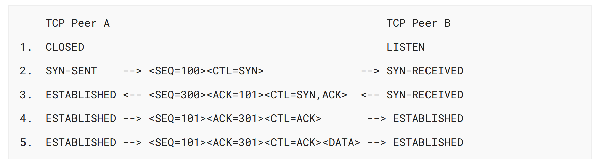
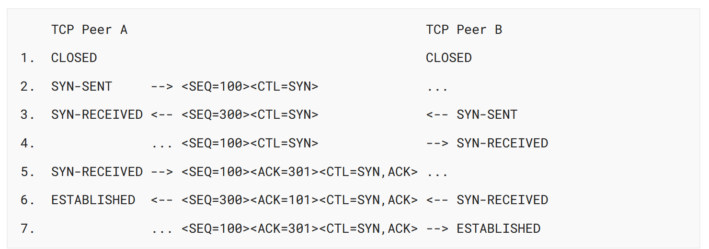

## 3. Functional Specification

<!-- TODO ### 20240829 | 3.1. Header Format -->
<!-- TODO ### 20240829 | 3.2. Specific Option Definitions -->
<!-- TODO ### 20240829 | 3.3. TCP Terminology Overview -->
<!-- TODO ### 20240829 | 3.4. Sequence Numbers  -->

### 3.5. Establishing a Connection

The __Three-way Handshake__ is the procedure used to establish a connection. This procedure normally is initiated by one TCP peer and responded by another TCP peer. The procedure also works if tow TCP peers simultaneously initiate the procedure. When simultaneous open occurs, each TCP peer receives a SYN segment that carries no acknowledgment after it has sent a SYN. Of course, the arrival of an old duplicate SYN segment can potentially make it appear, to the recipient, that a simultaneous connection initiation is in progress. Proper use of "reset" segments can disambiguate these cases.

<!--

Three-way Handshake는 연결을 설정하는 데 사용되는 절차입니다. 이 절차는 일반적으로 하나의 TCP 피어에 의해 시작되고 다른 TCP 피어에 의해 응답됩니다. 이 절차는 견인 TCP 피어가 동시에 절차를 시작하는 경우에도 작동합니다. 동시 오픈이 발생하면 각 TCP 피어는 SYN을 보낸 후에 아무런 확인 응답을 전송하지 않는 SYN 세그먼트를 받습니다. 물론 오래된 중복 SYN 세그먼트가 도착하면 잠재적으로 수신자에게 동시 연결 시작이 진행 중인 것처럼 보일 수 있습니다. "reset" 세그먼트를 적절하게 사용하면 이러한 경우를 명확하게 할 수 있습니다.

  -->

Several examples of connection initiation follow. Although these examples do not show connection synchronization using data-carrying segments, this perfectly legitimate, so long as the receiving TCP endpoint doesn't deliver the data to the user until it is clear the data is valid (e.g., the data is buffered at the receiver until the connection reaches the established state, given that the Three-way Handshake reduces the possibility of false connections). It is a trade-off between memory and messages to provide information for this checking.

<!--

연결 시작의 몇 가지 예는 다음과 같습니다. 이러한 예들은 데이터 전송 세그먼트를 사용한 연결 동기화를 보여주지는 않지만, 수신 TCP 엔드포인트가 데이터가 유효하다는 것이 명확할 때까지 데이터를 사용자에게 전달하지 않는 한, 이것은 완벽하게 합법적입니다(예: 삼자 핸드셰이크가 잘못된 연결의 가능성을 줄여준다는 점을 감안할 때, 연결이 설정된 상태에 도달할 때까지 수신기에서 데이터를 버퍼링합니다). 이 확인을 위한 정보를 제공하는 것은 메모리와 메시지 사이의 트레이드오프입니다.

  -->

This simplest Three-way Handshake 3WHS is shown in Figure 6. The figures should be interpreted in the following way. Each line is numbered for reference purposes. Right arrow `-->` indicate departure of a TCP segment from TCP Peer A to TCP Peer B or arrival of a segment at B from A. Left arrows `<--` indicate the reverse. Ellipses `...` indicate a segment that is still in the network (delayed). Comments appear in parentheses. TCP connection states represent the state after the departure or arrival of the segment (whose contents are shown in the center of each line). Segment contents are shown in abbreviated form, with sequence number, control flags, and ACK field. Other fields such as window, addresses, lengths, and text have been left out in the interest of clarity.

<!--

이 가장 간단한 3방향 핸드셰이크 3WHS는 그림 6에 나와 있습니다. 그림은 다음과 같은 방식으로 해석되어야 합니다. 각 행에는 참조용으로 번호가 매겨집니다. 오른쪽 화살표 --\> 는 TCP 피어 A에서 TCP 피어 B로 TCP 세그먼트의 출발 또는 A에서 B로 세그먼트의 도착을 나타냅니다. 왼쪽 화살표 \<-- 는 그 반대를 나타냅니다. 타원...은 아직 네트워크에 있는 세그먼트(지연됨)를 나타냅니다. 주석은 괄호 안에 표시됩니다. TCP 연결 상태는 세그먼트의 출발 또는 도착 이후의 상태(각 행의 중앙에 내용이 표시됨)를 나타냅니다. 세그먼트 내용은 시퀀스 번호, 제어 플래그 및 ACK 필드와 함께 축약된 형태로 표시됩니다. 창, 주소, 길이 및 텍스트와 같은 다른 필드는 명확성을 위해 생략되었습니다.

  -->

Figure 6: Basic Three-way Handshake for Connection Synchronization

In line 2 of Figure 6, TCP Peer A begins by sending a SYN segment indicating that it will use sequence number 100. In line 3, TCP Peer B sends a SYN and acknowledges the SYN it received from TCP Peer A. Note that the acknowledgment field indicates TCP Peer B is now expecting to hear sequence 101, acknowledging the SYN that occupied sequence 100.

At line 4, TCP Peer A responds with an empty segment containing an ACK for TCP Peer B's SYN; and in line 5, TCP Peer A sends some data. Note that the sequence number of the segment in line 5 is the same as in line 4 because the ACK does not occupy sequence number space (if it did, we would wind up ACK).

Simultaneous initiation is only slightly more complex, as is shown in Figure 7. Each TCP peer's connection state cycles from CLOSED to SYN-SENT to SYN-RECEIVED to ESTABLISHED.

A TCP implementation must support simultaneous open attempts. <a name="#must10">MUST10</a>