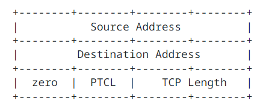

## 3. FunctionalSpecification

### 3.1. Header Format

TCP segments are sent as internet datagrams. The Internet Protocol IP header carries several information fields, including the source and destination host addresses. A TCP header follows the IP headers, supplying information specific to TCP. This division allows for the existence of host level protocols other than TCP. In the early development of the Internet suite of protocols, the IP header field had been a part of TCP.

This document describes TCP, which uses TCP headers.

A TCP header, followed by any user data in the segment:

Note that one tick mark represents one bit position.

Figure 1: TCP Header Format

where:

- Source Port: 16 bits

  The source port number.

- Destination Port: 16 bits

  The destination port number.

- Sequence Number: 32 bits

  The sequence number of the first data octet in this segment (except when the SYN flag is set). If SYN is set, the sequence number is the Initial Sequence Number ISN and the first data octet is Initial Sequence Number ISN + 1.

- Acknowledgment Number: 32 bits

  If the ACK control bit is set, this field contains the value of the next sequence number the sender of the segment is expecting ot receive. Once a connection is established, this is always sent.

- Data Offset: 4 bits

  The number of 32 bit words in the TCP header. This indicates where the data begins. The TCP header (even one including options) is an integer multiple of 32 bits long.

- Reserved: 4 bits

  A set of control bits reserved for future use. Must be zero in generated segments and must be ignored in received segments if the corresponding future features are not implemented by the sending or receiving host.

- Control bits: 8 bits

  The Control bits are also known as "flags". Assignment is managed by IANA from the "TCP Header Flags" registry. The currently assigned control bits are CWR, ECE, URG, ACK, PSH, RST, SYN, and FIN.

  - CWR: 1 bit

    Congestion Window Reduced (See [The Addition of Explicit Congestion Notification (ECN) to IP](https://datatracker.ietf.org/doc/html/rfc3168))

  - ECE: 1 bit

    ECN-Echo (See [The Addition of Explicit Congestion Notification (ECN) to IP](https://datatracker.ietf.org/doc/html/rfc3168))

  - URG: 1 bit

    Urgent pointer field is significant.

  - ACK: 1 bit

    Acknowledgment field is significant.

  - Push function (see the Send Call description is [Section 3.9.1](#3912-Send)).

  - RST: 1 bit

    Reset the connection.

  - SYN: 1 bit

    Synchronize sequence numbers.

  - FIN: 1 bit

    No more data from sender.

- Window: 16 bits

  The number of data octets beginning with the one indicated in the acknowledgment field that the sender of this segment is willing to accept. The value is shifted when the window scaling extension is used. (See [TCP Window Scale Option](../RFC1323/TCPWindowScaleOption.md))

  The window size must be treated as an unsigned number, or else large window sizes will appear like negative windows and TCP will not work. It is recommended that implementations will reserve 32 bit fields for the send and receive window sizes in the connection record and do all window computations with 32 bits.

- Checksum: 16 bits

  The checksum field is the 16 bit one's complement of the one's complement sum of all 16 bit words in the header and text. The checksum computation needs to ensure the 16 bit alignment of the data being summed. If a segment contains an odd number of header and text octets, alignment can be achieved by padding the last octet with zeros on its right to form a 16 bit word for checksum purposes. The pad is not transmitted as part of the segment. While computing the checksum, the checksum filed itself is replaced with zeros.

  The checksum also covers a pseudo header conceptually prefixed to the TCP header. The pseudo header is 96 bits for IPv4 and 320 bits for IPv6. Including the pseudo-header in the checksum gives the TCP conneciton protection against misrouted segments. This information is carried in IP headers and is transferred across the TCP/Network interface in the arguments or results of calls by the TCP implementation on the IP layer.

  

  Figure 2: IPv4 Pseudo Header

  Pseudo Header components for IPv4:

  - Source Address

    The IPv4 source address in network byte order

  - Destination Address

    The IPv4 destination address in network byte order

  - Protocol

    The protocol number from the IP header

  - TCP Length

    The TCP header length plus the data length in octets (this is not an explicitly transmitted quantity but is computed), and it does not count the 12 octets of the pseudo header.

    For IPv6, the pseudo header is defined in [Section 8.1 of RFC 8200](https://www.rfc-editor.org/rfc/rfc8200#section-8.1) and contains the IPv6 Source Address and Destination Address, an Upper Layer Packet Length (a 32 bit value otherwise equivalent to TCP Length in the IPv4 pseudo header), three bytes of zero padding, and a Next Header value, which differs from the IPv6 header value if there are extension headers present between IPv6 and TCP.

    The TCP checksum is never optional. The sender must generate it and the receiver must check it.

  - Urgent Pointer: 16 bits

    This field communicates the current value of the urgent pointer as a positive offset from the sequence number in this segment. The urgent pointer points to the sequence number of the octet following the urgent data. This field is only to be interpreted in segments with the URG control bit set.

  - Options: size(options) == (Data offset - 5) * 32

    present only when Data offset > 5. Note that this size expression also includes any padding trailing the actual options present.

    Options may occupy space at the end of the TCP header and are a multiple of 8 bits in length. All options are included in the checksum. An option may begin on any octet boundary. There are two cases for the format of an option:

    - Case 1: A single octet of option kind.
    - Case 2: An octet of option kind (Kind), an octet of option length, and the actual option data octets.

    The option length counts the two octets of option kind and option length as well as the option data octets.

    Note that the list of options may be shorter than the Data Offset field might imply. The content of the header beyond the End of Option List Option must be header padding of zeros.

    The list of all currently defined options is managed by IANA, and each option is defined in other RFC, as indicated there. That set includes experimental options that can be extended to support multiple concurrent usages. (See [hared Use of Experimental TCP Options](https://datatracker.ietf.org/doc/html/rfc6994))

    A given TCP implementation can support any currently defined options, but the following options must be supported:

    | Kind | Length | Meaning                    |
    | ---- | ------ | -------------------------- |
    | 0    | -      | End of Option List Option. |
    | 1    | -      | No Operation.              |
    | 2    | 4      | Maximum Segment Size.      |

    Table 1: Mandatory Option Set

    These options are specified in detail in [Section 3.2](#32-Specific-Option-Definitions).

    A TCP implementation must be able to receive a TCP Option in any segment.

    A TCP implementation must ignore without error any TCP Option it does not implement, assuming that the option has a length field. All TCP Options except End of Option List Option and No Operation must have length fields, including all future options. TCP implementations must be prepared to handle an illegal option length (e.g., zero); a suggested procedure is to reset the connection and log the error cause.

    Note: There is ongoing work to extend the space available for TCP Options, such as [TCP Extended Data Offset Option draft-ietf-tcpm-tcp-edo-12.txt](https://datatracker.ietf.org/doc/html/draft-ietf-tcpm-tcp-edo-12).

  - Data: variable length

    User data carried by the TCP segment.

### 3.2. Specific Option Defintiions

A TCP Option, in the mandatory option set, is one of an End of Option List Option, a No Operation Option, or a Maximum Segment Size Option.

An End of Option List Option is formatted as follows:

Kind: 1 byte; Kind == 0

This option code indicates the end of the option list. This might not coincide with the end of the TCP header according to the Data Offset field. This is used at the end of all options, not the end of each option, and need only be used if the end of the options would not otherwise coincide with the end of the TCP header.

A No-Operation Option is formatted as follows:

Kind: 1 byte; Kind == 1.

This option code can be used between options, for example, to align the beginning of a subsequent option on a word boundary. There is no guarantee that senders will use this option, so receivers must be prepared to process options even if they do not begin on a word boundary.

A Maximum Segment Size Option is formatted as follows:

where:

- Kind: 1 byte; Kind = 2

  If this option is present, then it communicates the maximum receive segment size at the TCP endpoint that sends this segment. This value is limited by the IP reassembly limit. This field may be sent in the initial connection request (i.e., in segments with the SYN control bit set) and must not be sent in other segments. If this option is not used, any segment size is allowed. A more complete description of this option is provided in [Section 3.7.1](#371-Maximum-Segment-Size-Option).

- Length: 1 byte; Length == 4

  Length of the option in bytes.

- Maximum Segment Size MSS: 2 bytes

  The maximum receive segment size at the TCP endpoint that sends this segment.

#### 3.2.1. Other Common Options

Additional RFC define some other commonly used options that are recommended to implement for high performance but not necessary for basic TCP interoperability. These are the TCP Selective Acknowledgment SACK Option (See [TCP Selective Acknowledgment Options](https://datatracker.ietf.org/doc/html/rfc2018), [An Extension to the Selective Acknowledgement (SACK) Option for TCP](https://datatracker.ietf.org/doc/html/rfc2883)), [TCP Timestamp TS Option](https://datatracker.ietf.org/doc/html/rfc7323), and [TCP Window Scale WS Option](https://datatracker.ietf.org/doc/html/rfc7323).

#### 3.2.2. Experimental TCP Options

Experimental TCP Option values are defined in [Experimental Values in IPv4, IPv6, ICMPv4, ICMPv6, UDP, and TCP Headers](https://datatracker.ietf.org/doc/html/rfc4727), and [Shared Use of Experimental TCP Options](https://datatracker.ietf.org/doc/html/rfc6994) describes the current recommended usage for these experimental values.

### 3.3. TCP Terminology Overview

This section includes an overview of key terms needed to understand the detailed protocol operation in the rest of the document. There is a glossary of terms in [Section 4. Glossary](./Glossary.md).

#### 3.3.1. Key Connection State Variables

Before we can discuss the operation of the Transmission Control Protocol TCP implementation is detail, we need to introduce some detailed terminology. The maintenance of a Transmission Control Protocol TCP connection requires maintaining state for several variables. We conceive of these variables being stored in a connection record called a Transmission Control Block TCB. Among the variables stored in the Transmission Control Block TCB are the local and remote Internet Protocol IP addresses and port numbers, the Internet Protocol IP security level, and compartment of the connection (see [Appendix A.1](./AppendixA.md#1-IP-Security-Compartment-and-Precedence)), pointers to the user's send and receive buffers, pointers to the retransmit queue and to the current segment. In addition, several variables relating to the send and receive sequence numbers are stored in the Transmission Control Block TCB.

<!--

The maintenance of a Transmission Control Protocol TCP connection requires maintaining state for several variables.

We conceive of these variables being stored in a connection record called a Transmission Control Block TCB.

Among the variables stored in the Transmission Control Block TCB are the local and remote Internet Protocol IP addresses and port numbers, the Internet Protocol IP addresses and port numbers, the Internet Protocol IP security level, and compartment of the connection, pointers to the user's send and receive buffers, pointers ot the retransmit queue nd to the current segment. In addition, several variables relating to the send and receive sequence numbers are stored in the Transmission Control Block TCB.

  -->

| Variable | Description                                               |
| -------- | --------------------------------------------------------- |
| SND.UNA  | Send Unacknowledged                                       |
| SND.NXT  | Send Next                                                 |
| SND.WND  | Send Window                                               |
| SND.UP   | Send Urgent Pointer                                       |
| SND.WL1  | Segment sequence number used for last window update       |
| SND.WL2  | Segment acknowledgment number used for last window update |
| ISS      | Initial Send Sequence number                              |

Table 2: Send Sequence Variables

<!-- Summary: Table 2: Send Sequence Variables -->

| Variable | Description                     |
| -------- | ------------------------------- |
| RCV.NXT  | Receive Next                    |
| RCV.WND  | Receive Window                  |
| RCV.UP   | Receive Urgent Pointer          |
| IRS      | Initial Receive Sequence number |

Table 3: Receive Sequence Variables

<!-- Summary: Table 3: Receive Sequence Variables -->

The following diagrams may help to relate some of these variables to the sequence space.

- 1 - Old sequence numbers that have been acknowledged
- 2 - Sequence numbers of unacknowledged data
- 3 - Sequence numbers allowed for new data transmission
- 4 - Future sequence numbers that are not yet allowed

Figure 3: Send Sequence Space

The send window is the portion of the sequence space labeled 3 in Figure 3.

<!-- Figure 3: Send Sequence Space -->

- 1 - Old sequence numbers that have been acknowledged
- 2 - Sequence numbers allowed for new reception
- 3 - Future sequence numbers that are not yet allowed

Figure 4: Receive Sequence Space

<!-- Figure 4: Receive Sequence Space -->

The receive window is the portion of the sequence space labeled 2 in Figure 4.

There are also some variables used frequently in the discussion that take their values from the fields of the current segment.

| Variable | Description                   |
| -------- | ----------------------------- |
| SEG.SEQ  | Segment Sequence number       |
| SEG.ACK  | Segment Acknowledgment number |
| SEG.LEN  | Segment Length                |
| SEG.WND  | Segment Window                |
| SEG.UP   | Segment Urgent Pointer        |

Table 4: Current Segment Variables

<!-- Table 4: Current Segment Variables -->

#### 3.3.2. State Machine Overview

A connection progresses through a series of states during its lifetime. The states are: LISTEN, SYN-SENT, SYN-RECEIVED, ESTABLISHED, FIN-WAIT-1, FIN-WAIT-2, CLOSE-WAIT, CLOSING, LAST-ACK, TIME-WAIT, and the fictional state CLOSED. CLOSED is fictional because it represents the state when there is no Transmission Control Block 
TCB, and therefore, no connection. Briefly the meanings of the states are:

<!-- TODO -->

#### 3.5. Establishing a Connection

The "three-way handshake" is the procedure used to establish a connection. This procedure normally is initiated by one TCP peer and responded to by another TCP peer. The procedure also works if two TCP peers simultaneously initiate the procedure. When simultaneous open occurs, each TCP peer receives a SYN segment that carries no acknowledgment after it has sent a SYN. Of course, the arrival of an old duplicate SYN segment can potentially make it appear, to the recipient, that a simulatneous connection initiation is in progress. Proper use of "reset" segments can disambiguate these cases.

<!--

"3방향 핸드셰이크"는 연결을 설정하는 데 사용되는 절차입니다. 이 절차는 일반적으로 한 TCP 피어가 시작하고 다른 TCP 피어가 응답합니다. 이 절차는 두 TCP 피어가 동시에 절차를 시작하는 경우에도 작동합니다. 동시에 열리면 각 TCP 피어는 SYN을 보낸 후 확인이 없는 SYN 세그먼트를 수신합니다. 물론 오래된 중복 SYN 세그먼트가 도착하면 수신자에게 동시 연결 시작이 진행 중인 것처럼 보일 수 있습니다. "재설정" 세그먼트를 적절히 사용하면 이러한 경우를 명확하게 할 수 있습니다.

  -->

Several examples of connection initiation follow. Although these examples do not show connection synchronization using data-carrying segments, this is perfectly legitimate, so long as the receiving TCP endpoint doesn't deliver the data to the user until it is clear the data is valid (e.g., the data is buffered at the receiver until the connection reaches the ESTABLISHED state, given that the three-way handshake reduces the possibility of false connections). It is a trade-off between memory and messages to provide information for this checking.

<!--

다음은 연결 시작의 몇 가지 예입니다. 이러한 예는 데이터 전송 세그먼트를 사용한 연결 동기화를 보여주지 않지만, 수신 TCP 엔드포인트가 데이터가 유효하다는 것이 분명해질 때까지 사용자에게 데이터를 전달하지 않는 한 이는 완벽하게 합법적입니다(예: 3방향 핸드셰이크가 잘못된 연결 가능성을 줄인다고 가정할 때, 연결이 ESTABLISHED 상태에 도달할 때까지 데이터가 수신자에서 버퍼링됨). 이 검사를 위한 정보를 제공하는 것은 메모리와 메시지 간의 트레이드오프입니다.

  -->

The simplest 3WHS is shown in Figure 6. This figures should be interpreted in the following way. Each line is numbered for reference purposes. Right arrow (-->) indicate departure of a TCP segment from TCP Peer A to TCP Peer B or arrival of a segment at B from A. Left arrows (<--) indicate the reverse. Ellipses (...) indicate a segment that is still in the network (delayed). Comments appear in parentheses. TCP connection states represent the state after the departure or arrival of the segment (whose contents are shown in the center of each line). Segment contents are shown in abbreviated form, with sequence number, control flags, and ACK field. Other fields such as window, addresses, lengths, and text have been left out in the interest of clarity.

In line 2 of Figure 2, TCP Peer A begins by sending a SYN segment indicating that it will use sequence numbers starting with sequence number 100. In line 3, TCP Peer B sends a SYN and acknowledge

#### 3.8.6. Managing the Window

