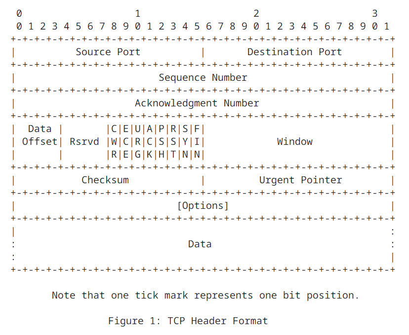
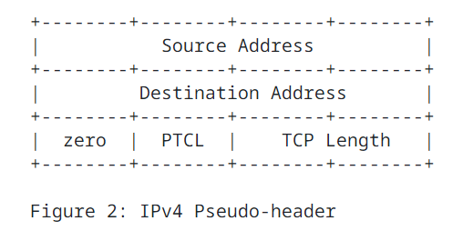
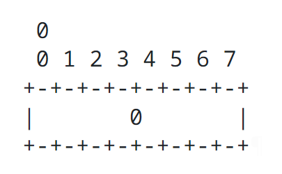
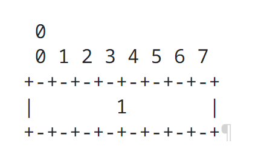
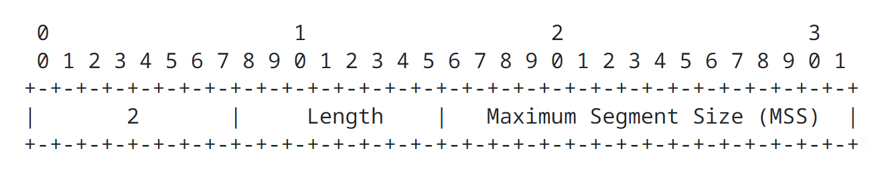
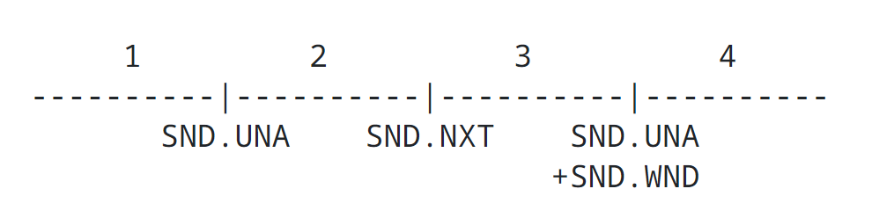
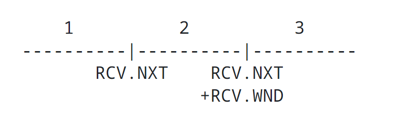
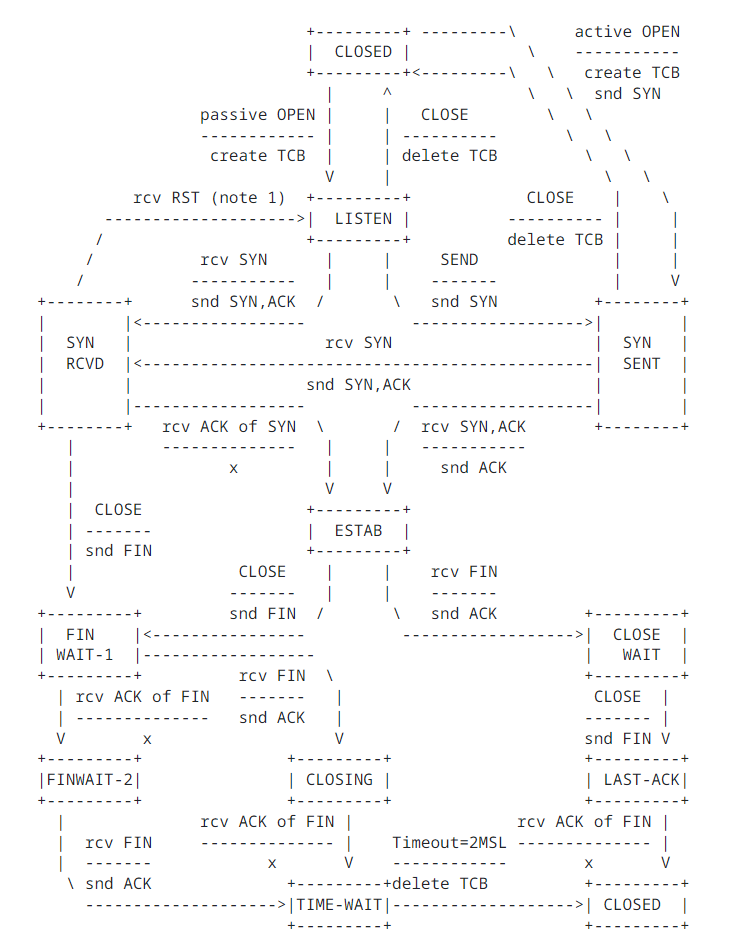

Transmission Control Protocol
=============================

### Abstract

This document specifies the Transmission Control Protocol TCP. Transmission Control Protocol TCP is an important transport layer protocol in the Internet Protocol stack, and it has continuously evolved over decades of use and growth of the Internet. Over this time, a number of changes have been made to Transmission Control Protocol TCP as it was specified in RFC793, though these have only been documented in a piecemeal fashion. This document collects and brings those changes together with the protocol specification from RFC793. This document obsoletes RFC793, as well as RFC879, 2873, 6093, 6429, 6528, and 6691 that updated parts of RFC 793. It updates RFC 1011 and 1122, and it should be considered as a replacement for the portions of those documents dealing with Transmission Control Protocol TCP requirements. It also updates RFC5961 by adding a small clarification in reset handling while in the SYN-RECEIVED state. The Transmission Control Protocol TCP header control bits from RFC793 have also been updated based on RFC3168.

### Status of This Memo

This is an Internet Standards Track document.

This document is a product of the Internet Engineering Task Force (IETF). It represents the consensus of the IETF community. It has received public review and has been approved for publication by the Internet Engineering Steering Group (IESG). Further information on Internet Standards is available in Section 2 of RFC 7841.

Information about the current status of this document, any errata, and how to provide feedback on it may be obtained at https://www.rfc-editor.org/info/rfc9293.

### Copyright Notice

Copyright (c) 2022 IETF Trust and the persons identified as the document authors. All rights reserved.

This document is subject to BCP 78 and the IETF Trust's Legal Provisions Relating to IETF Documents (https://trustee.ietf.org/license-info) in effect on the date of publication of this document. Please review these documents carefully, as they describe your rights and restrictions with respect to this document. Code Components extracted from this document must include Revised BSD License text as described in Section 4.e of the Trust Legal Provisions and are provided without warranty as described in the Revised BSD License.

This document may contain material from IETF Documents or IETF Contributions published or made publicly available before November 10, 2008. The person(s) controlling the copyright in some of this material may not have granted the IETF Trust the right to allow modifications of such material outside the IETF Standards Process. Without obtaining an adequate license from the person(s) controlling the copyright in such materials, this document may not be modified outside the IETF Standards Process, and derivative works of it may not be created outside the IETF Standards Process, except to format it for publication as an RFC or to translate it into languages other than English.

## 1. Purpose and Scope

In 1981, RFC793 was released, documenting the Transmission Control Protocol TCP and replacing earlier published specifications for Transmission Control Protocol TCP.

Since then, Transmission Control Protocol TCP has been widely implemented, and it has been used as a transport protocol for numerous applications on the Internet.

For several decades, RFC793 plus a number of other documents have combined to serve as the core specification for Transmission Control Protocol TCP. Over time, a number of errata have been filed against RFC793. There have also been deficiencies found and resolved in security, performance, and many other aspects. The number of enhancements has grown over time across many separate documents. These were never accumulated together into a comprehensive update to the base specification.

The purpose of this document is to bring together all of the IETF Standards Track changes and other clarifications that have been made to the base Transmission Control Protocol TCP functional specification (RFC793) and to unify them into an updated version of the specification.

Some companion documents are referenced for important algorithms that are used by Transmission Control Protocol TCP (e.g., for congestion control) but have not been completely included in this document. This is a conscious choice, as this base specification can be used with multiple additional algorithms that are developed and incorporated separately. This document focuses on the common basis that all Transmission Control Protocol TCP implementations must support in order to interoperate. Since some additional Transmission Control Protocol TCP features have become quite complicated themselves (e.g., advanced loss recovery and congestion control), future companion documents may attempt to similarly bring these together.

In addition to the protocol specification that describes the Transmission Control Protocol TCP segment format, generation, and processing rules that are to be implemented in code, RFC793 and other updates also contain informative and descriptive text for readers to understand aspects of the protocol design and operation. This document does not attempt to alter or update this informative text and is focused only on updating the normative protocol specification. This document preserves references to the documentation containing the important explanations and rationale, where appropriate.

This document is intended to be useful both in checking existing Transmission Control Protocol TCP implementations for conformance purposes, as well as in writing new implementations.

## 2. Introduction

RFC793 contains a discussion of the Transmission Control Protocol TCP design goals and provides examples of its operation, including examples of connection establishment, connection termination, and packet refransmission to repair losses.

This document describes the basic functionality expected in modern Transmission Control Protocol TCP implementations and replaces the protocol specification in RFC793. It does not replicate or attempt to update the introduction and philosophy content in Section 1 and 2 of RFC793. Other documents are referenced to provide explanations of the theory of operation, rationale, and detailed discussion of design decisions. This document only focuses on the normative behavior of the protocol.

The "TCP Roadmap" provides a more extensive guide to the RFC that define Transmission Control Protocol TCP and describe various important algorithms. The Transmission Control Protocol TCP Roadmap contains sections on strongly encouraged enhancements that improve performance and other apects of Transmission Control Protocol TCP beyond the basic operation specified in this document. As one example, implementing complex topic on its own and not described in detail in this document, as there are many options and possibilities that do not impact basic interoperability. Similarly, most Transmission Control Protocol TCP implementations today include the high performance extensions in [TCP Extensions for High Performance](https://datatracker.ietf.org/doc/html/rfc7323), but these are not strictly required or discussed in this document. Multipath considerations for Transmission Control Protocol TCP are also specified separately in [TCP Extensions for Multipath Operation with Multiple Addresses](https://datatracker.ietf.org/doc/html/rfc8684).

A list of changes from RFC793 is contained in Section 5.

### 2.1. Requirements Language

The key words "MUST", "MUST NOT", "REQUIRED", "SHALL", "SHALL NOT", "SHOULD", "SHOULD NOT", "RECOMMENDED", "NOT RECOMMENDED", "MAY", and "OPTIONAL" in this document are to be interpreted as described in BCP 14 [3] [12] when, and only when, they appear in all capitals, as shown here.

Each use of RFC 2119 keywords in the document is individually labeled and referenced in Appendix B, which summarizes implementation requirements.

Sentences using "MUST" are labeled as "MUST-X" with X being a numeric identifier enabling the requirement to be located easily when referenced from Appendix B.

Similarly, sentences using "SHOULD" are labeled with "SHLD-X", "MAY" with "MAY-X", and "RECOMMENDED" with "REC-X".

For the purposes of this labeling, "SHOULD NOT" and "MUST NOT" are labeled the same as "SHOULD" and "MUST" instances.

### 2.2. Key Transmission Control Protocol TCP Concepts

Transmission Control Protocol TCP provides a reliable, in-order, byte-stream service to applications.

The application byte-stream is conveyed over the network via Transmission Control Protocol TCP segments, with each Transmission Control Protocol TCP segment sent as an Internet Protocol IP datagram.

Transmission Control Protocol TCP reliability consists of detecting packet losses (via sequence numbers) and errors (via per-segment checksums), as well as correction via retransmission.

Transmission Control Protocol TCP supports unicast delivery of data. There are anycast applications that can successfully use Transmission Control Protocol TCP without modifications, though there is some risk of instability due to changes lower-layer forwarding behavior. [Architectural Considerations of IP Anycast](https://datatracker.ietf.org/doc/html/rfc7094)

Transmission Control Protocol TCP is connection oriented, though it does not inherently include a liveness detection capability.

Data flow is supported bidirectionally over Transmission Control Protocol TCP connections, though applications are free to send data only unidirectionally, if the so choose.

Transmission Control Protocol TCP uses port numbers to identify application services and to multiplex distinct flows between hosts.

A more detailed description of Transmission Control Protocol TCP features compared to other transport protocols can be found in [Section 3.1 of Services Provided by IETF Transport Protocols and Congestion Control Mechanisms](https://datatracker.ietf.org/doc/html/rfc8095#section-3.1). Further description of the motivations for developing Transmission Control Protocol TCP and its role in the Internet Protocol stack can be found [Section 2 of TRANSMISSION CONTROL PROTOCOL](https://datatracker.ietf.org/doc/html/rfc793) and earlier versions of the Transmission Control Protocol TCP specification.

## 3. Functional Specification

### 3.1. Header Format

Transmission Control Protocol TCP segments are sent as internet datagrams. The Internet Protocol IP header carries several information fields, including the source and destination host addresses. A Transmission Control Protocol TCP header follows the internet Protocol IP headers, supplying information specific to Transmission Control Protocol TCP. This division allows for the existence of host-level protocols other than Transmission Control Protocol TCP. In the early development of the Internet suite of protocols, the Internet Protocol IP header fields had been a part of Transmission Control Protocol TCP.

This document describes Transmission Control Protocol TCP, which uses Transmission Control Protocol TCP headers.

A Transmission Control Protocol TCP header, followed by any user data in the segment, is formatted as follows, using the style from [Describing Protocol Data Units with Augmented Packet Header Diagrams](https://datatracker.ietf.org/doc/html/draft-mcquistin-augmented-ascii-diagrams-10):

| Field | Bits | Description |
| ----- | ---- | ----------- |
| Source Port | 16 bits | The source port number. |
| Destination Port | 16 bits | The destination port number. |
| Sequence Number | 32 bits | The sequence number of the first data octet in this segment (except when the SYN flag is set). If SYN is set, the sequence number is the Initial Sequence Number ISN and the first data octet is Initial Sequence Number ISN + 1. |
| Acknowledgment Number | 32 bits | If the ACK control bit is set, this field contains the value of the next sequence number the sender of the segment is expecting to receive. Once a connection is established, this is always sent. |
| Data Offset DOffset | 4 bits | The number of 32 bit words in the Transmission Control Protocol TCP header. This indicates where the data begins. The Transmission Control Protocol TCP header (even one including options) is an integer multiple of 32 bits long. |
| Reserved Rsrvd | 4 bits | A set of control bits reserved for future use. Must be zero in generated segments and must be ignored in received segments if the corresponding future features are not implemented by the sending or receiving host. |
| Control bits | - | The control bits are also known as "flags". Assignment is managed by IANA from the [TCP Header Flags registry](https://www.iana.org/assignments/tcp-parameters/tcp-parameters.xhtml#tcp-header-flags). The currently assigned control bits are CWR, ECE, URG, ACK, PSH, RST, SYN, and FIN.  Congestion Window Reduced CWR 1 bit ([The Addition of Explicit Congestion Notification (ECN) to IP](https://datatracker.ietf.org/doc/html/rfc3168)) Explicit Congestion Notification Echo ECE 1 bit ([The Addition of Explicit Congestion Notification (ECN) to IP](https://datatracker.ietf.org/doc/html/rfc3168)) Urgent Pointer URG field is significant 1bit Acknowledgment ACK field is significant 1bit Push PSH function 1bit Reset RST the connection 1bit Synchronize SYN sequence numbers 1bit Finish FIN No more data from sender 1bit |
| Window | 16 bits | The number of data octets beginning with the one indicated in the acknowledgment field that the sender of this segment is willing to accept. The value is shifted when the window scaling extension is used. ([TCP Extensions for High Performance](https://datatracker.ietf.org/doc/html/rfc7323))  The window size must be treated as an unsigned number, or else large window sizes will appear like negative windows and Transmission Control Protocol TCP will not work. It is recommended that implementations will reserve 32 bit fields for the sender and receive window sizes in the connection record and do all window computations with 32 bits. |
| Checksum | 16 bits | The checksum field is the 16 bit ones' complement of the ones' complement sum of all 16 bit words in the header and text. The checksum computation needs to ensure the 16 bit alignment of the data being summed. If a segment contains an odd number of header and text octets, alignment can be achieved by padding the last octet with zeros on its right to form a 16 bit word for checksum purposes. The pad is not transmitted as part of the segment. While computing the checksum, the checksum field itself is replaced with zeros.  The checksum also covers a pseudo header is 96 bits for Internet Protocol version 4 IPv4 and 320 bits for Internet Protocol version 6 IPv6. Including the pseudo header in the checksum gives the Transmission Control Protocol TCP connection protection against misrouted segments. This information is carried in Internet Protocol IP headers and is transferred across the TCP/network interface in the arguments or results of calls by the Transmission Control Protocol TCP implementation on the Internet Protocol IP layer.  For Internet Protocol version 6 IPv6, the pseudo header is defined in [Section 8.1 of RFC8200](https://www.rfc-editor.org/rfc/rfc8200#section-8.1) and contains the Internet Protocol version 6 IPv6 Source Address and Destination Address, and Upper Layer Packet Length (a 32 bit value otherwise equivalent to Transmission Control Protocol TCP Length in the Internet Protocol version 4 IPv4 pseudo header), which differs from the Internet Protocol version 6 IPv6 header value if there are extension headers present between Internet Protocol version 6 IPv6 and Transmission Control Protocol TCP.  The Transmission Control Protocol TCP checksum is never optional. The sender must generate it and the receiver must check it. |
| Urgent Pointer | 16 bits | This field communicates the current value of the urgent pointer as a positive offset from the sequence number in this segment. The urgent pointer points to the sequence number of the octet following the urgent data. This field is only to be interpreted in segments with the Urgent URG control bit set. |
| Options | `size(Options) == (DOffset-5)*32;` | Transmission Control Protocol TCP Option present only when DOffset > 5. Note this size expression also includes any padding trailing the actual options present.  Options may occupy space at the end of the Transmission Control Protocol TCP header and are a multiple of 8 bits in length. All options are included in the checksum. An option may begin on any octet boundary. There are two cases for the format of an option:  Case 1: A single octet of option kind. Case 2: An octet of option kind (Kind), an octet of option length, and the actual option data octets.  The option length counts the two octets of option kind and option length as well as the option data octets.  Note that the list of options may be shorter than the Data Offset field might imply. The content of the header beyond the End of Option List option ust be header padding of zeros.  The list of all currently defined options is managed by IANA [TCP Option Kind Numbers](https://www.iana.org/assignments/tcp-parameters/tcp-parameters.xhtml#tcp-parameters-1), but the following options must be supported End of Option List Option, No Operation, Maximum Segment Size.  These options are specified in detail in Section 3.2.  A Transmission Control Protocol TCP implementation must be able to receive a Transmission Control Protocol TCP Option in any segment.  A Transmission Control Protocol TCP implementation must ignore without error any Transmission Control Protocol TCP Option it does not implement, assuming that the option has a length field. All Transmission Control Protocol TCP Options except End of Option List Option and No Operation must have length fields, including all future options. Transmission Control Protocol TCP implementations must be prepared to handle an illegal option length (e.g., zero); a suggested procedure is to reset the connection and log the error cause.  Note: There is ongoing work to extend the space available for Transmission Control Protocol TCP Options, such as [TCP Extended Data Offset Option draft-ietf-tcpm-tcp-edo-12.txt](https://datatracker.ietf.org/doc/html/draft-ietf-tcpm-tcp-edo-12). |
| Data | variable length | User data carried by the Transmission Control Protocol TCP segment. |

Pseudo Header Component for Internet Protocol version 4 IPv4

| Field | Description |
| ----- | ----------- |
| Source Address | The Internet Protocol version 4 IPv4 source address in network byte order |
| Destination Address | The Internet Protocol version 4 IPv4 destination address in network byte order |
| zero | bits set to zero |
| Protocol | The protocol number from the Internet Protocol IP header |
| Transmission Control Protocol TCP Length | The Transmission Control Protocol TCP header length plus the data length in octets (this is not an explicitly transmitted quantity byt is computed), and it does not count the 12 octets of the pseudo-header. |

### 3.2. Specific Option Definitions

A Transmission Control Protocol Option, in the mandatory option set, is one of an End of Option List Option, a No Operation Option, or a Maximum Segment Size Option.

An End of Option List Option is formatted as follows:

Kind: 1 byte; Kind == 0

This option code indicates the end of the option list. This might not coincide with the end of the Transmission Control Protocol TCP header according to the Data Offset field. This is used at the end of all options, not the end of echo option, and need only be used if the end of the options would not otherwise coincide with the end of the Transmission Control Protocol TCP header.

A No Operation is formatted as follows:

Kind: 1 byte; Kind == 1

This option code can be used between options, for example, to align the beginning of a subsequent option on a word boundary. There is no guarantee that senders will use this option, so receivers must be prepared to process options even if they do not begin on a word boundary.

A Maximum Segment Size Option is formatted as follows:

Kind: 1 byte; Kind == 2

If this option is present, then it communicates the maximum receive segment size at the Transmission Control Protocol TCP endpoint that sends this segment. This value is limited by the Internet Protocol IP reassembly limit. This field may be sent in the initial connection request (i.e., in segments with the Synchronize SYN control bit set) and must not be sent in other segments. If this option is not option is not used, any segment size is allowed. A more complete description of this option is provided in Section 3.7.1.

Length: 1 byte; Length == 4

Maximum Segment Size MSS: 2 bytes

The maximum receive segment size at the Transmission Control Protocol TCP endpoint that sends this segment.

#### 3.2.1. Other Common Options

Additional RFC define some other commonly used options that are recommended to implement for high performance but are necessary for basic Transmission Control Protocol TCP interoperability. These are the Transmission Control Protocol TCP Selecitive Acknowledgment SACK Option ([TCP Selective Acknowledgment Options](https://datatracker.ietf.org/doc/html/rfc2018), [An Extension to the Selective Acknowledgement (SACK) Option for TCP](https://datatracker.ietf.org/doc/html/rfc2883)), Transmission Control Protocol TCP Timestamp TS Option ([TCP Extensions for High Performance](https://datatracker.ietf.org/doc/html/rfc7323)), and Transmission Control Protocol TCP Window Scale WS Option. ([TCP Extensions for High Performance](https://datatracker.ietf.org/doc/html/rfc7323))

#### 3.2.2. Experimental Transmission Control Protocol TCP Options

Experimental Transmission Control Protocol TCP Option values are defined in [Experimental Values in IPv4, IPv6, ICMPv4, ICMPv6, UDP, and TCP Headers](https://datatracker.ietf.org/doc/html/rfc4727), and [Shared Use of Experimental TCP Options](https://datatracker.ietf.org/doc/html/rfc6994) describes the current recommended usage for these experimental values.

### 3.3. Transmission Control Protocol TCP Terminology Overview

This section includes an overview of key terms needed to understand the detailed protocol operation in the rest of the document. There is a glossary of terms in Section 4.

#### 3.3.1. Key Connection State Variables

Before we can discuss the operation of the Transmission Control Protocol TCP implementatin in detail, we need to introduce some detailed terminlogy. The maintenance of a Transmission Control Protocol TCP connection requires maintaining state for several variables. We conceive of these variables being stored in a connection record called a Transmission Control Block TCB. Among the variables stored in the Transmission Control Block TCB are the local and remote Internet Protocol IP addresses and port numbers, the Internet Protocol IP security level, and compartment of the connection, pointers to the user's send and receive buffers, pointers to the retransmit queue and to the current segment. In addition, several variables relating to the send and receive sequence numbers are stored in the Transmission Control Block TCB.

| Variable | Description |
| -------- | ----------- |
| SND.UNA  | Send unacknowledged |
| SND.NXT  | Send next |
| SND.WND  | Send window |
| SND.UP   | Send Urgent Pointer |
| SND.WL1  | Segment sequence number used for last window update |
| SND.WL2  | Segment acknowledgment number used for last window update |
| ISS      | Initial send sequence number |

Table 2: Send Sequence Variables

| Variable | Description |
| -------- | ----------- |
| RCV.NXT  | Receive Next |
| RCV.WND  | Receive Window |
| RCV.UP   | Receive Urgent Pointer |
| IRS      | Initial Receive Sequence Number |

Table 3: Receive Sequence Variables

The following diagrams may help to relate some of these variables to the sequence space.

1. Old sequence numbers that have been acknowledged
2. Sequence numbers of unacknowledged data
3. Sequence numbers allowed for new data transmission
4. Future sequence numbers that are not yet allowed

The send window is the portion of the sequence space labeled 3 in Figure 3.

1. Old sequence numbers that have been acknowledged
2. Sequence numbers allowed for new reception
3. Future sequence numbers that are not yet allowed

The receive window is the portion of the sequence space labeled 2 in Figure 4.

There are also some variables used frequently in the discusttion that take their values from the fields of the current segment.

| Variable | Description |
| -------- | ----------- |
| SEG.SEQ  | Segment sequence number |
| SEG.ACK  | Segment acknowledgment number |
| SEG.LEN  | Segment length |
| SEG.WND  | Segment window |
| SEG.UP   | Segment urgent pointer |

Table 3: Current Segment Variables

### 3.3.2. State Machine Overview

A connection progresses through a series of states during its lifetime. The states are: LISTEN, SYN-SENT, SYN-RECEIVED, ESTABLISHED, FIN-WAIT-1, FIN-WAIT-2, CLOSE-WAIT, CLOSING, LAST-ACK, TIME-WAIT, and finctional state CLOSED. CLOSE is fictional because it represents the state when there is no Transmission Control Block TCB, and therefore, no connection. Briefly the meanings of the states are:

| State | Description |
| ----- | ----------- |
| LISTEN | Represents waiting for a connection request from any remote Transmission Control Protocol TCP peer and port. |
| SYN-SENT | Represents waiting for a connection request after having sent a connection request. |
| SYN-RECEIVED | Represents waiting for confirming conneciton request acknowledgment after having both received and sent a connection request. |
| ESTABLISHED | Represents an open connection, data received can be delivered to the user. The normal state for the data transfer phase of the connection. |
| FIN-WAIT-1 | Represents waiting for a connection termination request from the remote Transmission Control Protocol TCP peer, or an acknowledgment of the connection termination request previously sent. |
| FIN-WAIT-2 | Represents waiting for a connection termination request from the remote Transmission Control Protocol TCP peer. |
| CLOSING |  Represents waiting for a connection termination request from the local user. |
| LAST-ACK | Represents waiting for an acknowledgment of the connection termination request previously sent to the remote Transmission Control Protocol TCP peer (This termination request sent to the remote Transmission Control Protocol TCP peer already included request and to avoid of the termination request sent from the remote Transmission Control Protocol TCP peer). |
| TIME-WAIT | Represents waiting for enough time to pass to be sure the remote Transmission Control Protocol TCP peer received the acknowledgment of its connection termination request and to avoid new connections being impacted by delayed segments from previous connections. |
| CLOSED | Represents no connection state at all. |

A Transmission Control Protocol TCP connection progresses from one state to another in response to events. The events are the user calls, OPEN, SEND, RECEIVE, CLOSE, ABORT, and STATUS; the incoming segments, particularly those containing the SYN, ACK, RST, and FIN flags; and timeouts.

The OPEN call specifies whether connection establishment is to be actively pursed, or to be passibely waited for.

The passive OPEN request means that the progress wants to accept incoming connection requests, in constrast to an active OPEN attempting to initiate a connection.

The state diagram in Figure 5 illustrates only state changes, together with the causing events and resulting actions, but addresses neither error conditions nor actions that are not connected with state changes. In a later section, more detail is offered with respect to the reaction of the Transmission Control Protocol TCP implementation to events. Some state names are abbreviated or hyphenated differently in the diagram from how they appear elsewhere in the document.

NOTA BENE: This diagram is only a summary and must not be taken as the total specification. Many details are not included.

The following notes apply to Figure 5:

- Note 1: The transition from SYN-RECEIVED to LISTEN on receiving a RST is conditional on having reached SYN-RECEIVED after a passive OPEN.
- Note 2: The figure omits a transition from FIN-WAIT-1 to TIME-WAIT if a FIN is received and the local FIN is also acknowledged.
- Note 3: A RST can be sent from any state with a corresponding transition to TIME-WAIT. These transitions are not explicitly shown; otherwise, the diagram would become very difficult to read. Similarly, receipt of a RST from any state results in a transition to LISTEN or CLOSED, though this is also omitted from the diagram for legibility.

## 3.4. Sequence Numbers

A fundametal notion in design is that every octet of data sent over a Transmission Control Protocol TCP connection has a sequence number. Since every octet is sequenced, each of them can be acknowledged. The acknowledgment mechanism employed is cumulative so that an acknowledgment of sequence number X indicates that all octets up to but not including X have been received. This mechanism allows for straightforward duplicate detection in the prsence retransmisson. The numbering scheme of octets within a segment is as follows: the first data octet immediately following the header is the lowest numbered, and the following octets are numbered consecutively.

It is essential to remember that the actual sequence number space is finite, though large. This space ranges from 0 to 232 - 1. Since the space is finite, all arithmetic dealing with sequence numbers must be performed module 232. This unsigned arithmetic preserves the relationship of sequence numbers as they cycle from 232 - 1 to 0 again. There are some subtleties to computer modulo arithmetic, so great care should be taken in programming the comparison of such values. The symbol `=<` means "less than or equal" (modulo 232).

The typical kinds of sequence number comparisons that the TCP implementation must perform include:

- Determining that an acknowledgment refers to some sequence number sent but not yet acknowledged.
- Determining that all sequence numbers occupied by a segment have been acknowledged (e.g., to remove the segment from a retransmission queue).
- Determining that an incoming segment contains sequence numbers that are expected (i.e., that the segment "overlaps" the receive window).

In response to sending data, the TCP endpoint will receive acknowledgments. The following comparisons are needed to process the acknowledgments:

Send Unacknowledged SND.UNA = Oldest unacknowledged sequence number

Send Next SND.NXT = Next sequence number to be sent

Segment Acknowledgment SEG.ACK = Acknowledgment from the receiving TCP peer (next sequence number expected by the receiving TCP peer)

Segment Sequence SEG.SEQ First sequence number of a segment

Segment Length SEG.LEN The number of octets occupied by the data in the segment (counting Synchronize SYN and Finish FIN)

Segment Sequence SEG.SEQ  + Segment Length SEG.LEN - 1 = Last sequence number of a segment

A new acknwoledgment (Called an "acceptable ack") is one for which the inequality below holds:

Send Unacknowledged SND.UNA < Segment Acknowledgment SEG.ACK =< Send Next SND.NXT

A segment on the retransmission queue is fully acknowledged if the sum of its sequence number and length is less than or equal to the acknowledgment value in the incoming segment.

When data is received, the following comparisons are needed:

Recv Next RCV.NXT = Next sequence number expected on an incoming segment, and is the left or lower edge of the receive window

Recv Next RCV.NXT + Recv Window RCV.WND - 1 = last sequence number expected on an incoming segment, and is the right or upper edge of the receive window.

Segment Sequence SEG.SEQ = First sequence number occupied by the incoming segment

Segment Sequence SEG.SEQ + Segment Length SEG.LEN - 1 = Last sequence number occupied by the incoming segment

A segment is judged to occupy a portion of valid receive sequence space if

Recv Next RCV.NXT =< Segment Sequence SEG.SEQ < Recv Next RCV.NXT + Recv Window RCV.WND

or

Recv Next RCV.NXT =< Segment Sequence SEG.SEQ < Recv Next RCV.NXT + Recv Window RCV.WND

The first part of this test checks to see if the beginning of the segments falls in the window, the second part of the test checks to see if the end of the segment falls in the window; if the segment passes either part of the test, it contains data in the window.

Actually, it is a little more complicated than this. Due to zero windows and zero-length segments, we have four cases for the acceptability of an incoming segment:

| Segment Length | Receive Window | Test |
| -------------- | -------------- | ---- |
| 0 | 0 | Segment Sequence SEG.SEQ = Recv Next RCV.NXT |
| 0 | >0 | Recv Next RCV.NXT =< Segment Sequence SEG.SEQ < Recv Next RCV.NXT + Recv Window RCV.WND |
| >0 | 0 | not acceptable |
| >0 | >0 | RCV.NXT =< SEG.SEQ < RCV.NXT + RCV.WND or RCV.NXT =< SEG.SEQ + SEG.LEN - 1 < RCV.NXT + RCV.WND |

Table 5: Segment Acceptability Tests

Note that when the receive window is zero no segments should be acceptable expect ACK segments. Thus, it is possible for a TCP implementation to maintain a zero receive window while transmitting data and receiving ACKs. A TCP receiver must  process the RST and URG fields of all incoming segments, even when the receive window is zero.

We have taken advantage of the numbering scheme to protect certain control information as well. This is achieved by implicitly including some control flags in the sequence space so they can be retransmitted and acknowledged without confusion (i.e., one and only one copy of the control will be acted upon). Control information is not physically carried i the segment data space. Consequently, we must adopt rules for implicitly assining sequence numbers to control. The SYN and FIN are the only controls requiring this protection, and these controls are used only at connection opening and closing. For sequence number purposes, the SYN is considered to occur before the first actual data octet of the segment in which it occurs, while the FIN is considered to occur after the last actual data octets in a segment in which it occurs. The segment length SEG.LEN includes both data and sequence space occupying controls. When a SYN is present, then SEG.SEQ is the sequence number of the SYN.