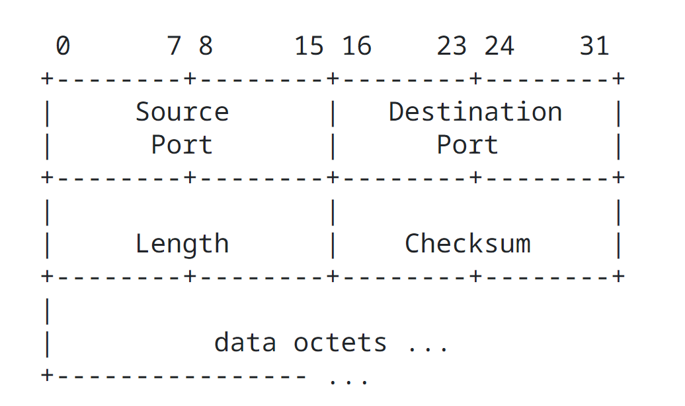
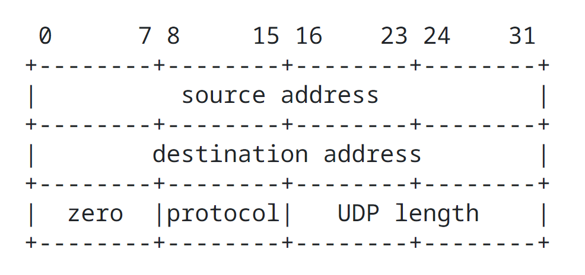

User Datagram Protocol
======================

## Introduction

This User Datagram Protocol UDP is defined to make available a datagram mode of packet-switched computer communication in the environment of an interconnected set of computer networks. This protocol assumes that the Internet Protocol IP is used as the underlying protocol.

This protocol provides a procedure for application programs to send messages to other programs with a minimum of protocol mechanism. The protocol is transaction oriented, and delivery and duplicate protection are not guaranteed. Applications requiring ordered reliable delivery of streams of data should use the Transmission Control Protocol TCP.

## Format

## Fields

Source Port is an optional field, when meaningful, it indicates the port of the sending process, and may be assumed to be the port to which a reply should be addressed in the absence of any other information. If not used, a value of zero is inserted.

Destination Port has a meaning within the context of a particular internet destination address.

Length is the length in octets of this user datagram including this header and the data. (This means the minimum value of the length is eight.)

Checksum is the 16 bit one's complement of the one's complement sum of a pseudo header of information from the Internet Protocol IP header, the User Datagram Protocol UDP header, and the data, padded with zero octets at the end (if necessary) to make a multiple of two octets.

The pseudo header conceptually prefixed to the User Datagram Protocol UDP header contains the source address, the destination address, the protocol, and the User Datagram Protocol UDP length. This information gives protection against misrouted datagrams. This checksum procedure is the same as is used in Transmission Control Protocol TCP.

If the computed checksum is zero, it is transmitted as all ones (the equivalent in one's complement arithmetic). An all zero transmitted checksum value means that the transmitter generated no checksum (for debugging or for higher level protocols that don't care).

## User Interface

A user interface should allow

- The creation of new receive ports
- Receive operations on the receive ports that return the data octets and an indication of source port and source address
- An operation that allows a datagram to be sent, specifying the data, source and destination ports and addresses to be sent.

## Internet Protocol IP Interface

The User Datagram Protocol UDP must be able to determine the source and destination interface addresses and the protocol field from the internet header. One possible UDP/IP interface would return the whoe interent datagram including all of the internet header in response to a receive operation. Such an interface would also allow the UDP to pass a full internet datagram complete with header to the IP to send. The IP would verify certain fields for consistency and compute the internet header checksum.

## Protocol Application

The major uses of this protocol is the Internet Name Server, and the Trivial File Transfer.

## Protocol Number

This is protocol 17 (21 octet) when used in the Internet Protocol.