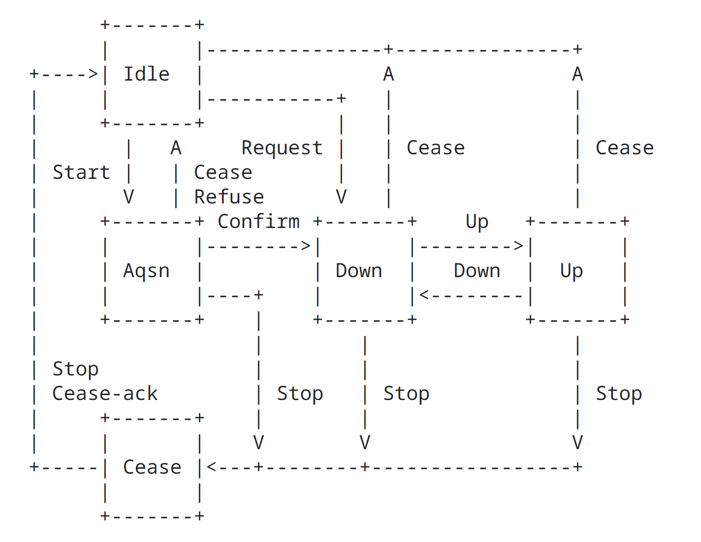
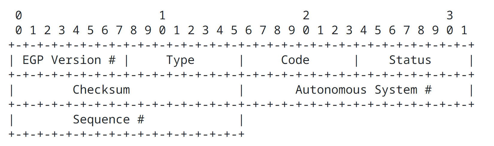
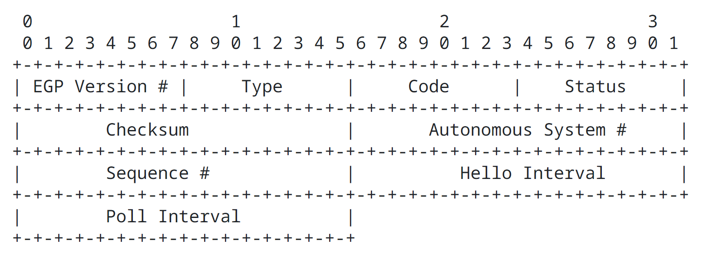
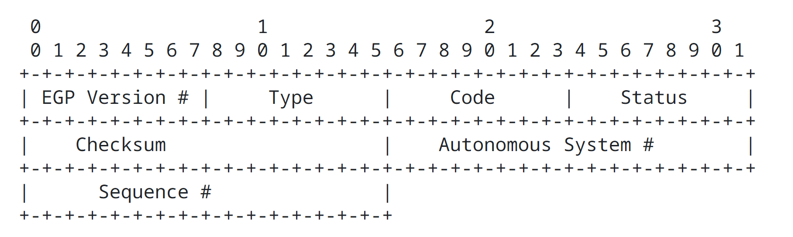
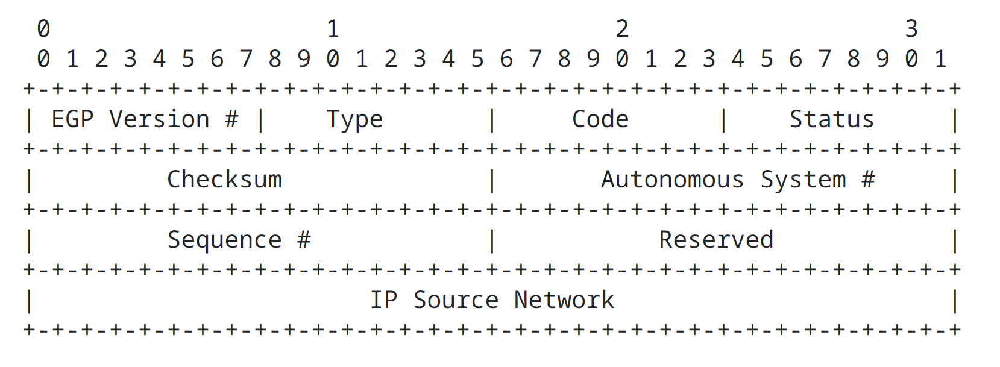
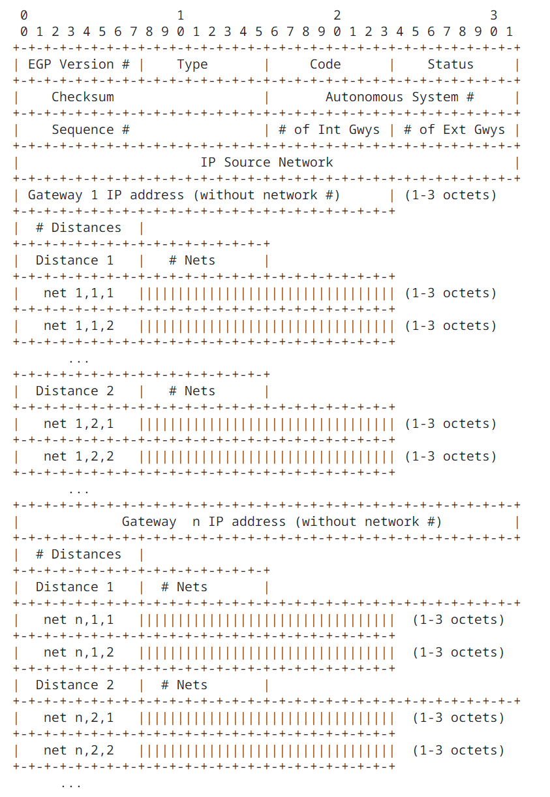
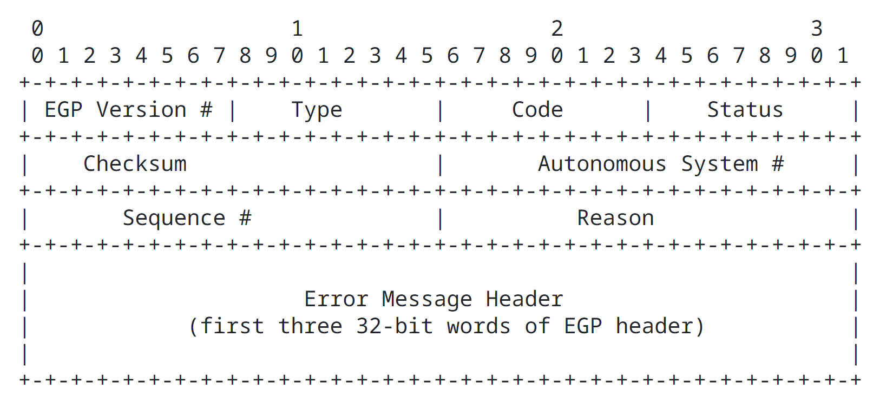

Exterior Gateway Protocol Formal Specification
==============================================

## 0. Status of this Memo

This RFC is the specification of the Exterior Gateway Protocol (EGP). This document updates RFC 827 and 888. This RFC specifies a standard for the DARPA community. Interactions between gateways of different autonomous systems in the ARPA Internet must follow this protocol.

## 1. Introduction

This document is a formal specification of the Exterior Gateway Protocol (EGP), which is used to exchange net-reachability information between Internet gateways belonging to the same or different autonomous systems. The specification is intended as a reference guide for implementation, testing and verification and includes suggested algorithmic parameters suitable for operation over a wide set of configurations, including the ARPANET and many local-network technologies now part of the Internet system.

Specifically excluded in this document is discussion on the background, application and limitations of EGP, which have been discussed elsewhere [RFC-827](https://datatracker.ietf.org/doc/html/rfc827), [RFC-888](https://datatracker.ietf.org/doc/html/rfc888). If, as expected, EGP evolves to include topologies not restricted to tree-structures and to incorporated full routing capabilities, this specification will be amended or obsolted accordingly. However, it is expected that, as new features are added to EGP, the basic protocol mechanisms described here will remain substantially unchanged, with only the format and interpretation of the Update message changed.

Section 2 of this document describes the nomenclature used, while Section 3 describes the state-machine model, including events, actions, parameters and state transitions. Section 4 contains a functional description of the operation of the machine, together with specific procedures and algorithms. Appendix A describes the EGP message formats, while Appendix B contains a summary of the minor differences between these and the formats described in [RFC-888](https://datatracker.ietf.org/doc/html/rfc888). Appendix C presents a reachability analysis including a table of composite state transitions for a system of two communicating EGP gateways.

### 1.1. Summary and Overview

EGP exists in order to convey net-reachability information between neighboring gateways, possibly in different autonomous systems. The protocol includes mechanisms to acquire neighbors, monitor neighbor reachability and exchange net-reachability information in the form of Update messages. The protocol is based on periodic polling using Hello/I-Heard-You (I-H-U) message exchanges to monitor neighbor reachability and Poll commands to solicit Update responses.

Specification of EGP is based on a formal model consisting of a finite-state automation with defined events, state transitions and actions. The following diagram shows a simplified graphical representation of this machine (see Section 3.4 for a detailed state transition table).

Idle State (0)

In the Idle state the gateway has no resources (table space) assigned to the neighbor and no protocol activity of any kind is in progress. It responds only to a Request command or a start event (system or operator initiated) and ignores all other commands and responses. The gateway may optionally return a cease-ack response to a cease command in this state.

Upon receipt of a request command the gateway initializes the state variables as described in Section 3.1, sends a confirm response and transitions to the down state, if resource commitments permit, or sends a refuse response and returns to the idel state if not. Upon receipt of a start event it sends a request command and transitions to the acquisition state.

Acquisition State (1)

In the acquisition state the gateway periodically retransmits request commands. Upon receiving a confirm response it initializes the state variables and transitions to the down state. Upon receiving a refuse response it returns to the idle state. The gateway does not send any other commands or responses in this state, since not all state variables have yet been initialized.

Down State (2)

In the down state the gateway has received a request command or a confirm response has been received for a previously sent request. The neighbor-reachability protocol has declared the neighbor to be down. In this state the gateway processes request, cease and hello commands and responds as required. It periodically retransmits hello commands if enabled. It does not process poll commands and does not send them, but may optionally process an unsolicited update indication.

Up State (3)

In the up state the neighbor-reachability protocol has declared the neighbor to be up. In this state the gateway processes and responds to all commands. It periodically retransmits hello commands, if enabled, and poll commands.

Cease State (4)

A stop event causes a cease command to be sent and a transition to the cease state. In this state the gateway periodically retransmits the cease command and returns to the idle state upon receiving a cease-ack response or a another stop event. The defined state transitions are designed to ensure that the neighbor does with high probability receive the cease command and stop the protocol.

In following sections of this document document a state machine which can serve as a model for implementation is described. It may happen that implementators may deviate from this model while conforming to the protocol specification; however, in order to verify conformance to the specification, the state-machine model is intended as the reference model.

Although not mentioned specifically in this document, it should be understood that all Internet gateways must include support for Internet Control Message Protocol (ICMP), specifically ICMP Redirect and ICMP Destination Unreachable messages.

## 2. Nomenclature

The following EGP message types are recognized in this document. The format of each of these messages is described in Appendix A.

| Name        | Function                                                            |
| ----------- | ------------------------------------------------------------------- |
| Request     | Request acauisition of neighbor and/or initialize polling variables |
| Confirm     | Confirm acqusition of neighbor and/or initialize polling variables  |
| Refuse      | Refuse acqusition of neighbor                                       |
| Cease       | Request de-acquisition of neighbor                                  |
| Cease-ack   | Confirm de-acquisition of neighbor                                  |
| Hello       | Request neighbor reachability                                       |
| I Heard You | Confirm neighbor reachability                                       |
| Poll        | Request net-reachability update                                     |
| Update      | net-reachability update                                             |
| Error       | error                                                               |

EGP messages are classed as commands which request some action, responses, which are sent to indicate the status of that action, and indications, which are similar to responses, but may be sent at any time. Following is a list of commands along with their possible responses.

| Command | Corresponding Responses |
| ------- | ----------------------- |
| Request | Confirm, Refuse, Error  |
| Cease   | Cease-ack, Error        |
| Hello   | I Heard You, Error      |
| Poll    | Update, Error           |

The Update and Error messages are classed both as responses and indications. When sent in reply to a previous command, either of these messages is classed as a response. In some circumstances an unsolicited update message can be sent, in which case it is classed as an indication. The use of the error message other than as a response to a previous command is a topic for further study.

## 3. State machine 

This section describes the state-machine model for EGP, including the variables and constants which establish the state at any time, the events which cause the state transitions, the actions which result from these transitions and the state-transition table which defines the behavior.

### 3.1. State Variables

The state-machine model includes a number of state variables which establish the state of the protocol between the gateway and each of its neighbors. Thus, a gateway maintaining EGP with a number of neighbors must maintain a separate set of these state variables for each neighbor. The current state, events and actions of the state machine apply to each neighbor separately.

The model assumes that system resources, including the set of state variables. are allocated when the state machine leaves the idle state, either because of a start event specifying a new neighbor addresses, or because of a start event specifying a new neighbor address. When either of these events occur the values of the state variables are initialized as indicated below. Upon return to the idle state all resources, including the set of state variables, are deallocated and returned to the system. Implementors may, of course, elect to dedicate resources and state variables permananently.

Included among the set of state variables are the following which determine the state transitions of the model. Initial values for all of the variables except the send sequence number S are set during the initial request/confirm exchange. The initial value for S is arbitrary.

| Name | Function                                                                   |
| ---- | -------------------------------------------------------------------------- |
| R    | receive seqeunce number                                                    |
| S    | send sequence number                                                       |
| T1   | interval between hello command retransmissions                             |
| T2   | interval between poll command retransmissions                              |
| T3   | interval during which neighbor-reachability indications are counted        |
| M    | hello polling mode                                                         |
| t1   | timer 1 (used to control request, hello and cease command retransmissions) |
| t2   | timer 2 (used to control poll command retransmissions)                     |
| t3   | timer 3 (abort timer)                                                      |

Additional state variables may be necessary to support various timer and similar internal housekeeping functions. The function and management of the cited variables ad discussed in Section 4.

### 3.2. Fixed Parameters

This section defines several fixed parameters which characterize the gateway functions. Included is a suggested value for each parameter based on experimental implementations in the internet system. These values may or may not be appropriate for the individual configuration.

Following is a list of time-interval parameters which control retransmissions and other time-dependent functions.

| Name | Value | Description                                                                                                              |
| ---- | ----- | ------------------------------------------------------------------------------------------------------------------------ |
| P1   | 30 sec | minimum interval acceptable between successive hello commands received                                                  |
| P2   | 2 min  | minimum interval acceptable between successive poll commands received                                                   |
| P3   | 30 sec | interval between request or cease command retransmissions                                                               |
| P4   | 1 hr   | interval during which state variables are maintained in the absence of commands or responses in the down and up states. |
| P5   | 2 min  | interval during which state variables are maintained in the absence of responses in the acquisition and cease states    |

Parameters P4 and P5 are used only if the abort-timer option is implemented. Parameter P4 establishes how long the machine will remain in the down and up states in the absence of commands or responses and would ordinarily be set to sustain state information while the neighbor is dumped and restared, for example, Parameter P5 establishes how long absence of reponses and would ordinarily be set in the same order as the expected value of T3 variables.

Following is a list of other parameters of interest.

| Name | Active | Passive | Description             |
| ---- | ------ | ------- | ----------------------- |
| j    | 3      | 1       | neighbor-up threshold   |
| k    | 1      | 4       | neighbor-down threshold |

The j and k parameters establish the "noise immunity" of the neighbor-reachability protocol described later. The values in the active column are suggested if the gateway elects to do hello polling, while the values in the passive column are suggested otherwise.

### 3.3. Events

Following is a list of events that can cause state transitions in the model.

| Name        | Event |
| ----------- | ----- |
| Up          | At least j neighbor-reachability indications have been received within the last T3 seconds. |
| Down        | At most k neighbor-reachability indications have been received within the last T3 seconds.  |
| Request     | Request command has been received. |
| Confirm     | Confirm command has been received. |
| Refuse      | Refuse response has been received. |
| Cease       | Cease command has been received.   |
| Cease-ack   | Cease-ack command has been received. |
| Hello       | Hello command has been received.     |
| I Heard You | I Heard You response has been received. |
| Poll        | Poll command has been received.         |
| Update      | Update response has been received.      |
| Start       | Start event has been recognized due to system or operator intervention. |
| Stop/t3     | Stop event has been recognized due to system or operator intervention or expiration of the abort timer t3. |
| t1          | Timer t1 has counted down to zero. |
| t2          | Timer t2 has counted down to zero. |

There is one special event, called a neighbor-reachability indication, which occurs when:

1. The gateway is operating in the active mode (hello polling enabled) and either a confirm, I Heard You or Update response is received.
2. The gateway is operating in the passive mode (hello polling disabled) and either a Hello or Poll command is received with the "Up state" code in the status field.

### 3.4. State Transition Table

The following table summarizes the state transitions that can occur in response to the events listed above. Transitions are shown in the form n/a, where n is the next state and a represents the action.

| -         | 0 Idle      | 1 Aqsn      | 2 Down      | 3 Up        | 4 Cease     |
| --------- | ----------- | ----------- | ----------- | ----------- | ----------- |
| Up        | 0           | 1           | 3/Poll      | 3           | 4           |
| Down      | 0           | 1           | 2           | 2           | 4           |
| Request   | 2/Confirm * | 2/Confirm   | 2/Confirm   | 2/Confirm   | 4/Cease     |
| Confirm   | 0/Cease  ** | 2           | 2           | 3           | 4           |
| Refuse    | 0/Cease  ** | 0           | 2           | 3           | 4           |
| Cease     | 0/Cease-ack | 0/Cease-ack | 0/Cease-ack | 0/Cease-ack | 0/Cease-ack |
| Cease-ack | 0           | 1           | 2           | 3           | 0           |
| Hello     | 0/Cease  ** | 1           | 2/I-H-U     | 3/I-H-U     | 4           |
| I-H-U     | 0/Cease  ** | 1           | 2/Process   | 3/Process   | 4           |
| Poll      | 0/Cease  ** | 1           | 2           | 3/Update    | 4           |
| Update    | 0/Cease  ** | 1           | 2           | 3/Process   | 4           |
| Start     | 1/Request   | 1/Request   | 1/Request   | 1/Request   | 4           |
| Stop/t3   | 0           | 0           | 4/Cease     | 4/Cease     | 0           |
| t1        | 0           | 1/Request   | 2/Hello     | 3/Hello     | 4/Cease     |
| t2        | 0           | 1           | 2           | 3/Poll      | 4           |

Note *: The transition shown applies to the case where the neighbor-acquisition request is accepted. The transition "0/Refuse" appies to the case where the request is rejected.

Note **: The Cease action shown is optional.

### 3.5. State Transitions and Actions

The following table describes in detail the transitions of the state machine and the actions evoked.

| State                 | Event         | Next State | Message Sent  | Actions |
| --------------------- | ------------- | ---------- | ------------- | ------- |
| Idle State (0)        | Request       | 2          | Confirm Hello | Initialize state variables and reset timer t1 to T1 seconds and reset timer t3 to P5 seconds. |
| -                     | -             | 0          | Refuse        | Return resources. |
| -                     | Cease         | 0          | Cease-ack     | Return resources. |
| -                     | Start         | 1          | Request       | Reset timer t1 to P3 seconds and reset timer t3 to P5 seconds. |
| Acquisition State (1) | Request       | 2          | Confirm Hello | Initialize state variables and reset timer t1 to T1 seconds and reset timer t3 to P5 seconds. |
| -                     | Confirm       | 2          | Hello         | Initialize state variables and reset timer t1 to T1 seconds and reset timer t3 to P5 seconds. |
| -                     | Refuse        | 0          | -             | Stop timers and return resources. |
| -                     | Cease         | 0          | Cease-ack     | Stop timer t1 to P3 seconds and reset timer t3 to P5 seconds. |
| -                     | Start         | 1          | Request       | Reset timer t1 to P3 seconds and reset timer t3 to P5 seconds. |
| -                     | Stop/t3       | 0          | -             | Stop timers and return resources. |
| -                     | t1            | 1          | Request       | Reset timer t1 to P3 seconds. |
| Down State (2)        | Up            | 3          | Poll          | Reset timer t2 to T2 seconds. |
| -                     | Request       | 2          | Confirm Hello | Reinitialize state variables and reset timer t1 to T1 seconds and reset timer t3 to P5 seconds. |
| -                     | Cease         | 0          | Cease-ack     | Stop timers and return resources. |
| -                     | Hello         | 2          | I Heard You   | - |
| -                     | I Heard You   | 2          | -             | Process neighbor-reachability info. |
| -                     | Start         | 1          | Request       | Reset timer t1 to P3 seconds and reset timer t3 to P5 seconds. |
| -                     | Stop/t3       | 4          | Cease         | Reset timer t1 to P3 seconds and reset timer t3 to P5 seconds. |
| -                     | t1            | 2          | Hello         | Reset timer t1 to T1 seconds. |
| Up State (3)          | Down          | 2          | -             | Stop timer t2. |
| -                     | Request       | 2          | Confirm Hello | Reinitialize state variables and reset timer t1 to T1 seconds and reset timer t3 to P5 seconds. |
| -                     | Cease         | 0          | Cease-ack     | Stop timers and return resources. |
| -                     | Hello         | 3          | I Heard You   | - |
| -                     | I Heard You   | 3          | -             | Process neighbor-reachability info. |
| -                     | Poll          | 3          | Update        | - |
| -                     | Update        | 3          | -             | Process net-reachability info. |
| -                     | Start         | 1          | Request       | Reset timer t1 to P3 seconds and reset timer t3 to P5 seconds. |
| -                     | Stop/t3       | 4          | Cease         | Reset timer t1 to P3 seconds and reset timer t3 to P5 seconds. |
| -                     | t1            | 3          | Hello         | Reset timer t1 to T1 seconds. |
| -                     | t2            | 3          | Poll          | Reset timer t2 to T2 seconds. |
| Cease State (4)       | Request       | 4          | Cease         | - |
| -                     | Cease         | 0          | Cease-ack     | Stop timers and return resources. |
| -                     | Cease-ack     | 0          | -             | Stop timers and return resources. |
| -                     | Stop/t3       | 0          | -             | Stop timers and return resources. |
| -                     | t1            | 4          | Cease         | Reset timer t1 to P3 seconds. |

Note: Reset timer t3 to P4 seconds on receipt of a reachability indication.

## 4. Managing the State Variables

The state variables which characterize the protocol are summarized in Section 3.1. This section describes the detailed management of these variables, including sequence numbers, polling intervals and timers.

#### 4.1.1. Sequence Numbers

All EGP commands and replies carry a sequence number. The state variable R records the last sequence number received in a command from that neighbor. The current value of R is used as the sequence number for all replies and indications sent to the neighbor until a command with a different sequence number is received from that neighbor.

Implementors are free to manage the sequence numbers of the commands sent; however, it is suggested that a separate send state variable S be maintained for each EGP neighbor and that its value be incremented just before the time an Poll command is sent and at no other times. The actions upon receipt of a response or indication with sequence number not equal to S is not specified; however, it is recommended these be discarded.

#### 4.1.2. Polling Intervals

As part of the Request/Confirm exchange a set of polling intervals are established including T1, which establishes the interval between Hello command retransmissions, and T2, which establishes the interval between poll retransmissions.

Each gateway configuration is characterized by a set of fixed parameters, including P1, which specifies the minimum polling interval at which it will respond to hello commands, and P2 which specifies the minimum polling interval at which it will respond to poll commands. P1 and P2 are inserted in the hello interval (S1) and poll interval (S2) fields, respectively, of request commands and confirm responses.

A gateway receiving a request command or confirm response uses the S1 and S2 fields in the message to calculate its own T1 and T2 state variables, respectively. Implementors are free to perform this calculation in arbitrary ways; however, the following constraints must be observed:

1. If T1 < S1 the neighbor may discard hello commands. If T2 < S2 the neighbor may discard poll commands.
2. The time window T3 in which neighbor-reachability indications are counted is dependent on T1. In the case where two neighbors select widely differing values for their T3 state variables, the neighbor-reachability algorithm may not work properly. This can be avoided if T1 > max(P1, S1).
3. If either S1 or S2 or both are unacceptable for some reason (e.g. exceed useful limits), the neighbor may either send a Refuse response or declare a Stop event, depending on state.

It is suggested that T3 be computed as four times the value of T1, giving a window of four neighbor-reachability indications, which has been found appropriate in the experimental implementations. Implementors may choose to make T3 a fixed parameter in those cases where the path between the neighbors has well-known characteristics.

Note that, if a gateway attempts to send hello commands near the rate max(P1, S1) or poll commands near the rate max(P2, S2), the neighbor may observe their succeeding arrivals to violate the polling restrictions due to bunching in the net. For this reason the gateway should send at rates somewhat below these. Just how much below these rates is appropriate depends on many factors beyond the scope of this specification.

#### 4.1.3. Hello Polling Mode

The neighbor-reachability algorithm can be used in either the active or passive mode. In the active mode hello commands are sent periodically along with poll commands, with reachability determined by the corresponding I Heard You and Update responses. In the passive mode Hello commands are not sent and I Heard You responses are not expected. Reachability is then determined from the status field of received hello or poll commands or update responses.

The M state variable specifies whether the gateway operates in the active or passive mode. At least one of the two neighbors sharing the protocol must operate in the active mode; however, the neighbor-reachability protocol is designed to work even if both neighbors operate in the active mode. The value of M is determined from the status field of a request command or confirm response. The sender sets this field according to whether the implementation supports the active mode, passive mode or both:>

| Status | Sender capabilities |
| ------ | ------------------- |
| 0      | either active or passive |
| 1      | active only |
| 2      | passive only |

The receiver inspects this field and sets the value of M according to its own capabilities as follows: 

| Status field | Receiver Capabilities 0 | Receiver Capabilities 1 | Receiver Capabilities 2 |
| ------------ | ----------------------- | ----------------------- | ----------------------- |
| 0            | *                       | active                  | passive                 |
| 1            | passive                 | active                  | passive                 |
| 2            | active                  | active                  | **                      |

In the case of "*" the mode is determined by comparing the autonomous system numbers of the neighbors. The neighbor with the smallest such number assumes active mode, while the other neighbor assumes passive mode. In the case of "**" the neighbor may either send a refuse response or declare a stop eent depending on state.

#### 4.1.4. Timers

There are three timers defined in the state machine: t1, used to control retransmission of request, hello and cease messages, t2, used to control retransmission of poll commands, and t3, which serves as an abort-timer mechanism should the protocol hang indefinately. The timers are set to specified values upon entry to each state and count down to zero.

In the case of t1 and t2 state-dependent events are declared when the timer counts down to zero, after which the timer is reset to the specified value and counts down again. In the case of t3 a stop event is declared when the timer counts down to zero. Implementors may choose not to implement t3 or, if so, may choose to implement it only in certain states, with the effect that request, hello and/or cease commands may be retransmitted indefinately.

The following table shows the initial values for each of the timers in each state. A missing value indicates the timer is not used in that state. Note that timer t3 is set to P4 upon receipt of a neighbor-reachability indication when in either the down or up states.

                          
| Timer | Idle 0 | Aqsn 1 | Down 2 | Up 3 | Cease 4 |
| ----- | ------ | ------ | ------ | ---- | ------- |
| t1    | -      | P3     | T1     | -    | P3      |
| t2    | -      | -      | -      | T2   | -       |
| t3    | -      | P5     | P5     | -    | P5      |

### 4.2. Starting and Stopping the Protocol

The start and stop events are intrinsic to the system environment of the gateway. They can be declared as the result of the gateway process being started and stopped by the operator, for example. A start event has meaning only in some states; however, a stop event has meaning in all states.

In all except the idle state the abort timer t3 is presumed running. This timer is initialized at P5 seconds upon entry to any state and at P4 seconds upon receipt of a neighbor-reachability indication in the down and up states. If it expires a stop event is declared. A stop event can also be declared by an intrinsic system action such as a resource problem or operator command.

If the abort timer is not implemented a manually-initiated stop event can be used to stop the protocol. If this is done in the down or up states, the machine will transition to the cese state and emit a cease command. It the neighbor does not respond to this command the machine will stay in the cease state indefinately; however, a second stop event can be used in this state to force a transition to the idle state.

A cease command received in any state will cause the gateway to immediately send the cease-ack response and transition to the idle state. This causes the protocol to be stopped and all system resources committed to the gateway process to be released. The interval between the time the gateway enters the idle state as the result of receiving a cease command and the time when it next sends a request command to resume the protocol is not specified; however, it is recommended this interval be at least P5 seconds.

It may happen that the cease-ack response is lost in the network, causing the neighbor to retransmit the cease response indefinately, at least if it has not implemented the abort-timer option. In order to reduce the likelihood of this happening, it is suggested that a gateway in the idel state be prepated to reply to a cease command with a cease-ack response whenever possible.

### 4.3. Determining Neighbor Reachability

The purpose of the neighbor-reachability algorithm is to confirm that the neighbor can safely be considered operational and capable of providing reliable net-reachability information. An equally important purpose is to filter noisy reachability information before sending it on to the remainder of the internet gateway system, thus avoiding unnecessary reachability changes.

As described above, a gateway operating in the active mode sends periodic hello commands and listens for I Heard U responses in order to determine neighbor-reachability indications. A gateway operating in the passive mode determines reachability indications by means of the status field in received hello commands. Poll commands and update responses can be used in lieu of hello commands and I Heard U responses respectively, since they contain the same status-field information.

The neighbor-reachability algorithm runs continuously while the gateway is in the down and up states and operates as follows. Define a moving window in time starting at the present and extending backwards for t seconds. Then count the number n of neighbor-reachability indications which have occured in that window. If n increases to j, then declare a up event. If n decreases to k, then declare a down event. If n decreases to k, then declare a down event. The number n is set to zero upon entering the down state from any state other than the up state.

The window t in this algorithm is defined as T3 seconds, the value of which is suggested as four times T1, which itself is determined during the request/confirm exchange. For proper operation of the algorithm only one neighbor-reachability indication is significant in any window of T1 seconds and additional ones are ignored. Note that the only way n can increase is as the result of a new neighbor-reachability indication and the only way it can decrease is as the result of an old neighbor-reachability indication moving out the window.

The behavior of the algorithm described above and using the suggested fixed parameters j and k differs depending on whether the gateway is operating in the active or passive mode. In the active mode (j = 3, k = 1 and T3/T1 = 4), once the neighbor has been declared down it will be forced down for at least two T1 intervals and, once it has been declared up it will be forced up for at least two T1 intervals. It will not change state unless at least three of the last four determinations of reachability have indicated that change.

In the passive mode (j = 1, k = 4 and T3/T1 = 4), the neighbor will be considered up from the first time the status field of a hello or poll command or update response indicates "up state" until four successive T1 intervals have passed without such indication. This design, suggested by similar designs used in the ARPANET, has proven effective in the experimental implementations, but may need to be adjusted for other configurations.

It is convenient for the active gateway to send hello commands at a rate of one every T1 seconds and substitute a poll command for a hello command approximately once every T2 seconds, with the neighbor-reachability indication generated by the corresponding I Heard U or update responses. Its passive neighbor generates neighbor-reachability indications from the status field or received hello and poll commands and update responses.

Implementors may find the following model useful in the understanding and implementation of this algorithm. Consider an n-bit shift register that shifts one bit to the right each T1-second interval. If a neighbor-reachability indication was received during the preceeding T1-second interval a one bit is shifted into the register at the end of the interval; otherwise, a zero bit is shifted. A table of 2**n entries indexed by the contents of the register can be used to calculate the number of one bits, which can then be used to declare the appripriate event to the state machine. A value of n equal ot four has been found useful in the experimental implementations.

### 4.4. Determining Network Reachability

Network reachability information is encoded into update messages in the form of lists of nets and gateways. The IP Source Address field of the poll command is used to specify a network common to the autonomous system of each of the neighbors, which is usually, but not necessarily, the one common to the neighbors themselves. The update response includes a list of gateways on the common net. Associated with each gateway is a list of the networks reachable via that gateway together with corresponding hop counts.

It is important to understand that, at the present state of development as described in [RFC827](https://datatracker.ietf.org/doc/html/rfc827) and [RFC888](https://datatracker.ietf.org/doc/html/rfc888), the EGP architectural model restricts the interpretation of "reachable" in this context. This consideration, as well as the implied topological restrictions, are beyond the scope of discussion here. The reader is referred to the RFC for further discussion.

Two types of gateway lists can be included in the update response, the format of which is described in Appendix A. Both lists include only those gateways directly connected to the net specified in the IP Source Network field of the last-received poll command. The internal list includes some or all ot the gateways in the same autonomous system as the sender, together with the nets which are reachable via these gateways, with the sending gateway listed first. A net is reachable in this context if a path exists to that net including only gateways in the system. The external list includes those gateways in other autonomous systems known to the sender. It is important to realize that the hop counts do not represent a routing metric and are comparable between different gateways only if those gateways belong to the same autonomous system; that is, are in the internal list.

The interval between successive poll commands T2 is determined during the request/confirm exchange. However, the specification permits at most one unsolicited update indication between succeeding poll commands reveived from the neighbor. It is the intent of the model here that an update indication is sent upon entry to the up state and when a change in the reachability data base is detected, subject to this limitation.

Occasionally it may happen that a poll command or update response is lost in the network, with the effect that net-reachability information may nbot be available until after another T2 interval. As an implementation option, the gateway sending a poll command and not receiving an update response after T1 seconds may send another poll. The gateway receiving this poll may either send an update response if it never received the orignal poll for that interval, send a second update response (which counts as the unsolicited update indication mentioned in the preceeding paragraph) or send an error response or not respond at all in other cases.

### 4.5. Error messages

Error messages can be used to report problems such as described in Appendix A in connection with the Error response/indication message format. In general, an error message is sent upon receipt of another command or response with bad format, content or ordering, but never in response to another error message. Receipt of an error message should be considered advisory and not result in change of state, except possibly to evoke a stop event.

## Appendix A. EGP Message Format

The format for the various EGP messages are described in this section. All EGP messages include a ten-octet header of six fields, which may be followed by additional fields depending on message type. The format of the header is shown below along with a description of its fields.

| Field | Comment |
| ----- | ------- |
| EGP Version # | assigned number identifying the EGP version (currently 2) |
| Type          | identifies the message type                               |
| Code          | identifies the message code (subtype)                     |
| Status        | contains message-dependent status information             |
| Checksum      | The EGP checksum is the 16 bit one's complement of the one's complement sum of the EGP message starting with the EGP version number field. When computing the checksum the checksum field itself should be zero. |
| Autonomous System # | assigned number identifying the particular autonomous system |
| Sequence #          | send state variable (commands) or receive state variable (responses and indications) |

Following is a description of each of the message formats. Note that the above description applies to all formats and will not be repeated.

### A.1. Neighbor Acquisition Messages

Note: the hello interval and poll interval fields are present only in request and confirm messages.

Type: 3

Code:

    - 0: Request command
    - 1: Confirm response
    - 2: Refuse response
    - 3: Cease command
    - 4: Cease-ack response

Status:

    - 0: unspecfied
    - 1: active mode
    - 2: passive mode
    - 3: insufficient resources
    - 4: administratively prohibited
    - 5: going down
    - 6: parameter problem
    - 7: protocol violation

Hello Interval: minimum hello command polling interval (seconds)
Poll Interval: minimum poll command polling interval (seconds)

Following is a summary of the assigned status codes along with a list of scenarios in which they might be used.

| Code | Status | Scenarios |
| ---- | ------ | --------- |
| 0    | unspecified  | when nothing else fits |
| 1    | active mode  | request/confirm only   |
| 2    | passive mode | request/confirm only   |
| 3    | insufficient resources | out of table space, out of system resources |
| 4    | administratively prohibied | unknown autonomous system, use another gateway |
| 5    | going down | operator initiated stop, abort timeout |
| 6    | parameter problem | nonsense polling parameters, unable to assume compatible mode |
| 7    | protocol violation | invalid command or response received in this state |

### A.2. Neighbor Reachability Messages

Type: 5

Code:

    - 0: Hello command
    - 1: I Heard U response

Status:

    - 0: indeterminate
    - 1: Up state
    - 2: Down state

### A.3. Poll Command

Type: 5

Code: 0

Status:

    - 0: indeterminate
    - 1: Up state
    - 2: Down state

IP Source Network:

    IP network number of the network about which reachability information is being requested (coded as 1, 2, or 3 octets, left justified with trailing zeros)

### A.4. Update Response/Indication

Type: 1

Code: 0

Status:

    - 0: indeterminate
    - 1: Up state
    - 2: Down state
    - 128: unsolicited message bit

`#` of Int Gwys: number of interior gateways appearing in this message

`#` of Ext Gwys: number of exterior gateways appearing in this message

IP Source Network: IP network number of the network about which reachability information is being supplied (coded as 1, 2, or 3 octets, left justified with trailing zeros)

Gateway IP addresses: IP address (without network number) of the gateway block (coded as 1, 2, or 3 octets)

`#` of Distances: number of distances in the gateway block

Distances: numbers depending on autonomous system architecture

`#` of Nets: number of nets at each distance

Nets: IP network number reachable via the gateway

### A.5. Error Response/Indication

Type: 8

Code: 0

Status:

    - 0: Indeterminate
    - 1: Up state
    - 2: Down state
    - 128: Unsolicited message bit

Reason:

    - 0: Unspecified
    - 1: Bad EGP Header format
    - 2: Bad EGP data field format
    - 3: Reachability info unavailable
    - 4: Excessive polling rate
    - 5: No response

Error Message Header: First three 32 bit words of EGP Header

Following is a summary of the assigned Reason codes along with a list of scenarios in which they might be used.

Code 0, Reason: Unspecified

    When nothing else fits

Code 1, Reason: Bad EGP Header format

    1. bad message length
    2. invalid type, code or status fields

    Note: The recipient can determine which of the above hold by inspecting the EGP header included in the message. An instance of a wrong EGP version or bad checksum should not be reported, since the original recipient can not trust the header format. An instance of an unknown autonmous system should be caught at acquisition time.

Code 2, Reason: Bad EGP data field format

    1. nonsence polling rates (request/confirm)
    2. invalid update message format
    3. response ip net address field does not match command (update)

    Notes: An instance of nonsense polling intervals (e.g. too long to be useful) specified in a request or confirm should result in a refuse or cease with this cause specified.

Code 3, Reason: Reachability info unavailable

    1. no info available on net specified in ip net address field (poll)

Code 4, Reason: Excessive polling rate

    1. Two of more hello commands received within minimum specified polling interval
    2. Two of more poll commands received within minimum specified pilling interval
    3. Two of more request commands received within some (reasonably short) interval

    Notes: The recipient can determine which of the above hold by inspecting the EGP header included in the message.

Code 5, Reason: No response

    1. no update received for poll within some (ressonably long) interval

## Appendix B. Comparison with [RFC888](https://datatracker.ietf.org/doc/html/rfc888)

Minor functional enhancements are necessary in the [RFC888](https://datatracker.ietf.org/doc/html/rfc888) message formats to support certain features assumed of the state-machine model, in particular the capability to request a neighbor to suppress hello commands. In addition, the model suggests a mapping between its states and certain status and error indications which clarifies and generalizes the interpretation.

All of the header fields except the status field (called the information field at some places in [RFC888](https://datatracker.ietf.org/doc/html/rfc888)) remain unchanged. The following table summarizes the suggested format chanages in the status field for the various messages by (type, code) class.

| Class | Messages  | Status | Codes        |
| ----- | --------- | ------ | ------------ |
| 3, 0  | Request   | 0      | Unspecified  |
| 3, 1  | Confirm   | 1      | Active mode  |
| 3, 2  | Refuse    | 2      | Passive mode |
| 3, 3  | Cease     | 3      | Insufficient resources |
| 3, 4  | Cease-ack | 4      | Administratively prohibited |
| -     | -         | 5      | Going down |
| -     | -         | 6      | Parameter problem |
| 5, 0  | Hello     | 0      | Indetermine |
| 5, 1  | I Heard U | 1      | Up state |
| 2, 0  | Poll      | 2      | Down state |
| 1, 0  | Update    | 128    | Unsolicited message bit |
| 8, 0  | Error     | -      | - |

The changes from [RFC888](https://datatracker.ietf.org/doc/html/rfc888) are as follows:

1. The status codes have been combined in two classes, one for those messages involved in starting and stopping the protocol and the other for those message involved in maintaining the protocol and exchanging reachability information. Some messages of either class may not use all the status codes assigned.

2. The status codes for the Request and Confirm indicate whether the sender can operate in active or passive mode. In [RFC888](https://datatracker.ietf.org/doc/html/rfc888) this field must be zero; however, [RFC888](https://datatracker.ietf.org/doc/html/rfc888) does not specify any mechanism to decide how the neighbors poll each other.

3. The status codes for the cease, refuse and cease-ack have the same interpretation. This provides a clear and unambiguous indication when the protocol is terminated due to an unusual situation, for instance if the NOC dynamically repartitions the ARPANET. The assigned codes are not consitent with [RFC888](https://datatracker.ietf.org/doc/html/rfc888), since the codes for the refuse and cease were assigned conflicting values; however, the differences are minor and should cause no significant problems.

4. The status codes for the Hello, I Heard U, Poll, Update and Error have the same interpretation. Codes 0 through 2 are mutually exclusive and are chosen solely on the basis of the state of the sender. In the case of the Update (and possibly Error) one of these codes can be combined with the "unsolicited bit," which corresponds to code 128. In [RFC888](https://datatracker.ietf.org/doc/html/rfc888) this field is unused for the Poll and Error and may contain only zero or 128 for the Update, so that the default case is to assume that reciprocal reachability cannot be determined by these messages.

5. Some of the reachability codes defined in [RFC888](https://datatracker.ietf.org/doc/html/rfc888) have been removed as not applicable.

## Appendix C. Reachability Analysis

The following table shows the state transitions which can occur in a system of two neighboring EGP gateways. Besides being useful in the design and verification of the protocol, the table is useful for implemetnation and testing.

The system of two neighboring EGP gateways is modelled as a finite-state automation constructed as the cartesian product of two state machines as defined above. Each state of this machine is represented as [i, j], where i and j are states of the original machine. Each line of the table shows one state transition of the machine in the form:

[i1, j1] - [i2, j2] E A

which specifies the machine in state [i1, j1] presented with event E transitions to state [i2, j2] and generates action A. Multiple actions are separted by the "/" symbol. The special symbol "`*`" represents the set of lines where all "`*`"s in the line take on the same value 0 - 4 in turn.

The table shows only those transitions which can occur as the result of events arriving at one of the two neighbors. The full table includes a duplicate set of lines for the other neighbor as well, with each line derived from a line of the table below using the transformation:

[i1, j1] -> [i2, j2]  E  A  =>  [j1, i1] -> [j2, i2]  E  A

State    State  Event           Actions
---------------------------------------------------
[*,4] -> [0,4]  Cease           Cease-ack

[0,1] -> [2,1]  Request         Confirm/Hello/Up/t1
[0,1] -> [0,1]  Request         Refuse
[0,*] -> [1,*]  Start           Request/t1

[1,1] -> [2,1]  Request         Confirm/Hello/Up/t1
[1,2] -> [2,2]  Confirm         Hello/Up/t1
[1,3] -> [2,3]  Confirm         Hello/Up/t1
[1,0] -> [0,0]  Refuse          Null
[1,*] -> [1,*]  Start           Request/r1
[1,*] -> [0,*]  Stop            Null
[1,*] -> [1,*]  t1              Request/t1

[2,1] -> [3,1]  Up              Down/Hello/Poll/t1/t2
[2,1] -> [2,1]  Request         Confirm/Hello/Up/t1
[2,2] -> [2,2]  Hello           I-H-U
[2,3] -> [2,3]  Hello           I-H-U
[2,2] -> [2,2]  I-H-U           Process

[2,3] -> [2,3]  I-H-U           Process
[2,*] -> [1,*]  Start           Request/r1
[2,*] -> [4,*]  Stop            Cease/t1
[2,1] -> [2,1]  t1              Hello/t1
[2,2] -> [2,2]  t1              Hello/t1
[2,3] -> [2,3]  t1              Hello/t1

[3,1] -> [2,1]  Down            Null
[3,2] -> [2,2]  Down            Null
[3,3] -> [2,3]  Down            Null
[3,1] -> [2,1]  Request         Confirm/Hello/Up/t1
[3,2] -> [3,2]  Hello           I-H-U
[3,3] -> [3,3]  Hello           I-H-U
[3,2] -> [3,2]  I-H-U           Process
[3,3] -> [3,3]  I-H-U           Process
[3,3] -> [3,3]  Poll            Update
[3,3] -> [3,3]  Update          Process
[3,*] -> [1,*]  Start           Request/r1
[3,*] -> [4,*]  Stop            Cease/t1
[3,1] -> [3,1]  t1              Hello/t1
[3,2] -> [3,2]  t1              Hello/t1
[3,3] -> [3,3]  t1              Hello/t1
[3,1] -> [3,1]  t2              Poll/t2
[3,2] -> [3,2]  t2              Poll/t2
[3,3] -> [3,3]  t2              Poll/t2

[4,1] -> [4,1]  Request         Cease
[4,*] -> [0,*]  Cease           Cease-ack
[4,0] -> [0,0]  Cease-ack       Null
[4,*] -> [0,*]  Stop            Null
[4,*] -> [4,*]  t1              Cease/t1

In the state-machine model defined in this document all states of the above machine are reachable; however, some are reachable only in extreme cases when one neighbor crashes, for example. In the common case where only one of the neighbors initiates and terminates the protocol and neighbor one crashes, for example, not all states are reachable. Following is a matrix showing the states which can be reached in this case, where the neighbor that initiates and terminates the protocol is called the active gateway and the other the passive gateway.

                                Passive Gateway
Active     0 Idle      1 Aqsn      2 Down      3 Up        4 Cease
Gateway   +-----------+-----------+-----------+-----------+-----------+
0 Idle    |stable     |           |           |           |unstable   |
1 Aqsn    |unstable   |unstable   |unstable   |unstable   |unstable   |
2 Down    |           |           |stable     |unstable   |           |
3 Up      |           |           |unstable   |stable     |           |
4 Cease   |unstable   |unstable   |unstable   |unstable   |unstable   |
          +-----------+-----------+-----------+-----------+-----------+

In the above matrix the blank entries represent unreachable states, while those marked unstable represent transient states which cannot persist for long, due to retransmission of request and hello messages, for example.

