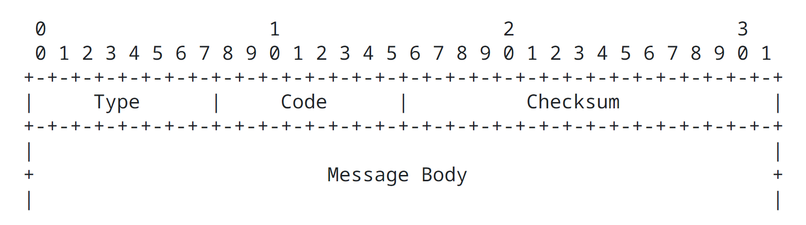

Internet Control Message Protocol ICMPv6 for the Internet Protocol version 6 IPv6 Specification
====================================================================================================================

[RFC4443](https://datatracker.ietf.org/doc/html/rfc4443)

### Status of This Memo

This document specifies an Internet standards track protocol for the Internet community, and requests discussion and suggestions for improvements.  Please refer to the current edition of the "Internet Official Protocol Standards" (STD 1) for the standardization state and status of this protocol.  Distribution of this memo is unlimited.

### Copyright Notice

Copyright (C) The Internet Society (2006).

### Abstract

This document describes the format of a set of control messages used in ICMPv6 (Internet Control Message Protocol).  ICMPv6 is the Internet Control Message Protocol for Internet Protocol version 6 (IPv6).

## 1. Introduction

The Internet Protocol version 6 IPv6 uses the Internet Control Message Protocol ICMP as defined for Internet Protocol version 4 IPv4 [RFC792](https://datatracker.ietf.org/doc/html/rfc792), with a number of changes. The resulting protocol is called Internet Control Message Protocol version 6 ICMPv6 and has an Internet Protocol version 6 IPv6 Next Header value of 58.

This document describes the format of a set of control messages used in Internet Control Message Protocol version 6 ICMPv6. It does not describe the procedures for using these messages to achieve functions like Path Maximum Transmission Unit MTU; thse procedures are described in other documents (e.g., [Path MTU Discovery for IP version 6](https://datatracker.ietf.org/doc/html/rfc1981)). Other documents may also introduce additional Internet Control Message Protocol version 6 ICMPv6 message types, such as Neighbor Discovery messages [Neighbor Discovery for IP Version 6 IPv6](https://datatracker.ietf.org/doc/html/rfc2461), subject to the general rules for Internet Control Message Protocol version 6 ICMPv6 messages given in [Section 2](https://datatracker.ietf.org/doc/html/rfc4443#section-2) of this document.

Terminology defined in the Internet Protocol version 6 IPv6 and the Internet Protocol version 6 IPv6 [RFC8200](https://datatracker.ietf.org/doc/html/rfc8200) Routing and Addressing specification [Internet Protocol Version 6 (IPv6) Addressing Architecture](https://datatracker.ietf.org/doc/html/rfc3513) applies to this document as well.

This document obsolets RFC2463 and updates RFC2780.

The key words "MUST", "MUST NOT", "REQUIRED", "SHALL", "SHALL NOT", "SHOULD", "SHOULD NOT", "RECOMMENDED", "MAY", and "OPTIONAL" in this document are to be interpreted as described in [RFC-2119].

## 2. Internet Control Message Protocol version 6 ICMPv6 (ICMP for Internet Protocol version 6 IPv6)

Internet Control Message Protocol version 6 ICMPv6 is used by Internet Protocol version 6 IPv6 nodes to report errors encountered in processing packets, and to perform other internet-layer functions, such as diagnostics (Internet Control Message Protocol version 6 ICMPv6 "ping"). Internet Control Message Protocol version 6 ICMPv6 is an integral part of Internet Protocol version 6 IPv6, and the base protocol (all the messages and behavior required by this specification) must be fully implemented by every Internet Protocol version 6 IPv6 node.

### 2.1. Message General Format

Every Internet Control Message Protocol version 6 ICMPv6 message is preceded by an Internet Protocol version 6 IPv6 header and zero or more Internet Protocol version 6 IPv6 extension headers. The Internet Control Message Protocol version 6 ICMPv6 header is identified by a Next Header value of 58 in the immediately preceding header. (This is different from the value used to identify Internet Control Message Protocol ICMP for Internet Protocol version 4 IPv4.)

The Internet Control Message Protocol version 6 ICMPv6 messages have the following general format:

The type field indicates the type of the message. Its value determines the format of the remaining data.

The code field depends on the message type. It is used to create an additional level of message granularity.

The checksum field is used to detect data corruption in the Internet Control Message Protocol version 6 ICMPv6 message and parts of the Internet Protocol version 6 IPv6 header.

Internet Control Message Protocol version 6 ICMPv6 messages are grouped into two classes: error messages and informational messages. Error messages are identified as such by a zero in the high-order bit of their message Type field values. Thus, error messages have message types for 0 to 127; informational messages have message types form 128 to 255.

This document defines the message formats for the following Internet Control Message Protocol version 6 ICMPv6 messages:

Internet Control Message Protocol version 6 ICMPv6 error messages:

- 1: Destination Unreachable
- 2: Packet Too Big
- 3: Time Exceeded
- 4: Parameter Problem

- 100: Private experimentation
- 101: Private experimentation

- 127: Reserved for expansion of Internet Control Message Protocol version 6 ICMPv6 error messages

Internet Control Message Protocol version 6 ICMPv6 informational messages:

- 128: Echo Request
- 129: Echo Reply
- 200: Private experimentation
- 201: Private experimentation
- 255: Reserved for expansion of Internet Control Message Protocol version 6 ICMPv6 informational messages

Type values 100, 101, 200, and 201 are reserved for private experimentation. They are not intended for general use. It is expected that multiple concurent expeiments will be done with the same type values. Any wide-scale and/or uncontrolled usage should obtain real allocations as defined in [Section 6](https://datatracker.ietf.org/doc/html/rfc4443#section-6).

Type values 127 and 255 are reserved for future expansion of the type value range if there is a shortage in the future. The details of this are left for future work. One possible way of doing this that would not cause any problems with current implementations is that if tthe type equals 127 or 255, the code field should be used for the new assignment. Existing implementations would ignore the new assignments as specified in [Section 2.4](https://datatracker.ietf.org/doc/html/rfc4443#section-2.4). The new messages using these expanded type values could assign fields in the message body for its code values.

Sections 3 and 4 describe the message formats for the Internet Control Message Protocol version 6 ICMPv6 error message tyeps 1 through 4 and informational message type 128 and 129.

Inclusion of, at least, the start of the invoking packet is intended to allow the originator of a packet that has resulted in an Internet Control Message Protocol version 6 ICMPv6 error message to identify the upper-layer protocol and process that sent the packet.

### 2.2. Message Source Address Determination

A node that originates an Internet Control Message Protocol version 6 ICMPv6 message has to determine both the source and destination Internet Protocol version 6 IPv6 addresses in the Internet Protocol version 6 IPv6 header before calculating the checksum. If the node has more than one unicast address, it must choose the source address of the message as follows:

- If the message is a response to a message sent to one of the node's unicast addresses, the source address of the reply must be that same address.
- If the message is a response to a message sent to any other address, such as

    - a multicast group address,
    - any anycast address implemented by the node, or
    - a unicast address that does not belong to the node

  the soruce address of the Internet Control Message Protocol version 6 ICMPv6 packet must be a unicast address belonging to the node. The address should be chosen according to the rules that would be used to select the source address for any other packet orginated by the node, given the destination address of the packet. However, it may be selected in an alternative way if this would lead to a more informative choice address reachable from the destination of the Internet Control Message Protocol version 6 ICMPv6 packet.

### 2.3. Message Checksum Calculation

The checksum is the 16-bit one's complement of the one's complement sum of the entire Internet Control Message Protocol version 6 ICMPv6 message, starting with the Internet Control Message Protocol version 6 ICMPv6 message type field, and prepended with a "pseudo header" of Internet Protocol version 6 IPv6 header fields, as specified in [Section 8.1](https://datatracker.ietf.org/doc/html/rfc8200#section-8.1). The Next Header value used in the pseudo header is 58. (The inclusion of a pseudo header in the Internet Control Message Protocol version 6 ICMPv6 checksum is a change from Internet Protocol version 4 IPv4; see [RFC8200](https://datatracker.ietf.org/doc/html/rfc8200) for the rationale for this change.)

For computing the checksum, the checksum field is first set to zero.

### 2.4. Message Processing Rules

Implementations must observe the following rules when processing Internet Control Message Protocol version 6 ICMPv6 message (from [RFC1122](https://datatracker.ietf.org/doc/html/rfc1122)):

- If an Internet Control Message Protocol version 6 ICMPv6 error message of unknown type is received as its destination, it must be passed to the upper layer process that originated the packet that caused the error, where this can be identified.

- If an Internet Control Message Protocol version 6 ICMPv6 informational message of unknown type is received, it must be silently discarded.

- Every Internet Control Message Protocol version 6 ICMPv6 error message (type < 128) must include as much of the Internet Protocol version 6 IPv6 offending (invoking) packet (the packet that caused the error) as possible without making the error message packet exceed the minimum Internet Protocol version 6 IPv6 Maximum Transmission Unit MTU.

- In cases where the internet layer protocol is required to pass an Internet Control Message Protocol version 6 ICMPv6 error message to the upper layer process, the upper layer protocol type is extracted from the original packet (contained in the body of the Internet Control Message Protocol version 6 ICMPv6 error message) and used to select the appropriate upper layer process to handle the error.
 
  In cases where it is not possible to retrieve the upper layer protocol type from the Internet Control Message Protocol version 6 ICMPv6 message, the Internet Control Message Protocol version 6 ICMPv6 message is silently dropped after any Internet Protocol version 6 IPv6 layer processing. One example of such a case is in Internet Control Message Protocol version 6 ICMPv6 message with an unusually large amount of extension headers that does not have the upper layer protocol type due to truncation of the original packet to meet the minimum Internet Protocol version 6 IPv6 Maximum Transmission Unit MTU limit. Another example is an Internet Control Message Protocol version 6 ICMPv6 message with an ESP extension header for which it is not possible to decrypt the original packet due to either truncation or the unavailability of the state necessary to decrypt the packet.

- An Internet Control Message Protocol version 6 ICMPv6 error message must not be originated as a result of receiving the following:

  - An Internet Control Message Protocol version 6 ICMPv6 error message
  - An Internet Control Message Protocol version 6 ICMPv6 redirect message [Neighbor Discovery for IP Version 6 (IPv6)](https://datatracker.ietf.org/doc/html/rfc2461)
  - A packet destined to an Internet Protocol version 6 IPv6 multicast address. (There are two exceptions to this rule: the Packet Too Big Message to allow Path Maximum Tranmission Unit MTU discovery to work for Internet Protocol version 6 IPv6 multicast, and the Parameter Problem Message, Code 2 repoting an unrecognized Internet Protocol version 6 IPv6 option (see Section 3.4) reporting an unrecognized Internet Protocol version 6 IPv6 (see Section 4.2. of Internet Protocol version 6) that has the Option Type highest order two bits set to 10).
  - A packet sent as a link layer multicast.
  - A packet sent as a link layer broadcast.
  - A packet whose source address does not uniquely identify a single node -- e.g., the Internet Protocol version 6 IPv6 multicast address, or an address known by the Internet Control Message Protocol ICMP message originator to be an Internet Protocol version 6 IPv6 anycast address.

- Finally, in order to limit the bandwidth and forwarding costs incurred by orignating Internet Control Message Protocol version 6 ICMPv6 error messages, an Internet Protocol version 6 IPv6 node must limit the rate of Internet Control Message Protocol version 6 ICMPv6 error messages it originates. This situation may occur when a source sending a stream of erroneous packets fails to head of resulting Internet Control Message Protocol version 6 ICMPv6 error messages.

  Rating limit of forwarded Internet Control Message Protocol ICMP messages is out of scope of this specification

  A recommended method for implementing the rate limiting function is a token bucket, limiting the average rate of transmission to N, where N can be either packets/second or a fraction of the attached link's bandwidth, but allowing up to B error messages to be transmitted in a burst, as long as the long-term average is not exceeded.

  Rate-limiting mechanisms that cannot cope with bursty traffic (e.g., traceroute) are not recommended; for example, a simple timer-based implementation, allowing an error message every T milliseconds (even with low values for T), is not reasonable.

  The rate-limiting parameters should be configurable. In the case of a token-bucket implementation, the best defaults depend on where the implementation is expected to be deployed (e.g., a high-end router vs. an embedded host). For example, in a small/mid-size device, the possible default could b B=10, N=10/s.

## 3. Internet Control Message Protocol version 6 ICMPv6 Error Messages

### 3.1. Destination Unreachable Message

Internet Protocol version 6 IPv6 Fields:

Destination Address

  Copied from the Source Address field of the invoking packet.

Internet Control Message Protocol version 6 ICMPv6 Fields:

Type  1

Code

  - 0: No route to destination
  - 1: Communication with destination administratively prohibited
  - 2: Beyond scope of source address
  - 3: Address unreachable
  - 4: Port unreachable
  - 5: Source address failed ingress/egress policy
  - 6: Reject route to destination

Unused

  This field is unused for all code values. It muse be initialized to zero by the originator and ignored by the receiver.

Description

A Destination Unreachable message should be generated by a router, or by the Internet Protocol version 6 IPv6 layer in the originating node, in response to a packet that cannot be delivered to its destination address for reasons other than congestion. (An Internet Control Message Protocol version 6 ICMPv6 message must not be generated if a packet is dropped due to congestion.)

If the reason for the failure to deliver is lack of a matching entry in the forwarding node's route table, the code field is set to 0. (This error can occur only in nodes that do not hold a "default route" in their routing tables.)

If the reason for the failure to delivery is administrative prohibision (e.g., a "firewall filter"), the code field is set to 1.

If the reason for the failure to deliver is that the destination is beyond the scope of the soruce address, the code field is set to 2. This condition can occur only when the scope of the soruce address is smaller than the scope of the destination address (e.g., when a packet has a link-local source address and a global-scope destination address) and the packet cannot be delivered to the destination without leaving the scope of the source address.

If the reason for the failure to deliver cannot be mapped to any of other codes, the code field is set to 3. Example of such cases are an inability to resolve the Internet Protocol version 6 Ipv6 destination address into a corresponding link address, or a link-specific problem of some sort.

One specific case in which a Destination Unreachable Message is sent with a code 3 is in response to a packet received by a router from a point-to-point link, destined to an address within a subnet assigned to that same link (other than one of the receiving router's own addresses). In such a case, the packet must not be forwarded back onto the arrival link.

A destination node should originate a Destination Unreachable message with code 4 in response to a packet for which the transport protocol (e.g., UDP) has no listener, if that transport protocol has no alternative means to inform the sender.

If the reason for the failure to deliver is that the packet with this source address is not allowed due to ingress or egress filtering polices, the code field is set to 5.

If the reason for the failure to deliver is that the route to the destination is a reject route, the code field is set to 6. This may occur if the router has been configured to reject all the traffic for a specific prefix.

Codes 5 and 6 are more informative subsets of code 1.

For security reasons, it is recommended that implementations should allow sending of Internet Control Message Protocol ICMP destination unreachable messages to be disabled, preferably on a per-interface basis.

Upper Layer Notification

A node receiving the Internet Control Message Protocol version 6 ICMPv6 Destination Unreachable message must notify the upper layer process if the relevant process can be identified.