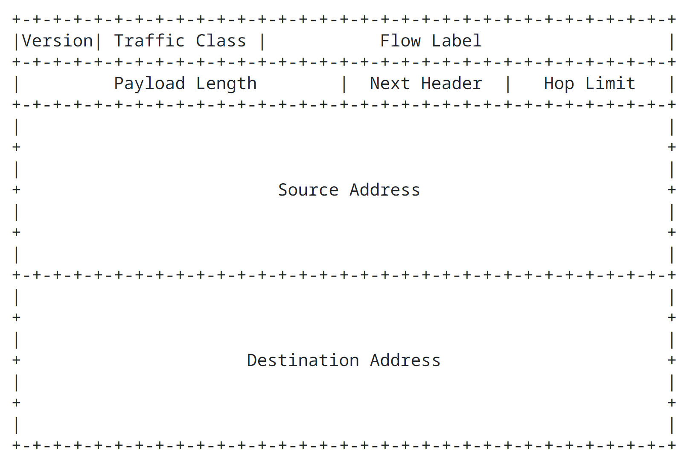

Internet Protocol, Version 6 (IPv6) Specification
=================================================

[RFC8200](https://datatracker.ietf.org/doc/html/rfc8200)

### Abstract

This document specifies version 6 of the Internet Protocol (IPv6). It obsoletes [RFC2460](https://datatracker.ietf.org/doc/html/rfc2460)

### Status of This Memo

This is an Internet Standards Track document.

This document is a product of the Internet Engineering Task Force (IETF). It represents the consensus of the IETF community. It has received public review and has been approved for publication by the Interent Engineering Steering Group (IESG). Further information on Internet Standards is available in [Section 2 of RFC7841](https://datatracker.ietf.org/doc/html/rfc7841#section-2).

Information about the current status of this document, any errata, and how to provide feedback on it may be obtained at [RFC EDITOR: 8200](https://www.rfc-editor.org/info/rfc8200)

### Copyright Notice

Copyright (c) 2017 IETF Trust and the persons identified as the document authors.  All rights reserved.

This document is subject to BCP 78 and the IETF Trust's Legal Provisions Relating to IETF Documents (http://trustee.ietf.org/license-info) in effect on the date of publication of this document.  Please review these documents carefully, as they describe your rights and restrictions with respect to this document.  Code Components extracted from this document must include Simplified BSD License text as described in Section 4.e of the Trust Legal Provisions and are provided without warranty as described in the Simplified BSD License.

This document may contain material from IETF Documents or IETF Contributions published or made publicly available before November 10, 2008.  The person(s) controlling the copyright in some of this material may not have granted the IETF Trust the right to allow modifications of such material outside the IETF Standards Process. Without obtaining an adequate license from the person(s) controlling the copyright in such materials, this document may not be modified outside the IETF Standards Process, and derivative works of it may not be created outside the IETF Standards Process, except to format it for publication as an RFC or to translate it into languages other than English.

## 1. Introduction

Internet Protocol IP version 6 IPv6 is a new version of Internet Protocol IP, designed as the successor to Internet Protocol IP version 4 IPv4 [RFC791](https://datatracker.ietf.org/doc/html/rfc791). The changes from Internet Protocol version 4 IPv4 to Internet Protocol version 6 IPv6 fall primarily into the following categories:

- Expanded Addressing Capabilities

    Internet Protocol version 6 IPv6 increases the Internet Protocol IP address size from 32 bits to 128 bits, to support more levels of addressing hierarchy, a much greater number of addressable nodes, and simpler autoconfiguration on addresses. The scalability of multicase routing is improved by adding a "scope" field to multicast addresses. And a new type of address called an "anycast address" is defined; it is used to send a packet to any one of a group of nodes.

- Header Format Simplication

    Sime Internet Protocol version 4 IPv4 header fields have been dropped or made optional, to reduce the common-case processing cost of packet handling and to limit the bandwidth cost of the Internet Protocol version 6 IPv6 header.

- Improved Support for Extensions and Options

    Changes in the way Internet Protocol IP header options are encoded allows for more efficient forwarding, less stringent limits on the length of options, and greater flexibility for introducing new options in the future.

- Flow Labeling Capability

    A new capability is added to enable the labeling of sequences of packets that the sender requests to be treated in the network as a single flow.

- Authentication and Privacy Capabilities

    Extensions to support authentication, data integrity, and (optional) data confidentiality are specifeid for Internet Protocol version 6 IPv6.

This document specifies the basic Internet Protocol version 6 IPv6 header and the initially defined Internet Protocol version 6 IPv6 extension headers and options. It also discusses packet size issues, the semantics of flow labels and traffic classes, and the effects of Internet Protocol version 6 IPv6 on upper-layer protocols. The format and semantics of Internet Protocol version 6 IPv6 addresses are specified separately in [RFC4291](https://datatracker.ietf.org/doc/html/rfc4291). The Internet Protocol version 6 IPv6 version of ICMP, which add Internet Protocol version 6 IPv6 implementations are required to include, ins specified in [RFC4443](https://datatracker.ietf.org/doc/html/rfc4443).

The data transmission order for Internet Protocol version 6 IPv6 is the same for Internet Protocol version 4 IPv4 as defined Appendix B of [RFC791](https://datatracker.ietf.org/doc/html/rfc791).

Note: As this document obsoletes [RFC2460](https://datatracker.ietf.org/doc/html/rfc2460), any document referenced in this document that includes pointers to [RFC2460](https://datatracker.ietf.org/doc/html/rfc2460) should be interpreted as referencing this document.

## 2. Terminology

node: a device that implements Internet Protocol version 6 IPv6

router: a node that forwards Internet Protocol version 6 IPv6 packets not explicitly addressed to itself.

host: any node that is not a router.

upper layer: a protocol layer immediately above Internet Protocol version 6 IPv6. Examples are transport protocols such as TCP and UDP, control protocols such as ICMP, routing protocols such as OSPF, and internet-layer or lower-layer protocols being "tunneled" over (i.e., encapsulated in) Internet Protocol version 6 IPv6 such as Internetwork Packet Exchange (IPX), AppleTalk, or Internet Protocol version 6 IPv6 itself.

link: a communication facility or medium over which nodes can communicate at the link layer, i.e., the layer immediately below Internet Protocol version 6 IPv6. Examples are Ethernets (simple or bridged); PPP links; X.25, Frame Relay, or ATM networks; and internet-layer or higher-layer "tunnels", such as tunnels over Internet Protocol version 4 IPv4 or Internet Protocol version 6 IPv6 itself.

neighbors: node attached to the same link

interface: a node's attachment to a link

address: an Internet Protocol version 6 IPv6 layer identifier for an interface or a set of interfaces.

packet: an Internet Protocol verison 6 IPv6 header plus payload.

link MTU: the maximum transmission unit, i.e., maximum packet size in octets, that can be conveyed over a link.

path MTU: the minimu link MTU of all the links in a path between a source node and a destination node.

Node: it is possible for a device with multiple interfaces to be configured to forward non-self-destined packets arriving from some set (fewer than all) of its interfaces and to discard non-self-destined packets arriving from its other interfaces. Such a device must obey the protocol requirements for routers when receiving packets from, and interacting with neighbors over, the former (forwarding) interfaces. It must obey the protocol requirements for hosts when receiving packets from, and interacting with neighbors over, the latter (non-forwarding) interfaces.

## 3. Internet Protocol version 6 IPv6 Header Format

Version: 4 bit Internet Protocol version number = 6

Traffic Class: 8 bit Traffic Class field.

Flow Label: 20 bit flow label.

Payload Length: 16 bit unsigned integer. Length of the Internet Protocol version 6 IPv6 payload, i.e., the rest of the packet following this Internet Protocol version 6 IPv6 header, in octets. (Note that any extension headers present are considered part of the payload i.e., included in the length count.)

Next Header: 8 bit selector. Identifies the type of header immediately following the Internet Protocol version 6 IPv6 header. Uses the same values as the Internet Protocol version 4 IPv4 protocol field [Protocol Numbers](https://www.iana.org/assignments/protocol-numbers/protocol-numbers.xhtml).

Hop Limit: 8 bit unsigned integer. Decremented by 1 by each node that forwards the packet. When forwarding, the packet is discarded if Hop Limit was zero when received or is determented to zero. A node that is the destination of a packet should not discard a packet with Hop Limit equal to zero; it should process the packet normally.

Source Address: 128 bit address of the originator of the packet. [RFC4291](https://datatracker.ietf.org/doc/html/rfc4291)

Destination Address: 128 bit address of the intended recipient of the packet (possibly not the ultimate recipient, if the Routing header is present). [RFC4291](https://datatracker.ietf.org/doc/html/rfc4291) and [RFC8200 Section 4.4](https://datatracker.ietf.org/doc/html/rfc8200#section-4.4)

## 4. Internet Protocol version 6 IPv6 Extension Headers

